# Browser-Use 架构图分析

> **作者**: Matrix Agent
> **项目地址**: https://github.com/browser-use/browser-use
> **分析时间**: 2026-01-24

---

## 一、系统整体架构图

### 1.1 核心架构概览

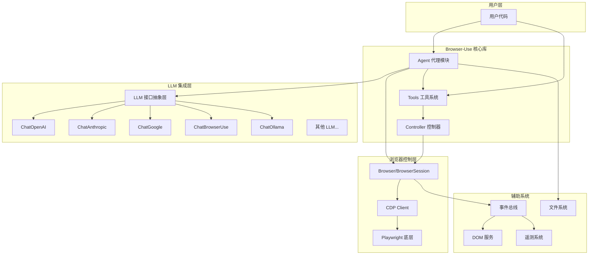

### 1.2 模块职责说明

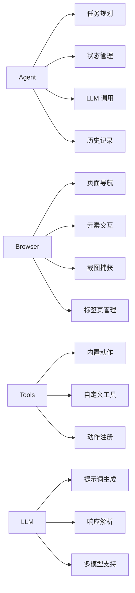

---

## 二、核心数据流图

### 2.1 代理执行主流程

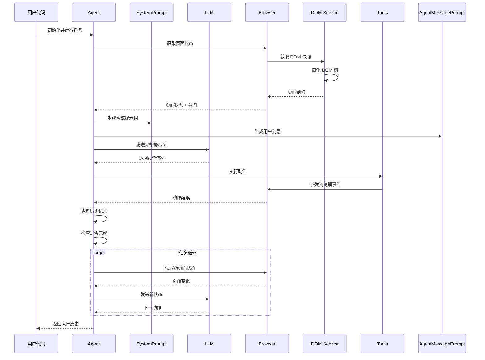

### 2.2 消息流转详情

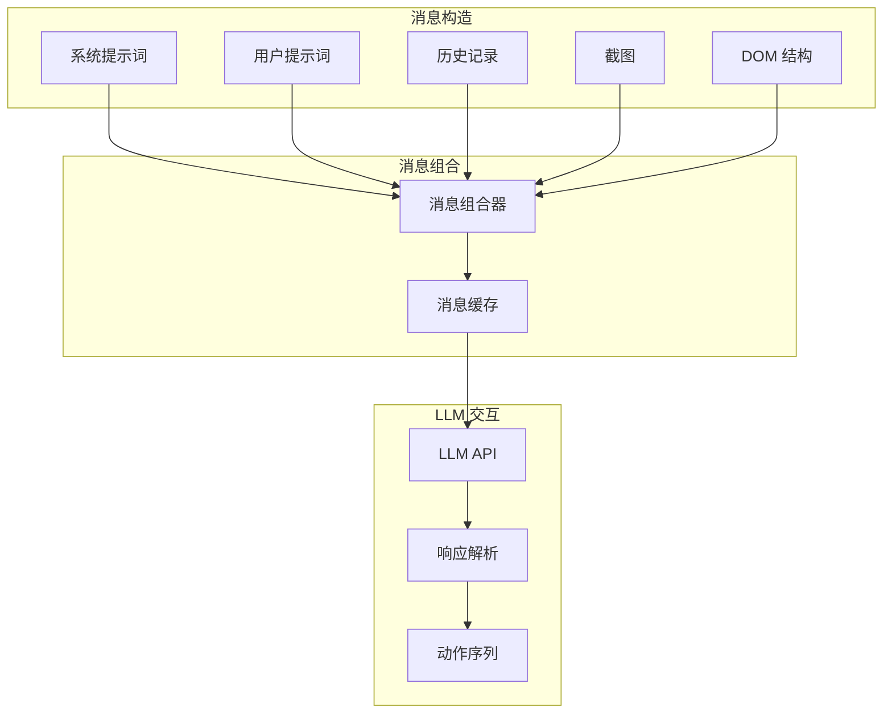

---

## 三、类/模块关系图

### 3.1 Agent 核心类图

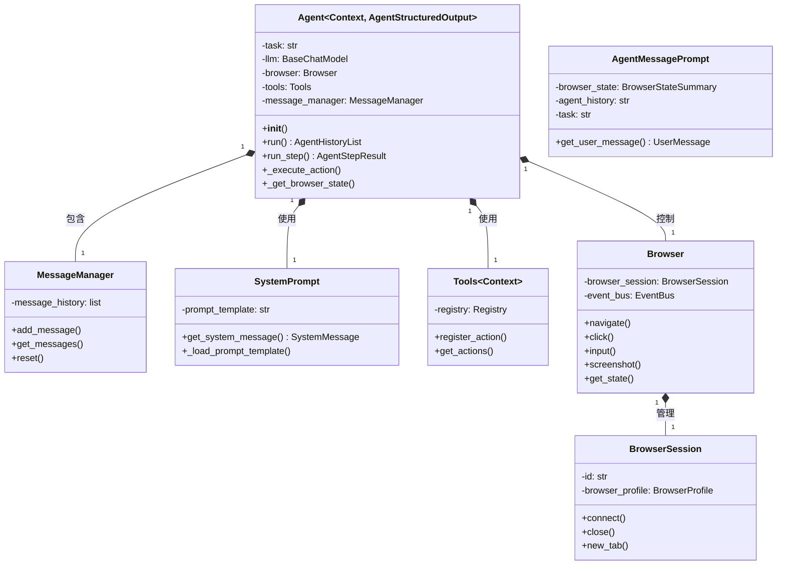

### 3.2 浏览器会话类图

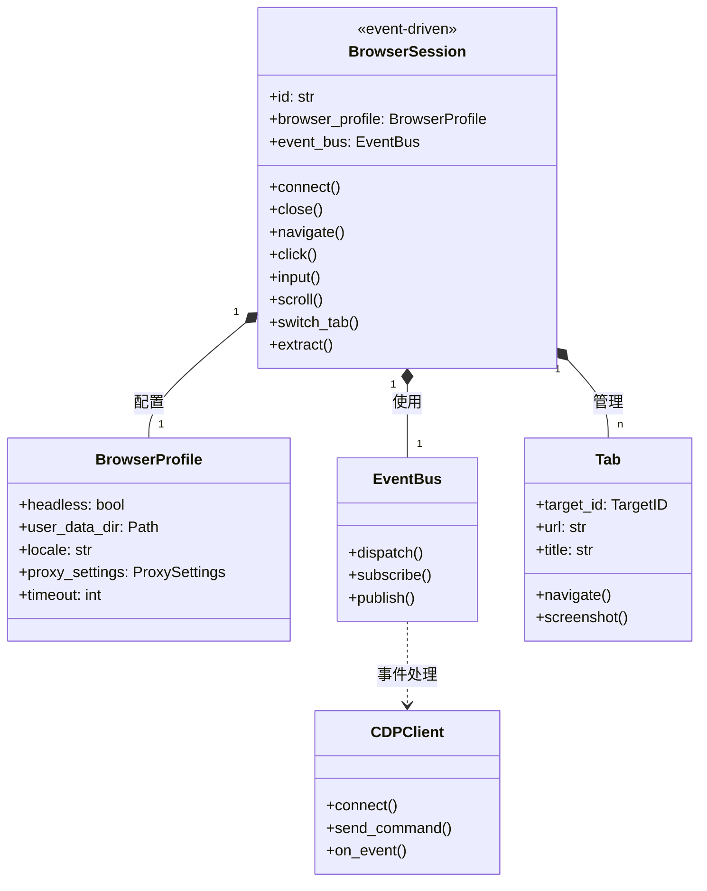

### 3.3 工具系统类图

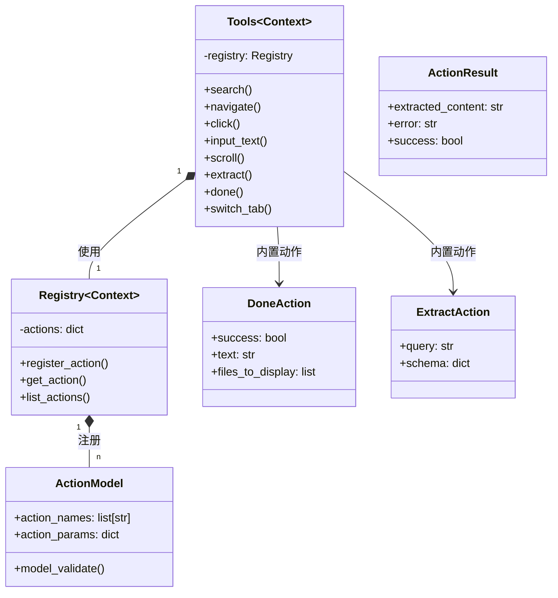

---

## 四、用户交互流程图

### 4.1 典型使用流程

```mermaid
flowchart TD
    A[开始] --> B[创建 Browser 实例]
    B --> C[创建 LLM 实例]
    C --> D[可选: 创建 Tools 实例]
    D --> E[创建 Agent 实例]
    E --> F[调用 agent.run()]
    F --> G{任务是否完成?}
    G -->|否| H[执行下一步动作]
    H --> I[获取新页面状态]
    I --> F
    G -->|是| J[返回执行历史]
    J --> K[结束]
```

### 4.2 动作执行流程

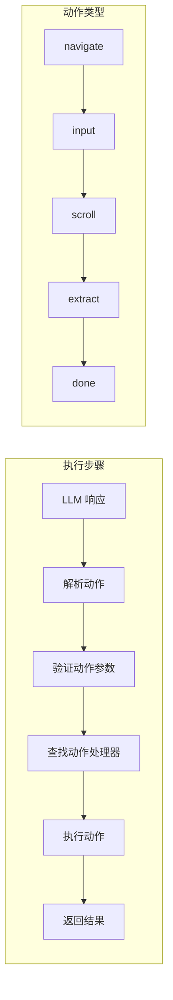

### 4.3 错误恢复流程

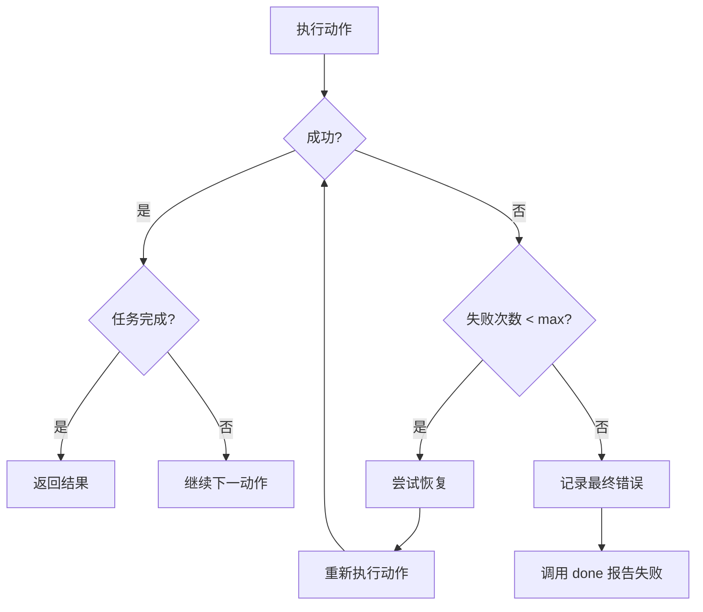

---

## 五、部署架构图

### 5.1 本地部署架构

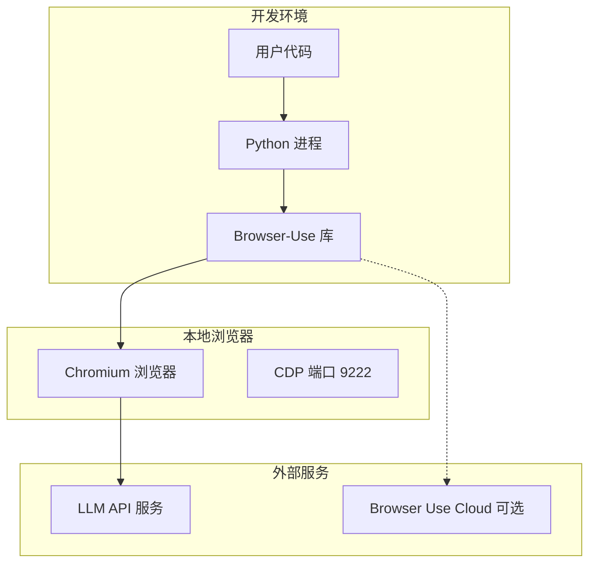

### 5.2 云端部署架构

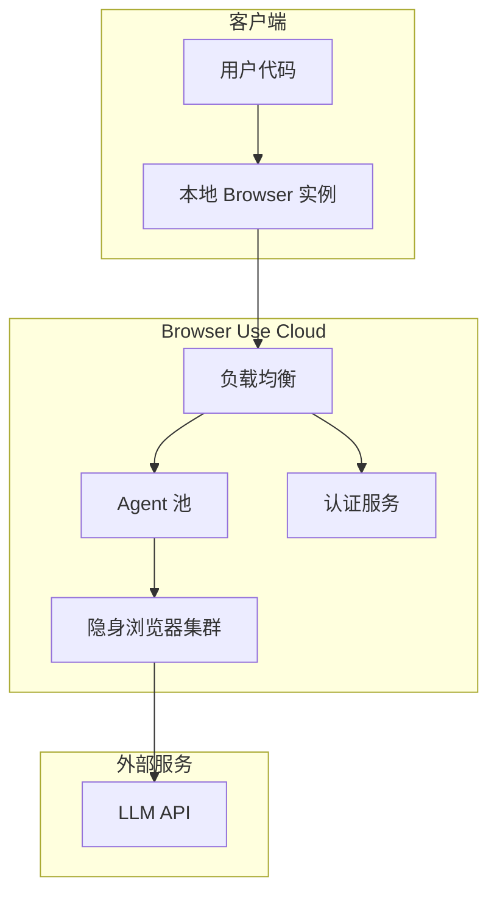

### 5.3 多代理并行架构

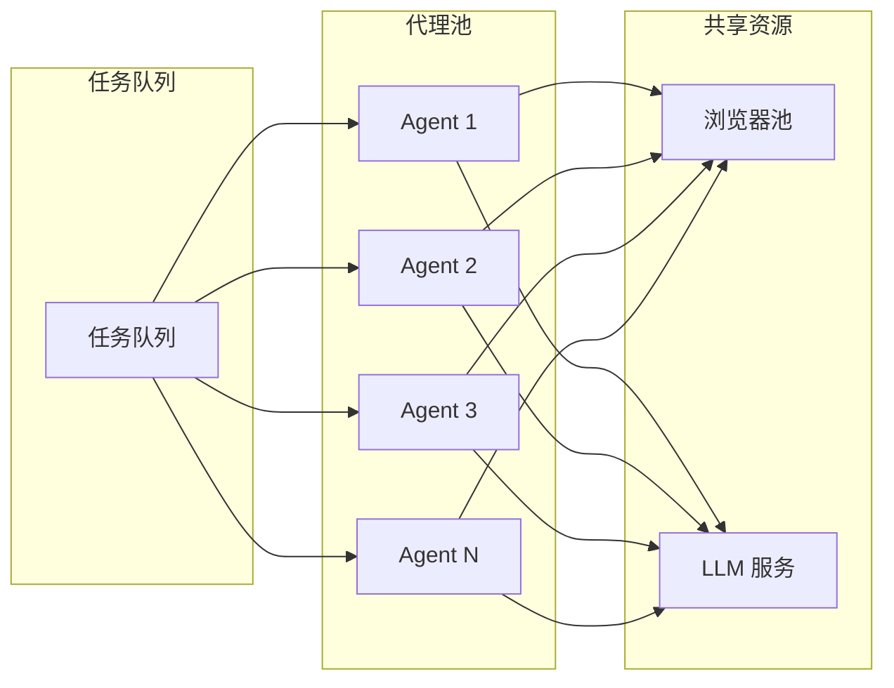

---

## 六、数据模型图

### 6.1 核心数据模型

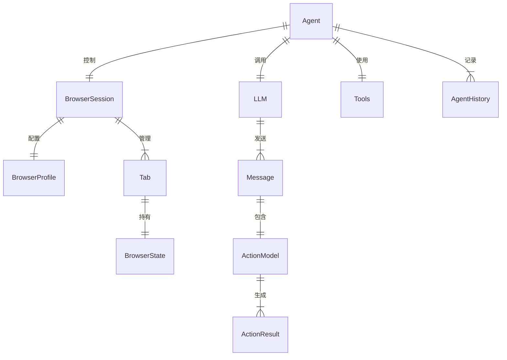

### 6.2 关键数据结构

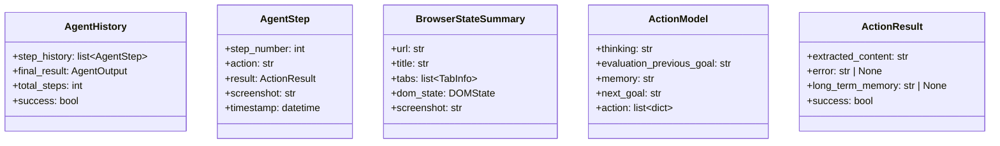

---

## 七、事件驱动架构

### 7.1 事件总线流程

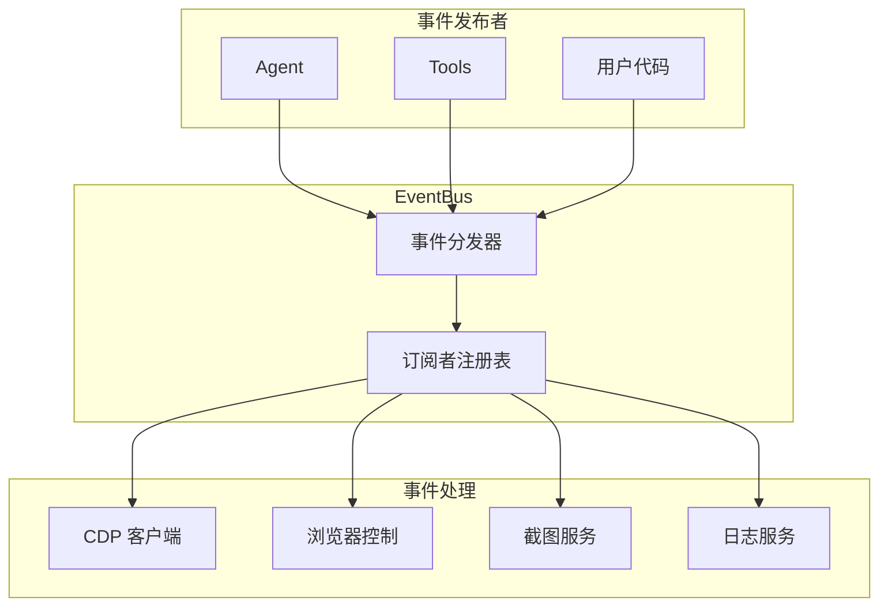

### 7.2 浏览器事件流

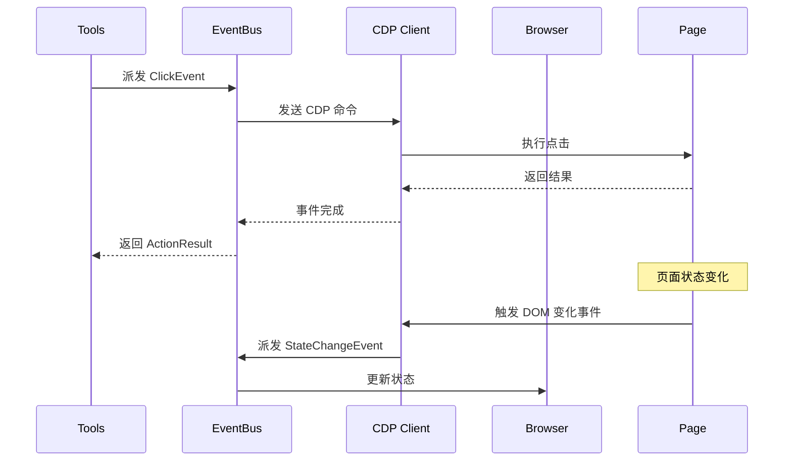

---

## 八、总结

Browser-Use 的架构设计体现了以下核心原则：

1. **分层架构**：清晰的层次划分，从用户接口到底层浏览器控制
2. **事件驱动**：使用 EventBus 实现松耦合的组件通信
3. **可扩展性**：通过 Tools 和 Registry 机制支持自定义动作
4. **多模型支持**：统一的 LLM 接口适配多种模型
5. **容错设计**：内置重试机制和错误恢复

这种架构使得 Browser-Use 既能处理简单的单步操作，也能支持复杂的多代理并行场景。
