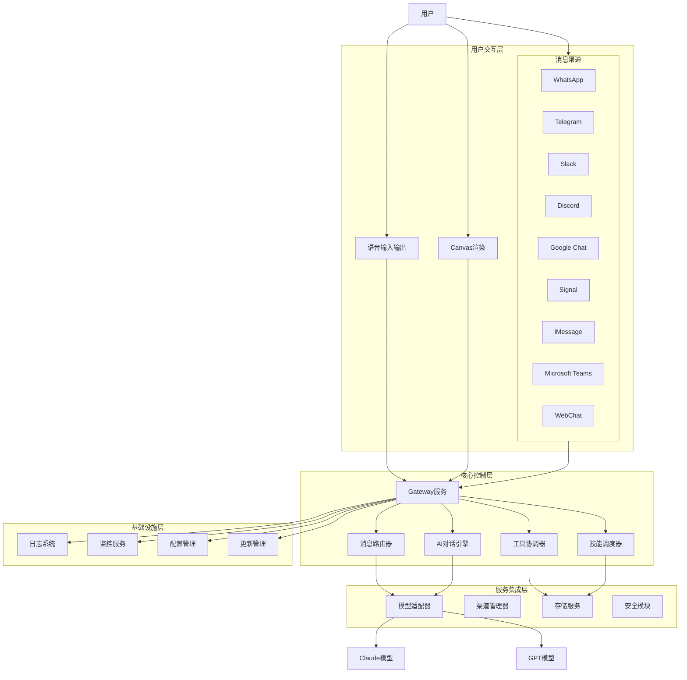
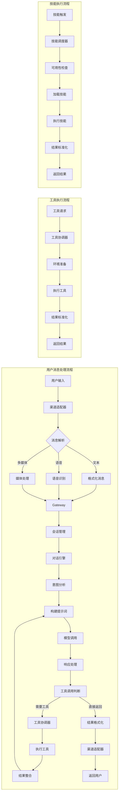
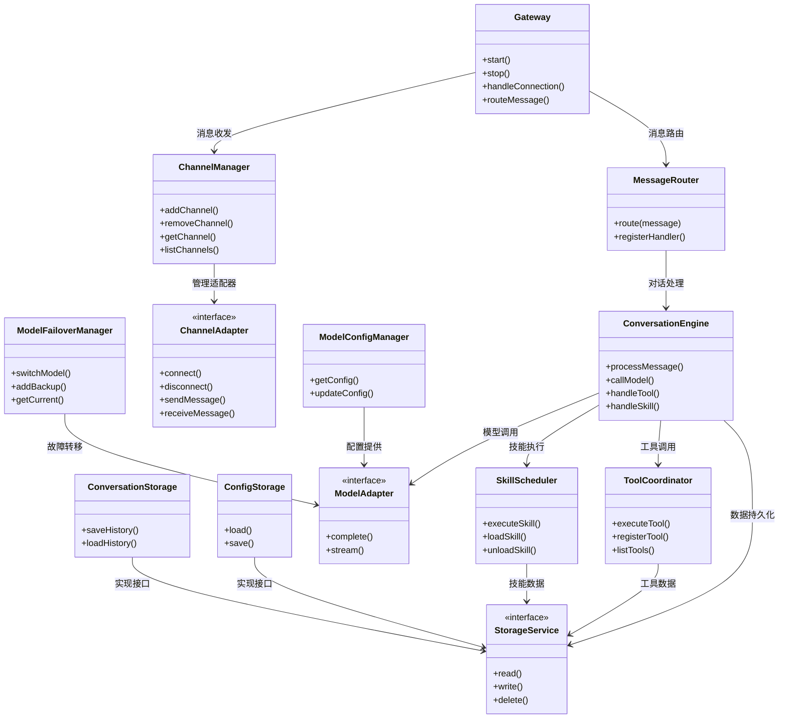
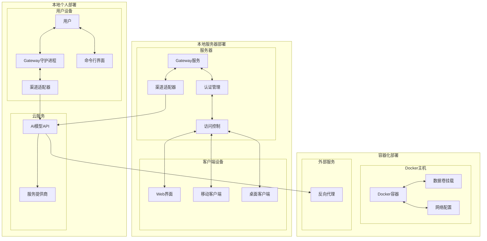
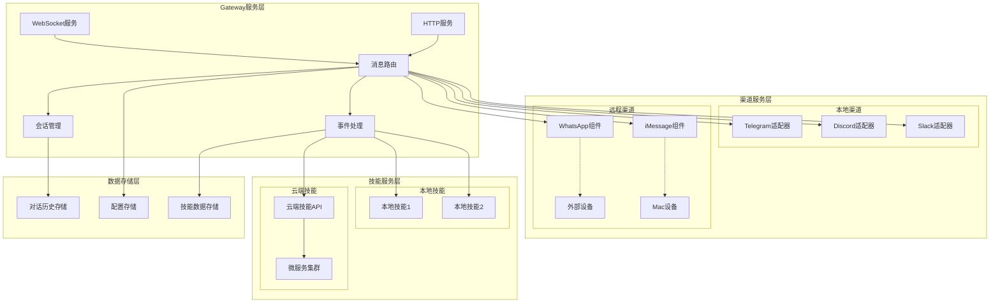

# Clawdbot 架构图

## 系统整体架构

Clawdbot 采用分层架构设计，将系统功能划分为多个相对独立的层次，每个层次承担特定的职责，层与层之间通过定义良好的接口进行交互。这种设计模式确保了系统的可维护性、可扩展性和可测试性。整体架构可以分为四个主要层次：用户交互层、核心控制层、服务集成层和基础设施层。

用户交互层是用户与系统接触的最外层，负责处理各种渠道的输入输出。这一层包含了所有支持的通讯渠道的适配器实现，如 WhatsApp、Telegram、Slack、Discord 等消息平台的连接器。每个适配器负责处理特定平台的协议细节，将不同格式的消息转换为系统内部统一的消息格式。语音交互模块也属于这一层，负责处理语音输入的录制、识别和语音输出的合成、播放。Canvas 渲染模块同样集成在这一层，为用户提供可视化的交互体验。

核心控制层是系统的中枢，负责协调各个组件的工作。Gateway 组件是这一层的核心，它实现了 WebSocket 服务，处理客户端连接、会话管理和事件分发。消息路由模块根据消息的来源和内容，将消息分发到相应的处理流程。AI 对话引擎负责与底层模型进行交互，处理对话历史、管理上下文、执行对话策略。工具协调器负责管理和执行各种工具调用，包括浏览器控制、文件系统操作、API 调用等。技能调度器则负责技能的发现、加载和执行，是系统扩展能力的核心。

服务集成层提供了与外部服务和资源的连接能力。模型适配器支持多种 AI 模型提供商，包括 Anthropic 的 Claude 系列和 OpenAI 的 GPT 系列，每种模型都有其特定的接口实现。渠道管理器维护与各个通讯平台的长期连接，处理认证、消息队列和错误恢复。存储服务提供了本地数据持久化的能力，包括对话历史、用户配置、技能数据等。安全模块负责数据的加密存储和传输，保护用户的隐私数据。

基础设施层提供了系统运行所需的基础支持。日志系统收集和存储系统运行日志，支持多种日志级别和输出目标。监控服务跟踪系统健康状态和性能指标。配置管理模块处理配置文件的读取、验证和热重载。更新管理负责检查和应用系统更新，支持自动和手动两种更新模式。

## 核心数据流图

数据在 Clawdbot 系统中的流动遵循一条清晰的路径，从用户输入开始，经过多个处理阶段，最终返回用户或触发相应的动作。理解这一数据流对于把握系统的整体行为和进行问题诊断都非常重要。以下详细描述主要的数据流场景。

用户消息处理流程是最基本的数据流场景。当用户通过任意支持的渠道发送消息时，消息首先被相应的渠道适配器接收。适配器负责解析消息内容，提取文本、语音或其他媒体数据，并将消息格式化为系统内部统一的格式。处理后的消息被发送到 Gateway，Gateway 根据消息的来源渠道创建或恢复会话上下文，并将消息路由到对话引擎。

对话引擎接收到消息后，首先进行意图分析，理解用户的需求。然后根据上下文历史构建完整的提示词，发送给 AI 模型进行处理。模型返回的响应经过后处理后，或者直接返回给用户，或者触发工具调用和技能执行。如果需要调用工具或技能，系统会暂停与模型的交互，先执行相应的操作，然后将结果整合到对话上下文中，再次发送给模型进行下一轮处理。最终的处理结果被转换为目标渠道的格式，由渠道适配器发送回用户。

工具执行流程展示了系统如何处理需要外部操作的请求。当对话引擎判断需要调用某个工具时，会向工具协调器发起请求。工具协调器根据工具类型和参数，准备执行环境，然后调用相应的工具实现。工具执行完成后，结果被标准化为统一的格式返回给对话引擎。对于可能耗时的操作（如浏览器自动化、API 调用），工具协调器会提供异步执行和进度反馈的能力。

技能执行流程展示了系统的扩展能力如何被激活。当用户在对话中提到某个技能或对话引擎判断需要特定技能时，技能调度器会被调用。调度器首先检查技能的可用性和当前状态，如果技能未加载则进行动态加载。技能执行时，调度器会传递必要的上下文信息和参数，技能的执行结果被标准化后返回。技能系统支持链式调用，多个技能可以按顺序执行，前一个技能的结果可以作为后一个技能的输入。

## 模块关系图

Clawdbot 的模块化设计是项目架构的核心特征。系统由多个相对独立的功能模块组成，每个模块专注于特定的功能领域，模块之间通过明确定义的接口进行协作。这种设计不仅提高了代码的可维护性，还使得各个模块可以独立开发、测试和更新。以下详细描述主要模块及其相互关系。

核心模块群包括 Gateway、消息路由器、对话引擎、工具协调器和技能调度器。这些模块构成了系统的控制核心，相互之间存在密切的协作关系。Gateway 模块作为所有外部连接的入口点，负责管理客户端连接和消息分发。消息路由器根据消息的特征将消息路由到正确的处理流程。对话引擎是处理用户对话的主要模块，它依赖于模型适配器来获取 AI 能力。工具协调器管理所有可用工具的执行，技能调度器则管理技能的生命周期和执行。工具协调器和技能调度器都会与存储服务交互，以持久化必要的数据。

渠道模块群包含所有支持的通讯渠道适配器。每个适配器都是独立的模块，实现统一的渠道接口规范。渠道适配器负责处理特定平台的协议、认证和消息格式转换。渠道管理器维护所有活跃渠道的状态，处理渠道的连接、断开和错误恢复。渠道模块与核心模块通过消息总线进行通信，接收需要发送的消息，并推送收到的消息到核心处理流程。

模型模块群负责 AI 模型的管理和使用。模型适配器抽象了不同模型提供商的差异，提供统一的调用接口。模型配置管理器处理认证信息的存储和使用，支持 OAuth 和 API 密钥两种认证方式。模型故障转移管理器监控模型可用性，在主模型出现问题时自动切换到备用模型。模型模块是对话引擎的核心依赖，对话引擎通过模型适配器与各种 AI 模型进行交互。

存储模块群提供了数据持久化的能力。存储服务定义了统一的数据访问接口，具体的实现可以是基于本地文件系统、数据库或其他存储系统。配置存储管理用户配置文件的读写。对话历史存储维护对话记录的持久化。技能存储管理技能的定义和数据。安全存储专门处理敏感信息的加密存储。

## 用户交互流程图

用户与 Clawdbot 的交互始于消息的发送，终于响应的接收，整个过程涉及多个组件的协作。不同的使用场景可能涉及不同的交互路径，但核心流程保持一致。以下通过几个典型的用户场景来展示交互流程。

首次使用流程描述了新用户如何开始使用 Clawdbot。用户首先通过包管理器安装 Clawdbot，然后运行引导命令 `clawdbot onboard`。引导程序会检查系统环境，提示用户配置 AI 模型提供商的认证信息。用户需要选择要启用的消息渠道，并按照渠道特定的流程完成认证（如扫描 QR 码、获取 API 密钥等）。引导程序还会询问用户是否需要安装 Gateway 守护进程，以及是否需要配置额外的技能。完成所有配置后，系统进行初始化，确保所有组件都正确运行。用户可以选择启动 Gateway 服务，开始使用 AI 助手。

日常对话流程展示了用户与 AI 助手进行交互的典型路径。用户在任何已配置的渠道上发送消息，消息通过渠道适配器被系统接收。系统检查是否存在活跃的会话，如果不存在则创建新会话。消息被发送到对话引擎，对话引擎结合当前上下文构建提示词，调用 AI 模型生成响应。响应被返回给用户，同时对话历史被更新以保持上下文连贯。如果用户的请求需要执行外部操作（如查询信息、执行任务），系统会先执行相应的工具或技能，再将结果整合到响应中。

多渠道切换流程展示了用户如何在不同的消息渠道之间无缝切换。Clawdbot 支持用户同时在多个渠道上与 AI 助手交互。当用户在一个渠道上开始对话后，如果切换到另一个渠道，可以继续之前的对话上下文。这是因为对话状态被存储在系统中，与用户身份关联，而不是与特定的渠道关联。渠道适配器在收到消息时，会附加渠道标识信息，系统据此将消息与正确的对话上下文关联。这种设计让用户可以根据需要灵活选择使用渠道，而不会丢失对话的连续性。

工具调用流程展示了当用户请求需要执行外部操作时的交互细节。对话引擎分析用户请求，判断是否需要调用工具。如果需要，会暂停与模型的对话，向工具协调器发起请求。工具协调器执行实际的工具操作，可能涉及浏览器控制、API 调用、文件操作等。执行结果被标准化后返回给对话引擎，对话引擎将结果整合到对话上下文中，可能进行进一步的模型调用以生成更自然的响应。最终的处理结果通过原来的渠道返回给用户。

```mermaid
flowchart TD
    subgraph 首次使用流程
        A1[安装Clawdbot] --> A2[运行引导命令]
        A2 --> A3[环境检查]
        A3 --> A4[配置模型认证]
        A4 --> A5[选择渠道]
        A5 --> A6[渠道认证]
        A6 --> A7[配置技能]
        A7 --> A8[安装守护进程]
        A8 --> A9[系统初始化]
        A9 --> A10[启动服务]
    end

    subgraph 日常对话流程
        B1[发送消息] --> B2[渠道适配器接收]
        B2 --> B3[检查会话]
        B3 --> B4{会话存在?}
        B4 -->|否| B5[创建新会话]
        B4 -->|是| B6[加载对话历史]
        B5 --> B6
        B6 --> B7[对话引擎处理]
        B7 --> B8[构建提示词]
        B8 --> B9[调用AI模型]
        B9 --> B10[生成响应]
        B10 --> B11{需要工具?}
        B11 -->|是| B12[执行工具]
        B11 -->|否| B13[更新对话历史]
        B12 --> B13
        B13 --> B14[返回响应]
    end

    subgraph 多渠道切换流程
        C1[渠道A开始对话] --> C2[创建对话上下文]
        C2 --> C3[切换到渠道B]
        C3 --> C4[发送消息]
        C4 --> C5[识别用户身份]
        C5 --> C6[关联对话上下文]
        C6 --> C7[继续对话]
    end

    subgraph 工具调用流程
        D1[用户请求] --> D2[对话引擎分析]
        D2 --> D3{需要工具?}
        D3 -->|是| D4[暂停模型对话]
        D3 -->|否| D10[直接生成响应]
        D4 --> D5[工具协调器请求]
        D5 --> D6[执行工具操作]
        D6 --> D7[返回执行结果]
        D7 --> D8[整合结果到上下文]
        D8 --> D9[恢复模型对话]
        D9 --> D10
    end
```

## 部署架构图

Clawdbot 支持多种部署方式，以适应不同的使用场景和用户需求。从个人使用的本地部署，到团队或组织的服务器部署，再到基于云的托管部署，用户可以根据自己的需求选择最适合的方案。每种部署方式都有其特定的优势和考量因素。

本地个人部署是最常见的部署方式，适用于希望完全控制自己数据的个人用户。在这种模式下，Clawdbot 运行在用户自己的设备上，可以是桌面电脑、笔记本电脑或树莓派等单板计算机。Gateway 服务作为用户级服务运行在后台，通过系统服务管理器（launchd、systemd 等）管理生命周期。消息渠道通过用户的个人账户进行认证，如用户的 WhatsApp 账号、Telegram 账号等。AI 模型调用直接发送到模型提供商的 API，用户的对话数据会经过云端处理，但对于大多数用户来说，这种程度的云端依赖是可以接受的。

本地服务器部署适用于希望在家庭网络或办公网络中运行 Clawdbot 的用户。这种模式下，Clawdbot 部署在一台专用的服务器上，所有家庭成员或团队成员都可以通过客户端应用或 Web 界面访问。服务器需要持续运行并保持网络连接，以确保 AI 助手随时可用。消息渠道的认证基于服务器上配置的主账户进行，所有用户共享这些渠道的访问。模型调用同样发送到云端 API，但可以通过配置使用特定的账户或企业订阅。

容器化部署使用 Docker 容器来运行 Clawdbot，提供了更好的隔离性和可移植性。项目提供了官方的 Dockerfile 和 docker-compose 配置，支持快速启动容器化的 Clawdbot 实例。容器化部署特别适合以下场景：在云服务器上运行、与其他服务集成、需要快速复制部署环境。容器内部的配置通过环境变量或挂载的配置文件进行管理，数据卷用于持久化存储对话历史和配置信息。

### 服务组件分布图

在典型的服务器部署场景中，Clawdbot 的各个组件分布在不同的层级和位置上。以下图表展示了组件在运行时的分布情况，以及组件之间的通信关系。

Gateway 服务作为系统的核心组件，通常部署在主服务器上，负责接收所有外部连接和内部消息。WebSocket 服务提供实时通信能力，Web 服务提供 HTTP 接口用于配置管理和状态查询。消息处理模块是 Gateway 的核心功能，负责消息的路由、过滤和转换。

渠道服务可以部署在不同的位置。对于大多数渠道（如 Telegram、Discord），渠道适配器与 Gateway 部署在同一位置，通过相应的 API 与外部平台通信。对于某些需要特殊认证的渠道（如 WhatsApp Web、iMessage），可能需要部署额外的组件来处理会话保持和消息接收。这些组件通常部署在与主服务相同的环境中，或者在需要时部署在专用设备上。

技能服务支持分布式部署。本地技能直接运行在主服务器上，与 Gateway 进程共享资源。云端技能运行在远程服务器上，通过 API 与主服务通信。复杂的技能可能涉及多个微服务的协作，形成技能服务集群。这种分布式设计允许技能开发者使用任何技术栈来实现技能逻辑，只要遵循定义的 API 规范。

数据存储层负责持久化各类数据。对话历史使用专门的存储服务，支持高效的查询和检索。配置存储管理用户和组织级别的配置信息。技能数据存储技能的定义、状态和运行时数据。对于高可用性部署，存储层可以配置为主从复制或集群模式，确保数据的可靠性和访问性能。

