---

# Data Science for Beginners - 架构图与流程图

> 本文档使用 Mermaid 图表展示课程架构、学习路径和数据流程

---

## 一、课程整体架构

### 1.1 课程结构概览

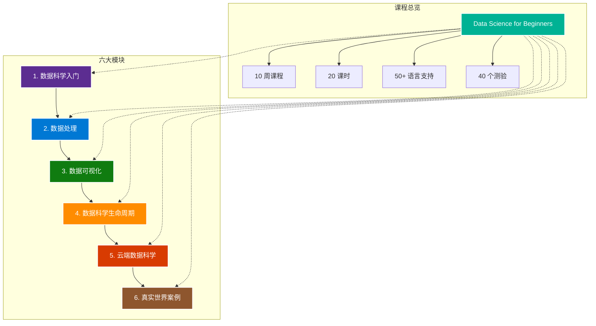

### 1.2 六大模块详情

```mermaid
graph LR
    subgraph "第一部分：数据科学入门"
        I1[01 定义数据科学] --> I2[02 数据科学伦理]
        I2 --> I3[03 定义数据]
        I3 --> I4[04 统计与概率入门]
    end

    subgraph "第二部分：数据处理"
        W1[05 关系型数据] --> W2[06 NoSQL 数据]
        W2 --> W3[07 Python 数据处理]
        W3 --> W4[08 数据准备]
    end

    subgraph "第三部分：数据可视化"
        V1[09 可视化数量] --> V2[10 可视化分布]
        V2 --> V3[11 可视化比例]
        V3 --> V4[12 可视化关系]
        V4 --> V5[13 有意义可视化]
    end

    subgraph "第四部分：数据科学生命周期"
        L1[14 生命周期简介] --> L2[15 数据分析]
        L2 --> L3[16 沟通交流]
    end

    subgraph "第五部分：云端数据科学"
        C1[17 云端入门] --> C2[18 低代码工具]
        C2 --> C3[19 Azure 部署]
    end

    subgraph "第六部分：真实世界案例"
        R1[20 真实世界示例]
    end

    style I1 fill:#e1dfdd,stroke:#333,stroke-width:1px
    style I2 fill:#e1dfdd,stroke:#333,stroke-width:1px
    style I3 fill:#e1dfdd,stroke:#333,stroke-width:1px
    style I4 fill:#e1dfdd,stroke:#333,stroke-width:1px
    style W1 fill:#fff4ce,stroke:#333,stroke-width:1px
    style W2 fill:#fff4ce,stroke:#333,stroke-width:1px
    style W3 fill:#fff4ce,stroke:#333,stroke-width:1px
    style W4 fill:#fff4ce,stroke:#333,stroke-width:1px
    style V1 fill:#eff6fc,stroke:#333,stroke-width:1px
    style V2 fill:#eff6fc,stroke:#333,stroke-width:1px
    style V3 fill:#eff6fc,stroke:#333,stroke-width:1px
    style V4 fill:#eff6fc,stroke:#333,stroke-width:1px
    style V5 fill:#eff6fc,stroke:#333,stroke-width:1px
    style L1 fill:#fde7e9,stroke:#333,stroke-width:1px
    style L2 fill:#fde7e9,stroke:#333,stroke-width:1px
    style L3 fill:#fde7e9,stroke:#333,stroke-width:1px
    style C1 fill:#ead1dc,stroke:#333,stroke-width:1px
    style C2 fill:#ead1dc,stroke:#333,stroke-width:1px
    style C3 fill:#ead1dc,stroke:#333,stroke-width:1px
    style R1 fill:#dff6dd,stroke:#333,stroke-width:1px
```

---

## 二、学习路径流程图

### 2.1 推荐学习路径

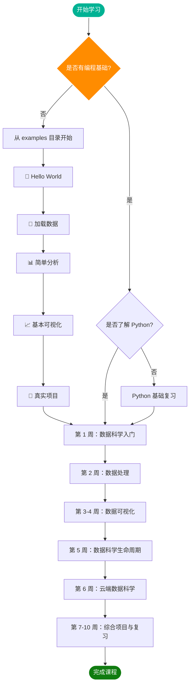

### 2.2 每课学习流程

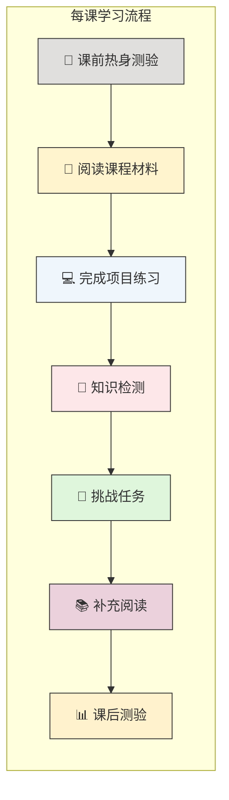

---

## 三、数据科学生命周期

### 3.1 数据科学生命周期流程图

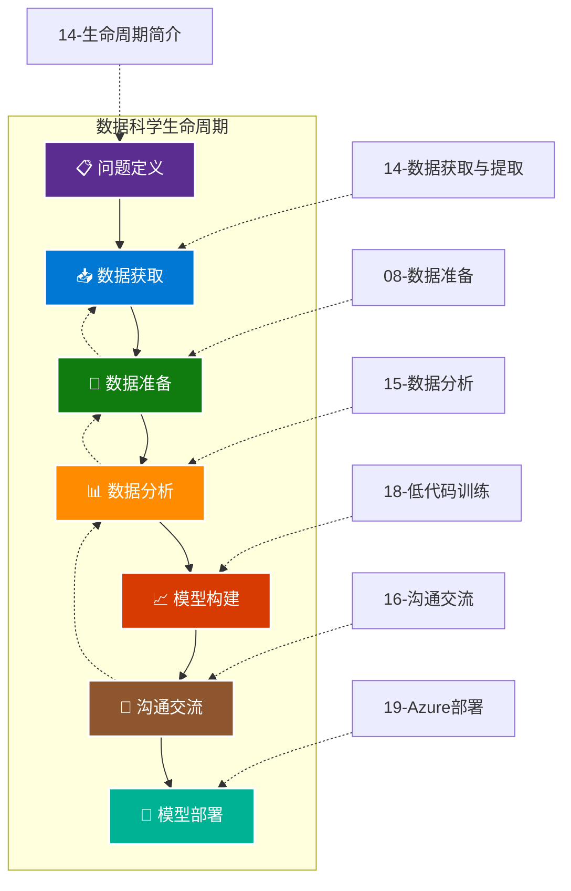

### 3.2 数据处理流程

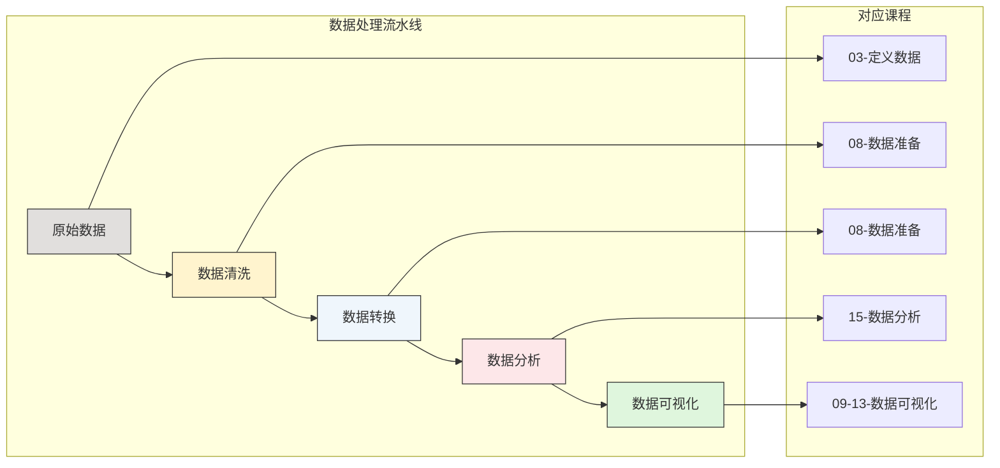

---

## 四、技术栈架构

### 4.1 涉及的技术栈

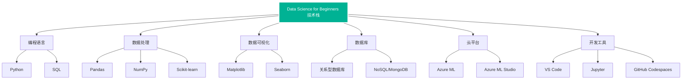

### 4.2 数据流向图

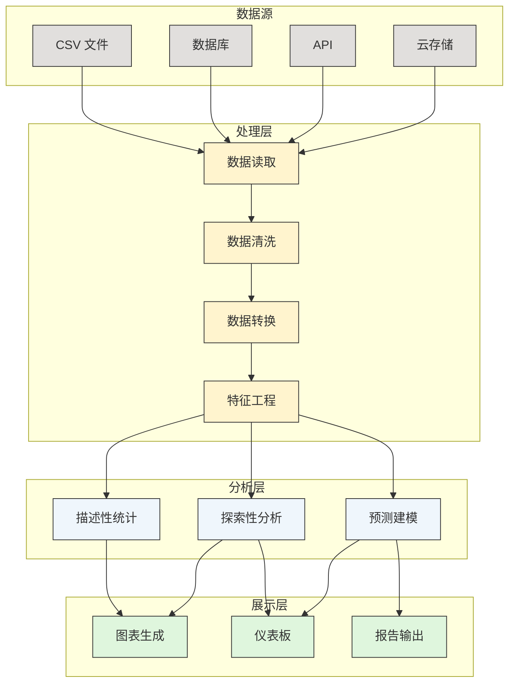

---

## 五、用户交互流程

### 5.1 学习者与课程的交互

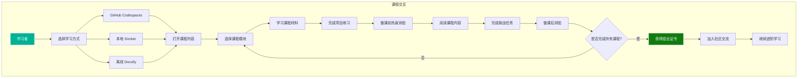

### 5.2 开发环境设置流程

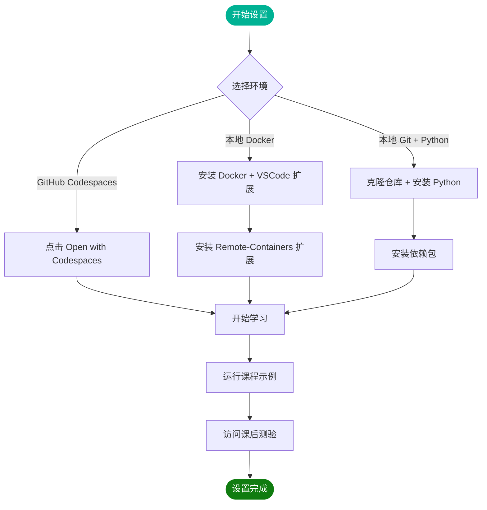

---

## 六、部署架构

### 6.1 课程部署方式

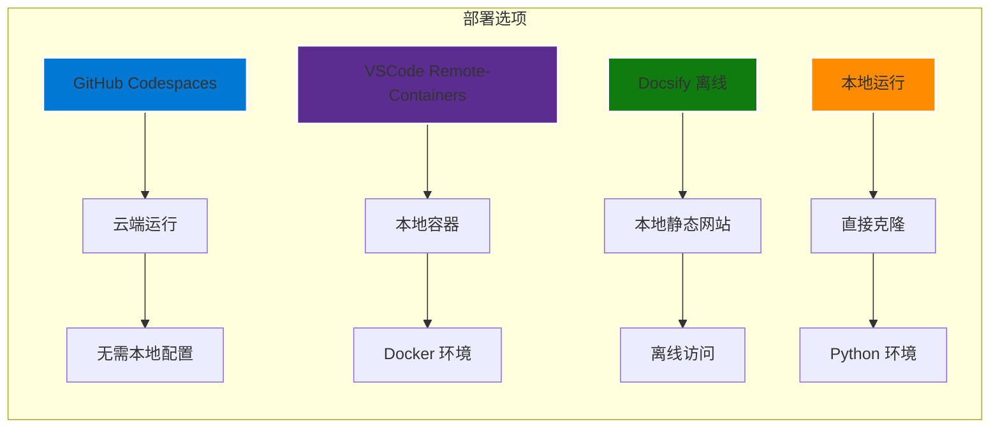

### 6.2 云端学习架构

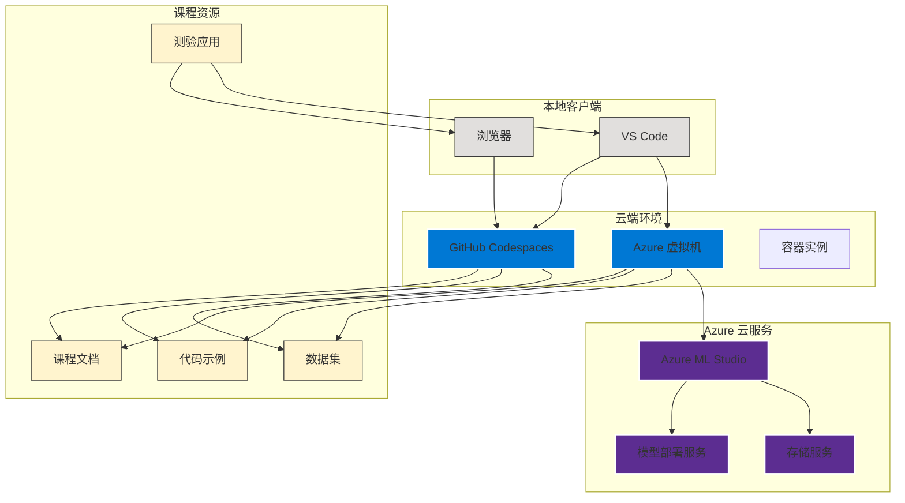

---

## 七、组件关系图

### 7.1 课程目录结构

```mermaid
graph TD
    ROOT[Data-Science-For-Beginners/] --> README[README.md]
    ROOT --> INSTALL[INSTALLATION.md]
    ROOT --> USAGE[USAGE.md]
    ROOT --> TROUBLE[TROUBLESHOOTING.md]
    ROOT --> CONTRIB[CONTRIBUTING.md]
    ROOT --> TEACHERS[for-teachers.md]

    ROOT --> MOD1[1-Introduction/]
    ROOT --> MOD2[2-Working-With-Data/]
    ROOT --> MOD3[3-Data-Visualization/]
    ROOT --> MOD4[4-Data-Science-Lifecycle/]
    ROOT --> MOD5[5-Data-Science-In-Cloud/]
    ROOT --> MOD6[6-Data-Science-In-Wild/]

    ROOT --> EXAMPLES[examples/]
    ROOT --> QUIZ[quiz-app/]
    ROOT --> IMAGES[images/]
    ROOT --> SKETCH[sketchnotes/]
    ROOT --> TRANS[translations/]

    MOD1 --> L01[01-defining-data-science/]
    MOD1 --> L02[02-ethics/]
    MOD1 --> L03[03-defining-data/]
    MOD1 --> L04[04-stats-and-probability/]

    MOD2 --> L05[05-relational-databases/]
    MOD2 --> L06[06-non-relational/]
    MOD2 --> L07[07-python/]
    MOD2 --> L08[08-data-preparation/]

    MOD3 --> L09[09-visualization-quantities/]
    MOD3 --> L10[10-visualization-distributions/]
    MOD3 --> L11[11-visualization-proportions/]
    MOD3 --> L12[12-visualization-relationships/]
    MOD3 --> L13[13-meaningful-visualizations/]

    MOD4 --> L14[14-Introduction/]
    MOD4 --> L15[15-analyzing/]
    MOD4 --> L16[16-communication/]

    MOD5 --> L17[17-Introduction/]
    MOD5 --> L18[18-Low-Code/]
    MOD5 --> L19[19-Azure/]

    MOD6 --> L20[20-Real-World-Examples/]

    style ROOT fill:#00b294,stroke:#fff,stroke-width:2px,color:#fff
    style MOD1 fill:#5c2d91,stroke:#fff,stroke-width:2px,color:#fff
    style MOD2 fill:#0078d4,stroke:#fff,stroke-width:2px,color:#fff
    style MOD3 fill:#107c10,stroke:#fff,stroke-width:2px,color:#fff
    style MOD4 fill:#ff8c00,stroke:#fff,stroke-width:2px,color:#fff
    style MOD5 fill:#d83b01,stroke:#fff,stroke-width:2px,color:#fff
    style MOD6 fill:#8e562e,stroke:#fff,stroke-width:2px,color:#fff
```

### 7.2 每课组件关系

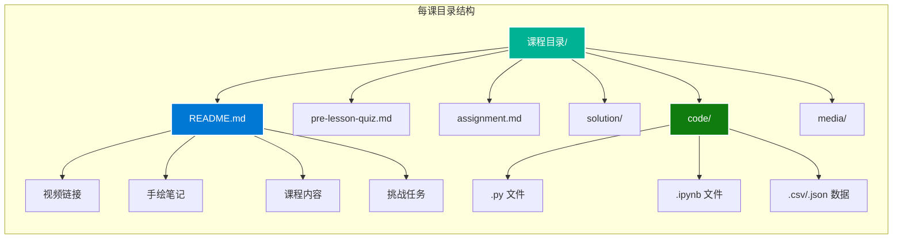

---

## 八、学习时间规划

### 8.1 10 周学习计划

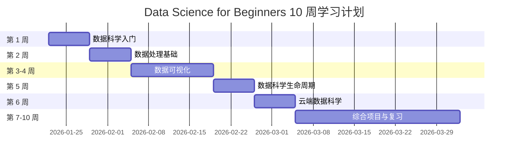

### 8.2 每周学习内容详情

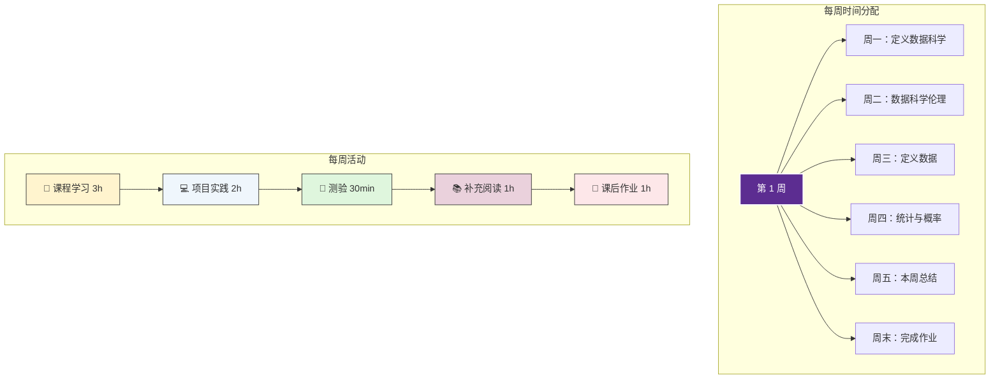

---

## 九、知识点依赖关系

### 9.1 课程依赖图

```mermaid
flowchart BT
    %% 节点定义
    I1[01 定义数据科学] --> BASE[基础概念]
    I2[02 数据科学伦理] --> BASE
    I3[03 定义数据] --> BASE
    I4[04 统计与概率] --> BASE

    W1[05 关系型数据] --> DATA[数据基础]
    W2[06 NoSQL 数据] --> DATA
    W3[07 Python 数据处理] --> PY[Python 编程]
    W4[08 数据准备] --> DATA

    V1[09 可视化数量] --> VIS[可视化基础]
    V2[10 可视化分布] --> VIS
    V3[11 可视化比例] --> VIS
    V4[12 可视化关系] --> VIS
    V5[13 有意义可视化] --> VIS

    L1[14 生命周期] --> LIFE[生命周期概念]
    L2[15 数据分析] --> DATA
    L3[16 沟通交流] --> SOFT[软技能]

    C1[17 云端入门] --> CLOUD[云概念]
    C2[18 低代码训练] --> CLOUD
    C3[19 Azure 部署] --> CLOUD

    R1[20 真实世界案例] --> ALL[综合应用]

    %% 依赖关系
    VIS --> DATA
    W3 --> I4
    V5 --> VIS
    C2 --> DATA
    C3 --> C2

    style BASE fill:#00b294,stroke:#fff,stroke-width:2px
    style DATA fill:#0078d4,stroke:#fff,stroke-width:2px
    style VIS fill:#107c10,stroke:#fff,stroke-width:2px
    style PY fill:#5c2d91,stroke:#fff,stroke-width:2px
    style CLOUD fill:#ff8c00,stroke:#fff,stroke-width:2px
    style ALL fill:#d83b01,stroke:#fff,stroke-width:2px
```

### 9.2 技能习得路径

---

*文档作者：Matrix Agent*
*最后更新：2026年1月*
