# DeepDiagram AI 架构图集

## Mermaid 架构图文档

---

## 1. 系统整体架构图

### 1.1 高级架构概览

```mermaid
graph TB
    subgraph User Layer [用户交互层]
        WebBrowser[Web 浏览器]
        MobileApp[移动设备]
        APIEndpoints[API 端点]
    end

    subgraph Frontend [React 前端]
        UI[React 19 UI]
        StateMgmt[Zustand 状态管理]
        Canvas[交互式画布]
        ChatPanel[聊天面板]
    end

    subgraph Backend [FastAPI 后端]
        APIGateway[API 网关]
        Auth[认证模块]
        SessionMgr[会话管理]
        AgentOrchestrator[Agent 编排器]
    end

    subgraph Agent Layer [多代理层]
        Router[智能路由器]

        subgraph Specialized Agents [专业 Agent]
            MindMap[🧠 MindMap Agent]
            Flow[🧜‍♂️ Flowchart Agent]
            Charts[📊 Charts Agent]
            Mermaid[🧜‍♀️ Mermaid Agent]
            Drawio[✏️ Draw.io Agent]
            Info[🎨 Infographic Agent]
            General[🤖 General Agent]
        end
    end

    subgraph AI Layer [AI 能力层]
        LLM[大语言模型]
        LangGraph[LangGraph 编排]
        LangChain[LangChain 工具链]
    end

    subgraph Data Layer [数据存储层]
        PostgreSQL[(PostgreSQL)]
        Redis[(Redis 缓存)]
        SSE[Server-Sent Events]
    end

    User Layer --> Frontend
    Frontend <-->|SSE/WebSocket| Backend
    Backend --> Agent Layer
    Agent Layer <--> AI Layer
    Backend --> Data Layer
```

### 1.2 技术栈架构

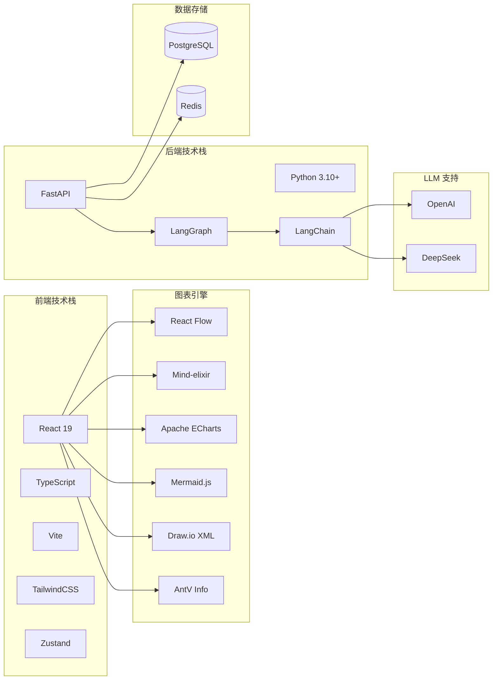

---

## 2. 核心数据流图

### 2.1 用户请求处理流程

```mermaid
sequenceDiagram
    participant User as 用户
    participant FE as 前端
    participant API as FastAPI
    participant Router as 智能路由器
    selected Agent as 目标 Agent
    Tool as 图表工具
    LLM as 大语言模型
    FE2 as 前端渲染

    User->>FE: 输入自然语言请求
    FE->>FE: 打包消息（支持多模态）
    FE->>API: POST /api/chat

    API->>API: 创建/恢复会话状态
    API->>Router: 路由分析

    Router->>Router: 解析用户意图
    Router->>Router: 检查 @agent 显式指定
    Router->>Router: 分析上下文历史
    Router-->>API: 返回目标 Agent

    API->>selected Agent: 分发请求
    selected Agent->>LLM: 思考+工具调用
    LLM->>Tool: 调用图表生成工具

    Tool->>Tool: 生成图表代码
    Tool-->>LLM: 返回结果

    LLM-->>selected Agent: 最终响应
    selected Agent-->>API: 流式响应

    API->>FE: SSE 流式推送
    FE->>FE2: 实时渲染图表

    FE2-->>User: 展示结果
```

### 2.2 智能路由决策流程

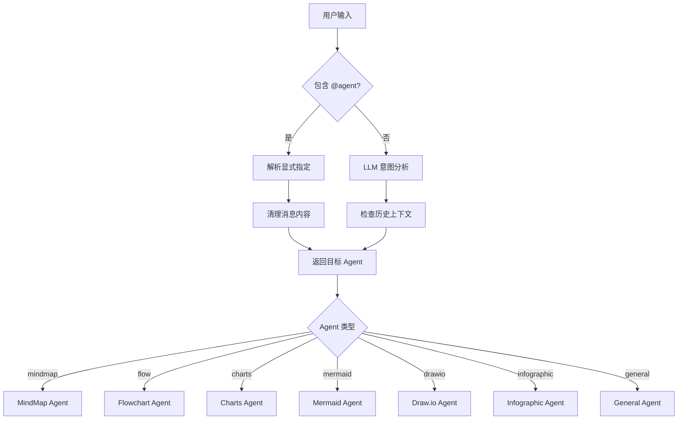

### 2.3 ReAct 代理循环流程

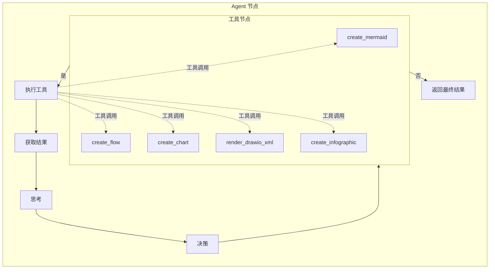

---

## 3. Agent 模块关系图

### 3.1 LangGraph 工作流编排

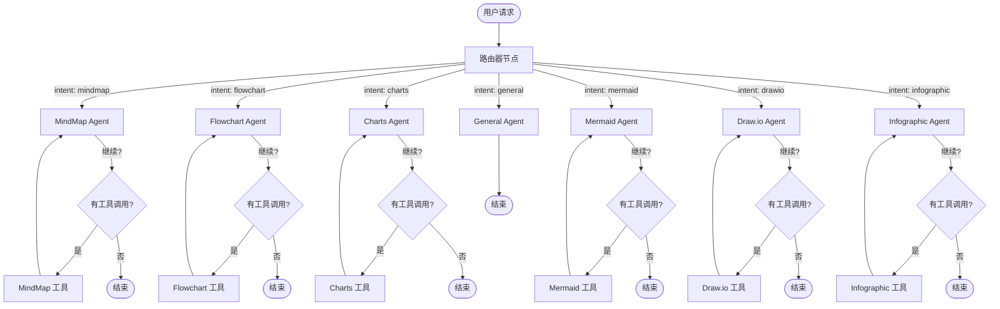

### 3.2 Agent 依赖关系

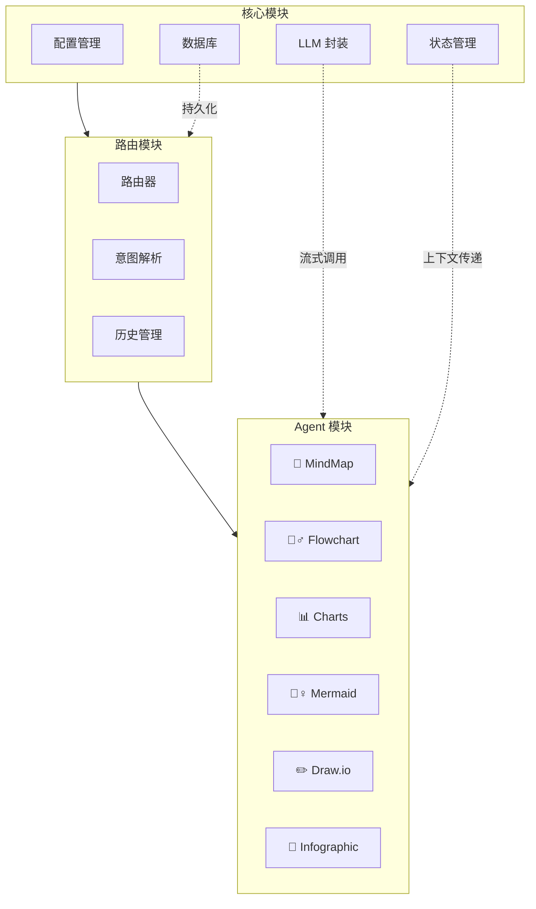

### 3.3 提示词系统架构

```mermaid
graph TB
    subgraph Global [全局配置]
        ThinkingModes[思考模式配置]
        SystemPrompts[系统提示词]
    end

    subgraph MindMap Prompts
        M1[MINDMAP_SYSTEM_PROMPT]
        M2[mindmap_agent_node 系统提示词]
        M3[create_mindmap 工具提示词]
    end

    subgraph Flowchart Prompts
        F1[FLOW_SYSTEM_PROMPT]
        F2[flow_agent_node 系统提示词]
        F3[create_flow 工具提示词]
    end

    subgraph Charts Prompts
        C1[CHARTS_SYSTEM_PROMPT]
        C2[charts_agent_node 系统提示词]
        C3[create_chart 工具提示词]
    end

    subgraph Mermaid Prompts
        MD1[MERMAID_SYSTEM_PROMPT]
        MD2[mermaid_agent_node 系统提示词]
        MD3[create_mermaid 工具提示词]
    end

    subgraph Drawio Prompts
        D1[DRAWIO_SYSTEM_PROMPT]
        D2[drawio_agent_node 系统提示词]
        D3[render_drawio_xml 工具提示词]
    end

    subgraph Infographic Prompts
        I1[INFOGRAPHIC_SYSTEM_PROMPT]
        I2[infographic_agent_node 系统提示词]
        I3[create_infographic 工具提示词]
    end

    Global -->|影响所有| MindMap Prompts
    Global -->|影响所有| Flowchart Prompts
    Global -->|影响所有| Charts Prompts
    Global -->|影响所有| Mermaid Prompts
    Global -->|影响所有| Drawio Prompts
    Global -->|影响所有| Infographic Prompts
```

---

## 4. 用户交互流程图

### 4.1 完整用户会话流程

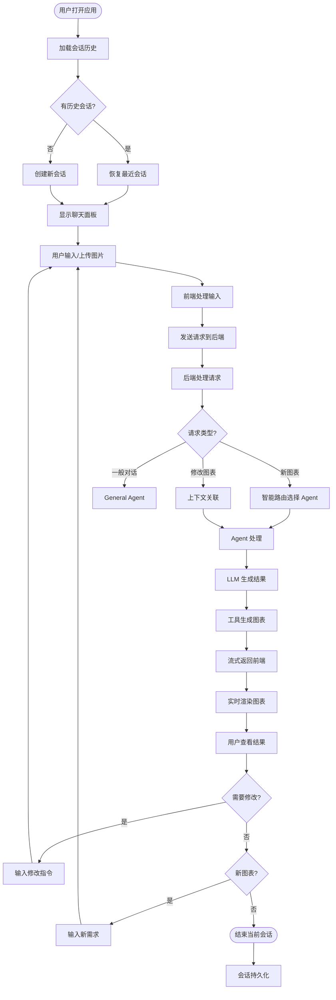

### 4.2 多模态输入处理流程

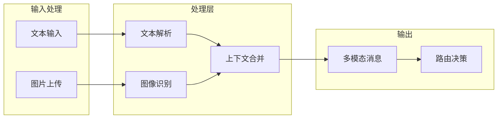

### 4.3 图表导出流程

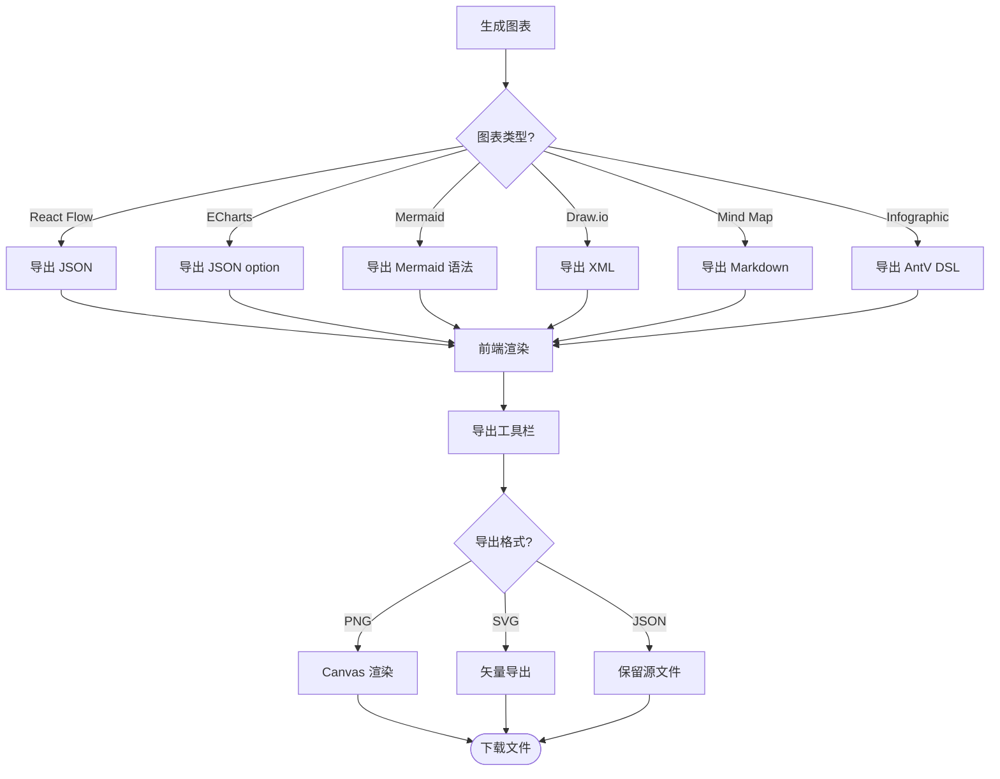

---

## 5. 部署架构图

### 5.1 Docker 部署架构

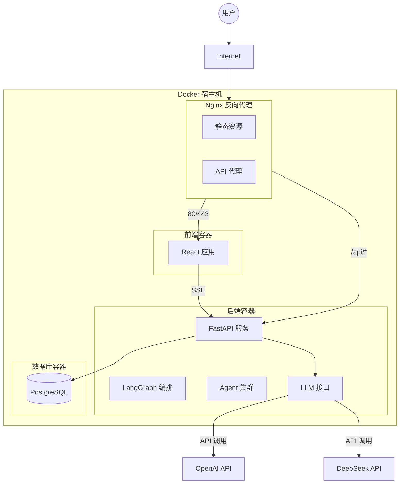

### 5.2 环境配置架构

```mermaid
flowchart LR
    subgraph Configuration [配置管理]
        EnvFile[.env 文件]
        ConfigMap[配置映射]
        Secrets[密钥管理]
    end

    subgraph Environment Variables [环境变量]
        OPENAI[OPENAI_API_KEY]
        DEEPSEEK[DEEPSEEK_API_KEY]
        DB[数据库连接]
        MODEL[模型配置]
    end

    subgraph Services [服务配置]
        BackendConfig[后端配置]
        FrontendConfig[前端配置]
    end

    EnvFile --> Environment Variables
    Secrets --> Environment Variables

    Environment Variables --> BackendConfig
    Environment Variables --> FrontendConfig
```

---

## 6. 数据模型关系图

### 6.1 核心实体关系

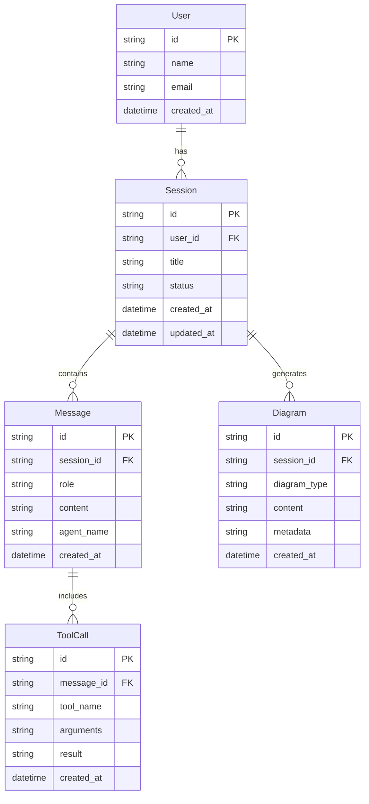

---

## 7. 关键时序图

### 7.1 思维导图生成时序图

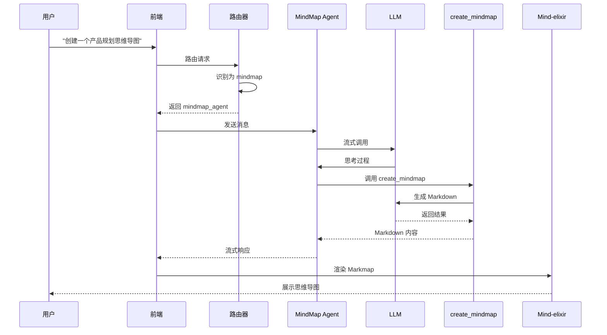

### 7.2 数据图表生成时序图

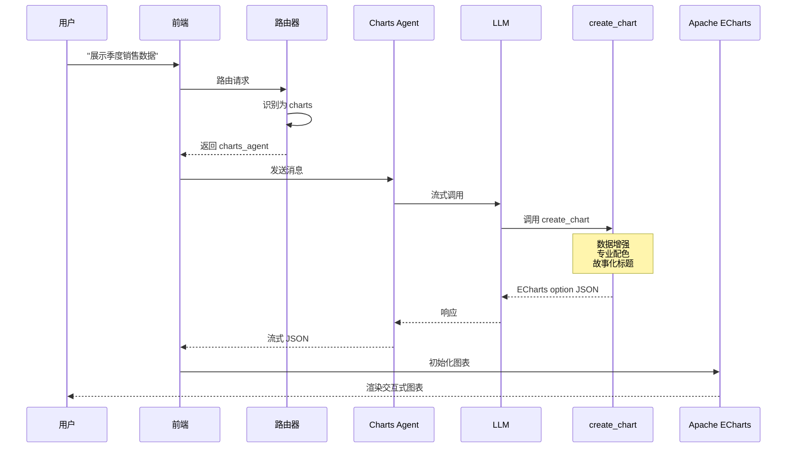

---

*文档生成时间: 2026-01-20*
*作者: Matrix Agent*
