# Remotion 架构图集

## 1. 系统整体架构图

### 核心架构概览

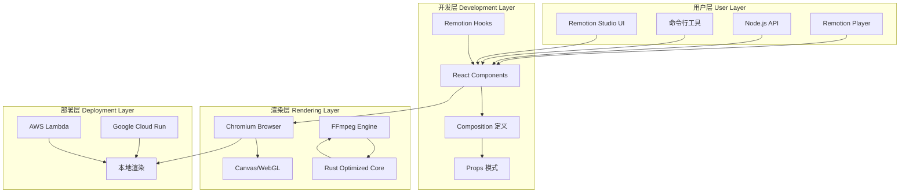

### 详细组件架构

```mermaid
graph LR
    subgraph 项目结构 Project Structure
        Config[remotion.config.ts]
        Compositions[compositions/]
        Components[components/]
        Assets[assets/]
        Utils[utils/]
    end

    subgraph 核心模块 Core Modules
        Runtime[@remotion/runtime]
        Player[@remotion/player]
        Studio[@remotion/studio]
        Renderer[@remotion/renderer]
    end

    subgraph 扩展包 Extension Packages
        Shapes[@remotion/shapes]
        Rive[@remotion/rive]
        Tailwind[@remotion/tailwind]
        Lambda[@remotion/lambda]
    end

    Compositions --> Runtime
    Components --> Runtime
    Utils --> Runtime

    Runtime --> Player
    Runtime --> Studio
    Runtime --> Renderer

    Config --> Renderer
    Assets --> Renderer
```

## 2. 核心数据流图

### 视频渲染数据流

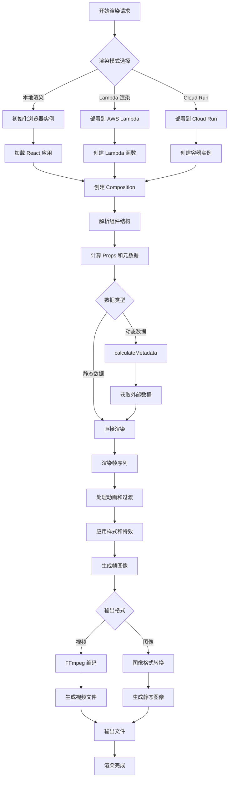

### Props 数据流

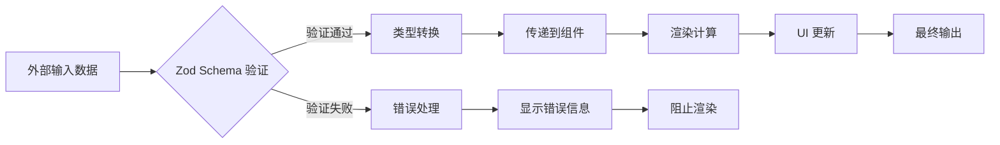

### Studio 交互数据流

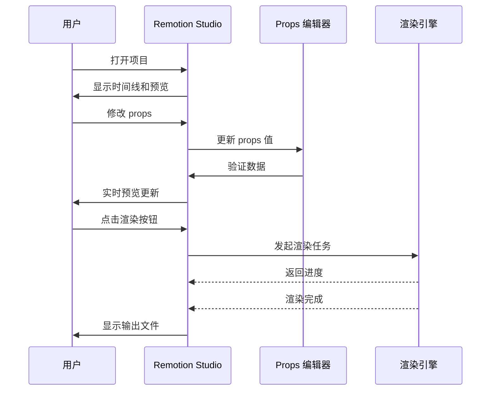

## 3. 模块依赖关系图

### 核心包依赖关系

```mermaid
graph TB
    subgraph 核心 Core
        main[remotion 主包]
        runtime[@remotion/runtime]
        renderer[@remotion/renderer]
    end

    subgraph 工具 Utilities
        player[@remotion/player]
        studio[@remotion/studio]
        cli[@remotion/cli]
    end

    subgraph 媒体 Media
        audio[音频处理]
        video[视频处理]
        images[图像处理]
    end

    subgraph 云服务 Cloud
        lambda[@remotion/lambda]
        cloudrun[@remotion/cloudrun]
    end

    main --> runtime
    main --> cli
    runtime --> renderer

    player --> main
    studio --> main

    audio --> renderer
    video --> renderer
    images --> renderer

    lambda --> main
    cloudrun --> main
```

### 组件依赖关系

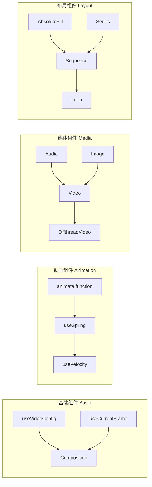

## 4. 用户交互流程图

### 创建新项目流程

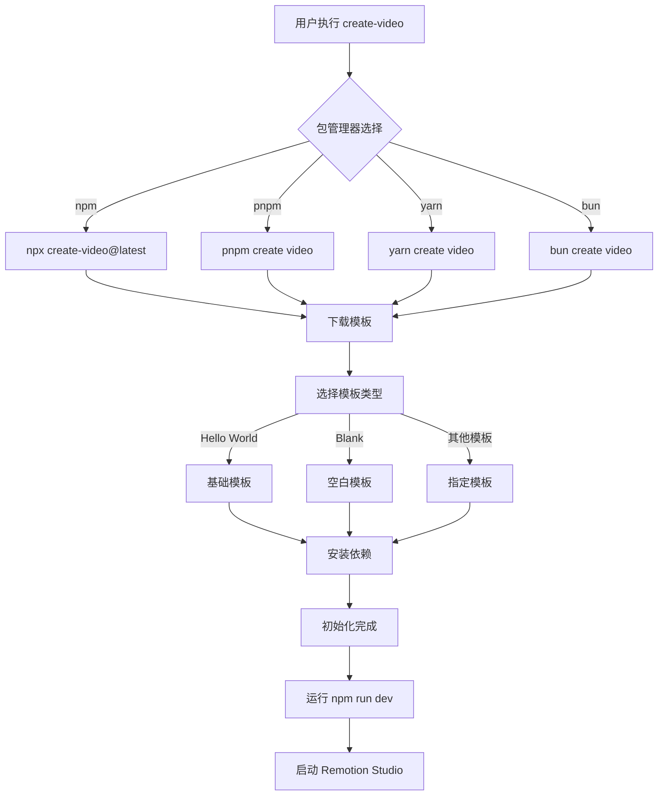

### 视频制作交互流程

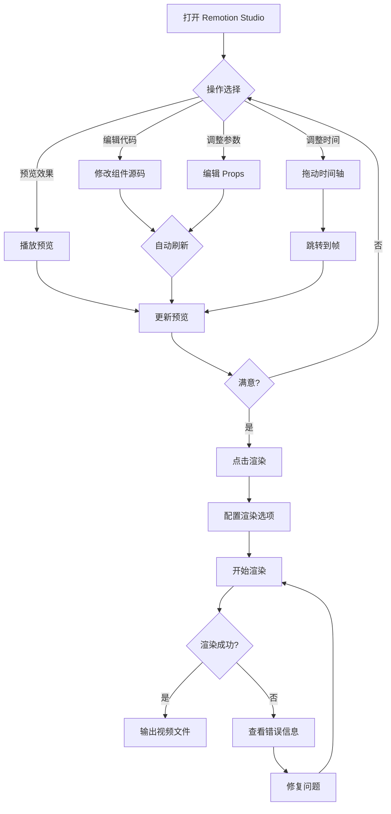

### Lambda 部署流程

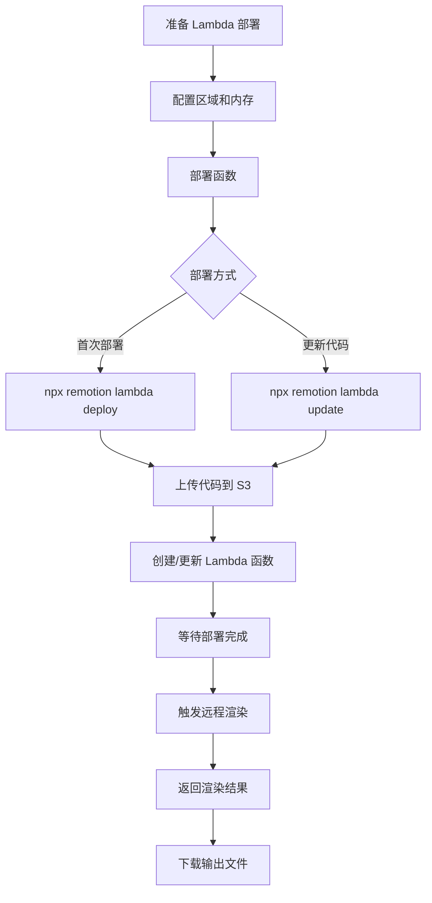

## 5. 部署架构图

### 多平台部署架构

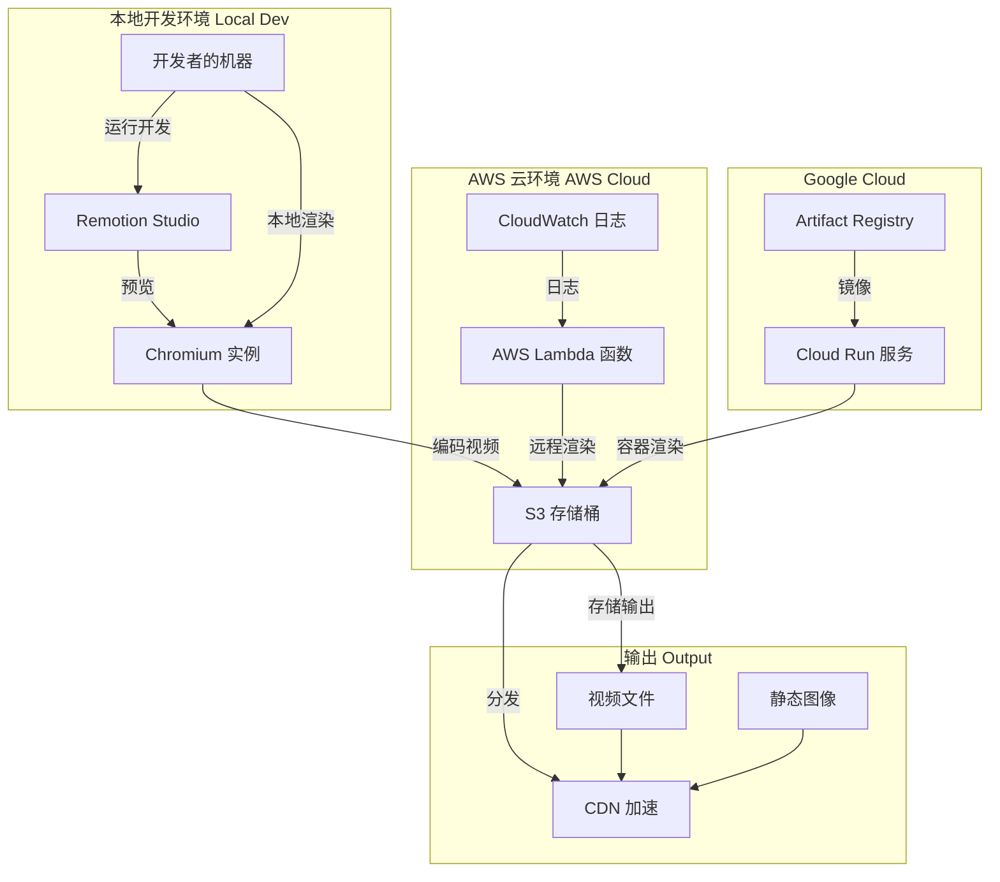

### 无服务器渲染架构

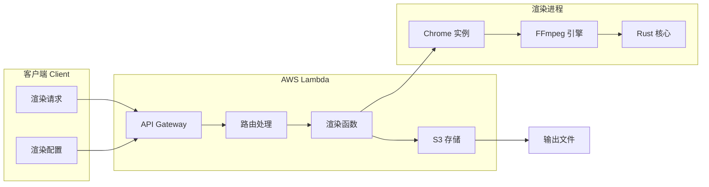

## 6. 性能优化架构

### 渲染性能优化

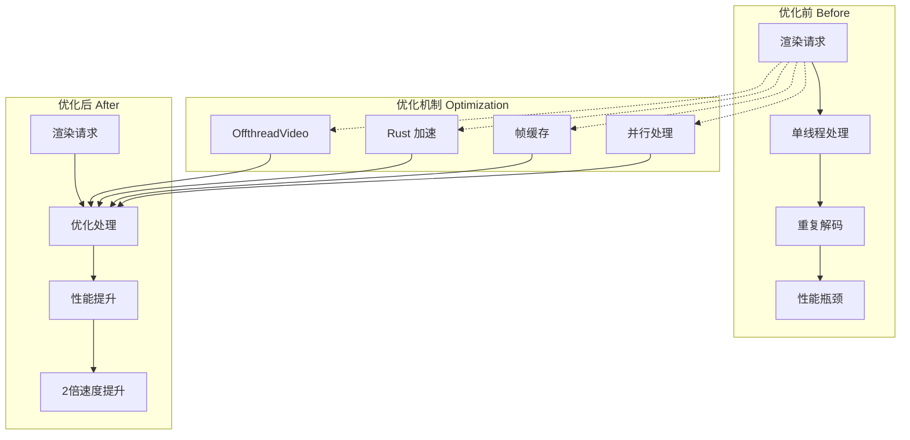

---

**文档说明**：
- 以上架构图使用 Mermaid 语法编写，可直接在支持 Mermaid 的 Markdown 查看器中渲染
- 图表展示了 Remotion 从开发到部署的完整架构流程
- 涵盖了核心组件、数据流、用户交互和部署架构

**作者**: Matrix Agent
**最后更新**: 2026-01-23
