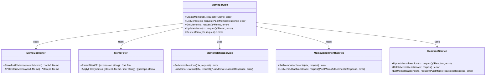

# Memos 架构图文档

## 一、系统整体架构图

### 1.1 逻辑架构


### 1.2 技术栈架构


---

## 二、核心数据流图

### 2.1 备忘录创建流程


### 2.2 备忘录查询流程


### 2.3 文件上传流程


---

## 三、模块关系图

### 3.1 核心服务模块


### 3.2 Memo 服务详细结构



---

## 四、用户交互流程图

### 4.1 典型用户操作流程


### 4.2 响应式设计流程


---

## 五、部署架构图

### 5.1 单机部署架构


### 5.2 生产环境部署架构

```mermaid
graph TB
    subgraph Internet["互联网"]
        User1["用户"]
        User2["用户"]
        User3["用户"]
    end

    subgraph DMZ["DMZ 区域"]
        Nginx["Nginx 反向代理"]
        SSL["SSL/TLS 证书"]
    end

    subgraph App["应用网络"]
        Memos["Memos Docker"]
        Cron["定时任务容器"]
    end

    subgraph Data["数据网络"]
        PostgreSQL["PostgreSQL 主库"]
        Redis["Redis 缓存"]
        S3["S3 兼容存储"]
    end

    subgraph Backup["备份网络"]
        Backup["备份存储"]
    end

    User1 -->|HTTPS| Nginx
    User2 -->|HTTPS| Nginx
    User3 -->|HTTPS| Nginx

    Nginx -->|代理| SSL
    SSL -->|HTTP| Memos

    Memos -->|连接| PostgreSQL
    Memos -->|连接| Redis
    Memos -->|上传/下载| S3

    Memos -->|定时备份| Backup
    PostgreSQL -->|同步| Backup
```

### 5.3 Kubernetes 部署架构


---

## 六、数据库模式图

### 6.1 核心表关系


---

## 七、安全架构图

### 7.1 安全防护层次


---

*文档版本：1.0*
*最后更新：2026年1月*
