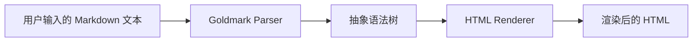

# Memos 提示词分析文档

## 一、分析结果概述

### 1.1 关键发现

**经过深入分析，Memos 项目中未发现传统意义上的 AI/LLM 提示词（Prompts）**

Memos 是一个**自托管的笔记管理应用**，其核心功能围绕传统的笔记 CRUD（创建、读取、更新、删除）操作，而非人工智能或大语言模型（LLM）相关功能。

### 1.2 项目定位说明

| 维度 | 描述 |
|-----|------|
| **项目类型** | 笔记/备忘录管理应用 |
| **核心功能** | 笔记存储、Markdown 渲染、多用户管理 |
| **AI 集成** | 无 |
| **提示词使用** | 无 |
| **技术栈** | Go + React + gRPC + 多数据库支持 |

---

## 二、项目结构中的"提示词"相关分析

### 2.1 代码库中未发现的内容

在以下位置进行了搜索和检查，均未发现 AI 相关提示词：

```bash
# 搜索范围
- /workspace/memos_repo/server/          # 服务端代码
- /workspace/memos_repo/web/src/         # 前端 React 代码
- /workspace/memos_repo/proto/           # Protocol Buffers 定义
- /workspace/memos_repo/plugin/          # 插件模块
- /workspace/memos_repo/README.md        # 项目文档
```

**搜索关键词**
- `system message`
- `prompt`
- `chat.*prompt`
- `ai.*prompt`
- `instruction`
- `assistant`
- `model.*instruction`

**搜索结果**：未匹配到任何相关文件

### 2.2 项目中的"过滤器"机制

虽然项目中没有 AI 提示词，但有一个值得注意的**CEL（Common Expression Language）过滤表达式**系统：

```protobuf
// 位于 proto/api/v1/memo_service.proto
message ListMemosRequest {
  // Optional. Filter to apply to the list results.
  // Filter is a CEL expression to filter memos.
  string filter = 5 [(google.api.field_behavior) = OPTIONAL];
}
```

**过滤表达式示例**（非提示词）：

```cel
// 筛选标签为 "work" 的备忘录
tags: contains("work")

// 筛选可见性为公开的备忘录
visibility == "PUBLIC"

// 组合条件
tags: contains("tech") && visibility == "PUBLIC"
```

这不是 AI 提示词，而是一种**声明式查询语言**，用于数据库记录的筛选。

---

## 三、Markdown 处理机制

### 3.1 Markdown 解析器

Memos 使用 Goldmark 作为 Markdown 解析器，相关代码位于：

```
plugin/markdown/
```

**解析流程**：



**支持的 Markdown 元素**：

| 元素类型 | 支持情况 |
|---------|--------|
| 标题 (H1-H6) | 完全支持 |
| 粗体/斜体 | 完全支持 |
| 代码块 | 完全支持 |
| 任务列表 | 完全支持 |
| 表格 | 完全支持 |
| 链接和图片 | 完全支持 |
| 数学公式 | 部分支持 |
| Mermaid 图表 | 需要额外配置 |

### 3.2 标签提取

系统会自动从 Markdown 内容中提取标签：

```go
// 标签匹配正则
#标签名
```

---

## 四、扩展建议：集成 AI 功能

虽然当前版本没有 AI 功能，但作为扩展方向，可以考虑以下集成方式：

### 4.1 智能标签建议

```go
// 伪代码示例：AI 标签推荐
func SuggestTags(content string) []string {
    // 调用外部 AI API 或本地 LLM
    prompt := fmt.Sprintf(`
        Analyze the following text and suggest 3-5 relevant tags:
        Text: %s
        Output format: JSON array of strings
    `, content)

    response := CallLLM(prompt)
    return ParseTags(response)
}
```

### 4.2 内容摘要生成

```go
// 伪代码示例：AI 内容摘要
func SummarizeMemo(content string) string {
    prompt := `Generate a concise one-sentence summary of this memo:`

    return CallLLM(prompt + " " + content)
}
```

### 4.3 智能搜索增强

```go
// 伪代码示例：语义搜索
func SemanticSearch(query string) []Memo {
    // 将查询转换为向量
    queryVector := EmbedText(query)

    // 在备忘录向量空间中搜索
    results := VectorSearch(queryVector)

    return results
}
```

---

## 五、项目中与"提示"相关的设计

### 5.1 用户界面中的提示

虽然不是 AI 提示词，但项目中有一些用户引导提示：

```typescript
// 位于 web/src/components/

// 首次使用引导
const onboardingTips = [
  "点击右上角创建您的第一条备忘录",
  "使用 #标签 来组织内容",
  "支持 Markdown 语法格式化文本",
  "可以通过设置调整外观和隐私选项"
];

// 输入占位符提示
const inputPlaceholder = "在这里输入您的想法... (支持 Markdown)";
```

### 5.2 帮助和文档提示

```markdown
## Markdown 快捷键提示

- **粗体**: Ctrl/Cmd + B
- **斜体**: Ctrl/Cmd + I
- **代码块**: Ctrl/Cmd + K
- **任务列表**: - [ ] 或 * [ ]
```

---

## 六、结论

### 6.1 分析结论

| 检查项目 | 结果 |
|---------|------|
| AI/LLM 提示词 | **不存在** |
| System Messages | **不存在** |
| Chat Templates | **不存在** |
| 提示词工程实践 | **不适用** |

### 6.2 原因分析

Memos 项目**专注于传统的笔记管理功能**，其设计理念是：

1. **轻量级**：避免引入复杂的 AI 依赖
2. **隐私优先**：本地运行，不依赖外部 AI 服务
3. **简洁性**：保持核心功能简单可靠
4. **开放性**：通过 API 支持外部工具集成

### 6.3 未来可能性

根据项目的发展路线，未来可能通过以下方式集成 AI：

- **可选的 AI 插件**：作为独立模块，按需启用
- **本地 LLM 支持**：使用 Ollama 等本地模型
- **第三方 API 集成**：OpenAI、Anthropic 等 API

---

## 七、参考资源

### 7.1 相关文件

| 文件路径 | 说明 |
|---------|------|
| `/workspace/memos_repo/proto/api/v1/memo_service.proto` | Memo 服务 API 定义 |
| `/workspace/memos_repo/plugin/filter/engine.go` | 过滤引擎实现 |
| `/workspace/memos_repo/README.md` | 项目 README |

### 7.2 外部链接

- **项目官网**: https://usememos.com
- **GitHub 仓库**: https://github.com/usememos/memos
- **官方文档**: https://usememos.com/docs

---

*文档版本：1.0*
*最后更新：2026年1月*
*分析工具：代码库搜索 + 文件检查*
