# Supermemory 架构图集

## 系统整体架构图

### 整体架构概览

Supermemory采用现代化的单体仓库（Monorepo）架构设计，由Turborepo进行统一的构建管理和发布编排。整个系统由多个独立的应用程序（Apps）和共享功能包（Packages）组成，形成清晰的分层结构和模块边界。这种架构既保证了开发效率（代码共享、类型统一），又维护了各应用之间的独立性和可部署性。

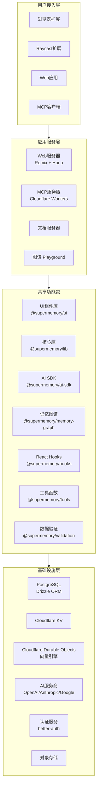

### 技术栈分布图

不同层次的技术选型反映了Supermemory在性能和开发效率之间的平衡考量。前端采用Remix框架充分利用服务端渲染的优势，后端服务部署在Cloudflare Workers上实现边缘计算能力，数据库层选择PostgreSQL保证数据一致性和查询能力。

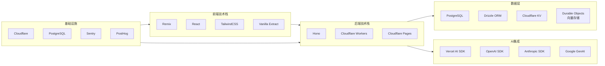

## 核心数据流图

### 记忆添加流程

用户添加记忆内容时，系统会经过一系列处理步骤将原始内容转换为可检索的向量表示。这一流程涉及内容解析、向量化、索引存储等多个环节，每个环节都经过优化以确保处理效率和存储空间的合理利用。

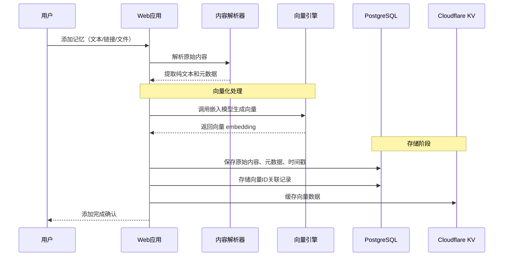

### 记忆检索与对话流程

当用户与记忆库进行对话时，系统需要协调向量检索、提示词构造、AI模型调用等多个组件。这一流程的设计目标是最大化检索相关性、最小化响应延迟，同时控制token使用成本。

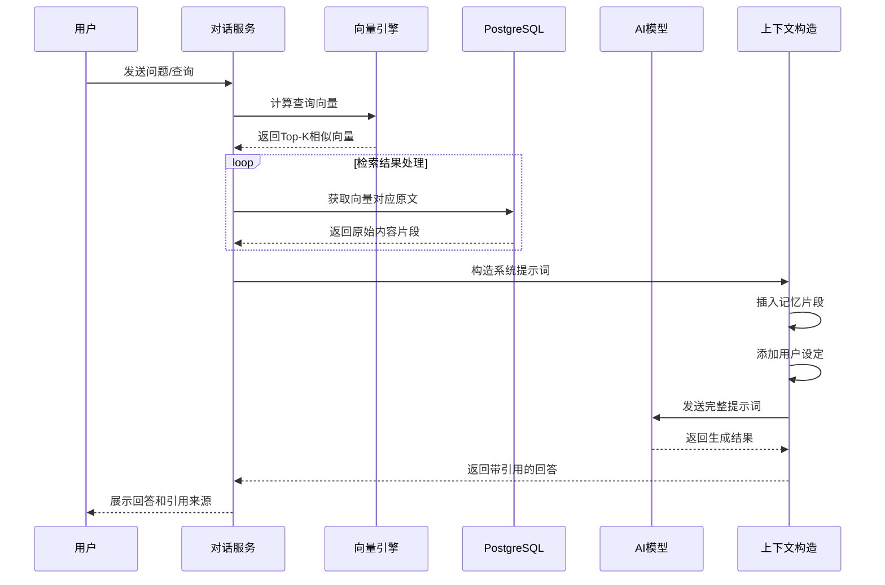

### MCP工具调用流程

当AI工具（如Claude Desktop、Cursor）通过MCP协议调用Supermemory时，系统需要处理工具调用请求、验证权限、执行操作并返回结果。这一流程遵循MCP协议规范，确保与各种AI客户端的兼容性。

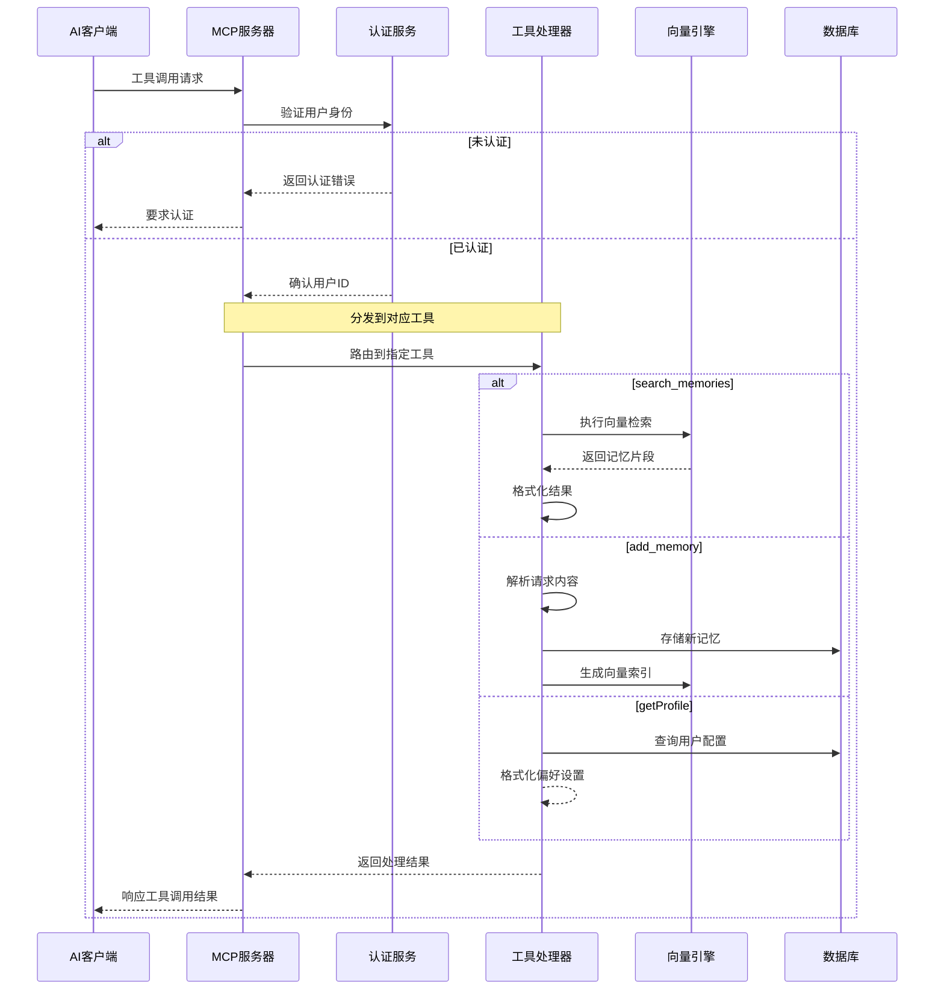

## 类与模块关系图

### 核心模块依赖关系

Supermemory的代码组织遵循清晰的依赖规则：应用程序（Apps）依赖共享功能包（Packages），Packages之间也存在明确的依赖关系。这种分层架构确保了代码的高内聚低耦合，便于维护和测试。

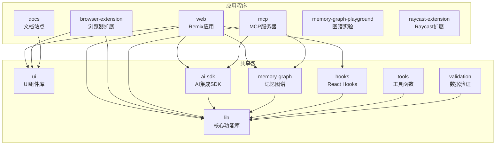

### 数据库实体关系图

Supermemory的数据模型围绕「记忆」核心概念构建，包含用户、会话、记忆内容、向量索引等实体。实体之间通过外键关联形成完整的数据图谱，支持复杂的查询和检索需求。

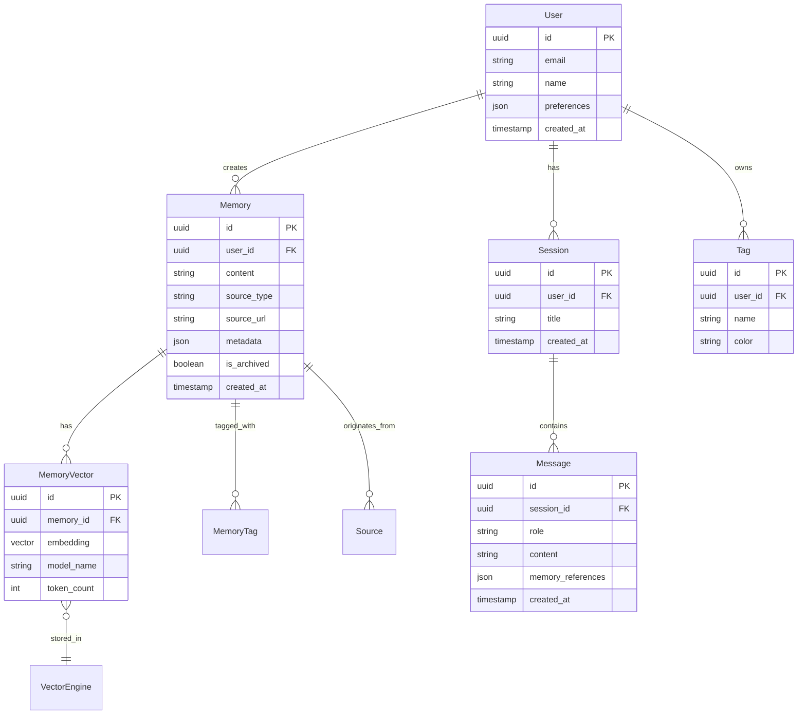

## 用户交互流程图

### Web应用用户旅程

用户首次使用Supermemory Web应用的典型交互流程涵盖账号创建、内容添加、对话检索等核心环节。每个环节都经过精心设计，确保用户能够快速上手并获得价值。

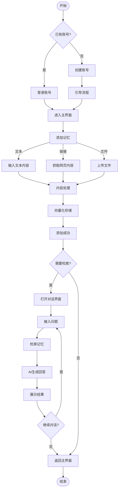

### 浏览器扩展交互流程

浏览器扩展提供了一种更加便捷的记忆保存方式，用户可以在浏览任意网页时快速捕捉感兴趣的内容。这一流程最大化了「即时捕获」的用户体验，减少了信息流失的可能性。

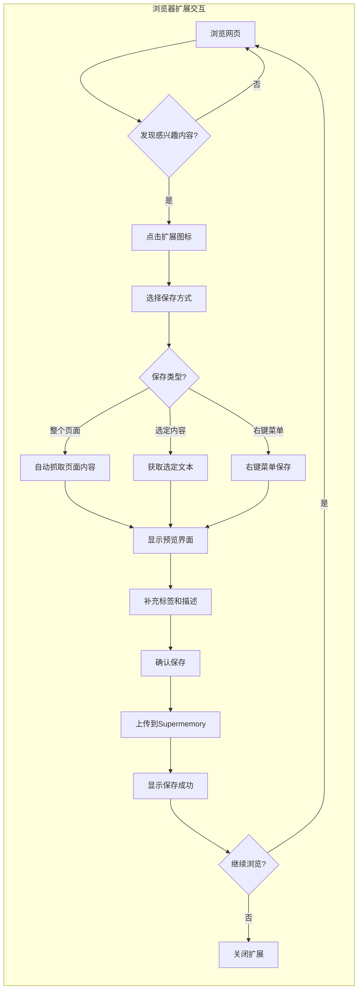

### MCP集成配置流程

将Supermemory集成到外部AI工具中需要完成MCP服务器的配置。这一流程涉及获取配置信息、在AI工具中添加服务器、验证连接成功等步骤。

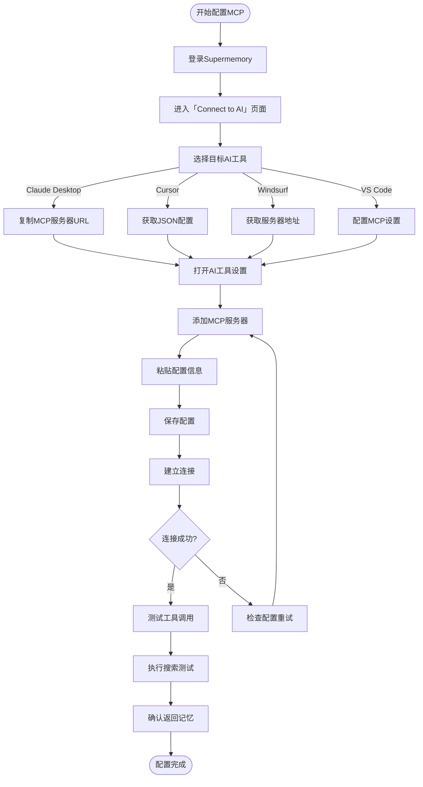

## 部署架构图

### 生产环境部署架构

Supermemory的生产环境采用多区域部署策略，充分利用Cloudflare的全球边缘网络提供低延迟服务访问。核心数据存储在PostgreSQL数据库中，AI相关计算通过API调用外部服务完成，实现了计算与存储的分离。

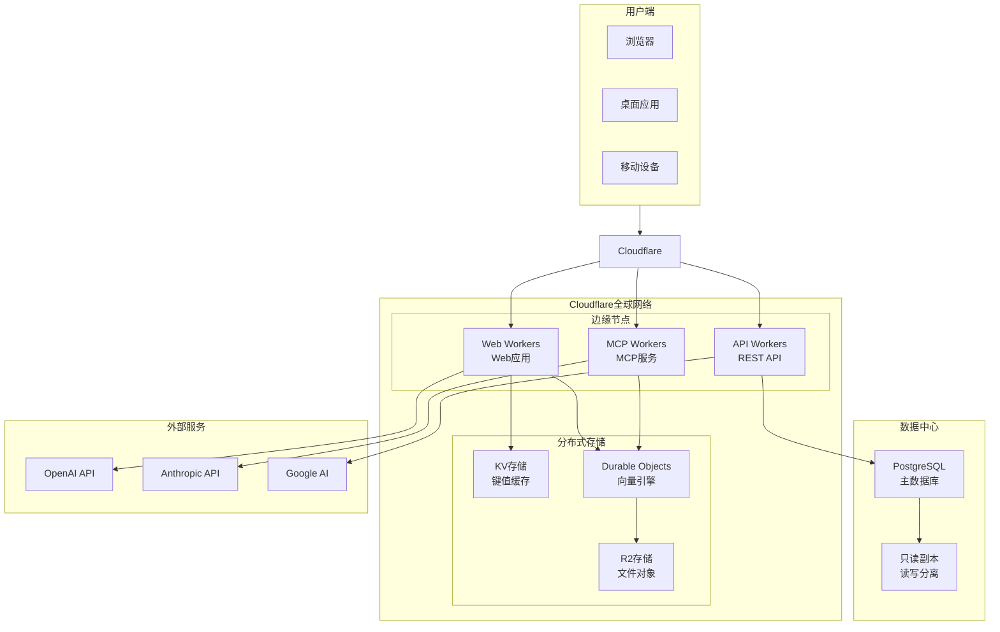

### 开发环境架构

开发环境采用与生产环境相似的架构，但使用本地服务和模拟组件替代云端资源。这一设计确保开发者在本地能够完成大部分开发和测试工作，同时保持代码在环境间的一致性。

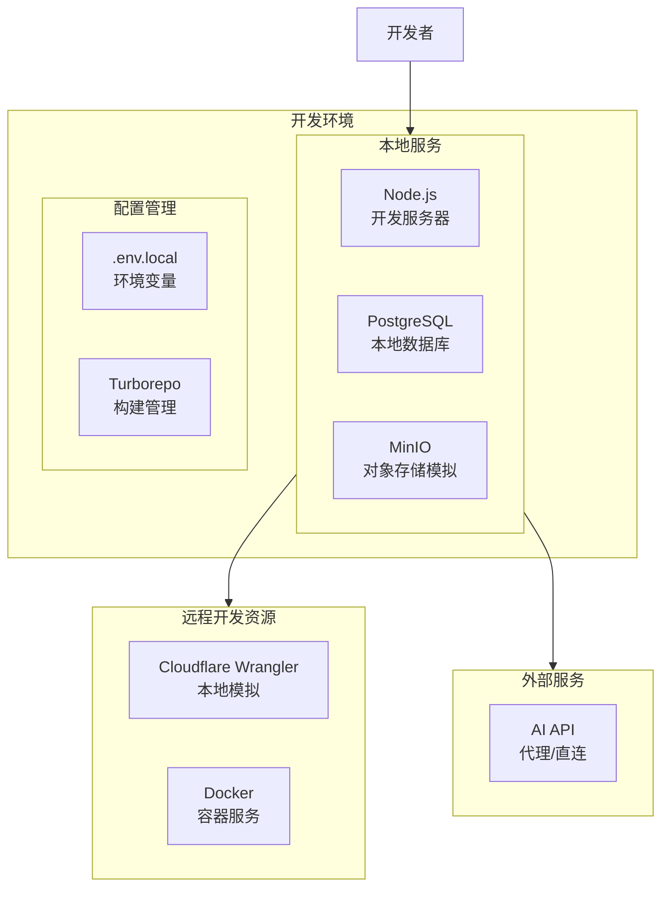

### CI/CD流水线架构

Supermemory采用自动化的持续集成和持续部署流程，确保代码变更能够快速、安全地部署到生产环境。流水线涵盖代码检查、构建测试、预览部署、生产发布等多个阶段。

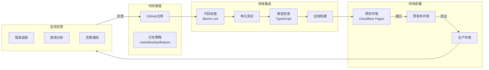

---

以上架构图集全面展示了Supermemory系统的设计理念和技术实现细节。从整体架构到模块关系，从数据流到用户交互，从开发环境到生产部署，每个层面都经过精心设计以支持系统的极速、可扩展目标。
