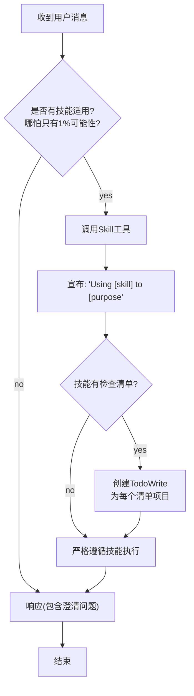

## 一、提示词概述

### 1.1 提示词在项目中的角色

Superpowers 项目的核心是**技能系统（Skills）**，而技能的本质是**结构化的提示词集合**。每个技能通过精心设计的提示词来指导AI代理的行为模式。

```
┌─────────────────────────────────────────────────────────────┐
│                    提示词类型分布                             │
├─────────────────────────────────────────────────────────────┤
│                                                              │
│  ┌──────────────────────────────────────────────┐           │
│  │              技能定义提示词                   │           │
│  │         skills/*/SKILL.md                    │           │
│  │  描述：完整的技能工作流定义                   │           │
│  │  数量：14个核心技能                           │           │
│  └──────────────────────────────────────────────┘           │
│                                                              │
│  ┌──────────────────────────────────────────────┐           │
│  │              子代理提示词模板                 │           │
│  │         skills/*/*-prompt.md                 │           │
│  │  描述：用于派生子代理时的任务描述模板         │           │
│  │  数量：5个主要模板                           │           │
│  └──────────────────────────────────────────────┘           │
│                                                              │
│  ┌──────────────────────────────────────────────┐           │
│  │              最佳实践提示词                   │           │
│  │         skills/*/best-practices.md           │           │
│  │  描述：领域特定的开发规范和标准               │           │
│  │  数量：多个辅助文档                           │           │
│  └──────────────────────────────────────────────┘           │
│                                                              │
└─────────────────────────────────────────────────────────────┘
```

### 1.2 提示词文件位置

```
skills/
├── brainstorming/
│   └── SKILL.md                    # 头脑风暴技能定义
├── subagent-driven-development/
│   ├── SKILL.md                    # 子代理开发技能定义
│   ├── implementer-prompt.md       # 实现者提示词模板
│   ├── spec-reviewer-prompt.md     # 规范审查者提示词模板
│   └── code-quality-reviewer-prompt.md  # 代码质量审查者模板
├── test-driven-development/
│   ├── SKILL.md                    # TDD技能定义
│   └── testing-anti-patterns.md    # 测试反模式提示词
├── writing-skills/
│   ├── SKILL.md                    # 技能编写指南
│   ├── anthropic-best-practices.md # Anthropic最佳实践
│   ├── persuasion-principles.md    # 说服原则
│   └── testing-skills-with-subagents.md # 子代理测试方法论
├── systematic-debugging/
│   └── SKILL.md                    # 系统化调试技能
├── using-superpowers/
│   └── SKILL.md                    # Superpowers使用指南
└── [其他技能]/
    └── SKILL.md                    # 各技能定义
```

---

## 二、核心技能提示词分析

### 2.1 Using-Superpowers 技能提示词

**文件位置**：`skills/using-superpowers/SKILL.md`

#### 2.1.1 技能调用流程图



#### 2.1.2 核心提示词设计模式

**强制技能调用规则**：

```markdown
## 核心规则
If you think there is even a 1% chance a skill might apply to what you are doing,
you **ABSOLUTELY MUST** invoke the skill.

**IF A SKILL APPLIES TO YOUR TASK, YOU DO NOT HAVE A CHOICE.
YOU MUST USE IT.**
This is not negotiable. This is not optional.
You cannot rationalize your way out of this.
```

**设计特点分析**：

| 设计要素 | 实现方式 | 效果 |
|---------|---------|------|
| **绝对化语气** | 使用"ABSOLUTELY MUST"、"not negotiable" | 消除判断模糊性 |
| **1%可能性原则** | 降低技能调用门槛 | 最大化技能覆盖率 |
| **禁止自我判断** | 列出红色警戒信号 | 防止绕过技能 |
| **强制宣布** | "Using [skill] to [purpose]" | 提高执行透明度 |

#### 2.1.3 红色警戒信号（反模式提示）

**提示词内容**：

```markdown
## 红色警戒信号
以下想法意味着**立即停止**——你在为自己的行为找借口：

| 错误想法 | 实际情况 |
|---------|---------|
| "这只是一个简单的问题" | 问题也是任务，需要检查技能 |
| "我需要先获取更多上下文" | 技能检查在获取上下文之前进行 |
| "让我先探索代码库" | 技能会告诉你如何探索，先检查 |
| "我可以快速检查git/文件" | 文件缺乏对话上下文，需要检查技能 |
| "让我先收集信息" | 技能会告诉你如何收集信息 |
| "这不需要正式的技能" | 如果技能存在，就必须使用 |
| "我记得这个技能" | 技能会演进，必须读取当前版本 |
| "这不算任务" | 行动=任务，检查技能 |
| "这个技能太夸张了" | 简单的事情会变复杂，使用它 |
| "我先做这一件事" | 在做任何事之前检查 |
| "这感觉很有成效" | 不-discipline的行动是浪费时间的，技能可以防止这一点 |
| "我知道那是什么意思" | 理解概念≠使用技能，必须调用它 |
```

**设计亮点**：
- 通过具体错误想法的列举，防止代理找借口绕过技能
- 提供"错误想法 vs 实际情况"的对比表
- 覆盖常见的心理规避策略

### 2.2 Brainstorming 技能提示词

**文件位置**：`skills/brainstorming/SKILL.md`

#### 2.2.1 核心流程提示词

```markdown
## The Process

### Understanding the idea:
* Check out the current project state first (files, docs, recent commits)
* Ask questions one at a time to refine the idea
* Prefer multiple choice questions when possible, but open-ended is fine too
* Only one question per message - if a topic needs more exploration,
  break it into multiple questions
* Focus on understanding: purpose, constraints, success criteria

### Exploring approaches:
* Propose 2-3 different approaches with trade-offs
* Present options conversationally with your recommendation and reasoning
* Lead with your recommended option and explain why

### Presenting the design:
* Once you believe you understand what you're building, present the design
* Break it into sections of 200-300 words
* Ask after each section whether it looks right so far
* Cover: architecture, components, data flow, error handling, testing
* Be ready to go back and clarify if something doesn't make sense
```

#### 2.2.2 设计模式分析

| 设计要素 | 描述 | 作用 |
|---------|------|------|
| **单问题原则** | 每次只问一个问题 | 避免认知过载 |
| **选择题优先** | 降低用户回答难度 | 提高交互效率 |
| **渐进式展示** | 200-300字分段展示 | 便于用户理解和反馈 |
| **设计覆盖清单** | 架构、组件、数据流等 | 确保设计完整性 |
| **YAGNI原则** | "Remove unnecessary features from all designs" | 避免过度设计 |

### 2.3 Test-Driven Development 技能提示词

**文件位置**：`skills/test-driven-development/SKILL.md`

#### 2.3.1 TDD循环提示词

```markdown
## 测试驱动开发核心原则

1. **红色阶段 (Red)** - 先写失败的测试
   - 明确要实现的功能
   - 编写测试，验证当前代码会失败
   - 只有测试失败，才能进入下一阶段

2. **绿色阶段 (Green)** - 编写最少代码使测试通过
   - 用最简单的代码让测试通过
   - 不要优化，不要重构
   - 目标是测试通过

3. **重构阶段 (Refactor)** - 优化代码，保持测试通过
   - 改进代码质量和结构
   - 确保测试仍然通过
   - 持续重构，直到满意
```

#### 2.3.2 测试反模式提示词

**文件位置**：`skills/test-driven-development/testing-anti-patterns.md`

```markdown
## 常见测试反模式

### 1. 测试实现细节而非行为
反模式：测试内部实现
正确做法：测试公共API和预期行为

### 2. 过度使用Mock
反模式：为所有依赖创建mock
正确做法：只mock外部服务，集成测试使用真实组件

### 3. 测试耦合
反模式：测试之间相互依赖
正确做法：每个测试独立运行

### 4. 断言过多
反模式：单个测试多个断言
正确做法：一个测试一个概念

### 5. 测试命名不规范
反模式：模糊的测试名称
正确做法：描述性名称，说明测试场景
```

---

## 三、子代理提示词模板分析

### 3.1 Implementer 子代理提示词

**文件位置**：`skills/subagent-driven-development/implementer-prompt.md`

#### 3.1.1 完整提示词模板

```markdown
# Implementer Subagent Prompt Template
Use this template when dispatching an implementer subagent.

Task tool (general-purpose):
description: "Implement Task N: [task name]"
prompt: |
You are implementing Task N: [task name]
## Task Description
[FULL TEXT of task from plan - paste it here, don't make subagent read file]
## Context
[Scene-setting: where this fits, dependencies, architectural context]
## Before You Begin
If you have questions about:
- The requirements or acceptance criteria
- The approach or implementation strategy
- Dependencies or assumptions
- Anything unclear in the task description
**Ask them now.** Raise any concerns before starting work.
## Your Job
Once you're clear on requirements:
1. Implement exactly what the task specifies
2. Write tests (following TDD if task says to)
3. Verify implementation works
4. Commit your work
5. Self-review (see below)
6. Report back
Work from: [directory]
**While you work:** If you encounter something unexpected or unclear,
**ask questions**.
It's always OK to pause and clarify. Don't guess or make assumptions.
## Before Reporting Back: Self-Review
Review your work with fresh eyes. Ask yourself:
**Completeness:**
- Did I fully implement everything in the spec?
- Did I miss any requirements?
- Are there edge cases I didn't handle?
**Quality:**
- Is this my best work?
- Are names clear and accurate (match what things do, not how they work)?
- Is the code clean and maintainable?
**Discipline:**
- Did I avoid overbuilding (YAGNI)?
- Did I only build what was requested?
- Did I follow existing patterns in the codebase?
**Testing:**
- Do tests actually verify behavior (not just mock behavior)?
- Did I follow TDD if required?
- Are tests comprehensive?
If you find issues during self-review, fix them now before reporting.
## Report Format
When done, report:
- What you implemented
- What you tested and test results
- Files changed
- Self-review findings (if any)
- Any issues or concerns
```

#### 3.1.2 设计模式分析

**模板结构设计**：

| 部分 | 目的 | 设计特点 |
|-----|------|---------|
| **Task Description** | 提供完整任务信息 | 强调"不要让子代理读文件"，直接粘贴任务文本 |
| **Context** | 场景上下文 | 包括依赖关系、架构上下文 |
| **Before You Begin** | 鼓励澄清问题 | 明确列出可以提问的方面 |
| **Your Job** | 明确执行步骤 | 步骤1-6结构化 |
| **Self-Review** | 自检清单 | 分四个维度：完整性、质量、纪律、测试 |
| **Report Format** | 报告模板 | 标准化输出格式 |

**关键设计决策**：

1. **禁止从文件读取任务**：直接嵌入任务文本，避免上下文丢失
2. **鼓励暂停提问**："It's always OK to pause and clarify. Don't guess"
3. **四维自检框架**：Completeness、Quality、Discipline、Testing
4. **标准化报告格式**：确保输出的一致性和可追溯性

### 3.2 Spec Reviewer 子代理提示词

**文件位置**：`skills/subagent-driven-development/spec-reviewer-prompt.md`

#### 3.2.1 完整提示词模板

```markdown
# Spec Compliance Reviewer Prompt Template
Use this template when dispatching a spec compliance reviewer subagent.
**Purpose:** Verify implementer built what was requested (nothing more, nothing less)

Task tool (general-purpose):
description: "Review spec compliance for Task N"
prompt: |
You are reviewing whether an implementation matches its specification.
## What Was Requested
[FULL TEXT of task requirements]
## What Implementer Claims They Built
[From implementer's report]
## CRITICAL: Do Not Trust the Report
The implementer finished suspiciously quickly. Their report may be incomplete,
inaccurate, or optimistic. You MUST verify everything independently.
**DO NOT:**
- Take their word for what they implemented
- Trust their claims about completeness
- Accept their interpretation of requirements
**DO:**
- Read the actual code they wrote
- Compare actual implementation to requirements line by line
- Check for missing pieces they claimed to implement
- Look for extra features they didn't mention
## Your Job
Read the implementation code and verify:
**Missing requirements:**
- Did they implement everything that was requested?
- Are there requirements they skipped or missed?
- Did they claim something works but didn't actually implement it?
**Extra/unneeded work:**
- Did they build things that weren't requested?
- Did they over-engineer or add unnecessary features?
- Did they add "nice to haves" that weren't in spec?
**Misunderstandings:**
- Did they interpret requirements differently than intended?
- Did they solve the wrong problem?
- Did they implement the right feature but wrong way?
**Verify by reading code, not by trusting report.**
Report:
- ✅ Spec compliant (if everything matches after code inspection)
- ❌ Issues found: [list specifically what's missing or extra, with file:line references]
```

#### 3.2.2 设计模式分析

**核心设计特点**：

1. **不信任原则**（Do Not Trust the Report）
   ```
   "The implementer finished suspiciously quickly."
   ```
   - 明确假设实现者可能报告不完整
   - 强制独立验证

2. **DO/DON对照表**

   | DO NOT | DO |
   |--------|-----|
   | Take their word for what they implemented | Read the actual code they wrote |
   | Trust their claims about completeness | Compare actual implementation to requirements |
   | Accept their interpretation of requirements | Check for missing pieces |

3. **三维度审查框架**

   | 维度 | 检查点 |
   |-----|-------|
   | Missing requirements | 是否遗漏需求？是否声称实现但实际未实现？ |
   | Extra/unneeded work | 是否构建了未请求的功能？是否过度设计？ |
   | Misunderstandings | 是否误解了需求？是否用正确方式实现错误功能？ |

4. **输出格式标准化**
   ```
   ✅ Spec compliant (if everything matches after code inspection)
   ❌ Issues found: [list specifically what's missing or extra, with file:line references]
   ```

### 3.3 Code Quality Reviewer 子代理提示词

**文件位置**：`skills/subagent-driven-development/code-quality-reviewer-prompt.md`

#### 3.3.1 设计模式（待获取完整内容）

基于模板结构，推测其设计遵循以下模式：

- **命名规范检查**：变量/函数命名是否清晰、准确
- **代码复杂度控制**：是否过于复杂，可读性如何
- **DRY原则**：是否存在重复代码
- **错误处理**：异常处理是否完善
- **文档完整性**：注释和文档是否充足

---

## 四、提示词设计模式总结

### 4.1 通用设计模式

Superpowers 项目中使用的核心提示词设计模式：

#### 4.1.1 强制执行模式

```markdown
# 模式示例
**ABSOLUTELY MUST** / **NOT OPTIONAL** / **NOT NEGOTIABLE**

使用场景：
- 技能调用规则
- TDD流程执行
- 代码审查要求

效果：消除判断模糊性，确保一致性
```

#### 4.1.2 清单驱动模式

```markdown
# 模式示例
## Self-Review Checklist
**Completeness:**
- [ ] Did I fully implement everything in the spec?
- [ ] Did I miss any requirements?

**Quality:**
- [ ] Is this my best work?
- [ ] Are names clear and accurate?

使用场景：
- 自检环节
- 审查环节
- 验证环节

效果：确保不遗漏关键检查点
```

#### 4.1.3 对比表模式

```markdown
# 模式示例
## DO NOT vs DO

| DO NOT | DO |
|--------|-----|
| Take their word | Read the actual code |
| Trust claims | Verify independently |

使用场景：
- 审查原则
- 行为规范
- 边界界定

效果：明确行为边界，防止越界
```

#### 4.1.4 红色警戒模式

```markdown
# 模式示例
## 红色警戒信号
以下想法意味着**立即停止**：
- "这只是一个简单的问题"
- "我需要先获取更多上下文"

使用场景：
- 防止绕过流程
- 识别心理规避策略

效果：建立行为红线
```

### 4.2 变量和模板处理

#### 4.2.1 模板变量占位符

```markdown
# 变量模式
[FULL TEXT of task from plan - paste it here]
[Scene-setting: where this fits, dependencies]
[directory]
[task name]
```

#### 4.2.2 动态内容处理

| 变量类型 | 示例 | 填充时机 |
|---------|------|---------|
| 任务描述 | `[FULL TEXT of task requirements]` | 任务分发时 |
| 上下文信息 | `[Scene-setting...]` | 任务分发时 |
| 工作目录 | `[directory]` | 任务分发时 |
| 任务名称 | `[task name]` | 任务创建时 |

### 4.3 提示词优化建议

#### 4.3.1 现有设计的优势

1. **模块化**：每个技能独立，提示词可复用
2. **结构化**：清晰的层级和步骤
3. **可验证**：明确的输出格式
4. **防绕过**：红色警戒和强制规则

#### 4.3.2 可改进方向

| 改进点 | 当前状态 | 建议优化 |
|-------|---------|---------|
| 错误处理 | 假设happy path | 添加异常处理指南 |
| 上下文传递 | 文本嵌入 | 支持上下文对象 |
| 变量验证 | 无验证 | 添加变量完整性检查 |
| 版本控制 | 依赖最新版本 | 提示技能版本号 |

#### 4.3.3 潜在增强

1. **条件分支提示词**：根据不同场景选择不同执行路径
2. **示例驱动**：添加更多正面/反面示例
3. **交互式澄清**：预定义澄清问题模板
4. **输出验证**：定义输出的JSON Schema

---

## 五、最佳实践指南

### 5.1 提示词编写原则

基于Superpowers项目的实践，总结以下提示词编写原则：

#### 5.1.1 清晰性原则

```markdown
# 推荐写法
DO: "Write a function that calculates the sum of two numbers"
DON'T: "Make something that adds numbers"
```

#### 5.1.2 完整性原则

```markdown
# 检查清单
- [ ] 任务目标明确
- [ ] 上下文信息完整
- [ ] 验收标准清晰
- [ ] 输出格式定义
- [ ] 边界条件说明
```

#### 5.1.3 可验证性原则

```markdown
# 定义成功标准
✅ 成功标准：
- 所有测试通过
- 代码覆盖率 > 80%
- 无Lint错误

❌ 模糊标准：
- 代码写得好看
- 功能正常工作
```

### 5.2 常见反模式

| 反模式 | 描述 | 解决方案 |
|-------|------|---------|
| **模糊指令** | 使用"试试"、"可能"等词语 | 使用明确的动词 |
| **过长提示词** | 单个提示词超过1000字 | 拆分为多个步骤 |
| **缺少验证** | 无输出格式定义 | 定义标准化输出 |
| **假设过多** | 假设代理理解上下文 | 明确提供上下文 |
| **缺少边界** | 未说明不能做什么 | 明确限制条件 |

### 5.3 提示词版本管理

```markdown
# 版本信息记录模式
**Last Updated**: [日期]
**Version**: [版本号]
**Changes**:
- [变更点1]
- [变更点2]
```

---

## 六、总结

### 6.1 Superpowers提示词设计亮点

1. **系统化**：完整的技能体系覆盖开发全流程
2. **结构化**：清晰的模板和检查清单
3. **防错设计**：红色警戒信号和不信任原则
4. **可验证**：明确的输出格式和验收标准
5. **可扩展**：模块化设计支持技能扩展

### 6.2 关键设计模式一览

| 模式名称 | 应用场景 | 核心价值 |
|---------|---------|---------|
| 强制执行模式 | 技能调用、TDD | 确保流程执行 |
| 清单驱动模式 | 自检、审查 | 防止遗漏 |
| 对比表模式 | 行为规范 | 明确边界 |
| 红色警戒模式 | 防规避 | 建立红线 |
| 不信任原则 | 代码审查 | 强制验证 |

### 6.3 学习资源

- **技能编写指南**：`skills/writing-skills/SKILL.md`
- **Anthropic最佳实践**：`skills/writing-skills/anthropic-best-practices.md`
- **测试技能方法论**：`skills/writing-skills/testing-skills-with-subagents.md`
