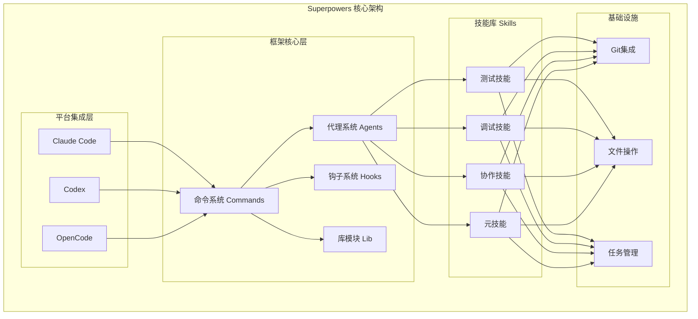
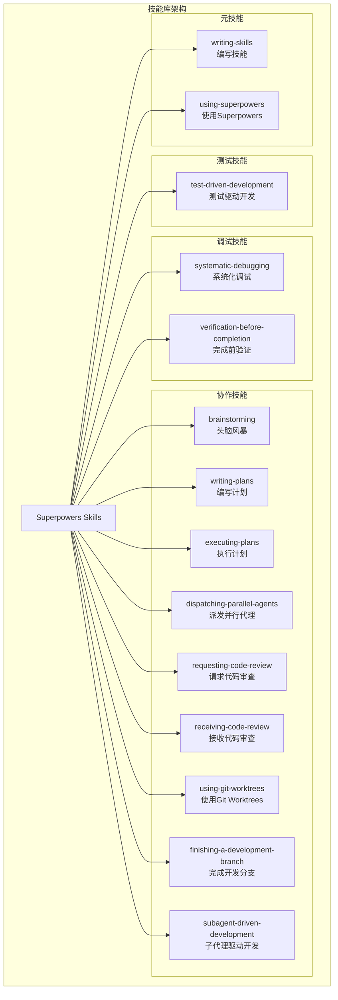
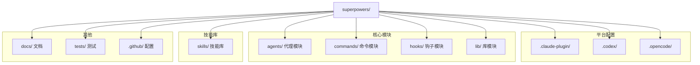
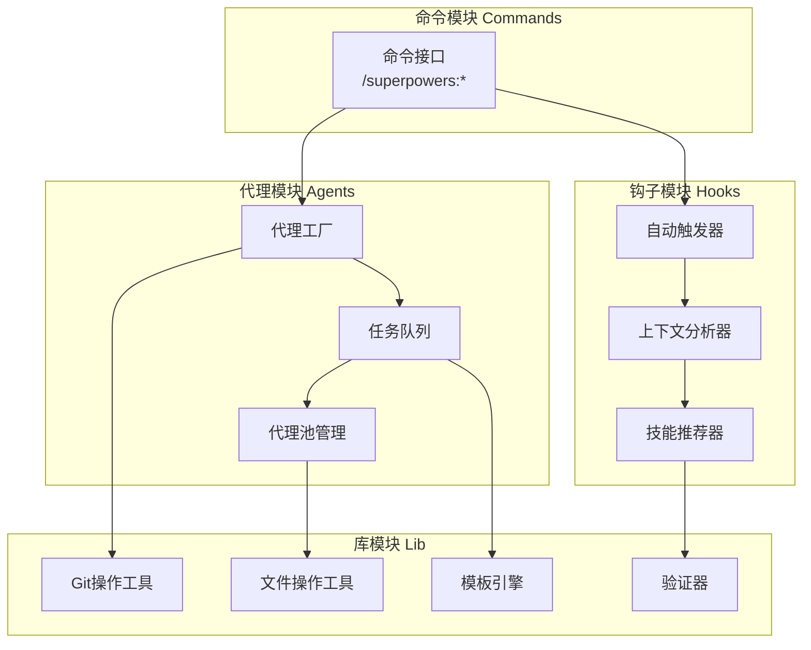
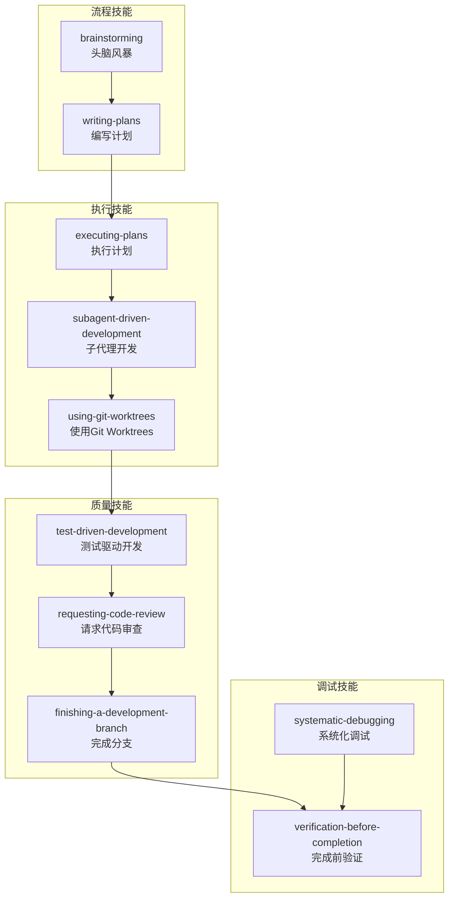
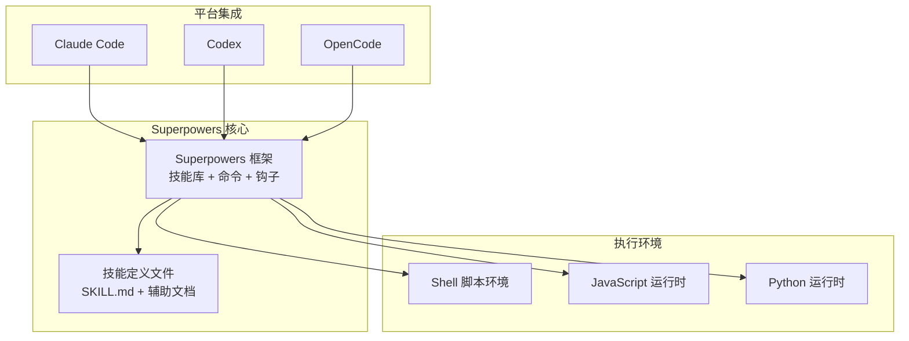
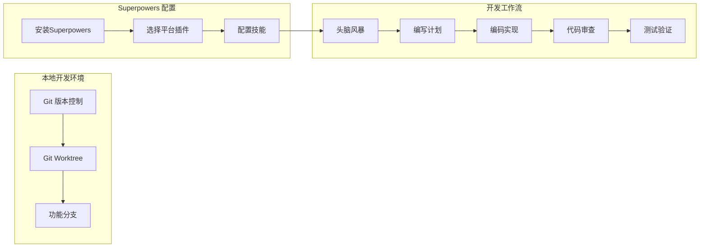

# Superpowers 架构图集

> 使用Mermaid图表从多个维度展示项目架构

---

## 一、系统整体架构图

### 1.1 核心架构概览



### 1.2 技能分类架构



### 1.3 文件目录结构



---

## 二、核心数据流图

### 2.1 任务执行数据流

```mermaid
flowchart TD
    START["用户请求"]

    subgraph "阶段1：需求理解"
        A1["接收用户消息"]
        A2["评估适用技能"]
        A3["调用brainstorming技能"]
        A4["需求澄清对话"]
        A5["生成设计文档"]
    end

    subgraph "阶段2：计划制定"
        B1["调用writing-plans技能"]
        B2["分析设计文档"]
        B3["任务分解"]
        B4["生成任务清单"]
    end

    subgraph "阶段3：执行开发"
        C1["创建git worktree"]
        C2["派发第一个任务"]
        C3["子代理实现"]
        C4["代码审查阶段1：规范合规"]
        C5["代码审查阶段2：质量检查"]
        C6["测试验证"]
        C7{还有更多任务?}
    end

    subgraph "阶段4：完成收尾"
        D1["调用finishing技能"]
        D2["最终测试验证"]
        D3["合并或创建PR"]
        D4["清理worktree"]
    END["完成"]

    START --> A1
    A1 --> A2
    A2 --> A3
    A3 --> A4
    A4 --> A5
    A5 --> B1
    B1 --> B2
    B2 --> B3
    B3 --> B4
    B4 --> C1
    C1 --> C2
    C2 --> C3
    C3 --> C4
    C4 --> C5
    C5 --> C6
    C6 --> C7
    C7 -->|是| C2
    C7 -->|否| D1
    D1 --> D2
    D2 --> D3
    D3 --> D4
    D4 --> END
```

### 2.2 技能调用数据流

```mermaid
flowchart TD
    USER["用户消息"]

    subgraph "技能评估"
        CHECK{"是否有技能适用?<br/>至少1%可能性?"}
        YES["调用Skill工具"]
        NO["直接响应"]
    end

    subgraph "技能执行"
        ANNOUNCE["宣布: Using [skill]<br/>to [purpose]"]
        CHECKLIST{"技能有清单?"}
        CREATE_TODO["创建TodoWrite任务"]
        EXECUTE["严格遵循技能执行"]
    end

    subgraph "响应输出"
        RESPOND["生成响应<br/>(包括澄清问题)"]
    END["结束"]

    USER --> CHECK
    CHECK -->|yes| YES
    CHECK -->|no| NO --> END
    YES --> ANNOUNCE
    ANNOUNCE --> CHECKLIST
    CHECKLIST -->|yes| CREATE_TODO
    CHECKLIST -->|no| EXECUTE
    CREATE_TODO --> EXECUTE
    EXECUTE --> RESPOND
    RESPOND --> END
```

### 2.3 子代理任务数据流

```mermaid
flowchart TD
    TASK["主任务分配"]

    subgraph "任务分发"
        DISPATCH["派发子代理N"]
        PROVIDE_TASK["提供完整任务描述"]
        PROVIDE_CONTEXT["提供场景上下文"]
    end

    subgraph "子代理执行"
        CLARIFY{"有疑问?<br/>需求/策略/依赖?"}
        ASK["暂停并提问"]
        IMPLEMENT["实现任务"]
        WRITE_TEST["编写测试<br/>(如需TDD)"]
        VERIFY["验证实现"]
        COMMIT["提交代码"]
        SELF_REVIEW["自检"]
    END_TASK["任务完成"]

    subgraph "审查阶段"
        SPEC_REVIEW["阶段1:规范合规审查"]
        QUALITY_REVIEW["阶段2:代码质量审查"]
        FIX_ISSUES["修复问题"]
    END_REVIEW["审查通过"]

    TASK --> DISPATCH
    DISPATCH --> PROVIDE_TASK
    PROVIDE_TASK --> PROVIDE_CONTEXT
    PROVIDE_CONTEXT --> CLARIFY
    CLARIFY -->|是| ASK --> CLARIFY
    CLARIFY -->|否| IMPLEMENT
    IMPLEMENT --> WRITE_TEST
    WRITE_TEST --> VERIFY
    VERIFY --> COMMIT
    COMMIT --> SELF_REVIEW
    SELF_REVIEW --> END_TASK
    END_TASK --> SPEC_REVIEW
    SPEC_REVIEW --> QUALITY_REVIEW
    QUALITY_REVIEW -->|发现问题| FIX_ISSUES
    FIX_ISSUES --> END_TASK
    QUALITY_REVIEW -->|全部通过| END_REVIEW
```

---

## 三、核心模块关系图

### 3.1 模块依赖关系



### 3.2 技能交互关系



---

## 四、用户交互流程图

### 4.1 典型开发会话流程

```mermaid
flowchart TD
    START["用户开始新会话<br/>'帮我构建一个功能'"]

    subgraph "设计阶段"
        A1["使用brainstorming技能"]
        A2["理解需求和约束"]
        A3["探索替代方案"]
        A4["展示设计方案"]
        A5{"用户确认?"}
        A6["保存设计文档"]
    end

    subgraph "准备阶段"
        B1["使用using-git-worktrees"]
        B2["创建新worktree"]
        B3["创建新分支"]
        B4["初始化项目设置"]
        B5["验证测试基线"]
    end

    subgraph "规划阶段"
        C1["使用writing-plans技能"]
        C2["分析设计文档"]
        C3["分解为2-5分钟任务"]
        C4["生成任务清单"]
        C5["验证任务完整性"]
    end

    subgraph "执行阶段"
        D1["循环:派发任务"]
        D2["子代理执行"]
        D3["两阶段审查"]
        D4["测试验证"]
        D5{"任务完成?"}
    end

    subgraph "收尾阶段"
        E1["使用finishing技能"]
        E2["最终测试通过"]
        E3{"选择操作:<br/>合并/PR/保留/丢弃"}
        E4["清理worktree"]
    END["会话结束"]

    START --> A1
    A1 --> A2
    A2 --> A3
    A3 --> A4
    A4 --> A5
    A5 -->|no| A2
    A5 -->|yes| A6
    A6 --> B1
    B1 --> B2
    B2 --> B3
    B3 --> B4
    B4 --> B5
    B5 --> C1
    C1 --> C2
    C2 --> C3
    C3 --> C4
    C4 --> C5
    C5 --> D1
    D1 --> D2
    D2 --> D3
    D3 --> D4
    D4 --> D5
    D5 -->|no| D1
    D5 -->|yes| E1
    E1 --> E2
    E2 --> E3
    E3 --> E4
    E4 --> END
```

### 4.2 调试流程

```mermaid
flowchart TD
    BUG["发现Bug<br/>或问题"]

    subgraph "阶段1:问题定义"
        A1["使用systematic-debugging技能"]
        A2["收集问题信息"]
        A3["复现问题"]
        A4["定义问题边界"]
    end

    subgraph "阶段2:根因分析"
        B1["收集数据"]
        B2["形成假设"]
        B3["验证假设"]
        B4["定位根本原因"]
    END_ANALYSIS["找到根本原因"]

    subgraph "阶段3:修复开发"
        C1["使用TDD技能"]
        C2["编写测试(红)"]
        C3["编写修复代码(绿)"]
        C4["重构优化(重构)"]
    END_FIX["修复完成"]

    subgraph "阶段4:验证"
        D1["使用verification-before-completion"]
        D2["运行测试套件"]
        D3["验证修复有效"]
        D4{"验证通过?"}
    END_VERIFY["问题解决"]

    BUG --> A1
    A1 --> A2
    A2 --> A3
    A3 --> A4
    A4 --> B1
    B1 --> B2
    B2 --> B3
    B3 --> B4
    B4 --> END_ANALYSIS
    END_ANALYSIS --> C1
    C1 --> C2
    C2 --> C3
    C3 --> C4
    C4 --> END_FIX
    END_FIX --> D1
    D1 --> D2
    D2 --> D3
    D3 --> D4
    D4 -->|no2
    D4 -->|yes| C| END_VERIFY
```

---

## 五、部署架构图

### 5.1 多平台部署架构



### 5.2 开发环境配置



---

## 六、TDD循环详细流程

### 6.1 红-绿-重构周期

```mermaid
flowchart TD
    START["开始TDD周期"]

    subgraph "红色阶段 Red"
        A1["编写失败的测试"]
        A2["验证测试失败"]
        A3{"测试失败?"}
    end

    subgraph "绿色阶段 Green"
        B1["编写最少代码"]
        B2["使测试通过"]
        B3{"测试通过?"}
    end

    subgraph "重构阶段 Refactor"
        C1["优化代码结构"]
        C2["提升代码质量"]
        C3["保持测试通过"]
        C4{"重构完成?"}
    end

    subgraph "下一轮"
        D{"还有更多<br/>功能要实现?"}
        D1["开始下一周期"]
        D2["结束TDD"]
    END["完成"]

    START --> A1
    A1 --> A2
    A2 --> A3
    A3 -->|yes| B1
    A3 -->|no| A1
    B1 --> B2
    B2 --> B3
    B3 -->|yes| C1
    B3 -->|no| B1
    C1 --> C2
    C2 --> C3
    C3 --> C4
    C4 -->|yes| D
    C4 -->|no| C1
    D -->|yes| D1
    D -->|no| D2
    D1 --> A1
    D2 --> END
```

---

## 七、代码审查流程

### 7.1 两阶段审查流程

```mermaid
flowchart TD
    SUBMIT["提交代码"]

    subgraph "阶段1:规范合规审查"
        A1["使用spec-reviewer-prompt"]
        A2["对照任务要求"]
        A3["检查功能完整性"]
        A4["识别缺失需求"]
        A5{"规范合规?"}
    END_SPEC["规范审查通过"]

    subgraph "阶段2:代码质量审查"
        B1["使用code-quality-reviewer-prompt"]
        B2["检查代码质量"]
        B3["识别改进点"]
        B4{"质量达标?"}
    END_QUALITY["质量审查通过"]

    SUBMIT --> A1
    A1 --> A2
    A2 --> A3
    A3 --> A4
    A4 --> A5
    A5 -->|no| FIX["修复问题"]
    A5 -->|yes| END_SPEC
    FIX --> A1
    END_SPEC --> B1
    B1 --> B2
    B2 --> B3
    B3 --> B4
    B4 -->|no| FIX
    B4 -->|yes| END_QUALITY
```

---

