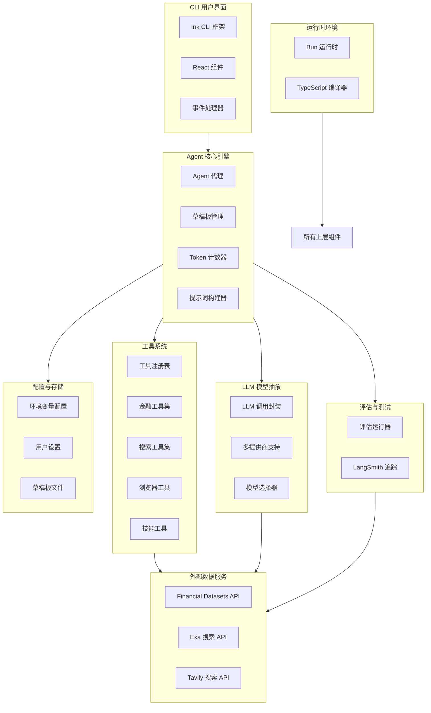
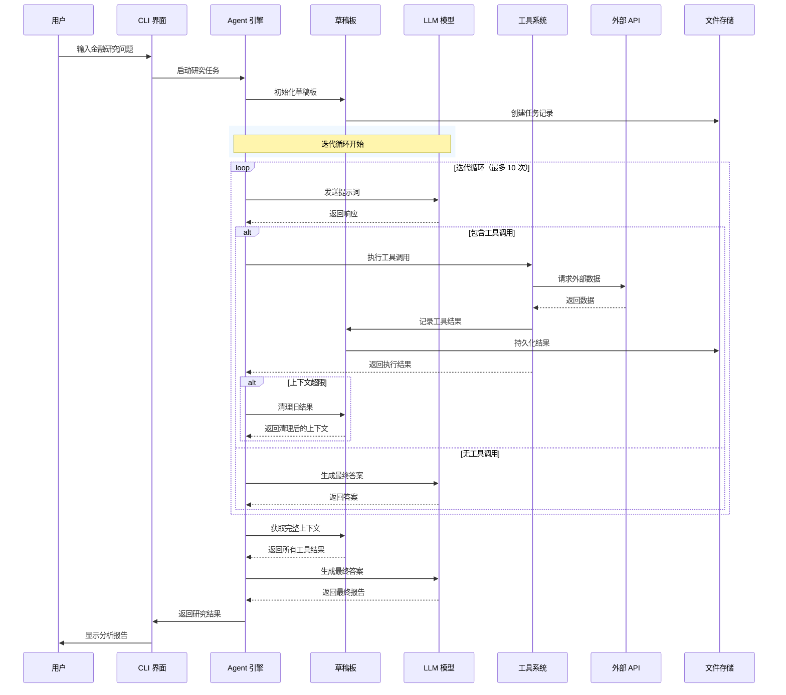
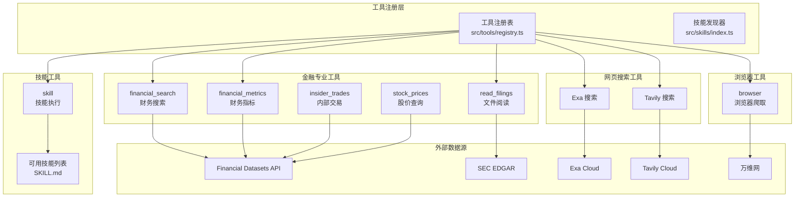
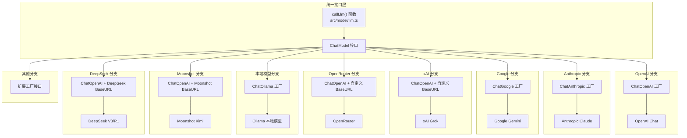
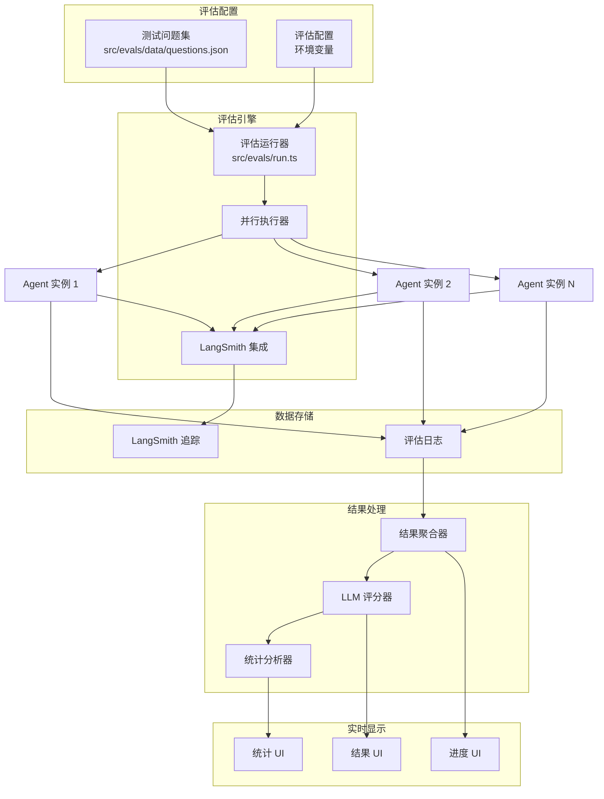

# Dexter 架构文档

本文档使用 Mermaid 图表从多个角度展示 Dexter 项目的技术架构，包括系统整体架构、数据流、模块关系、用户交互流程以及部署架构。这些图表旨在帮助开发者深入理解项目的设计理念和实现细节。

## 1. 系统整体架构图

整体架构图展示了 Dexter 项目的主要组成部分及其相互关系。系统采用分层架构设计，从底层的运行时环境到顶层的用户界面，形成了清晰的技术栈分层。



系统架构的核心思想是将用户界面、Agent 引擎、工具系统和外部数据服务进行清晰的分层解耦。运行时层位于最底层，由 Bun 运行时和 TypeScript 编译器组成，提供了整个项目的执行环境。Bun 作为现代 JavaScript 运行时，相比传统的 Node.js 具有更快的启动速度和执行效率，这对于 CLI 应用尤为重要。

核心引擎层是整个系统的决策中枢，包含 Agent 代理、草稿板管理、Token 计数和提示词构建四个核心模块。Agent 代理负责执行主循环和任务调度；草稿板管理负责维护整个研究过程中的上下文状态；Token 计数器用于监控和管理上下文窗口的使用情况；提示词构建器负责组装系统提示词和用户提示词。

模型抽象层为上层提供了统一的大语言模型调用接口，支持 OpenAI、Anthropic、Google、xAI、OpenRouter、Ollama、Moonshot、DeepSeek 等多种提供商。这种设计使得 Agent 引擎无需关心底层使用的是哪个模型，只需通过统一的接口进行调用。工具系统层包含了各种专业工具，包括金融数据工具、网页搜索工具、浏览器工具和自定义技能工具，这些工具为 Agent 提供了执行实际任务的能力。

## 2. 核心数据流图

数据流图展示了用户输入如何在系统中流转，以及各个组件之间如何传递和处理数据。理解数据流对于掌握系统的运行时行为至关重要。



数据流的核心循环遵循 ReAct 模式（Reasoning + Acting）。当用户提出金融研究问题时，系统首先初始化一个草稿板实例来跟踪整个研究过程。在迭代循环中，Agent 将当前上下文（包括用户问题、历史工具结果）发送给 LLM 进行推理。LLM 可能返回直接的答案，也可能返回需要调用的工具列表。

如果需要调用工具，系统会通过工具注册表找到对应的工具实现，执行实际的 API 调用，并将结果记录到草稿板中。为了控制上下文长度，系统实现了基于 Token 数量的上下文阈值检查，当上下文超出限制时会自动清理最早的工具调用结果。这种设计借鉴了 Anthropic 的上下文管理策略，确保在处理长时间复杂任务时不会出现上下文溢出的问题。

当 LLM 不再返回工具调用，或者达到最大迭代次数时，系统进入最终答案生成阶段。此时，Agent 会从草稿板中获取所有收集到的数据，组装成一个完整的上下文，然后调用 LLM 生成最终的分析报告。这种设计将中间推理过程和最终答案生成分离能够充分利用所有已，确保答案收集的信息。

## 3. 类与模块关系图

类图展示了项目中主要 TypeScript 类之间的静态关系，包括继承、实现和依赖关系。这些关系反映了项目的面向对象设计原则。

```mermaid
classDiagram
    class Agent {
        -model: string
        -modelProvider: string
        -maxIterations: number
        -tools: StructuredToolInterface[]
        -toolMap: Map
        -systemPrompt: string
        -signal?: AbortSignal
        +create(config: AgentConfig): Agent
        +run(query: string): AsyncGenerator~AgentEvent~
        #callModel(prompt: string): Promise
        #executeToolCall(): AsyncGenerator
    }

    class Scratchpad {
        -query: string
        -toolResults: ToolContext[]
        -toolCallHistory: Map
        -executedSkills: Set
        +addThinking(text: string): void
        +addToolResult(): void
        +getToolResults(): string
        +clearOldestToolResults(): number
        +hasToolResults(): boolean
        +recordToolCall(): void
        +canCallTool(): LimitCheck
        +hasExecutedSkill(): boolean
    }

    class TokenCounter {
        -totalInput: number
        -totalOutput: number
        -startTime: number
        +add(usage: TokenUsage): void
        +getUsage(): TokenUsage
        +getTokensPerSecond(): number
    }

    class Scratchpad
    class TokenCounter

    Agent --> Scratchpad: 使用
    Agent --> TokenCounter: 使用

    interface StructuredToolInterface {
        <<interface>>
        +name: string
        +description: string
        +invoke(): Promise~unknown~
    }

    class FinancialSearch {
        +name: string
        +invoke(query: string): Promise~unknown~
    }

    class FinancialMetrics {
        +name: string
        +invoke(config: object): Promise~unknown~
    }

    class ReadFilings {
        +name: string
        +invoke(config: object): Promise~unknown~
    }

    class BrowserTool {
        +name: string
        +invoke(config: object): Promise~unknown~
    }

    class WebSearch {
        +name: string
        +invoke(query: string): Promise~unknown~
    }

    class SkillTool {
        +name: string
        +invoke(config: object): Promise~unknown~
    }

    StructuredToolInterface <|.. FinancialSearch: 实现
    StructuredToolInterface <|.. FinancialMetrics: 实现
    StructuredToolInterface <|.. ReadFilings: 实现
    StructuredToolInterface <|.. BrowserTool: 实现
    StructuredToolInterface <|.. WebSearch: 实现
    StructuredToolInterface <|.. SkillTool: 实现

    Agent --> StructuredToolInterface: 调用
```

Agent 类是整个系统的核心入口点，采用了工厂模式和生成器模式的设计。Agent.create() 静态方法负责创建 Agent 实例，同时初始化工具注册表和系统提示词。Agent.run() 方法返回一个异步生成器，按照事件流的方式逐步输出执行过程，这种设计使得用户界面可以实时显示执行进度。

Scratchpad 类维护了单个研究任务的所有状态信息，包括用户原始问题、工具调用历史、收集到的数据以及已执行的技能列表。这种设计将状态管理与业务逻辑分离，使得 Agent 核心代码更加清晰。Scratchpad 提供了丰富的方法来操作这些状态，包括添加思考过程、记录工具结果、查询历史记录、检测重复调用等。

TokenCounter 类是一个专门用于统计 Token 使用情况的工具类。它记录了每次 LLM 调用的输入和输出 Token 数量，并计算总的消耗和每秒处理速度。这些数据对于成本控制和性能优化非常重要。

工具类都实现了 LangChain 定义的 StructuredToolInterface 接口，这保证了工具系统的一致性和可扩展性。每个工具只需要关注自己的业务逻辑实现，而与 Agent 的交互则通过统一的接口进行。

## 4. 用户交互流程图

用户交互流程图展示了用户与系统之间的完整交互过程，从启动程序到获得最终答案的各个步骤。

```mermaid
flowchart TB
    subgraph 启动阶段
        A1([启动程序]) --> A2[检查 API 密钥]
        A2 --> A3{密钥是否配置？}
        A3 -->|否| A4[提示用户输入]
        A4 --> A5[保存到环境变量]
        A5 --> A6[加载用户设置]
        A3 -->|是| A6
        A6 --> A7[初始化 Agent]
        A7 --> A8[显示欢迎界面]
    end

    subgraph 对话阶段
        B1([等待用户输入]) --> B2[获取用户问题]
        B2 --> B3[显示加载状态]
        B3 --> B4[Agent 执行任务]
        B4 --> B5{任务完成？}
        B5 -->|否| B6[更新进度显示]
        B6 --> B4
        B5 -->|是| B7[显示最终结果]
    end

    subgraph 特殊命令处理
        C1[/model 命令] --> C2[切换模型]
        C3[/help 命令] --> C4[显示帮助信息]
        C5[/clear 命令] --> C6[清空历史]
        C7[/exit 命令] --> C8([退出程序])
    end

    B1 -.->|用户输入命令| C1
    B1 -.->|用户输入命令| C3
    B1 -.->|用户输入命令| C5
    B1 -.->|用户输入命令| C7

    A8 --> B1

    B7 --> B1
```

用户交互流程设计注重简洁和高效。启动阶段首先检查 API 密钥配置，如果没有配置则提示用户输入。Dexter 支持从环境变量加载密钥，也支持交互式输入，这为不同使用场景提供了灵活性。初始化完成后，系统加载用户保存的设置（如默认模型选择），然后初始化 Agent 引擎并显示欢迎界面。

对话阶段是主要的使用模式。系统等待用户输入金融研究问题，然后启动 Agent 执行任务。在执行过程中，用户界面会实时显示执行进度，包括当前的思考过程、正在调用的工具、收集到的数据等。当 Agent 完成研究后，系统显示最终的分析报告，然后返回等待用户输入的状态。

系统还支持几个特殊的命令。/model 命令用于切换 LLM 提供商或模型，用户可以根据需要选择不同的模型来优化效果或控制成本。/help 命令显示所有可用的命令和使用提示。/clear 命令清空当前会话的历史记录。/exit 命令退出程序。

## 5. 工具系统架构图

工具系统是 Dexter 能够执行实际任务的关键组件。这个架构图详细展示了工具系统的内部结构和交互关系。



工具系统采用了注册表模式进行管理。工具注册表（Registry）在系统启动时扫描所有可用的工具，并根据环境变量配置决定是否包含某些工具。例如，Web 搜索工具只有在配置了 Exa 或 Tavily API 密钥后才会被注册。技能发现器负责扫描 src/skills 目录下的所有 SKILL.md 文件，发现可用的自定义技能。

金融工具集是系统最核心的工具类别，提供了访问专业金融数据的能力。financial_search 是主要的入口工具，它封装了对 Financial Datasets API 的调用，支持同时查询多个公司和多个指标。financial_metrics 提供更细粒度的财务指标查询。read_filings 用于获取和解析 SEC filings 文档。insider_trades 和 stock_price 分别用于查询内部交易记录和历史股价数据。

搜索工具集提供了网页搜索能力，优先使用 Exa（如果配置了 API 密钥），否则回退到 Tavily。浏览器工具基于 Playwright 实现，可以访问和抓取网页内容，这对于阅读财务新闻或公司公告非常有用。技能工具允许执行预定义的工作流程，如 DCF 估值分析等。

## 6. 多模型提供商架构图

Dexter 的一个重要特性是支持多种 LLM 提供商。这个架构图展示了如何抽象和统一不同提供商的接口。



多模型支持的核心设计是工厂模式和适配器模式。callLlm() 函数是统一的入口点，接收提示词和选项参数，返回 LLM 响应。根据模型名称的前缀（如 claude-、gemini-、grok- 等），系统选择对应的工厂函数来创建具体的 ChatModel 实例。

OpenAI、Anthropic 和 Google 使用各自官方的 LangChain 集成包。xAI、OpenRouter、Moonshot 和 DeepSeek 虽然底层不是官方 LangChain 集成，但由于它们都兼容 OpenAI 的 API 格式，因此可以使用 ChatOpenAI 配合自定义 baseURL 来实现。Anthropic 还有一个特殊的优化点，系统使用 cache_control 参数标记系统提示词，从而启用 Anthropic 的提示词缓存功能，可以节省约 90% 的输入 Token 成本。

## 7. 评估系统架构图

评估系统用于系统性测试和优化 Agent 的性能。架构图展示了评估框架的主要组件和工作流程。



评估系统的设计目标是能够系统性、客观地评估 Agent 在各种金融问题上的表现。测试问题集保存在 JSON 文件中，包含了不同类型和难度的金融研究问题。评估运行器负责加载配置、创建 Agent 实例、执行测试并收集结果。

评估引擎支持并行执行多个 Agent 实例，这样可以显著减少运行完整评估套件所需的时间。每次执行都会通过 LangSmith 进行追踪，记录所有的中间步骤和工具调用，便于后续分析。执行完成后，结果聚合器收集所有运行结果，LLM 评分器使用 judge 模型来评估答案的正确性，统计分析器计算准确率、召回率等指标。

评估结果通过实时 UI 显示，用户可以观察执行进度和最终统计信息。所有数据都持久化存储到日志文件中，支持后续的深入分析和比较。

## 8. 文件存储结构图

Dexter 在运行过程中会创建和修改多个文件和目录。这个架构图展示了项目的文件存储结构。

```mermaid
graph TB
    subgraph 项目根目录 ["项目根目录 /"]
        Git[".git/ Git 版本控制"]
        Src["src/ 源代码目录"]
        Scripts["scripts/ 脚本目录"]
        Docs["docs/ 文档目录"]
    end

    subgraph 用户配置目录 [".dexter/ 用户配置"]
        Settings["settings.json 用户设置"]
        ScratchpadDir["scratchpad/ 草稿板目录"]
    end

    subgraph 临时存储 ["临时文件"]
        BunLock["bun.lock 依赖锁定"]
        NodeModules["node_modules/ 依赖目录"]
    end

    subgraph 环境配置 [".env 环境变量"]
        EnvFile[".env API 密钥配置"]
        EnvExample["env.example 模板"]
    end

    subgraph 技能目录 ["src/skills/ 技能定义"]
        SkillFiles["SKILL.md 技能文件"]
        SkillMeta["技能元信息"]
    end

    subgraph 测试数据 ["src/evals/ 评估数据"]
        EvalQuestions["questions.json 测试问题"]
        EvalResults["results/ 评估结果"]
    end

    Src --> Agent
    Src --> Components
    Src --> Model
    Src --> Tools
    Src --> Skills
    Src --> Utils

    Agent --> ScratchpadDir: 写入记录

    Settings --> 用户配置目录
    ScratchpadDir --> 用户配置目录

    SkillFiles --> 技能目录
    SkillMeta --> 技能目录

    EvalQuestions --> 测试数据
    EvalResults --> 测试数据

    EnvFile --> 环境配置
    EnvExample --> 环境配置
```

项目的文件组织遵循清晰的约定。用户配置文件存储在项目根目录下的 .dexter 目录中，包括 settings.json（用户保存的设置）和 scratchpad/（所有任务执行的草稿板记录）。这种设计使得用户数据与项目代码分离，便于版本控制忽略。

技能定义以 SKILL.md 文件的形式存储在 src/skills 目录下，每个技能文件包含 YAML 前言（定义名称、描述等）和 Markdown 主体（定义工作流程）。评估数据存储在 src/evals 目录下，包括测试问题集和评估结果。

## 总结

本文档通过八个不同角度的架构图，全面展示了 Dexter 项目的技术架构设计。从宏观的系统分层到微观的模块关系，从核心的数据流到具体的技术实现，这些图表共同构成了理解 Dexter 内部工作原理的完整指南。

项目的架构设计体现了几个核心原则：清晰的职责分离使得各个组件可以独立开发和测试；统一接口模式使得系统易于扩展新的工具和模型；状态管理策略确保了复杂研究任务的可靠执行；评估框架的集成则为持续优化提供了基础设施保障。

对于希望贡献代码或扩展功能的开发者，理解这些架构设计将有助于更快地融入项目，找到合适的扩展点并进行正确的实现。