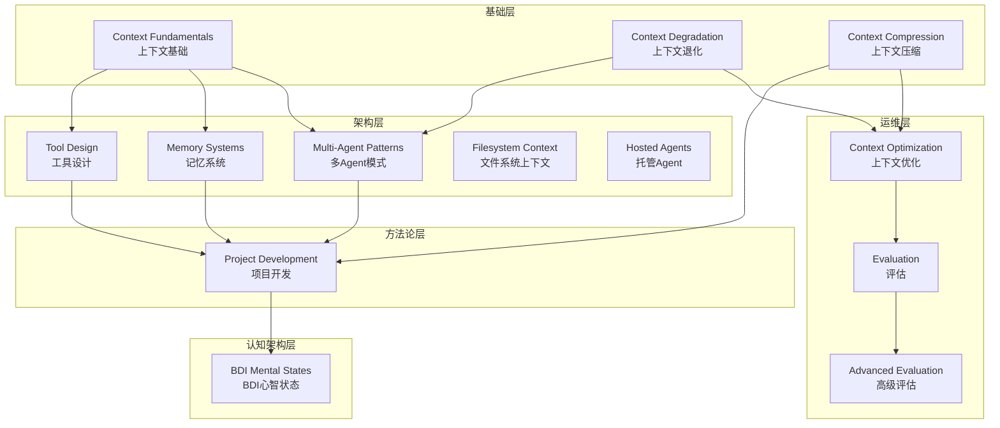
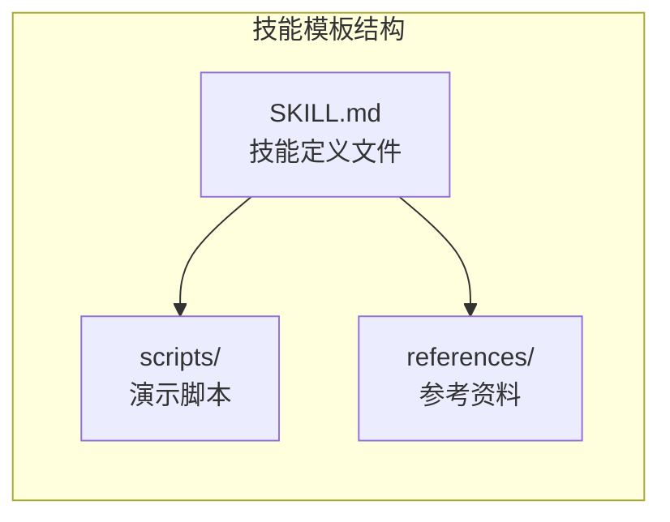
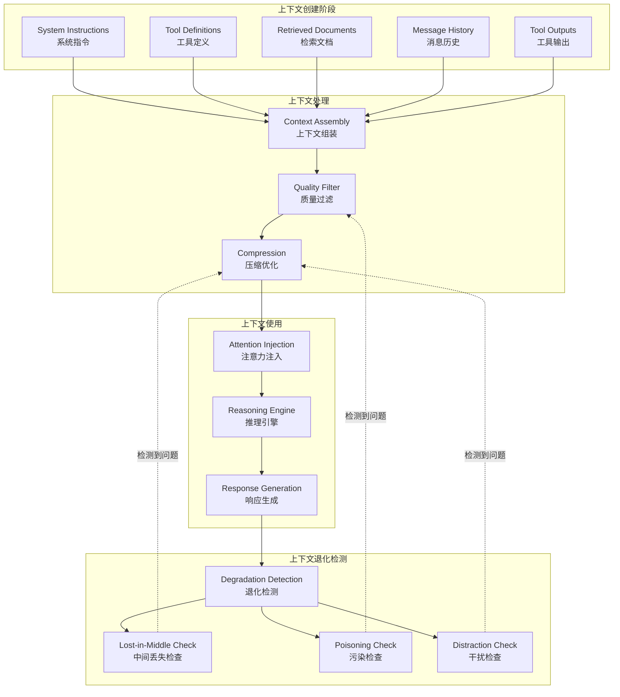
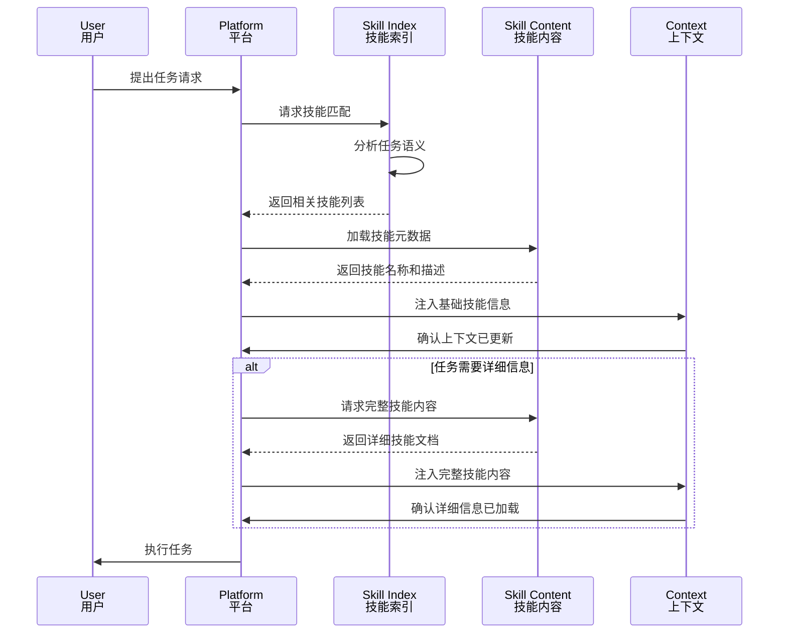
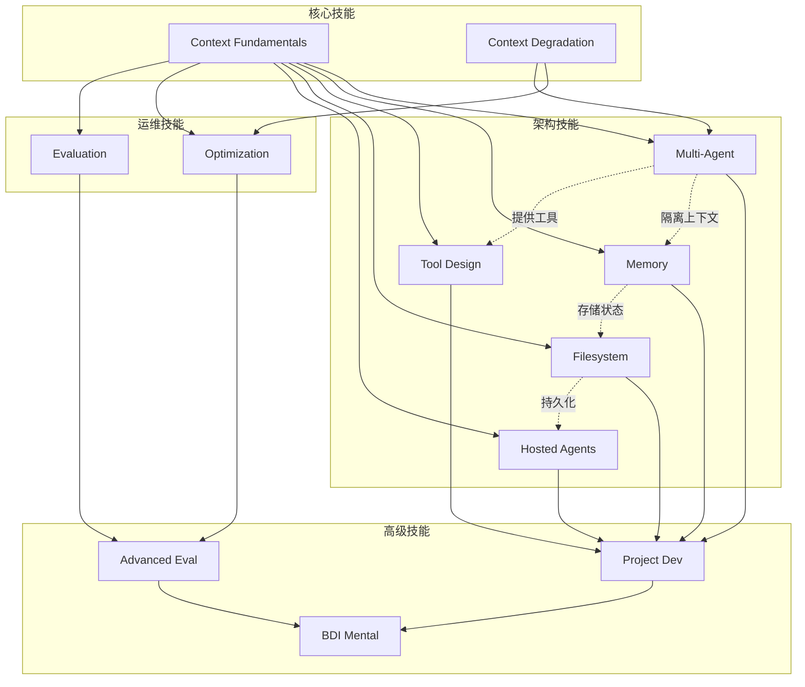
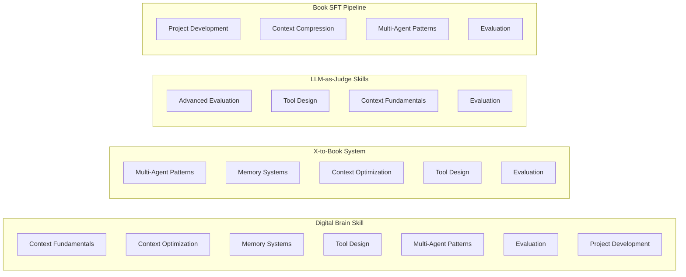
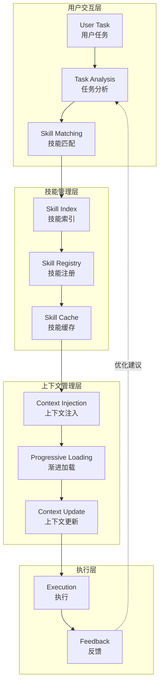
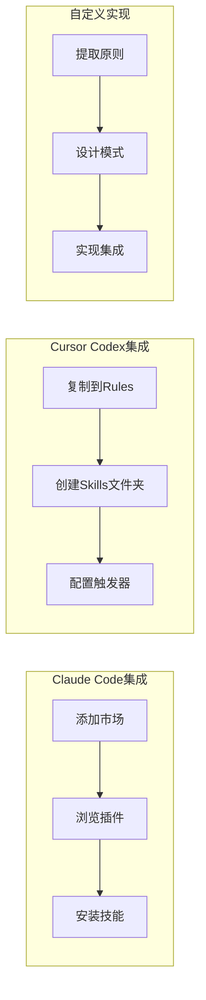
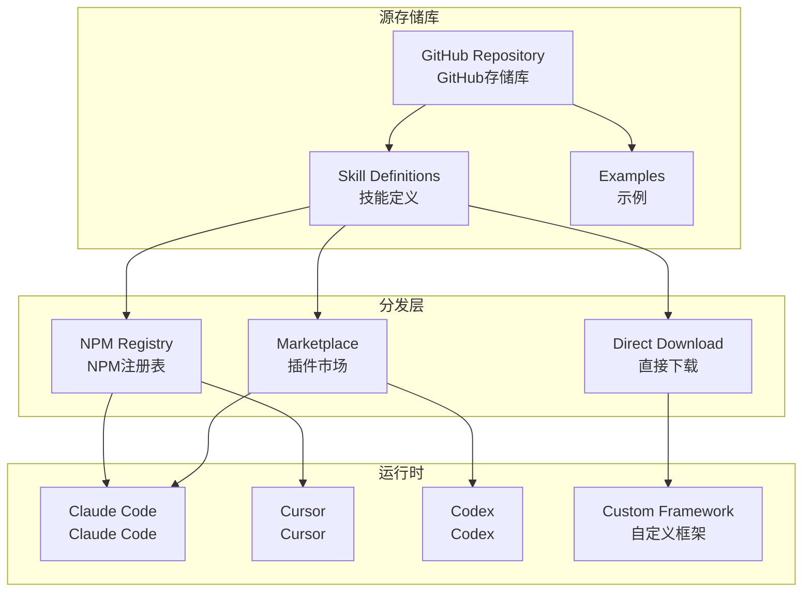
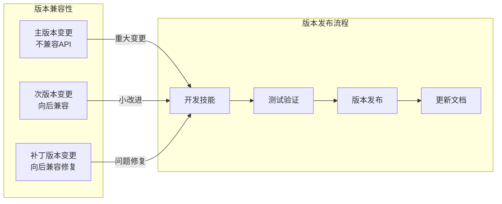

# Agent-Skills-for-Context-Engineering 架构文档

## 一、系统整体架构

### 1.1 项目架构概览

Agent-Skills-for-Context-Engineering采用分层架构设计，将上下文工程的核心概念组织为相互关联的技能单元。整个系统由五个主要层次构成，每个层次承担不同的职责，共同构建完整的Agent开发知识体系。

基础层包含三个核心技能，负责建立上下文工程的基本概念框架。这一层是所有其他技能的基础，为开发者提供理解和管理LLM上下文的理论基础。开发者必须首先掌握这些基础概念，才能有效地使用其他技能来解决实际问题。

架构层包含五个技能，专注于Agent系统的设计与实现。这一层涵盖了多Agent协调、记忆系统设计、工具开发、文件系统上下文管理以及托管Agent基础设施等核心架构模式。每个技能都提供了经过验证的设计原则和实施指南。

运维层包含三个技能，专注于Agent系统的持续优化和评估。这一层教会开发者如何监控和优化系统性能，建立有效的评估框架，以及使用LLM作为评判者进行高级评估。

方法论层提供一个综合技能，涵盖从概念到部署的完整项目开发生命周期。这一技能将所有其他技能整合在一起，为开发者提供端到端的指导。

认知架构层引入BDI心智状态建模，将外部RDF上下文转换为Agent的心智状态，实现形式化认知建模和可解释的推理过程。

### 1.2 技能组织架构

如上图所示，技能之间存在明确的依赖关系。基础层技能为架构层提供理论支撑，架构层技能为方法论层提供构建块，而运维层技能则贯穿整个体系，提供持续优化的能力。

### 1.3 技能模板结构

每个技能都遵循统一的标准结构，这种标准化设计确保了知识的一致性和可维护性。

核心文件是SKILL.md，它包含技能的定义，元数据、激活条件、核心概念、详细主题、实践指导、示例、指南、集成信息和参考文献。每个技能都被设计为独立可用的单元，同时又与整体知识体系相互关联。

scripts文件夹包含可选的可执行代码，用于演示技能中描述的概念。这些脚本使用Python伪代码编写，确保跨平台兼容性而无需安装特定依赖。

references文件夹包含额外的文档和资源，用于存放过于详细而不适合放在主技能文件中的内容。这种分层设计使得技能文件保持简洁，同时为深入学习者提供丰富的参考资料。

## 二、核心数据流

### 2.1 上下文生命周期

上下文工程的核心在于管理信息在Agent系统中的流动。下面的流程图展示了上下文从创建到优化的完整生命周期。

在上下文创建阶段，系统收集所有需要进入模型上下文窗口的信息，包括系统指令、工具定义、检索文档、消息历史和工具输出。这些信息源共同构成了Agent的「感知世界」。

上下文处理阶段对收集的信息进行质量过滤和压缩优化。质量过滤移除低信噪比的内容，压缩优化则确保信息在有限的上下文容量内得到高效表达。

上下文使用阶段将处理后的信息注入模型的注意力机制，驱动推理引擎产生响应。有效的上下文管理确保关键信息获得足够的注意力权重。

上下文退化检测是一个持续的过程，监控系统运行状态，识别「中间丢失」「污染」「干扰」等退化模式，并在检测到问题时触发相应的纠正措施。

### 2.2 技能激活数据流

技能的激活遵循特定的数据流模式，确保在正确的时机加载相关的知识单元。

技能激活采用渐进式披露策略。初始阶段仅加载技能的名称和描述，这些轻量级元数据足以让系统做出初步的技能选择决策。当任务确实需要特定技能的详细信息时，系统才会加载完整的技能内容。这种设计最大化了上下文效率，避免了不必要的信息加载。

## 三、核心模块关系图

### 3.1 技能类别关系

不同技能类别之间存在复杂的协同关系，理解这些关系对于有效使用技能集合至关重要。

基础技能为所有其他技能提供概念框架。Context Fundamentals解释了什么是上下文以及为什么它重要，而Context Degradation则识别上下文失败的各种模式。这两个技能是理解所有其他技能的前提条件。

架构技能构建Agent系统的物理结构。Multi-Agent Patterns定义系统组件的组织方式，Memory Systems提供持久化和状态管理，Tool Design创建Agent与外部世界交互的接口，Filesystem Context利用文件系统作为动态上下文存储，Hosted Agents则提供后台执行的计算环境。

运维技能确保系统的持续健康运行。Context Optimization应用各种技术来提高效率，而Evaluation则测量系统性能。Advanced Evaluation将运维提升到更高层次，使用LLM作为评判者进行自动化评估。

方法论技能和认知架构技能代表了技能的更高层次抽象。Project Development整合所有技能提供端到端指导，而BDI Mental States则引入形式化认知建模，实现可解释的推理过程。

### 3.2 示例项目与技能映射

示例项目展示了如何将多个技能组合使用来解决实际问题的完整流程。

Digital Brain Skill是最全面的示例，它综合运用了七个核心技能来构建一个面向创始人和创作者的个人操作系统。这个示例展示了如何将理论转化为完整的生产系统。

X-to-Book System专注于内容生成场景，展示了Multi-Agent Patterns、Memory Systems和Context Optimization在处理持续数据流时的协同工作方式。

LLM-as-Judge Skills是一个技术实现示例，展示了如何用TypeScript实现高级评估功能，为其他评估任务提供可复用的工具。

Book SFT Pipeline则展示了如何将AI技术应用于创意写作领域，通过训练模型学习特定作者的风格来生成新内容。

## 四、用户交互流程

### 4.1 技能发现与激活流程

用户与技能系统的交互遵循特定的模式，从任务提出到技能激活的完整流程如下。

用户首先提出任务请求，系统进行任务分析以理解用户的意图和需求。任务分析器提取关键语义信息，这些信息用于技能匹配。

技能匹配阶段将任务语义与已注册的技能进行比对，返回相关性最高的技能列表。系统维护一个技能缓存来加速重复查询。

上下文注入阶段将选定的技能信息添加到用户请求的上下文中。渐进加载策略确保仅在需要时加载详细信息，避免上下文膨胀。

执行层使用更新后的上下文来完成任务，并将结果反馈给用户。反馈信息可用于后续的优化建议。

### 4.2 平台集成流程

该项目支持与多种主流Agent平台的集成，每种集成方式都有特定的配置流程。

Claude Code集成是最直接的方式，用户只需添加市场、浏览可用插件并选择安装即可。这种集成利用了Claude Code的内置技能系统，实现无缝体验。

Cursor和Codex用户可以将技能内容复制到项目的Rules文件夹中，或创建项目特定的Skills文件夹。这种方式给予用户更大的定制灵活性。

对于使用自定义Agent框架的开发者，项目提供了平台无关的设计原则，可以提取这些原则并实现自定义集成。这种方式确保了技能知识的可移植性。

## 五、部署架构

### 5.1 技能分发架构

项目采用分布式技能分发架构，允许在不同平台和环境中灵活部署。

GitHub存储库作为单一真相来源，所有技能定义和示例都存储在这里。从这个中央源，技能可以通过多种渠道分发：NPM注册表用于包管理集成，插件市场用于Claude Code内置集成，直接下载用于离线使用或自定义部署。

运行时层支持多种客户端，每种客户端都有特定的集成方式。这种多渠道分发策略确保了技能的可访问性和灵活性。

### 5.2 技能版本管理

技能采用语义化版本控制，确保开发者可以精确控制他们使用的技能版本。

主版本变更表示不兼容的API更改，通常是因为基础概念框架发生了重大变化。次版本变更添加了新功能同时保持向后兼容。补丁版本变更仅包含错误修复和小型改进。

开发者可以根据他们的稳定性需求选择适当的版本策略。生产环境通常应该固定到特定版本，而开发环境可以使用最新版本以获取最新功能。

## 六、技术架构总结

### 6.1 架构设计原则

项目采用了多项架构设计原则来确保系统的可扩展性、可维护性和可用性。

**渐进式披露原则**：技能的渐进式加载确保了高效的上下文利用。系统在启动时仅加载技能名称和描述，仅在任务确实需要时才加载完整内容。这种设计极大地减少了不必要的信息加载，提高了整体系统效率。

**平台无关性原则**：技能专注于可转移的概念而非特定供应商的实现。无论开发者使用Claude Code、Cursor还是自定义框架，都可以从这些技能中获益。这种设计降低了技术锁定风险，增加了技能的长期价值。

**模块化原则**：每个技能都是一个独立的功能单元，可以单独使用或与其他技能组合。这种模块化设计使得技能集合具有高度的可组合性和可扩展性。

**标准化原则**：所有技能都遵循统一的模板结构，包含预定义的章节和格式。这种标准化确保了知识的一致性，使得开发者可以快速定位所需信息。

### 6.2 架构优势

该架构为开发者和组织带来了显著的优势。

对于技能开发者而言，标准化的模板降低了创建新技能的成本，清晰的集成指南简化了发布流程，而版本管理系统确保了变更的可追溯性。

对于技能使用者而言，渐进式加载提高了使用效率，平台无关性提供了灵活性，多样化的集成选项满足了不同需求，而丰富的示例加速了学习曲线。

对于整个生态系统而言，开源协作模式促进了知识共享，学术认可增加了可信度，而完整的文档和贡献指南确保了项目的长期可持续发展。
