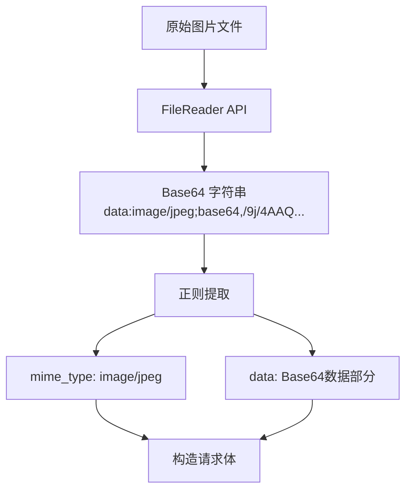

# AI 智能卡路里计算器 - 提示词分析

## 提示词位置与内容

### 代码位置

提示词位于 `src/pages/api/detect_food.js` 文件的 `detectFoodAndCalories` 函数中，用于调用 Google Gemini API 进行食物识别和卡路里估算。

### 完整提示词内容

```javascript
'Identify the food in this picture and estimate the calories. Please make sure to return the content in this structure as JSON. {"items": ["ice", "apple"], "total_calories": xx} Just return JSON, do not include other content.'
```

### 提示词在代码中的上下文

```javascript
const requestBody = {
  contents: [
    {
      parts: [
        {
          text: 'Identify the food in this picture and estimate the calories...',
        },
        {
          inline_data: {
            mime_type: mimeType,
            data: base64Data,
          },
        },
      ],
    },
  ],
};
```

## 提示词结构解析

### 语义层次分析

该提示词采用经典的「任务说明 + 输出格式约束」结构，包含三个核心语义模块：

| 模块 | 内容 | 作用 |
|------|------|------|
| 任务描述 | "Identify the food in this picture and estimate the calories" | 明确告知模型需要完成的任务 |
| 格式规范 | "Please make sure to return the content in this structure as JSON" | 约束输出必须为 JSON 格式 |
| 示例模板 | "{"items": ["ice", "apple"], "total_calories": xx}" | 提供输出结构的参考示例 |
| 明确指令 | "Just return JSON, do not include other content" | 强化格式要求，避免冗余输出 |

### 语法特征

- 使用英文编写，保持与 API 的兼容性
- 语气直接明确，使用祈使句
- 结构清晰，指令分层递进
- 示例具有代表性（包含复数食物和数值）

## 设计模式分析

### 1. 结构化输出模式（Structured Output）


提示词采用了「任务 + 格式 + 示例」的三段式结构，这是与大语言模型交互时常用的结构化输出设计模式。通过提供 JSON 示例，模型能够更准确地理解期望的输出格式。

### 2. 负向约束设计

```
"Just return JSON, do not include other content"
```

通过明确的负向约束（不要包含其他内容），指导模型避免输出解释性文字、思考过程或其他非结构化数据。这种设计在需要程序化处理 API 响应的场景中尤为重要。

### 3. 多模态输入处理

提示词与图片数据通过 `parts` 数组同时发送给模型：

```javascript
parts: [
  { text: "...prompt..." },      // 文本提示词
  { inline_data: {...} }         // 图片数据
]
```

这种设计利用了 Gemini 模型的多模态能力，实现了文本指令与图像识别的无缝结合。

## 变量与模板处理

### 动态内容处理方式

本项目的提示词模板中包含以下动态变量：

| 变量 | 类型 | 填充方式 | 说明 |
|------|------|----------|------|
| 图片数据 | Base64 字符串 | 通过 `inline_data.data` 字段传入 | 用户上传的食物图片 |
| MIME 类型 | 字符串 | 通过 `inline_data.mime_type` 字段传入 | 图片格式（如 image/jpeg） |
| 输出内容 | 数组 + 数值 | 模型自动生成 | 识别的食物列表和总卡路里 |

### Base64 图片处理流程



```javascript
// 从 Base64 字符串中提取 MIME 类型和数据
const match = base64Image.match(/^data:(image\/\w+);base64,(.*)$/);
const mimeType = match[1];   // 例如: "image/jpeg"
const base64Data = match[2];  // Base64 编码的数据部分
```

### 响应解析处理

模型返回的文本需要进一步解析：

```javascript
const text = data.candidates[0].content.parts[0].text;
const regex = /\{.*?\}/s;  // 使用正则匹配 JSON
const match = text.match(regex);
const parsedData = JSON.parse(match[0]);
```

## 响应数据结构

### 期望输出格式

```json
{
  "items": ["食物1", "食物2", "..."],
  "total_calories": 数值
}
```

### 字段说明

| 字段 | 类型 | 说明 | 示例 |
|------|------|------|------|
| items | 字符串数组 | 识别到的食物列表 | ["苹果", "香蕉", "面包"] |
| total_calories | 整数 | 所有食物的总卡路里（千卡） | 285 |

### API 完整响应

```javascript
// 成功响应
{
  success: true,
  items: ["苹果", "香蕉", "面包"],
  count: 285
}

// 失败响应
{
  success: false,
  message: "错误描述信息"
}
```

## 提示词优化建议

### 当前提示词的局限性

1. **语言不一致**：提示词使用英文，但用户界面面向全球用户，建议支持中英文双语提示词
2. **缺乏数量信息**：仅返回食物名称，未要求返回预估份量或重量
3. **缺少置信度**：未要求模型提供识别置信度或不确定性说明
4. **卡路里单位模糊**：未明确说明卡路里的单位（千卡/千焦）
5. **缺少食物状态描述**：未要求描述食物的烹饪方式或状态

### 优化建议方案

#### 方案一：增强结构化输出

```
Identify the food items in this picture and estimate their calories.
Return your response as valid JSON with this exact structure:
{
  "items": [
    {"name": "食物名称", "estimated_calories": 数值, "confidence": "high/medium/low"}
  ],
  "total_calories": 数值,
  "unit": "kcal",
  "notes": "补充说明（如有）"
}
Return ONLY the JSON object, no additional text.
```

#### 方案二：支持中文输出

```
请识别这张图片中的食物，并估算其卡路里含量。
请按照以下 JSON 格式返回结果：
{
  "items": ["食物1", "食物2"],
  "total_calories": 总卡路里数值,
  "unit": "千卡"
}
请只返回 JSON 格式，不要包含其他内容。
```

#### 方案三：添加份量估算

```
Analyze this food image and estimate calories for each item.
For each food item, estimate based on typical portion sizes.
Return JSON:
{
  "items": [
    {
      "name": "food name",
      "portion": "estimated portion size",
      "calories": estimated calories per item
    }
  ],
  "total_calories": total kcal,
  "calculation_basis": "typical portion assumptions used"
}
JSON only, no explanation.
```

### 针对不同食物类型的优化

```javascript
// 动态提示词模板示例
const getPromptForFoodType = (foodCategory) => {
  const basePrompt = 'Identify the food and estimate calories. ';
  const categorySpecific = {
    'beverage': 'Focus on estimating drink volume and sugar content.',
    'dessert': 'Consider typical portion sizes for sweets and desserts.',
    'meal': 'Identify main dish, sides, and estimate overall meal calories.',
    'fruit': 'Estimate based on typical fruit sizes and portions.',
    'default': 'Provide accurate estimation based on visible portions.'
  };
  const formatSpec = 'Return JSON: {"items": [...], "total_calories": number}';

  return basePrompt + (categorySpecific[foodCategory] || categorySpecific.default) + formatSpec;
};
```

## 最佳实践建议

### 提示词工程建议

1. **使用示例驱动**：提供 JSON 格式的完整示例，比纯文字描述更有效
2. **明确输出边界**：使用「只返回」「不要包含」等明确指令
3. **处理多语言**：根据用户群体选择提示词语言
4. **错误处理预案**：始终添加 JSON 解析失败的异常处理
5. **版本控制**：记录每次提示词的修改，便于回溯和优化

### 安全考虑

1. **输入验证**：在发送图片前验证 Base64 格式
2. **响应验证**：使用 JSON Schema 验证 API 返回
3. **限流处理**：Google Gemini API 有调用频率限制，需要实现重试机制
4. **错误信息脱敏**：避免在错误信息中暴露内部实现细节

### 性能优化

1. **图片压缩**：在上传前压缩图片，减少 Base64 编码长度
2. **缓存结果**：对于相同的图片内容，可考虑缓存识别结果
3. **异步处理**：使用 loading 状态改善用户体验
4. **超时设置**：为 API 调用设置合理的超时时间

## 总结

本项目的提示词设计采用了简洁高效的结构化输出模式，通过明确的 JSON 格式约束确保了模型输出的可用性。提示词与多模态图片数据的结合充分发挥了 Gemini 模型的能力，实现了端到端的食物识别与卡路里估算功能。

后续可以通过增强提示词的表达能力（如添加份量估算、置信度、食物描述等），进一步提升识别结果的实用性和准确性。
