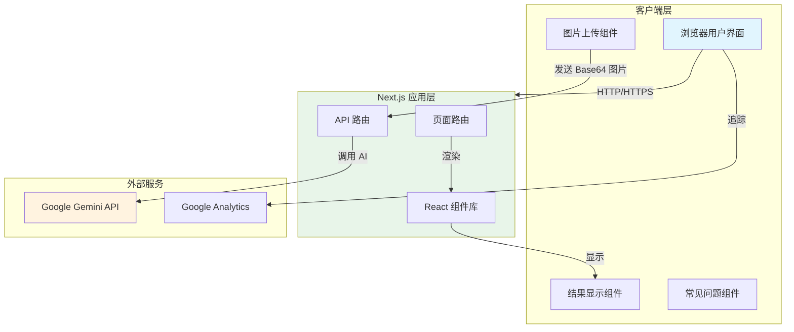
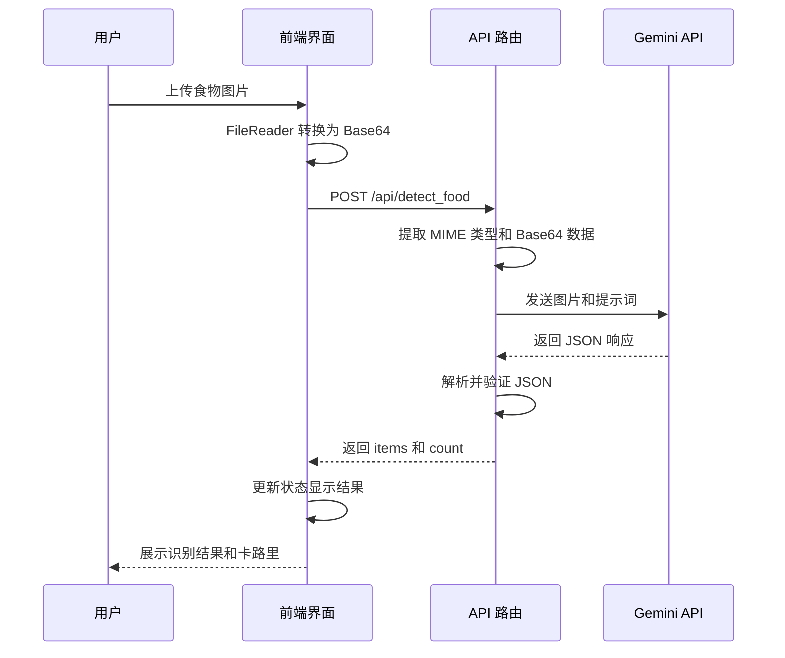
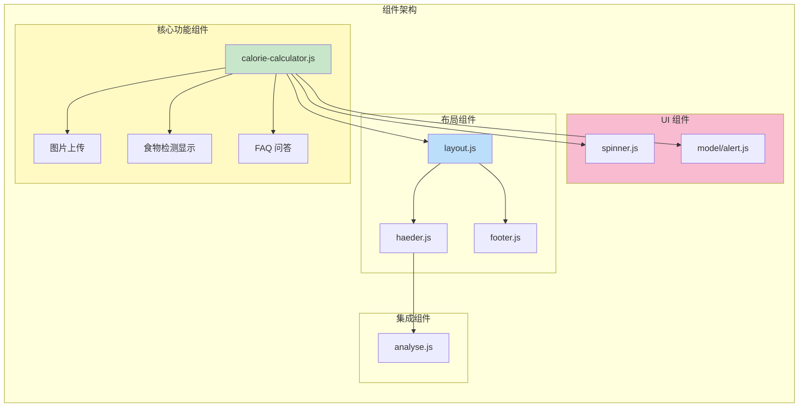
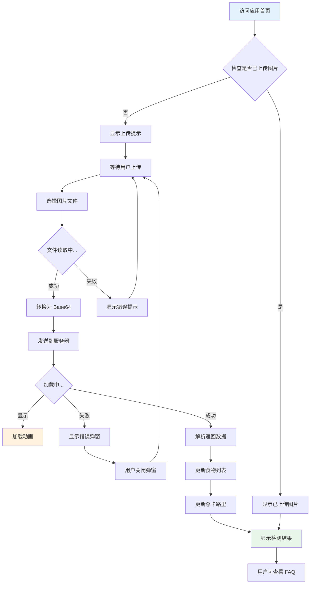
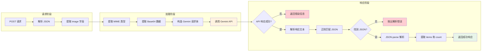
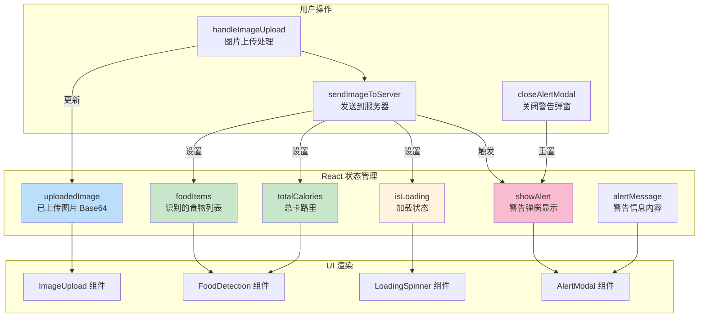
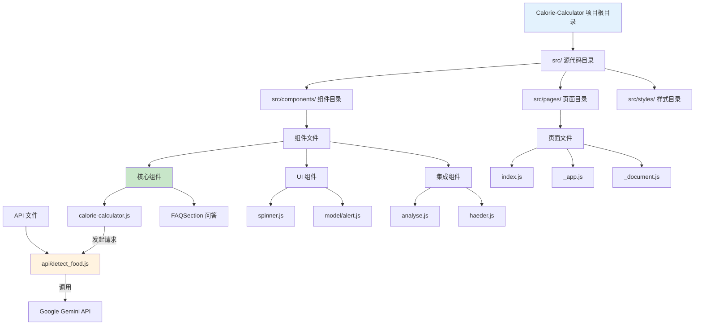
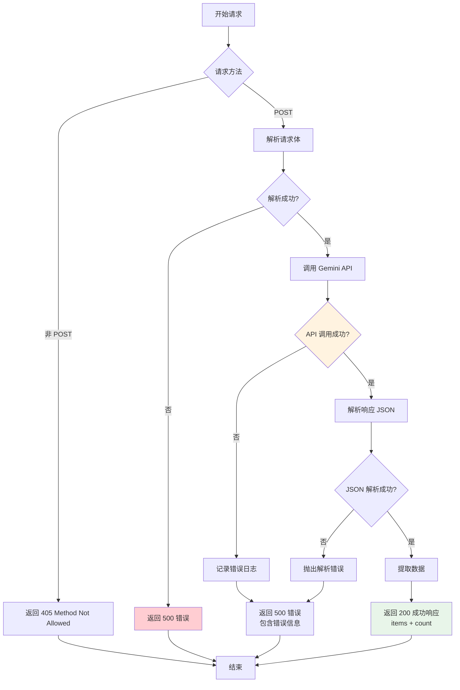

# AI 智能卡路里计算器 - 系统架构

## 系统整体架构

```mermaid
graph TB
    subgraph Client["客户端层"]
        Browser[浏览器用户界面]
        ImageUpload[图片上传组件]
        ResultDisplay[结果显示组件]
        FAQSection[常见问题组件]
    end

    subgraph NextJS["Next.js 应用层"]
        Pages[页面路由]
        APIRoutes[API 路由]
        Components[React 组件库]
    end

    subgraph External["外部服务"]
        GeminiAPI[Google Gemini API]
        GoogleAnalytics[Google Analytics]
    end

    Browser -->|HTTP/HTTPS| NextJS
    ImageUpload -->|发送 Base64 图片| APIRoutes
    APIRoutes -->|调用 AI| GeminiAPI
    Pages -->|渲染| Components
    Components -->|显示| ResultDisplay
    Browser -->|追踪| GoogleAnalytics

    style Browser fill:#e1f5fe
    style GeminiAPI fill:#fff3e0
    style NextJS fill:#e8f5e9
```

## 核心数据流

```mermaid
sequenceDiagram
    participant User as 用户
    participant UI as 前端界面
    participant API as API 路由
    participant Gemini as Gemini API

    User->>UI: 上传食物图片
    UI->>UI: FileReader 转换为 Base64
    UI->>API: POST /api/detect_food
    API->>API: 提取 MIME 类型和 Base64 数据
    API->>Gemini: 发送图片和提示词
    Gemini-->>API: 返回 JSON 响应
    API->>API: 解析并验证 JSON
    API-->>UI: 返回 items 和 count
    UI->>UI: 更新状态显示结果
    UI-->>User: 展示识别结果和卡路里
```

## 组件模块关系

```mermaid
graph LR
    subgraph Components["组件架构"]
        subgraph Layout["布局组件"]
            LayoutComp[layout.js]
            Header[haeder.js]
            Footer[footer.js]
        end

        subgraph Core["核心功能组件"]
            CalorieCalc[calorie-calculator.js]
            ImageUpload[图片上传]
            FoodDetection[食物检测显示]
            FAQSection[FAQ 问答]
        end

        subgraph UI["UI 组件"]
            Spinner[spinner.js]
            AlertModal[model/alert.js]
        end

        subgraph Integration["集成组件"]
            GoogleAnalytics[analyse.js]
        end
    end

    CalorieCalc --> LayoutComp
    LayoutComp --> Header
    LayoutComp --> Footer
    CalorieCalc --> ImageUpload
    CalorieCalc --> FoodDetection
    CalorieCalc --> FAQSection
    CalorieCalc --> Spinner
    CalorieCalc --> AlertModal
    Header --> GoogleAnalytics

    style LayoutComp fill:#bbdefb
    style CalorieCalc fill:#c8e6c9
    style Core fill:#fff9c4
    style UI fill:#f8bbd0
```

## 用户交互流程

```mermaid
flowchart TD
    A[访问应用首页] --> B{检查是否已上传图片}

    B -->|否| C[显示上传提示]
    C --> D[等待用户上传]

    B -->|是| E[显示已上传图片]

    D --> F[选择图片文件]
    F --> G{文件读取中...}

    G -->|成功| H[转换为 Base64]
    G -->|失败| I[显示错误提示]
    I --> D

    H --> J[发送到服务器]
    J --> K{加载中...}

    K -->|显示| L[加载动画]

    K -->|成功| M[解析返回数据]
    K -->|失败| N[显示错误弹窗]
    N --> O[用户关闭弹窗]
    O --> D

    M --> P[更新食物列表]
    P --> Q[更新总卡路里]
    Q --> R[显示检测结果]

    E --> R
    R --> S[用户可查看 FAQ]

    style A fill:#e3f2fd
    style R fill:#e8f5e9
    style L fill:#fff3e0
```

## API 处理流程

```mermaid
flowchart LR
    subgraph Request["请求阶段"]
        A[POST 请求] --> B[解析 JSON]
        B --> C[提取 image 字段]
    end

    subgraph Process["处理阶段"]
        C --> D[提取 MIME 类型]
        D --> E[提取 Base64 数据]
        E --> F[构造 Gemini 请求体]
        F --> G[调用 Gemini API]
    end

    subgraph Response["响应阶段"]
        G --> H{API 响应成功?}
        H -->|否| I[返回错误信息]
        H -->|是| J[解析响应文本]
        J --> K[正则匹配 JSON]
        K --> L{找到 JSON?}
        L -->|否| M[抛出解析错误]
        L -->|是| N[JSON.parse 解析]
        N --> O[提取 items 和 count]
        O --> P[返回成功响应]
    end

    style G fill:#fff3e0
    style P fill:#e8f5e9
    style I fill:#ffcdd2
    style M fill:#ffcdd2
```

## 状态管理架构

```mermaid
graph TD
    subgraph State["React 状态管理"]
        uploadedImage["uploadedImage<br/>已上传图片 Base64"]
        foodItems["foodItems<br/>识别的食物列表"]
        totalCalories["totalCalories<br/>总卡路里"]
        isLoading["isLoading<br/>加载状态"]
        showAlert["showAlert<br/>警告弹窗显示"]
        alertMessage["alertMessage<br/>警告信息内容"]
    end

    subgraph Actions["用户操作"]
        handleImageUpload["handleImageUpload<br/>图片上传处理"]
        sendImageToServer["sendImageToServer<br/>发送到服务器"]
        closeAlertModal["closeAlertModal<br/>关闭警告弹窗"]
    end

    subgraph UI["UI 渲染"]
        ImageUpload["ImageUpload 组件"]
        FoodDetection["FoodDetection 组件"]
        LoadingSpinner["LoadingSpinner 组件"]
        AlertModal["AlertModal 组件"]
    end

    handleImageUpload -->|更新| uploadedImage
    handleImageUpload --> sendImageToServer
    sendImageToServer -->|设置| isLoading
    sendImageToServer -->|设置| foodItems
    sendImageToServer -->|设置| totalCalories
    sendImageToServer -->|触发| showAlert

    uploadedImage --> ImageUpload
    foodItems --> FoodDetection
    totalCalories --> FoodDetection
    isLoading --> LoadingSpinner
    showAlert --> AlertModal
    alertMessage --> AlertModal

    closeAlertModal -->|重置| showAlert

    style uploadedImage fill:#bbdefb
    style foodItems fill:#c8e6c9
    style totalCalories fill:#c8e6c9
    style isLoading fill:#fff3e0
    style showAlert fill:#f8bbd0
```

## 目录结构与模块依赖

```mermaid
graph TD
    Root["Calorie-Calculator 项目根目录"]

    Src["src/ 源代码目录"]
    Components["src/components/ 组件目录"]
    Pages["src/pages/ 页面目录"]
    Styles["src/styles/ 样式目录"]

    ComponentFiles["组件文件"]
    APIFiles["API 文件"]
    PageFiles["页面文件"]

    Core["核心组件"]
    UI["UI 组件"]
    Integration["集成组件"]

    Root --> Src
    Src --> Components
    Src --> Pages
    Src --> Styles

    Components --> ComponentFiles
    Pages --> PageFiles

    ComponentFiles --> Core
    ComponentFiles --> UI
    ComponentFiles --> Integration

    Core --> CC["calorie-calculator.js"]
    Core --> FAQ["FAQSection 问答"]

    UI --> Spinner["spinner.js"]
    UI --> Alert["model/alert.js"]

    Integration --> GA["analyse.js"]
    Integration --> Header["haeder.js"]

    APIFiles --> DetectFood["api/detect_food.js"]

    PageFiles --> Index["index.js"]
    PageFiles --> App["_app.js"]
    PageFiles --> Doc["_document.js"]

    DetectFood -->|调用| Gemini["Google Gemini API"]
    CC -->|发起请求| DetectFood

    style Root fill:#e3f2fd
    style Core fill:#c8e6c9
    style DetectFood fill:#fff3e0
```

## 错误处理流程

```mermaid
flowchart TD
    A[开始请求] --> B{请求方法}

    B -->|非 POST| C[返回 405 Method Not Allowed]
    B -->|POST| D[解析请求体]

    D --> E{解析成功?}
    E -->|否| F[返回 500 错误]
    E -->|是| G[调用 Gemini API]

    G --> H{API 调用成功?}
    H -->|否| I[记录错误日志]
    I --> J[返回 500 错误<br/>包含错误信息]

    H -->|是| K[解析响应 JSON]

    K --> L{JSON 解析成功?}
    L -->|否| M[抛出解析错误]
    M --> J

    L -->|是| N[提取数据]
    N --> O[返回 200 成功响应<br/>items + count]

    C --> P[结束]
    F --> P
    J --> P
    O --> P

    style H fill:#fff3e0
    style O fill:#e8f5e9
    style F fill:#ffcdd2
```
