# Claude Code Game Studios 架构图

本文档使用Mermaid图表展示Claude Code Game Studios项目的系统架构。

---

## 1. 系统整体架构

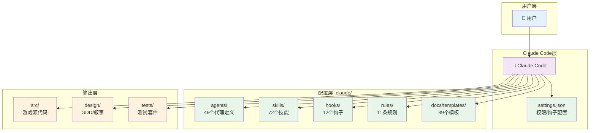

---

## 2. 代理层级架构

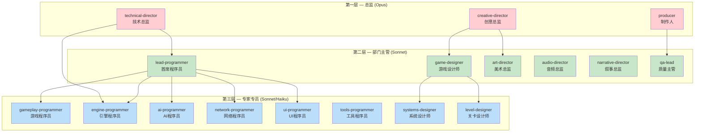

---

## 3. 7阶段开发流程

```mermaid
flowchart LR
    subgraph 阶段1_概念
        B["/brainstorm"]
        SM["/setup-engine"]
        MS["/map-systems"]
    end

    subgraph 阶段2_系统设计
        DS["/design-system"]
        DR["/design-review"]
    end

    subgraph 阶段3_技术设置
        CA["/create-architecture"]
        ADR["/architecture-decision"]
        CCM["/create-control-manifest"]
    end

    subgraph 阶段4_预生产
        UX["/ux-design"]
        PR["/prototype"]
        CE["/create-epics"]
        CS["/create-stories"]
    end

    subgraph 阶段5_生产
        DST["/dev-story"]
        SD["/story-done"]
        SP["/sprint-plan"]
    end

    subgraph 阶段6_打磨
        PP["/perf-profile"]
        BC["/balance-check"]
        TP["/team-polish"]
    end

    subgraph 阶段7_发布
        RC["/release-checklist"]
        LC["/launch-checklist"]
        TR["/team-release"]
    end

    阶段1_概念 --> 阶段2_系统设计
    阶段2_系统设计 --> 阶段3_技术设置
    阶段3_技术设置 --> 阶段4_预生产
    阶段4_预生产 --> 阶段5_生产
    阶段5_生产 --> 阶段6_打磨
    阶段6_打磨 --> 阶段7_发布

    classDef phase fill:#E1F5FE
    classDef skill fill:#F3E5F5

    class B,SM,MS,DS,DR,CA,ADR,CCM,UX,PR,CE,CS,DST,SD,SP,PP,BC,TP,RC,LC,TR skill
```

---

## 4. 核心数据流

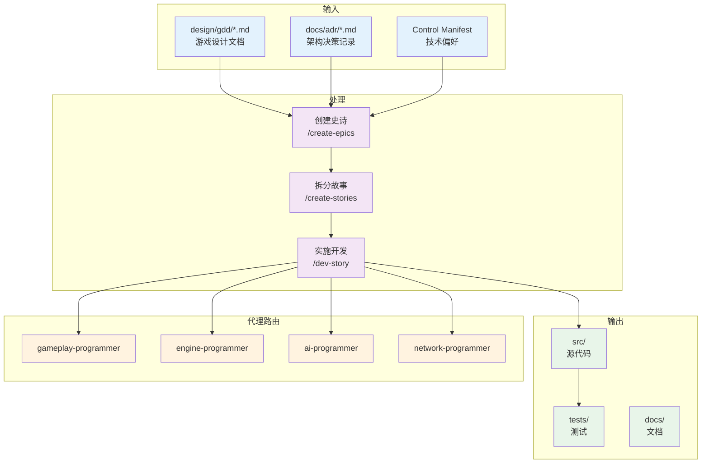

---

## 5. 协作协议流程

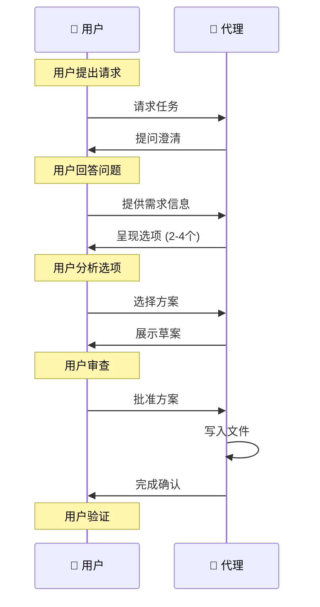

---

## 6. 钩子执行时序

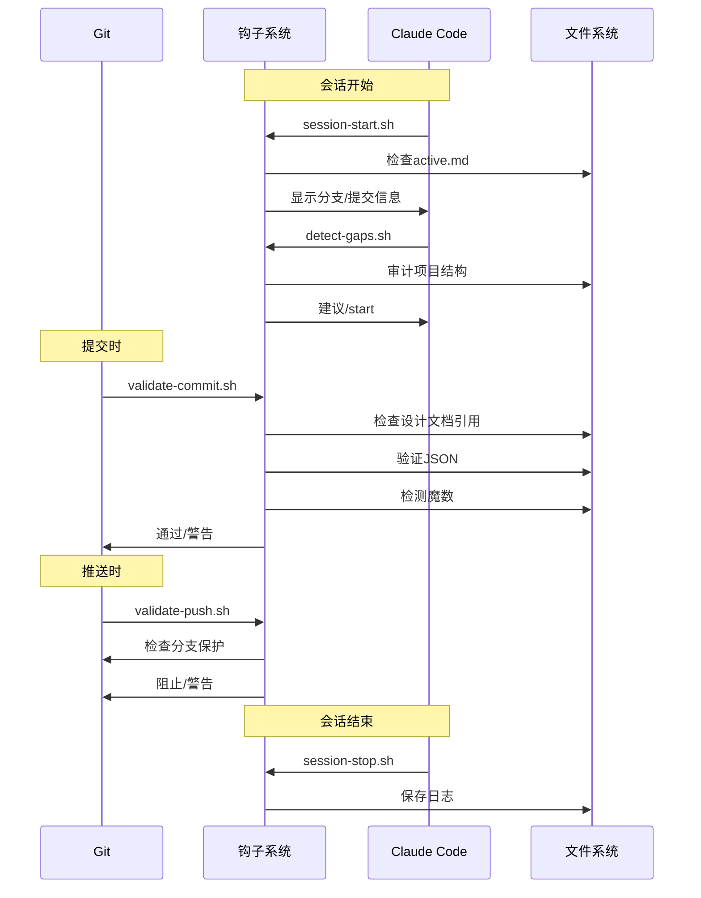

---

## 7. 故事生命周期

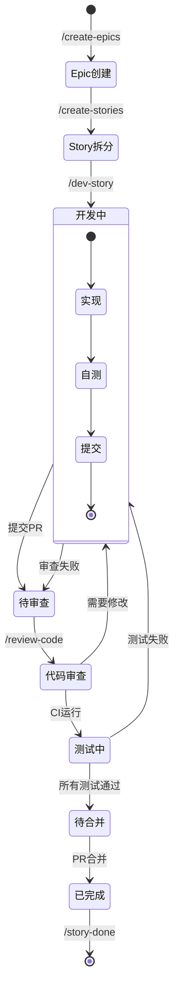

---

## 8. 权限控制流

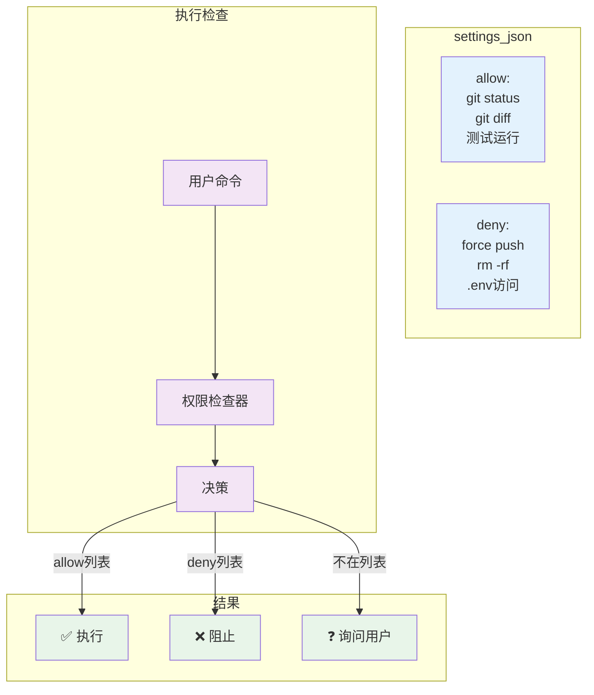

---

## 9. 状态行架构

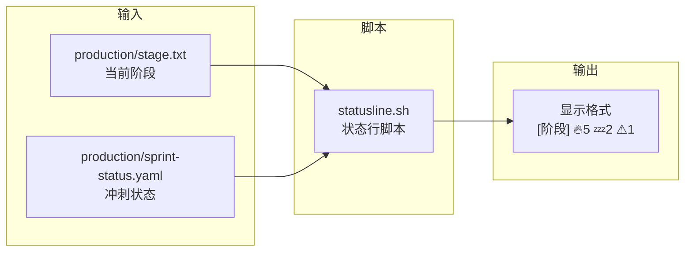

状态行显示示例：
```
[Phase 3] 🔥5 stories | 💤2 blocked | ⚠1 gap
```

---

## 10. 文件结构映射

```mermaid
graph TB
    subgraph 源代码 src/
        Src["src/"]
        SrcCore["src/core/<br/>引擎/核心系统"]
        SrcGameplay["src/gameplay/<br/>游戏逻辑"]
        SrcAI["src/ai/<br/>AI行为树"]
        SrcNet["src/networking/<br/>多人/网络"]
        SrcUI["src/ui/<br/>界面组件"]
        SrcTools["src/tools/<br/>编辑器工具"]
    end

    subgraph 设计 design/
        Design["design/"]
        DesignGDD["design/gdd/<br/>游戏设计文档"]
        DesignNarrative["design/narrative/<br/>叙事内容"]
        DesignUX["design/ux/<br/>UX规范"]
    end

    subgraph 资源 assets/
        Assets["assets/"]
        AssetsArt["assets/art/<br/>精灵/模型/纹理"]
        AssetsAudio["assets/audio/<br/>音乐/SFX"]
        AssetsData["assets/data/<br/>配置/平衡数据"]
    end

    subgraph 测试 tests/
        Tests["tests/<br/>测试套件"]
    end

    subgraph 原型 prototypes/
        Prototypes["prototypes/<br/>临时原型"]
    end

    Root["项目根目录"]

    Root --> Src
    Root --> Design
    Root --> Assets
    Root --> Tests
    Root --> Prototypes

    Src --> SrcCore
    Src --> SrcGameplay
    Src --> SrcAI
    Src --> SrcNet
    Src --> SrcUI
    Src --> SrcTools

    Design --> DesignGDD
    Design --> DesignNarrative
    Design --> DesignUX

    Assets --> AssetsArt
    Assets --> AssetsAudio
    Assets --> AssetsData

    classDef src fill:#E3F2FD
    classDef design fill:#F3E5F5
    classDef assets fill:#E8F5E9
    classDef tests fill:#FFF3E0
    classDef proto fill:#FFEBEE

    class Src,SrcCore,SrcGameplay,SrcAI,SrcNet,SrcUI,SrcTools src
    class Design,DesignGDD,DesignNarrative,DesignUX design
    class Assets,AssetsArt,AssetsAudio,AssetsData assets
    class Tests tests
    class Prototypes proto
```

---

## 11. 引擎特定架构

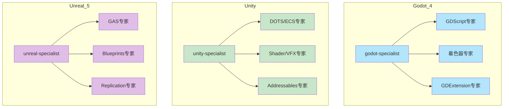
