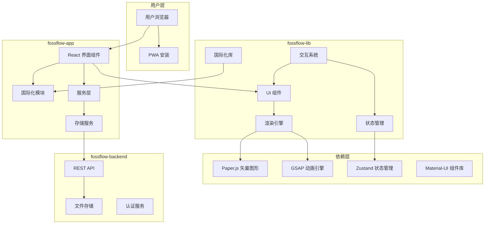
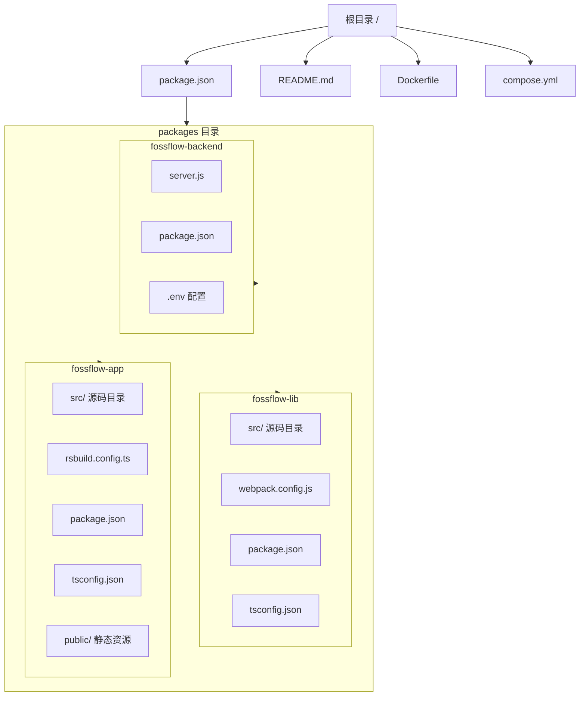
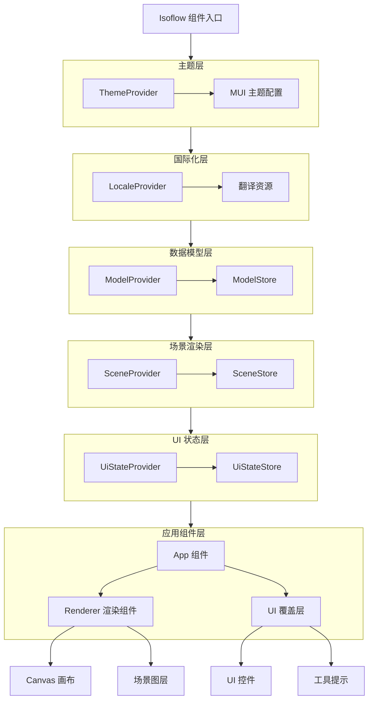
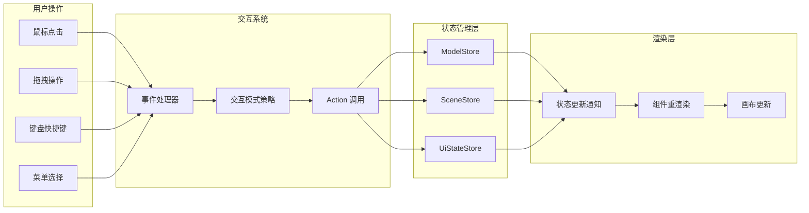
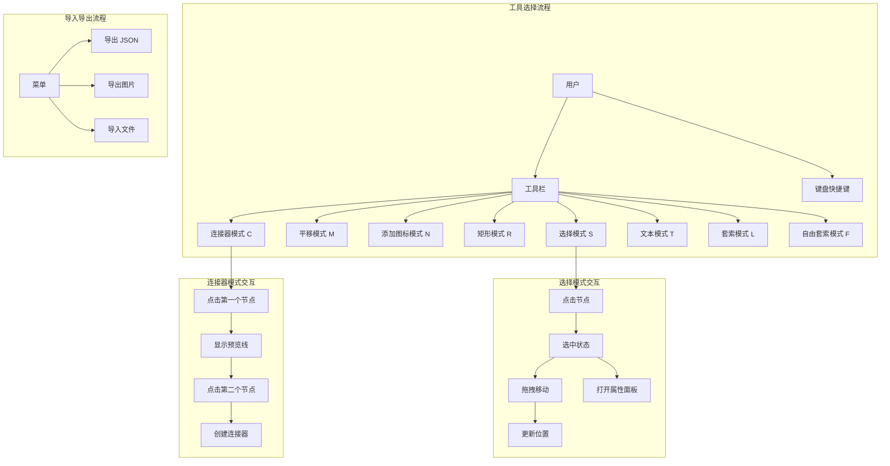
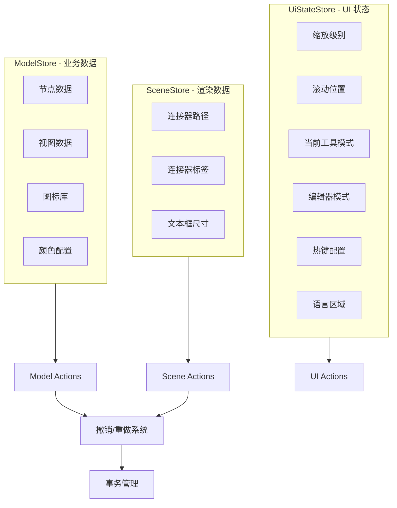
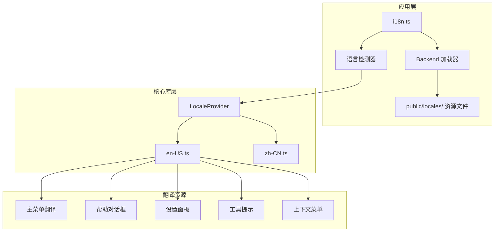

# FossFLOW 架构分析

## 一、系统整体架构

FossFLOW 采用分层架构设计，将整个系统划分为表现层、业务逻辑层、数据持久层和基础设施层四个主要层次。这种分层设计的核心理念是关注点分离（Separation of Concerns），使得各层可以独立演进和测试，同时保持良好的代码可维护性。作为一个渐进式 Web 应用，FossFLOW 的前端代码完全在浏览器中运行，通过可选的后端服务实现数据的持久化存储。

整体架构采用了 Monorepo 的代码组织方式，将核心库（fossflow-lib）、前端应用（fossflow-app）和后端服务（fossflow-backend）三个独立的包整合在同一个代码库中。这种架构选择便于跨包的重构和依赖共享，同时简化了开发和构建流程。根目录的 package.json 定义了工作空间的配置和共享的构建脚本，各子包遵循统一的代码规范和版本策略。



从技术栈角度来看，FossFLOW 的前端部分建立在 React 生态系统之上，使用 TypeScript 提供编译时的类型检查，确保代码的可靠性。状态管理采用 Zustand 库，相比 Redux 等传统方案更加轻量且易于使用。图形渲染依赖 Paper.js 库，该库提供了强大的矢量图形处理能力，非常适合等轴测图表的绘制需求。动画效果使用 GSAP（GreenSock Animation Platform）实现，提供了流畅的过渡动画和交互反馈。UI 组件库选择 Material-UI，确保了界面的美观性和一致性。

## 二、Monorepo 包结构

FossFLOW 的 Monorepo 结构清晰地划分了三个子包的职责边界，每个包都可以独立开发和发布。根目录的 workspace 配置使得 npm install 命令能够一次性安装所有包的依赖，而 npm run 脚本可以同时或分别对各包执行操作。这种架构特别适合有多个相互依赖项目的场景，避免了传统多仓库模式中的版本同步和维护复杂性。

fossflow-lib 是整个系统的核心库，包含了等轴测图表的渲染引擎、状态管理逻辑、交互处理系统以及可复用的 UI 组件。这个包被设计为可以独立发布到 npm 供第三方应用使用，因此采用了 Webpack 作为构建工具，输出 CommonJS2 格式的模块。包的入口文件 Isoflow.tsx 导出了主要的 React 组件和 Hook 函数，第三方开发者可以像使用其他 React 组件库一样将 FossFLOW 集成到自己的应用中。



fossflow-app 是基于 fossflow-lib 构建的渐进式 Web 应用，它提供了完整的用户界面、包装了核心库的功能、实现了 PWA 配置以及国际化资源的动态加载。这个包使用了 RSBuild 作为构建工具，相比传统的 Webpack 具有更快的构建速度和更好的开发体验。RSBuild 是基于 Rspack 的现代构建工具，专为 React 应用优化，提供了开箱即用的 TypeScript 支持、HMR 和生产构建优化。

fossflow-backend 是可选的后端服务，使用 Express.js 框架提供图表数据的持久化存储 API。这个包没有独立的构建流程，直接使用 Node.js 运行 ES Modules 格式的源代码。后端服务通过环境变量配置存储路径、端口和功能开关，使得部署更加灵活。对于纯客户端使用场景，可以完全不部署后端服务；对于需要团队协作或数据备份的场景，可以启用后端存储功能。

## 三、组件 Provider 层次结构

FossFLOW 的 React 组件采用了 Provider 注入的模式来组织各层的依赖关系。这种设计模式确保了状态和配置能够按需传递到需要它们的子组件，同时避免了props drilling（属性穿透）的繁琐写法。最外层的 Provider 负责全局配置，向内层依次提供主题、国际化、数据模型和 UI 状态等不同的上下文。



ThemeProvider 是最外层的 Provider，它使用 Material-UI 的 theming 系统为整个应用提供统一的视觉样式。主题配置包含了颜色方案、字体设置、组件默认样式等，所有的子组件都可以通过 useTheme Hook 访问当前的主题配置。主题支持深色模式和浅色模式的切换，用户可以根据使用环境或个人偏好进行选择。

LocaleProvider 负责国际化资源的注入，它接收翻译对象并通过 Context 传递给需要国际化支持的子组件。与应用层的 react-i18next 集成不同，核心库的国际化实现更加轻量，直接在组件中引用翻译对象的键名来获取本地化文本。这种设计使得核心库可以作为独立包发布，而应用层可以根据需要选择不同的国际化方案。

ModelProvider、SceneProvider 和 UiStateProvider 分别注入三种不同类型的状态。ModelProvider 提供图表的业务数据，包括所有节点、图标、颜色等核心数据；SceneProvider 提供与视觉渲染相关的数据，如连接器的路径点坐标、文本框的尺寸等；UiStateProvider 提供用户界面状态，如当前缩放级别、选中的工具、快捷键配置等。这种分离的状态管理设计使得各层可以独立更新，避免不必要重新渲染。

## 四、核心数据流

FossFLOW 的数据流遵循单向数据流（Unidirectional Data Flow）的设计原则，用户的操作首先被交互系统捕获，然后通过 Action 触发 Store 中状态的更新，状态更新后自动触发组件的重新渲染，最终反映到界面上。这种数据流模式使得状态变化可预测、可追踪，便于调试和测试。

当用户执行一个操作（如拖拽节点、创建连接器）时，交互系统首先收集相关的输入信息（鼠标位置、目标元素、操作类型等），然后调用对应的 Action 函数。Action 函数是纯函数，它接收输入参数和当前状态，返回新的状态。对于复杂操作，Action 可能会执行多个状态变更，这些变更会被组合成一个事务（Transaction），保证撤销/重做功能的原子性。



状态更新后，Zustand 库会通知所有订阅了相关状态变化的组件。React 的响应式渲染机制会自动比较新旧状态的差异，只重新渲染发生变化的部分。对于图形密集的渲染层，这种细粒度的更新机制显著提高了性能。Canvas 画布使用 Paper.js 的图形对象模型，当底层数据变化时，只会重新绘制受影响的图形元素，而不是整个画布。

## 五、用户交互流程

FossFLOW 的用户交互流程设计注重直观性和一致性。用户通过工具栏或键盘快捷键切换当前的操作模式，不同模式下鼠标事件有不同的语义。例如，选择模式下点击可以选中节点，拖拽可以移动节点；连接器模式下点击两个节点会在它们之间创建连接；矩形模式下拖拽可以绘制矩形区域。这种设计使得学习曲线平缓，用户可以快速掌握各种操作。



撤销/重做功能是交互流程中的重要组成部分，它使用命令模式（Command Pattern）来封装每一个操作。系统维护两个栈（undo stack 和 redo stack），分别记录执行过的操作和撤销过的操作。每次执行新操作时，redo 栈会被清空。用户可以通过菜单选项、工具栏按钮或键盘快捷键（Ctrl+Z / Ctrl+Y）来执行撤销和重做操作。

## 六、状态管理架构

FossFLOW 的状态管理采用多 Store 设计，每个 Store 负责特定领域的状态。这种设计源于「单一数据源」原则的变体——将单一数据源按照领域边界拆分为多个协作的 Store，既保持了状态的可管理性，又避免了单一 Store 过于庞大带来的复杂性。



ModelStore 管理图表的业务数据，是整个系统的核心数据源。它存储了所有节点的定义（位置、图标、描述）、视图的定义（多个视角或布局方案）、图标库的配置以及颜色调色板。ModelStore 的更新会影响图表的结构和内容，是最关键的数据变更来源。

SceneStore 管理与视觉渲染相关的数据，这些数据可以根据业务数据计算得出，也可以独立调整。连接器的路径点坐标、标签在路径上的位置、文本框的尺寸和位置都属于 SceneStore 的管理范围。这种分离设计使得渲染相关的细粒度调整不会与业务数据混淆，保持了数据的清晰性。

UiStateStore 管理与用户界面相关的状态，包括缩放级别、滚动偏移、当前选中的工具、编辑器模式（可编辑/只读）、热键配置方案、语言区域设置等。这些状态纯粹是界面相关的，不会影响图表数据本身，但在交互过程中需要频繁读取和更新。

## 七、国际化架构

FossFLOW 的国际化架构分为两个层次：核心库层的轻量级 i18n 实现和应用层完整的 react-i18next 集成。这种分层设计使得核心库可以作为独立包发布，而应用层可以根据需求选择不同的国际化方案。



核心库的国际化实现使用 TypeScript 接口定义翻译结构，翻译资源是硬编码的 TypeScript 对象。这种实现方式简单直接，没有运行时加载的开销，适合核心库的场景。翻译对象的键名采用嵌套结构，按功能模块组织（如 mainMenu、helpDialog、settings 等），组件中通过键名路径访问翻译文本（如 locale.mainMenu.undo）。

应用层的国际化实现使用 react-i18next 框架，支持翻译资源的动态加载和多语言检测。翻译资源存储在 public/locales 目录下的 JSON 文件中，应用启动时通过 HTTP 请求异步加载。这种实现方式支持更多的语言和更大的翻译体积，适合需要频繁更新翻译内容的场景。应用层的国际化与核心库的轻量级实现通过 LocaleProvider 进行桥接，确保两个层次的翻译能够无缝整合。

## 八、部署架构

FossFLOW 支持多种部署方式，从轻量级的纯静态托管到完整的容器化部署，可以根据实际需求选择合适的方案。对于大多数使用场景，静态文件托管是最简单的部署方式，只需要将构建产物部署到任何支持静态网站的托管服务上。

```mermaid
flowchart TB
    subgraph 客户端
        Browser[浏览器]
        PWA[Service Worker]
        Cache[本地缓存]
    end

    subgraph 静态托管
        Nginx[Nginx 服务器]
        StaticFiles[静态资源文件]
    end

    subgraph Docker容器
        Container[Docker 容器]

        subgraph ContainerContents[容器内容]
            Nginx_Cont[Nginx]
            Frontend[前端构建产物]
            Backend[后端服务]
        end

        subgraph Volumes[数据卷]
            Diagrams[/data/diagrams]
        end
    end

    subgraph 后端服务
        Express[Express.js API]
        FileSystem[文件系统存储]
    end

    Browser --> Nginx
    Nginx --> StaticFiles
    Nginx --> Frontend

    Browser --> PWA
    PWA --> Cache

    Container --> Nginx_Cont
    Nginx_Cont --> Frontend
    Nginx_Cont --> Backend

    Backend --> Express
    Express --> FileSystem
    FileSystem --> Diagrams
```

Docker 部署是生产环境的推荐方式，它提供了完整的功能包括后端存储服务。Dockerfile 采用多阶段构建，第一阶段使用 node:22 镜像构建应用，第二阶段将构建产物复制到更轻量的运行镜像中。compose.yml 配置了容器运行参数，包括端口映射（80 端口提供 HTTP 服务，3001 端口提供后端 API）和持久化卷挂载。

对于纯客户端使用场景（不需要后端存储），可以禁用后端容器或设置 ENABLE_SERVER_STORAGE=false 环境变量。在这种模式下，所有数据都存储在浏览器的本地存储中，适合个人使用或对数据安全性要求较高的环境。PWA 特性确保了即使在离线状态下，应用也能正常运行。

---

**作者：Matrix Agent**

**创建时间：2026年1月31日**

**文档版本：1.0**
