# GitNexus 架构文档

## 一、系统整体架构

GitNexus 采用模块化架构设计，整体系统由 CLI（命令行工具）和 Web UI（网页界面）两个主要入口组成，共用同一套核心索引管道。CLI 分支使用原生 Node.js 运行，支持完整的图数据库操作和 MCP 协议；Web UI 分支则完全运行在浏览器中，通过 WebAssembly 技术实现代码解析和图数据存储。

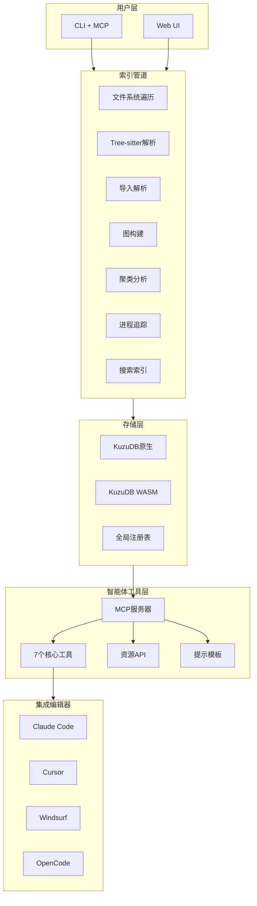

### 1.1 核心模块职责

整个系统的核心模块分布在 `gitnexus/src` 目录下，分为以下几个主要职责领域：

**CLI 命令模块（cli）**：负责处理用户命令行交互，包括 `analyze`（代码库索引）、`setup`（MCP 配置）、`serve`（本地服务器）、`list`（列出仓库）、`status`（状态检查）、`clean`（清理索引）等命令的实现。

**配置模块（config）**：管理系统配置和全局注册表，支持多代码库场景下的索引注册和发现机制。

**核心处理模块（core）**：这是系统的技术核心，包含代码解析、图构建、搜索、嵌入生成等关键功能，具体包括：

- **ingestion（摄取模块）**：负责从源代码到知识图谱的完整转换流程，包括 AST 解析、导入关系解析、调用关系追踪，社区检测、进程追踪等
- **graph（图模块）**：封装图数据结构操作，提供节点和边的创建、查询、更新等基础功能
- **kuzu（图数据库模块）**：封装 KuzuDB 图数据库操作，提供 Cypher 查询接口
- **search（搜索模块）**：实现混合搜索功能，结合 BM25 关键词搜索和语义向量搜索
- **embeddings（嵌入模块）**：使用 HuggingFace transformers.js 生成代码语义嵌入
- **tree-sitter（解析模块）**：封装 Tree-sitter 语法树解析功能
- **augmentation（增强模块）**：提供图增强能力，如置信度计算等
- **wiki（文档生成模块）**：基于知识图谱自动生成项目文档

**MCP 模块（mcp）**：实现 Model Context Protocol 服务器，提供工具定义、资源定义、提示模板等接口，支持与外部 AI 编辑器的集成。

**服务端模块（server）**：提供本地 HTTP 服务器功能，支持 Bridge 模式连接 Web UI 和 CLI。

**存储模块（storage）**：封装底层的文件系统和数据库存储操作。

**类型定义模块（types）**：提供 TypeScript 类型定义，确保代码类型安全。

## 二、核心数据流

### 2.1 索引数据流

索引是 GitNexus 最核心的管道，它将原始源代码转化为可查询的知识图谱。整个索引过程分为六个主要阶段：

```mermaid
flowchart LR
    subgraph Phase1["阶段一：结构分析"]
        FSW["文件系统遍历"]
        FP["文件解析"]
    end

    subgraph Phase2["阶段二：AST解析"]
        TSP["Tree-sitter解析"]
        SymExt["符号提取"]
    end

    subgraph Phase3["阶段三：关系解析"]
        IP["导入解析"]
        CP["调用解析"]
        HP["继承解析"]
    end

    subgraph Phase4["阶段四：图构建"]
        NodeCr["节点创建"]
        EdgeCr["边创建"]
        KG["知识图谱"]
    end

    subgraph Phase5["阶段五：高级分析"]
        CDP["社区检测"]
        ProcP["进程追踪"]
        Conf["置信度计算"]
    end

    subgraph Phase6["阶段六：索引构建"]
        BM25["BM25索引"]
        Emb["向量索引"]
        Final["最终索引"]
    end

    FSW --> FP
    FP --> TSP
    TSP --> SymExt
    SymExt --> IP
    IP --> CP
    CP --> HP
    HP --> NodeCr
    NodeCr --> EdgeCr
    EdgeCr --> KG
    KG --> CDP
    CDP --> ProcP
    ProcP --> Conf
    Conf --> BM25
    BM25 --> Emb
    Emb --> Final
```

**阶段一：结构分析**。`FilesystemWalker` 类遍历代码库目录结构，识别需要索引的文件，排除测试文件和构建产物。该阶段的输出是待处理的文件列表。

**阶段二：AST 解析**。使用 Tree-sitter 对每个源文件进行语法分析，提取函数、类、接口、方法、变量等符号信息。`ParsingProcessor` 类负责协调解析工作，`SymbolTable` 类维护全局符号表。

**阶段三：关系解析**。这是理解代码逻辑的关键阶段：

- **导入解析（ImportProcessor）**：解析 import/export 语句，建立文件间的依赖关系
- **调用解析（CallProcessor）**：分析函数调用关系，追踪调用者和被调用者
- **继承解析（HeritageProcessor）**：处理类继承、接口实现等关系

**阶段四：图构建**。将前三个阶段的输出转化为图数据库中的节点和边。节点类型包括 File、Folder、Function、Class、Interface、Method 等，边类型包括 CALLS、IMPORTS、EXTENDS、IMPLEMENTS、DEFINES 等。

**阶段五：高级分析**。在基础图结构之上进行深度分析：

- **社区检测（CommunityProcessor）**：使用 Leiden 算法识别功能相关的代码社区
- **进程追踪（ProcessProcessor）**：从入口点追踪完整的执行流程
- **置信度计算（EntryPointScoring）**：评估关系匹配的可靠性

**阶段六：索引构建**。为搜索功能建立高效索引，包括 BM25 倒排索引和语义向量索引，支持混合搜索。

### 2.2 查询数据流

当用户通过 MCP 工具查询代码时，数据流如下：

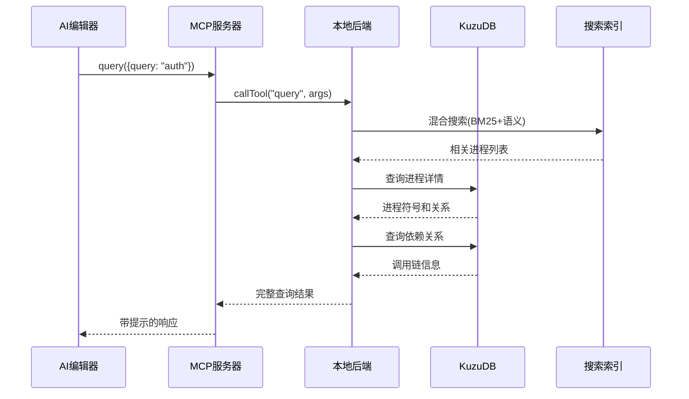

查询数据流的关键特点是「预计算关系智能」的应用。与传统方案在运行时动态探索图谱不同，GitNexus 在索引阶段已经完成了复杂的关系计算，因此查询工具可以直接返回完整、结构化的响应。

## 三、类与模块关系

### 3.1 核心类图

以下是索引管道中核心类的关系图：

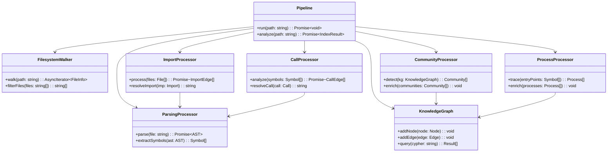

### 3.2 MCP 工具调用链

MCP 工具通过以下调用链响应用户请求：

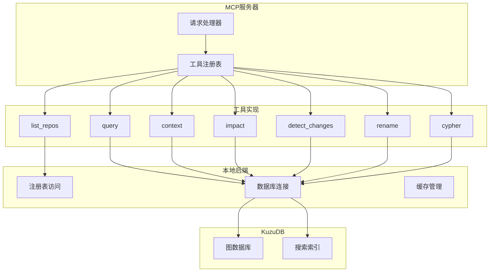

## 四、用户交互流程

### 4.1 典型用户工作流

以下展示使用 GitNexus 进行代码探索的典型工作流程：

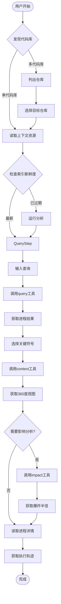

### 4.2 MCP 工具使用引导

GitNexus MCP 服务器的一个独特设计是「下一步提示」（Next-step Hints）。在每个工具响应后，都会附带上图灵式的下一步行动建议，帮助 AI 智能体构建自引导工作流：

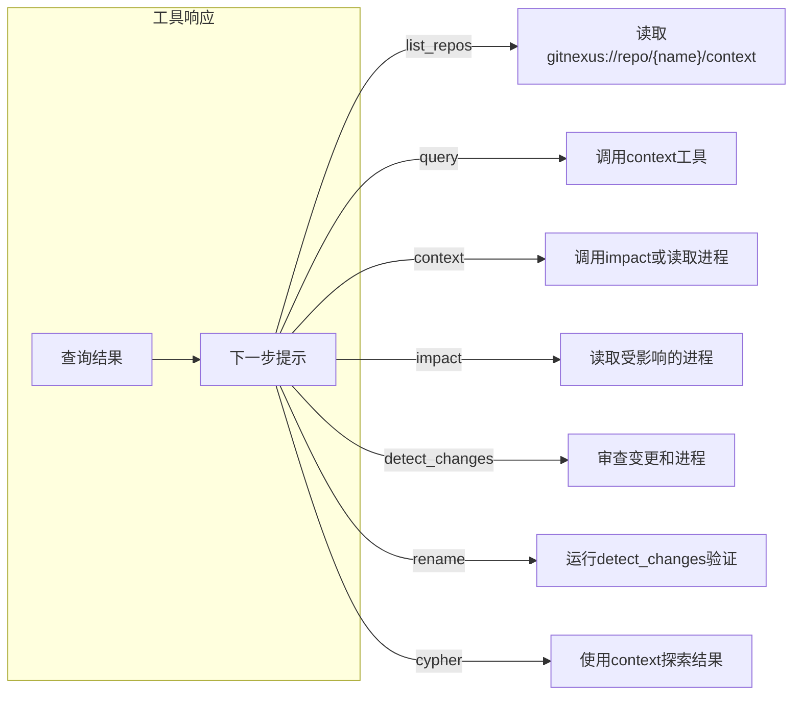

## 五、部署架构

### 5.1 CLI 部署模式

CLI 模式是 GitNexus 推荐的主要使用方式，适用于日常开发场景：

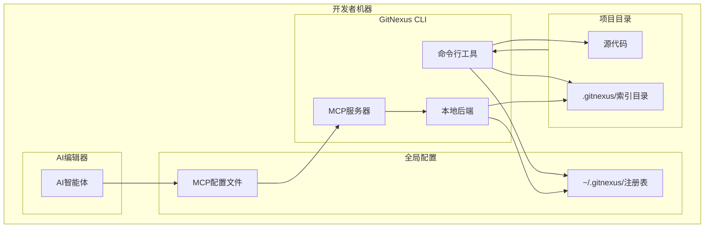

CLI 模式的典型部署步骤：首先通过 `npm install -g gitnexus` 全局安装工具，然后在项目目录运行 `npx gitnexus analyze` 进行索引，接着运行 `npx gitnexus setup` 配置 MCP，最后在编辑器中启动 AI 智能体即可使用。

### 5.2 Web UI 部署模式

Web UI 提供纯浏览器端的图形化探索体验：

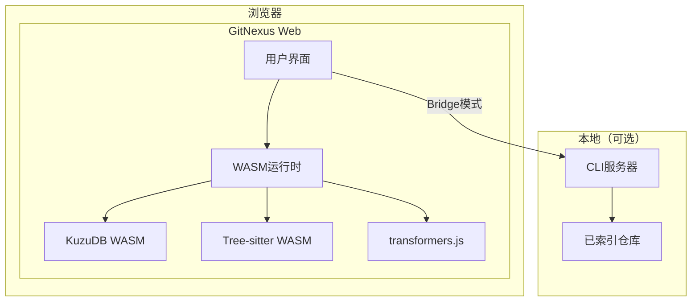

Web UI 支持两种使用模式：直接上传模式，用户直接拖拽代码库 ZIP 文件，浏览器内完成索引和探索；Bridge 模式，连接本地 CLI 服务器，访问已索引的仓库，无需重新上传和索引。

### 5.3 多代码库架构

GitNexus 支持同时管理多个代码库的索引：

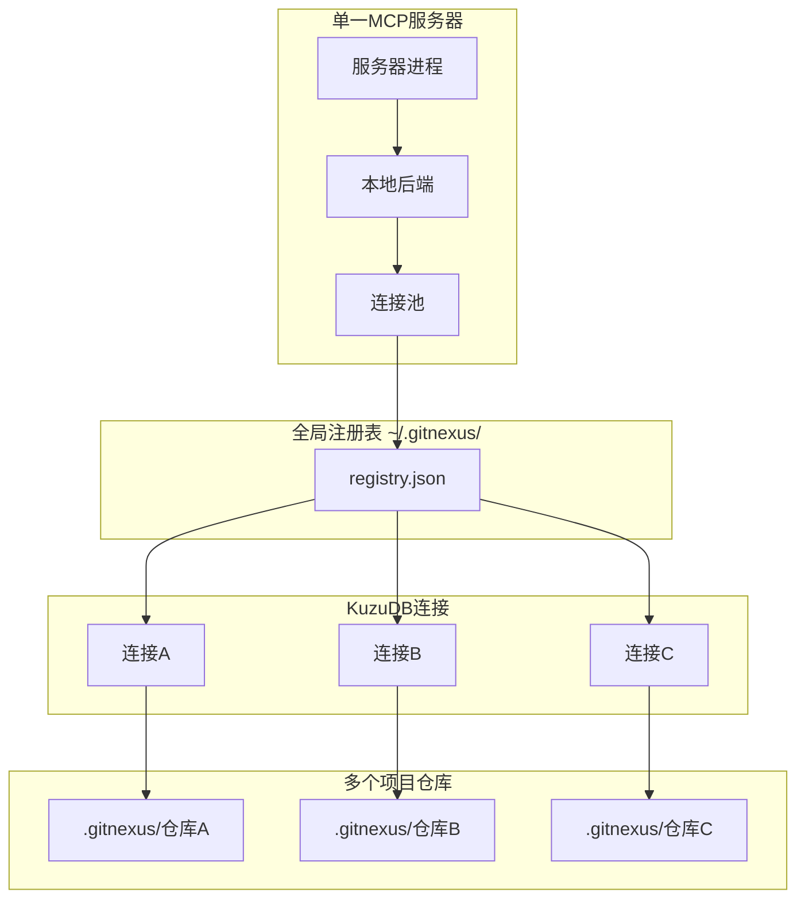

多代码库架构的关键设计是全局注册表机制：每个仓库独立维护自己的 `.gitnexus/` 索引目录（便携且被 Git 忽略），全局注册表 `~/.gitnexus/registry.json` 仅存储指向各仓库的指针。MCP 服务器启动时读取注册表，按需打开 KuzuDB 连接（延迟打开，空闲 5 分钟后关闭，最多 5 个并发）。

## 六、技术栈总览

### 6.1 运行时环境

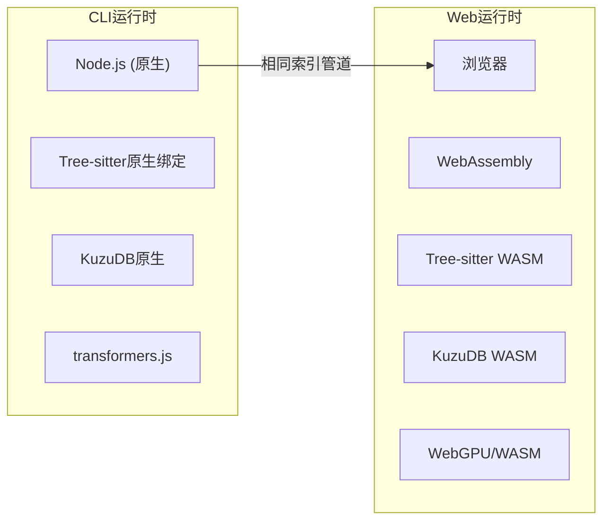

### 6.2 核心技术依赖

| 层次 | CLI 实现 | Web 实现 | 用途 |
|------|----------|----------|------|
| 运行时 | Node.js | 浏览器 (WASM) | 应用执行环境 |
| 代码解析 | Tree-sitter 原生绑定 | Tree-sitter WASM | AST 语法树生成 |
| 图数据库 | KuzuDB 原生 | KuzuDB WASM | 知识图谱存储 |
| 嵌入向量 | transformers.js (GPU/CPU) | transformers.js (WebGPU) | 语义搜索 |
| 搜索 | BM25 + 语义 + RRF | BM25 + 语义 + RRF | 混合搜索 |
| 智能体接口 | MCP (stdio) | LangChain ReAct | AI 集成 |
| 可视化 | — | Sigma.js + Graphology | 图渲染 |
| 前端框架 | — | React 18 + TypeScript + Vite | UI 构建 |
| 图算法 | Graphology | Graphology | 社区检测等 |
| 并发 | Worker threads + async | Web Workers + Comlink | 并行处理 |

## 七、总结

GitNexus 的架构设计体现了几个关键设计原则：首先是模块化分离，CLI 和 Web UI 共用核心索引管道，但针对不同运行环境做了适配优化；其次是预计算优先，通过在索引阶段完成复杂的关系计算，大幅降低查询时的计算负担；第三是多代码库支持，全局注册表机制使单一 MCP 服务器可以服务多个仓库；第四是智能体友好，下一步提示和技能系统帮助 AI 智能体构建自引导工作流。

这种架构使得 GitNexus 能够为各种规模的代码库提供高效的代码智能服务，从小型项目到大型企业代码库都能得到良好的支持。
