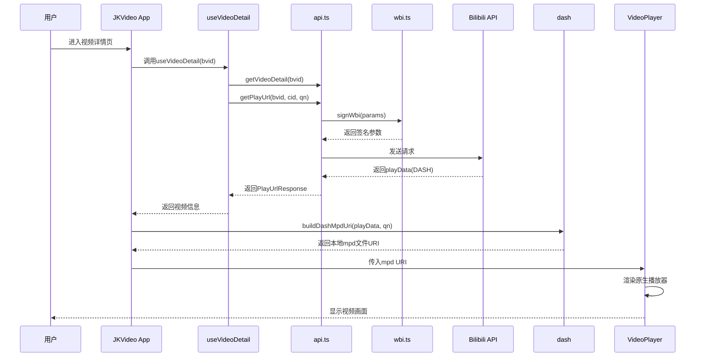
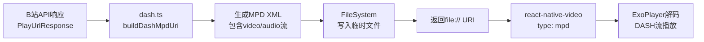
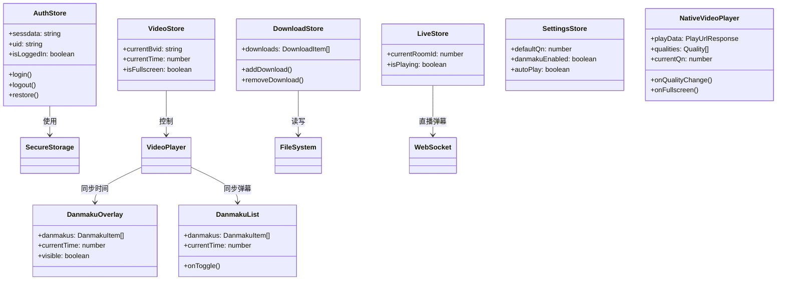
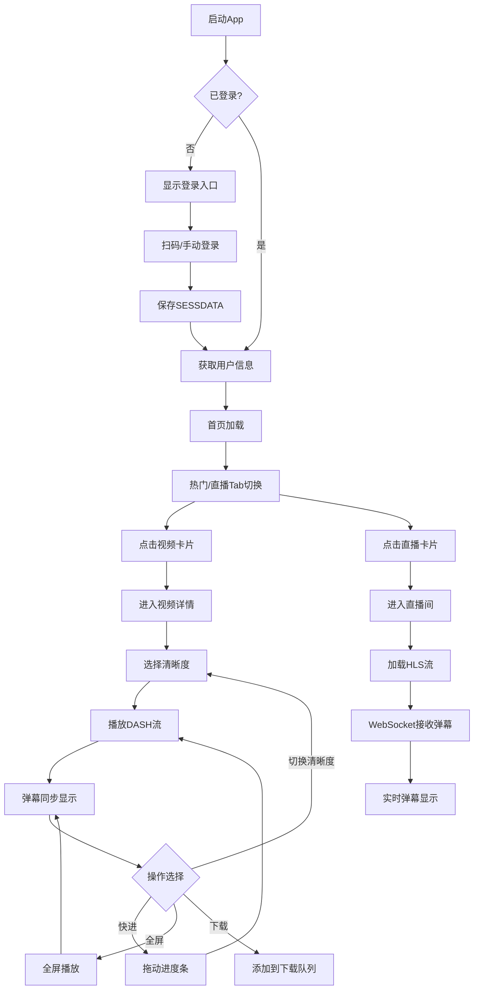
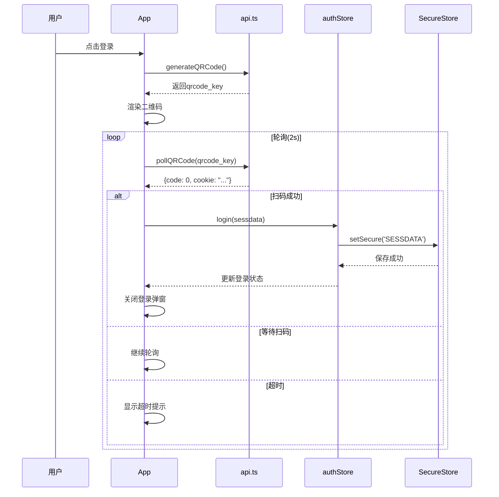
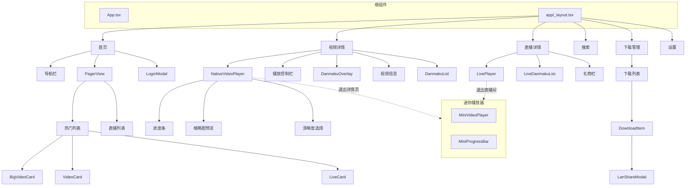
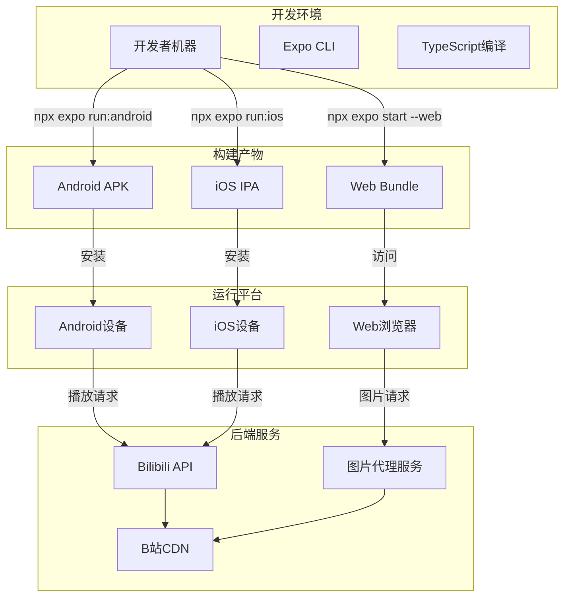
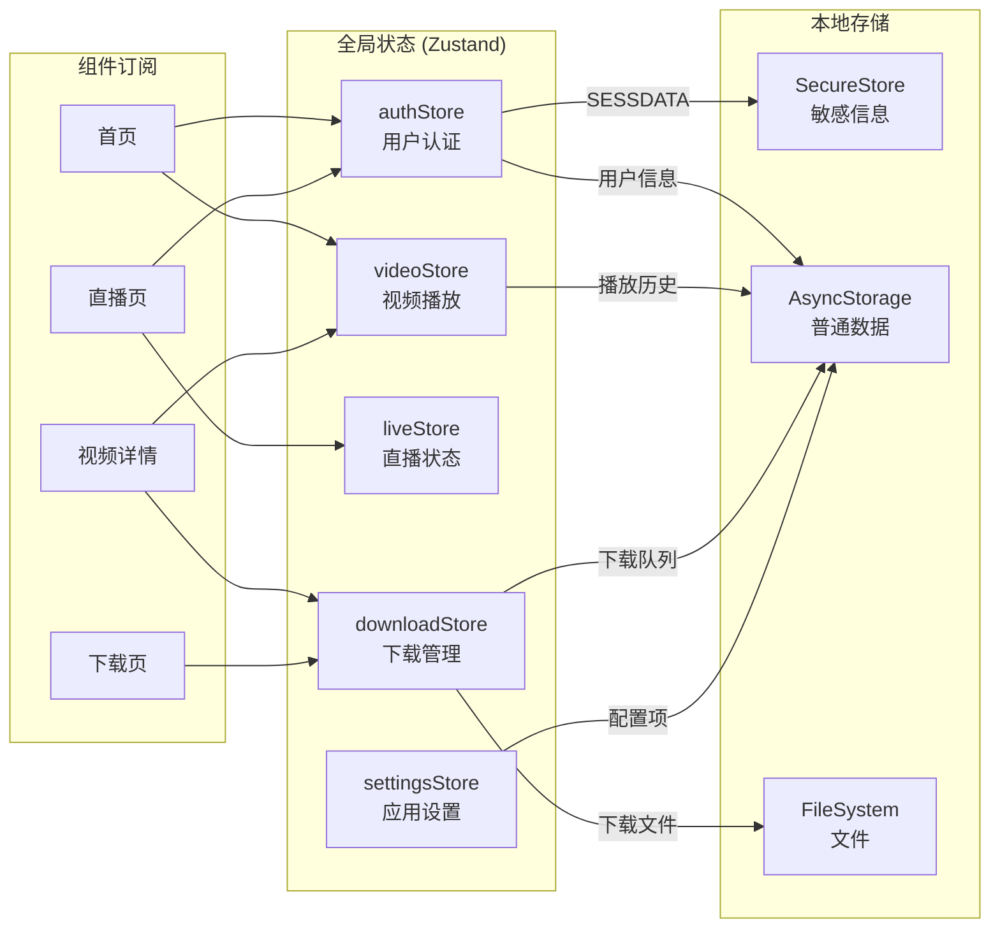

# JKVideo 架构图

## 1. 系统整体架构图

```mermaid
graph TB
    subgraph 前端表现层["前端表现层 (React Native / Expo)"]
        subgraph 页面层["页面层 (app/)"]
            Index["首页 index.tsx"]
            Video["视频详情 video/[bvid].tsx"]
            Live["直播详情 live/[roomId].tsx"]
            Search["搜索页 search.tsx"]
            Downloads["下载页 downloads.tsx"]
            Settings["设置页 settings.tsx"]
        end

        subgraph 组件层["组件层 (components/)"]
            VideoPlayer["NativeVideoPlayer"]
            LivePlayer["LivePlayer"]
            DanmakuList["DanmakuList"]
            DanmakuOverlay["DanmakuOverlay"]
            BigVideoCard["BigVideoCard"]
            MiniPlayer["MiniPlayer"]
            LoginModal["LoginModal"]
            LanShareModal["LanShareModal"]
        end
    end

    subgraph 业务逻辑层["业务逻辑层 (hooks/ + store/)"]
        subgraph Hooks["Hooks层"]
            useVideoList["useVideoList"]
            useVideoDetail["useVideoDetail"]
            useLiveDanmaku["useLiveDanmaku"]
            useDownload["useDownload"]
            useSearch["useSearch"]
        end

        subgraph Store["Zustand状态管理"]
            authStore["authStore 认证"]
            videoStore["videoStore 播放"]
            liveStore["liveStore 直播"]
            downloadStore["downloadStore 下载"]
            settingsStore["settingsStore 设置"]
        end
    end

    subgraph 服务层["服务层 (services/ + utils/)"]
        subgraph Services["服务层"]
            api["api.ts Bilibili API"]
            types["types.ts 类型定义"]
        end

        subgraph Utils["工具层"]
            wbi["wbi.ts WBI签名"]
            dash["dash.ts DASH处理"]
            buildMpd["buildMpd.ts MPD构建"]
            danmaku["danmaku.ts 弹幕解析"]
            format["format.ts 格式化"]
            cache["cache.ts 缓存"]
            secureStorage["secureStorage.ts 安全存储"]
            lanServer["lanServer.ts 局域网服务"]
        end
    end

    subgraph 底层依赖["底层依赖"]
        RN["React Native 0.83"]
        Expo["Expo SDK 55"]
        Video["react-native-video"]
        WebView["react-native-webview"]
        AsyncStorage["AsyncStorage"]
        SecureStore["expo-secure-store"]
        Axios["Axios"]
    end

    Index --> useVideoList
    Video --> useVideoDetail
    Video --> useDownload
    Live --> useLiveDanmaku
    Search --> useSearch

    useVideoList --> api
    useVideoDetail --> api
    useLiveDanmaku --> api
    useDownload --> api
    useSearch --> api

    api --> wbi
    api --> types

    VideoPlayer --> dash
    VideoPlayer --> buildMpd
    VideoPlayer --> danmaku

    authStore --> SecureStore
    downloadStore --> AsyncStorage

    VideoPlayer --> Video
    DanmakuOverlay --> Video
    MiniPlayer --> Video
    BigVideoCard --> Index

    wbi --> RN
    Video --> Expo
```

## 2. 核心数据流图

```mermaid
sequenceDiagram
    participant User as 用户
    participant App as JKVideo App
    participant Hook as useVideoDetail
    participant API as api.ts
    participant WBI as wbi.ts
    participant Bilibili as Bilibili API

    User->>App: 进入视频详情页
    App->>Hook: 调用useVideoDetail(bvid)
    Hook->>API: getVideoDetail(bvid)
    Hook->>API: getPlayUrl(bvid, cid, qn)

    API->>WBI: signWbi(params)
    WBI-->>API: 返回签名参数

    API->>Bilibili: 发送请求
    Bilibili-->>API: 返回playData(DASH)

    API-->>Hook: 返回PlayUrlResponse
    Hook-->>App: 返回视频信息

    App->>dash: buildDashMpdUri(playData, qn)
    dash-->>App: 返回本地mpd文件URI

    App->>VideoPlayer: 传入mpd URI
    VideoPlayer->>VideoPlayer: 渲染原生播放器
    VideoPlayer-->>User: 显示视频画面
```

### DASH播放数据流

```mermaid
flowchart LR
    A["B站API响应<br/>PlayUrlResponse"] --> B["dash.ts<br/>buildDashMpdUri"]
    B --> C["生成MPD XML<br/>包含video/audio流"]
    C --> D["FileSystem<br/>写入临时文件"]
    D --> E["返回file:// URI"]
    E --> F["react-native-video<br/>type: mpd"]
    F --> G["ExoPlayer解码<br/>DASH流播放"]
```

## 3. 模块关系图

```mermaid
classDiagram
    class AuthStore {
        +sessdata: string
        +uid: string
        +isLoggedIn: boolean
        +login()
        +logout()
        +restore()
    }

    class VideoStore {
        +currentBvid: string
        +currentTime: number
        +isFullscreen: boolean
    }

    class DownloadStore {
        +downloads: DownloadItem[]
        +addDownload()
        +removeDownload()
    }

    class LiveStore {
        +currentRoomId: number
        +isPlaying: boolean
    }

    class SettingsStore {
        +defaultQn: number
        +danmakuEnabled: boolean
        +autoPlay: boolean
    }

    AuthStore --> SecureStorage : 使用
    VideoStore --> VideoPlayer : 控制
    DownloadStore --> FileSystem : 读写
    LiveStore --> WebSocket : 直播弹幕

    class NativeVideoPlayer {
        +playData: PlayUrlResponse
        +qualities: Quality[]
        +currentQn: number
        +onQualityChange()
        +onFullscreen()
    }

    class DanmakuOverlay {
        +danmakus: DanmakuItem[]
        +currentTime: number
        +visible: boolean
    }

    class DanmakuList {
        +danmakus: DanmakuItem[]
        +currentTime: number
        +onToggle()
    }

    VideoPlayer --> DanmakuOverlay : 同步时间
    VideoPlayer --> DanmakuList : 同步弹幕
```

## 4. 用户交互流程图

```mermaid
flowchart TD
    A[启动App] --> B{已登录?}
    B -->|否| C[显示登录入口]
    C --> D[扫码/手动登录]
    D --> E[保存SESSDATA]
    E --> F[获取用户信息]

    B -->|是| F

    F --> G[首页加载]
    G --> H[热门/直播Tab切换]
    H --> I[点击视频卡片]
    I --> J[进入视频详情]
    J --> K[选择清晰度]
    K --> L[播放DASH流]
    L --> M[弹幕同步显示]

    M --> N{操作选择}
    N -->|快进| O[拖动进度条]
    O --> L
    N -->|切换清晰度| K
    N -->|全屏| P[全屏播放]
    P --> M
    N -->|下载| Q[添加到下载队列]

    H --> R[点击直播卡片]
    R --> S[进入直播间]
    S --> T[加载HLS流]
    T --> U[WebSocket接收弹幕]
    U --> V[实时弹幕显示]
```

### 扫码登录流程

```mermaid
sequenceDiagram
    participant User as 用户
    participant App as App
    participant API as api.ts
    participant Auth as authStore
    participant Secure as SecureStore

    User->>App: 点击登录
    App->>API: generateQRCode()
    API-->>App: 返回qrcode_key
    App->>App: 渲染二维码

    loop 轮询(2s)
        App->>API: pollQRCode(qrcode_key)
        API-->>App: {code: 0, cookie: "..."}

        alt 扫码成功
            App->>Auth: login(sessdata)
            Auth->>Secure: setSecure('SESSDATA')
            Secure-->>Auth: 保存成功
            Auth-->>App: 更新登录状态
            App->>App: 关闭登录弹窗
        else 等待扫码
            App->>App: 继续轮询
        else 超时
            App->>App: 显示超时提示
        end
    end
```

## 5. 组件层级图

```mermaid
graph TD
    subgraph 根组件["根组件"]
        App["App.tsx"]
        Layout["app/_layout.tsx"]
    end

    Layout --> Index["首页"]
    Layout --> Video["视频详情"]
    Layout --> Live["直播详情"]
    Layout --> Search["搜索"]
    Layout --> Downloads["下载管理"]
    Layout --> Settings["设置"]

    Index --> NavBar["导航栏"]
    Index --> Pager["PagerView"]
    Index --> LoginModal["LoginModal"]

    Pager --> HotList["热门列表"]
    Pager --> LiveList["直播列表"]

    HotList --> BigVideoCard["BigVideoCard"]
    HotList --> VideoCard["VideoCard"]
    HotList --> LiveCard["LiveCard"]

    Video --> VideoPlayer["NativeVideoPlayer"]
    Video --> Controls["播放控制栏"]
    Video --> Danmaku["DanmakuOverlay"]
    Video --> Info["视频信息"]
    Video --> Comments["DanmakuList"]

    VideoPlayer --> ProgressBar["进度条"]
    VideoPlayer --> ThumbPreview["缩略图预览"]
    VideoPlayer --> QualityModal["清晰度选择"]

    Live --> LivePlayer["LivePlayer"]
    Live --> LiveDanmaku["LiveDanmakuList"]
    Live --> GiftBar["礼物栏"]

    Downloads --> DownloadList["下载列表"]
    DownloadList --> DownloadItem["DownloadItem"]
    DownloadItem --> LanShare["LanShareModal"]

    subgraph MiniPlayer["迷你播放器"]
        MiniVideo["MiniVideoPlayer"]
        MiniProgress["MiniProgressBar"]
    end

    VideoPlayer -.->|退出详情页| MiniPlayer
    LivePlayer -.->|退出直播间| MiniPlayer
```

## 6. 部署架构图

```mermaid
graph TB
    subgraph 开发环境["开发环境"]
        Dev["开发者机器"]
        ExpoCLI["Expo CLI"]
        TypeScript["TypeScript编译"]
    end

    subgraph 构建产物["构建产物"]
        Android["Android APK"]
        iOS["iOS IPA"]
        Web["Web Bundle"]
    end

    subgraph 运行平台["运行平台"]
        AndroidDevice["Android设备"]
        iOSDevice["iOS设备"]
        Browser["Web浏览器"]
    end

    subgraph 后端服务["后端服务"]
        Bilibili["Bilibili API"]
        CDN["B站CDN"]
        ImageProxy["图片代理服务"]
    end

    Dev -->|npx expo run:android| Android
    Dev -->|npx expo run:ios| iOS
    Dev -->|npx expo start --web| Web

    Android -->|安装| AndroidDevice
    iOS -->|安装| iOSDevice
    Web -->|访问| Browser

    AndroidDevice -->|播放请求| Bilibili
    iOSDevice -->|播放请求| Bilibili
    Browser -->|图片请求| ImageProxy

    Bilibili --> CDN
    ImageProxy --> CDN
```

## 7. 状态管理架构

```mermaid
flowchart LR
    subgraph 全局状态["全局状态 (Zustand)"]
        auth["authStore<br/>用户认证"]
        video["videoStore<br/>视频播放"]
        live["liveStore<br/>直播状态"]
        download["downloadStore<br/>下载管理"]
        settings["settingsStore<br/>应用设置"]
    end

    subgraph 本地存储["本地存储"]
        Secure["SecureStore<br/>敏感信息"]
        Async["AsyncStorage<br/>普通数据"]
        FileSystem["FileSystem<br/>文件"]
    end

    auth -->|SESSDATA| Secure
    auth -->|用户信息| Async
    video -->|播放历史| Async
    download -->|下载队列| Async
    download -->|下载文件| FileSystem
    settings -->|配置项| Async

    subgraph 组件订阅["组件订阅"]
        IndexPage["首页"]
        VideoPage["视频详情"]
        LivePage["直播页"]
        DownloadsPage["下载页"]
    end

    IndexPage --> auth
    IndexPage --> video
    VideoPage --> video
    VideoPage --> download
    LivePage --> live
    LivePage --> auth
    DownloadsPage --> download
```
