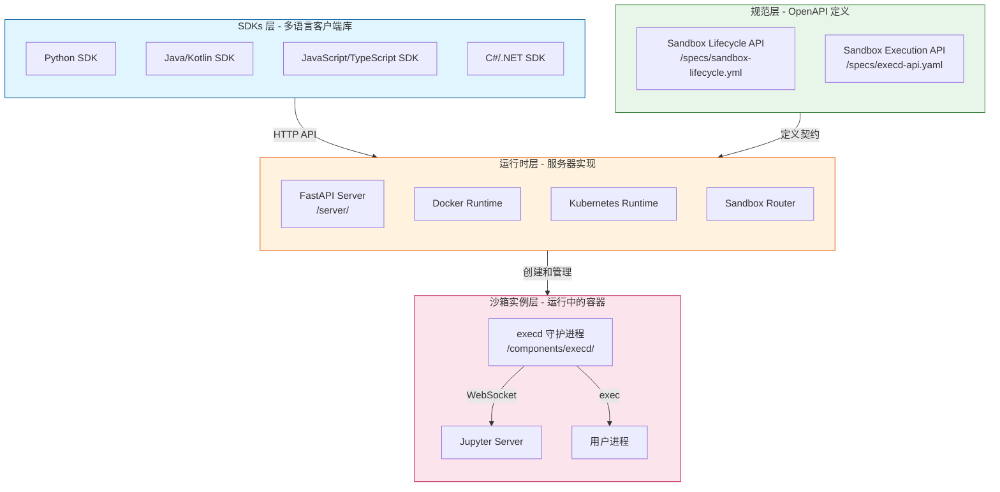
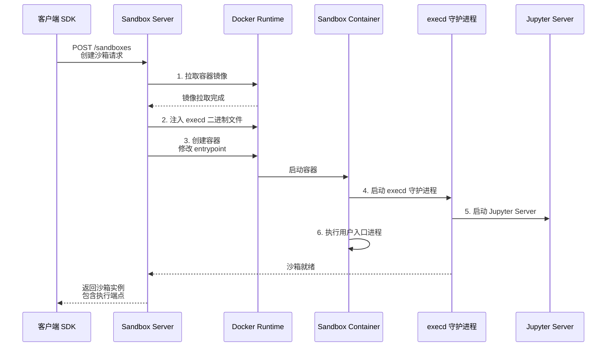
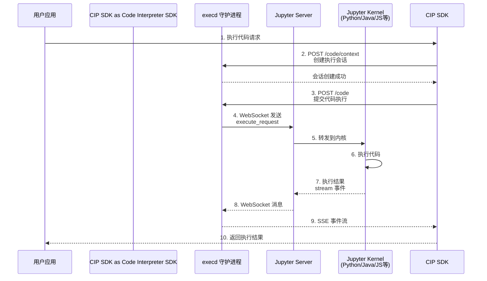
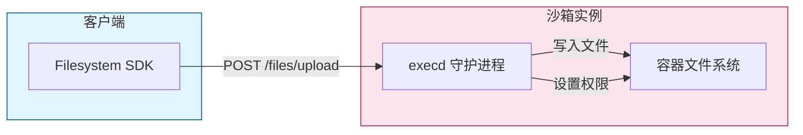
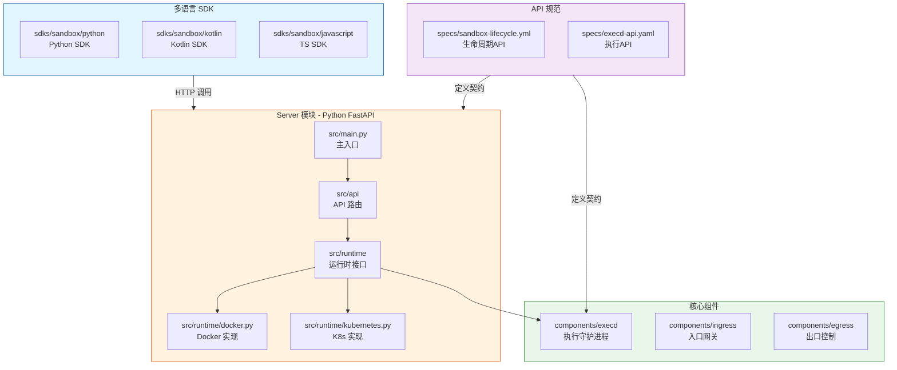
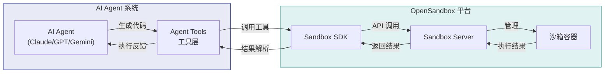
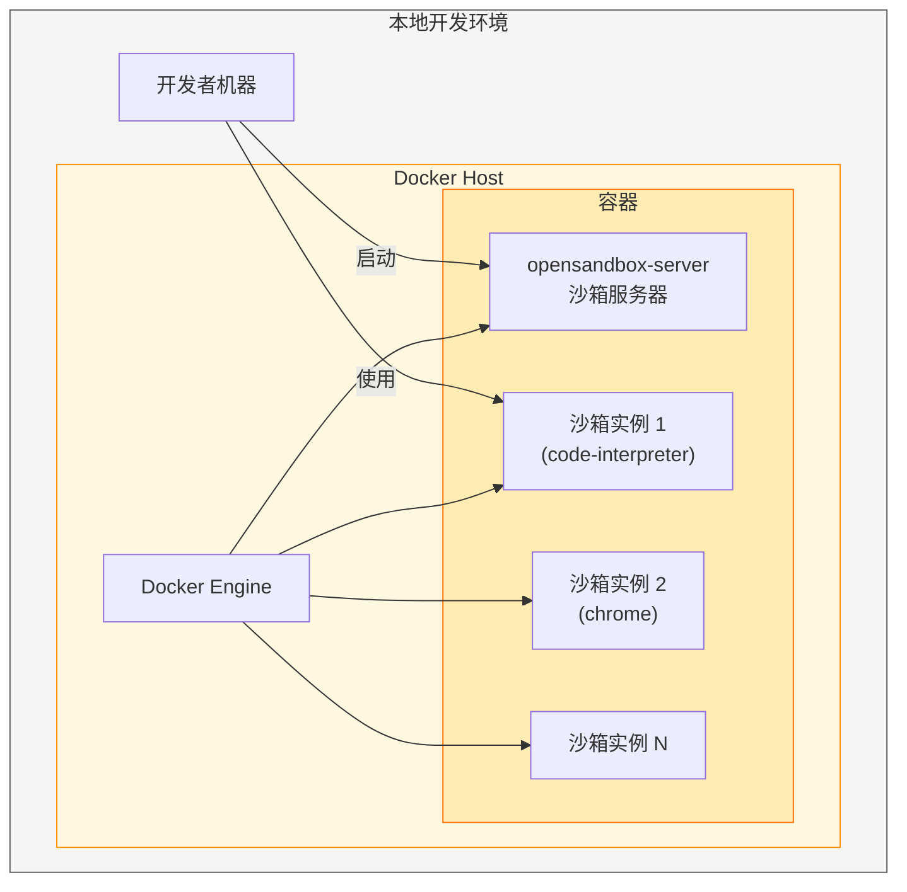
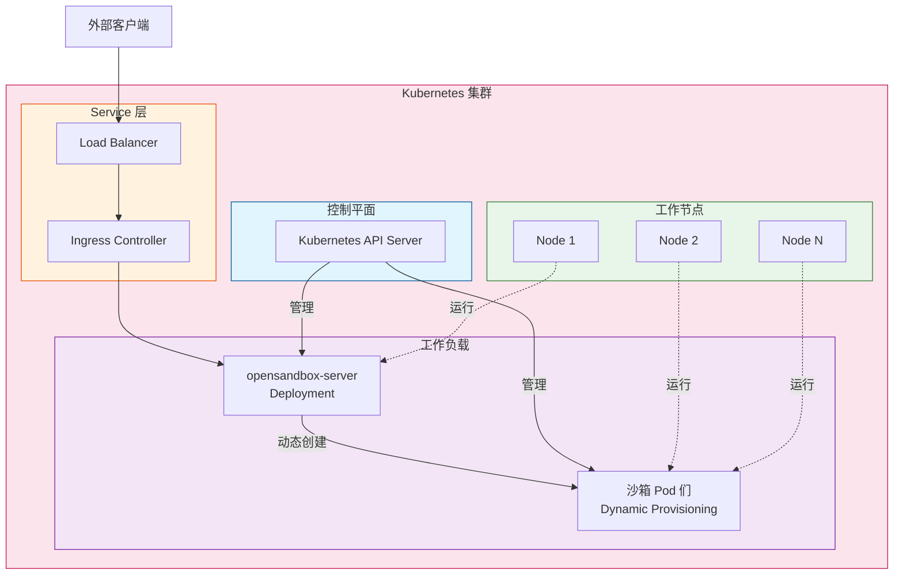
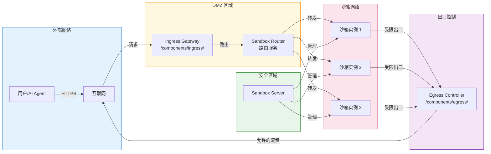
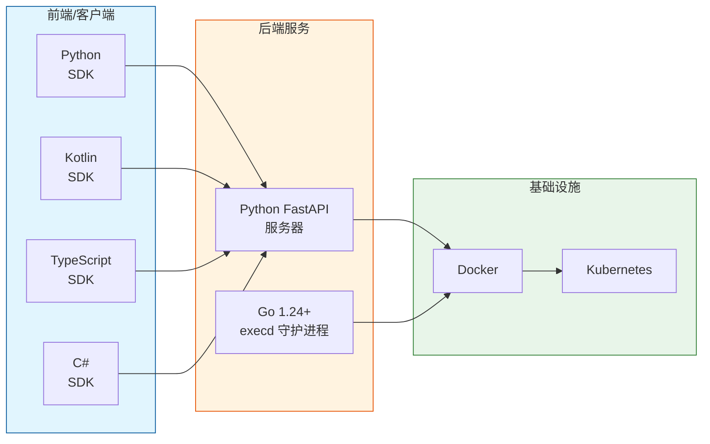

# OpenSandbox 架构详解

本文档通过 Mermaid 图表从多个角度展示 OpenSandbox 的系统架构，帮助开发者深入理解各组件之间的关系和数据流转方式。

## 系统整体架构图

OpenSandbox 采用四层架构设计，从上到下依次为 SDK 层、规范层、运行时层和沙箱实例层。各层之间通过 HTTP API 进行通信，职责边界清晰，便于独立扩展和维护。



## 核心数据流图

OpenSandbox 中的数据流主要分为三类：沙箱创建流程、代码执行流程和文件操作流程。这些流程展示了系统内部各组件如何协同工作。

### 沙箱创建流程

当用户通过 SDK 发起创建沙箱请求时，系统会经历一系列操作来完成沙箱实例的初始化。以下流程图展示了从请求创建到沙箱就绪的完整过程：



### 代码执行流程

代码执行是 OpenSandbox 的核心功能之一。通过 Code Interpreter SDK，用户可以在沙箱中执行多语言代码。以下流程图展示了代码从提交到返回结果的完整过程：



### 文件操作流程

文件操作通过 Filesystem SDK 提供，支持上传、下载、搜索等多种操作。以下是文件上传的流程：



## 类与模块关系图

OpenSandbox 的代码结构清晰，主要分为服务端、SDK、组件和沙箱实现几个大部分。以下图表展示了各模块之间的依赖关系：



## 用户交互流程图

不同的用户场景对应着不同的交互流程。以下图表展示了典型用户场景下，系统各组件如何响应用户操作。

### 基础沙箱操作流程

基础沙箱操作包括创建、使用和销毁三个阶段。以下流程图展示了完整的交互序列：

```mermaid
flowchart TD
    Start([用户开始]) --> Create["创建沙箱<br/>Sandbox.create()"]

    Create -->|POST /sandboxes| Server{"Server 处理"}

    Server -->|拉取镜像| Docker["Docker Hub<br/>或私有仓库"]
    Docker -->|返回镜像| Server
    Server -->|创建容器| Docker
    Docker -->|容器运行| Running[沙箱运行中]

    Running --> Use["使用沙箱"]

    Use --> Commands["执行命令<br/>sandbox.commands.run()"]
    Commands -->|POST /command| Execd
    Execd -->|返回结果| Commands

    Use --> Files["文件操作<br/>sandbox.files.read/write"]
    Files -->|POST /files/*| Execd
    Execd -->|返回结果| Files

    Use --> Code["代码执行<br/>interpreter.codes.run()"]
    Code -->|POST /code| Execd
    Execd -->|Jupyter协议| Jupyter["Jupyter Server"]
    Jupyter -->|返回结果| Execd
    Execd -->|SSE流| Code

    Use --> Destroy["销毁沙箱<br/>sandbox.kill()"]
    Destroy -->|DELETE /sandboxes/{id}| Server
    Server -->|清理容器| Docker

    Destroy --> End([流程结束])

    style Start fill:#e3f2fd
    style Running fill:#c8e6c9
    style End fill:#ffcdd2
```

### AI Agent 集成场景

OpenSandbox 广泛用于 AI Agent 的代码执行场景。以下图表展示了典型的集成模式：



## 部署架构图

OpenSandbox 支持多种部署模式，从本地开发到大规模生产环境都有完善的解决方案。

### Docker 本地部署架构

对于本地开发和测试环境，Docker 部署是最简单的方式：



### Kubernetes 分布式部署架构

对于大规模生产环境，Kubernetes 部署提供了水平扩展和高可用能力：



## 网络架构图

OpenSandbox 的网络架构设计考虑了安全性和灵活性，提供了入口网关和出口控制两层的网络策略。

### 整体网络拓扑



## 技术栈概览

OpenSandbox 在技术选型上采用了多种编程语言和框架，以充分发挥各技术的优势：



## 总结

通过以上多个维度的架构图表，我们可以清晰地看到 OpenSandbox 的设计理念和实现细节。四层架构确保了各组件之间的职责分离，协议优先的设计使得多语言 SDK 和自定义运行时成为可能，完善的数据流设计保证了代码执行、文件操作等核心功能的稳定可靠。无论是本地开发测试还是大规模生产部署，OpenSandbox 都能提供合适的解决方案。
