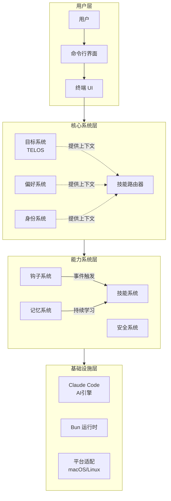
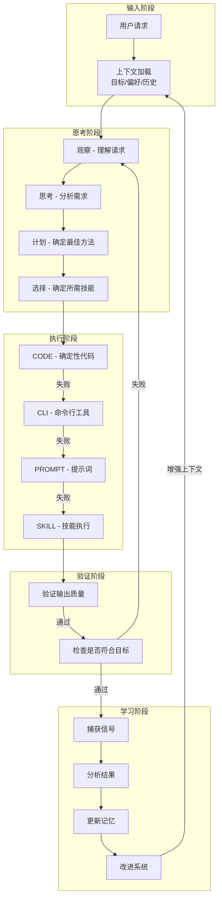
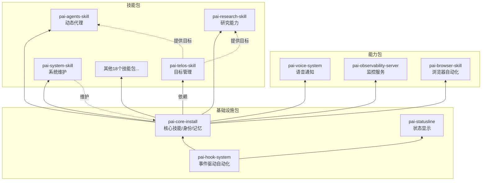
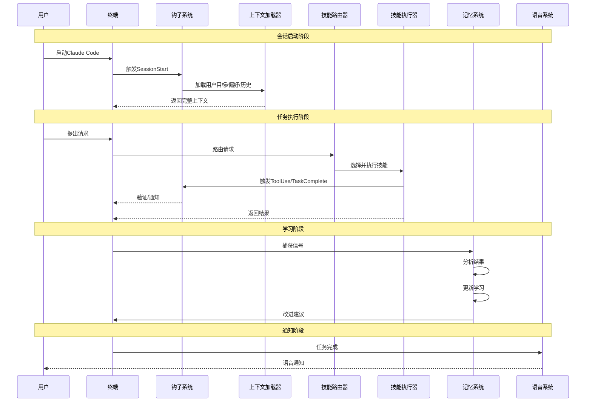
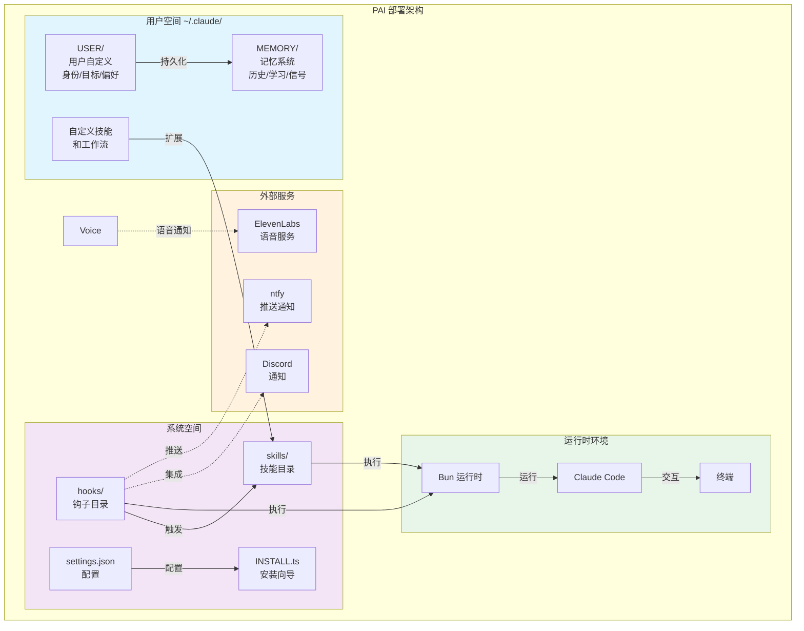
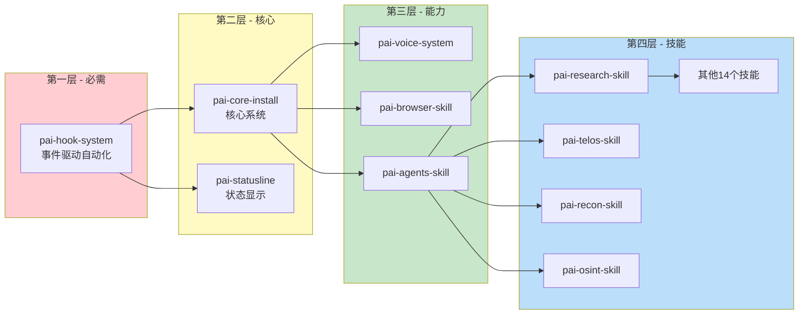
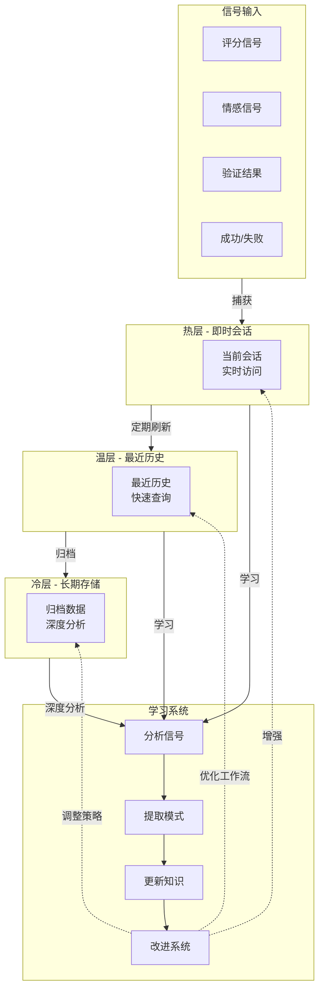
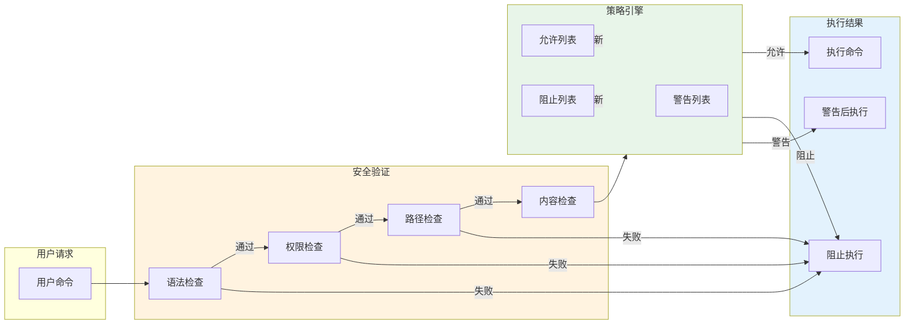

# Personal AI Infrastructure 架构文档

## 系统整体架构

PAI采用分层架构设计，从底层到顶层依次为：基础设施层提供核心运行环境（Claude Code/Bun/终端），其上构建持久记忆系统、模块化技能系统、事件驱动钩子系统，以及最顶层的目标理解和用户交互层。这种架构确保了系统的可扩展性和模块化特性。

## 核心数据流

PAI的数据流遵循科学方法循环：观察→思考→计划→执行→验证→学习→改进。系统通过记忆系统捕获每次交互的信号（评分、情感、成功、失败），这些信号反馈到学习循环中，使系统随着时间推移不断优化。

## 模块关系图

PAI的模块化设计通过包（Pack）系统实现，每个包都是独立的功能单元。包之间存在依赖关系：钩子系统是基础，其他所有包都依赖它；核心安装包提供身份、路由和记忆功能；技能包提供具体能力；其他系统包提供增强功能。

## 用户交互流程

用户与PAI的交互遵循一个循环流程：启动会话时加载用户上下文和目标，用户提出请求后系统通过技能路由器选择合适的技能，执行过程中钩子监控系统状态，任务完成后学习系统捕获结果信号，最终系统自我改进以更好地服务用户。

## 部署架构

PAI采用本地部署模式，运行在用户的终端环境中。系统支持macOS和Linux平台，通过Bun运行时执行。部署结构分为用户空间和系统空间，用户自定义存储在USER目录，系统升级时用户数据不受影响，确保了数据的安全性和可移植性。

## 包依赖关系

PAI的包系统具有明确的依赖层次。基础设施包构成系统的基石，技能包基于基础设施构建。安装顺序至关重要：钩子系统必须首先安装，因为它是所有其他功能的基础；核心安装包提供身份、路由和记忆功能；之后才能安装技能包。

## 记忆系统架构

PAI的记忆系统采用三层架构设计：热层存储当前会话的即时信息，温层保存最近的历史记录和学习成果，冷层归档长期数据。系统通过信号捕获机制持续收集用户反馈（评分、情感、验证结果），这些信号经过分析后用于更新学习，最终实现系统的自我改进。

## 安全架构

PAI采用多层安全策略，在系统级别和用户级别都定义了安全策略。安全钩子在命令执行前进行验证，阻止危险操作的同时允许正常工作流通过。这种设计确保用户无需使用--dangerously-skip-permissions标志也能获得不间断的体验。

