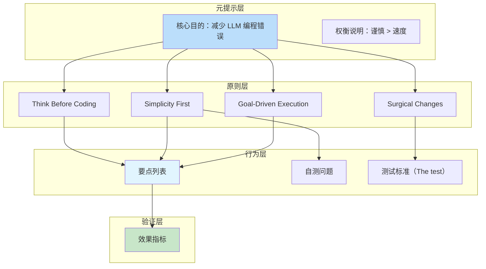
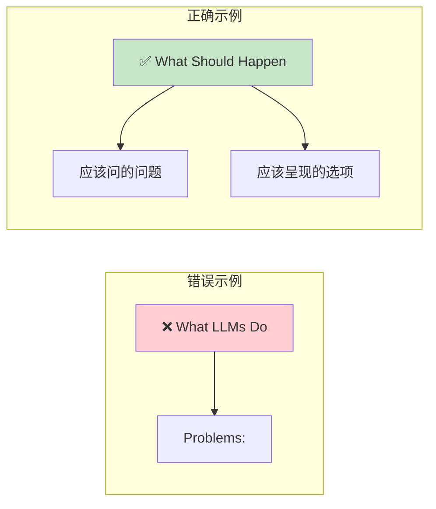

# Karpathy 启发式 Claude Code 指南：提示词深度分析

## 1. 提示词位置概览

本项目本质上是一个**行为指导型提示词工程**，核心提示词分布在以下文件中：

| 文件 | 角色 | 提示词类型 |
|------|------|-----------|
| `CLAUDE.md` | 主提示词（精简版） | 系统级行为指南 |
| `SKILL.md` | 技能定义 | 结构化行为规范 |
| `README.md` | 背景与说明 | 元信息与使用指南 |
| `EXAMPLES.md` | 案例库 | 正误对比示例 |

---

## 2. 核心提示词内容分析

### 2.1 CLAUDE.md（主提示词）

```markdown
# CLAUDE.md

Behavioral guidelines to reduce common LLM coding mistakes. Merge with project-specific instructions as needed.

**Tradeoff:** These guidelines bias toward caution over speed. For trivial tasks, use judgment.

## 1. Think Before Coding

**Don't assume. Don't hide confusion. Surface tradeoffs.**

Before implementing:
- State your assumptions explicitly. If uncertain, ask.
- If multiple interpretations exist, present them - don't pick silently.
- If a simpler approach exists, say so. Push back when warranted.
- If something is unclear, stop. Name what's confusing. Ask.

## 2. Simplicity First

**Minimum code that solves the problem. Nothing speculative.**

- No features beyond what was asked.
- No abstractions for single-use code.
- No "flexibility" or "configurability" that wasn't requested.
- No error handling for impossible scenarios.
- If you write 200 lines and it could be 50, rewrite it.

Ask yourself: "Would a senior engineer say this is overcomplicated?" If yes, simplify.

## 3. Surgical Changes

**Touch only what you must. Clean up only your own mess.**

When editing existing code:
- Don't "improve" adjacent code, comments, or formatting.
- Don't refactor things that aren't broken.
- Match existing style, even if you'd do it differently.
- If you notice unrelated dead code, mention it - don't delete it.

When your changes create orphans:
- Remove imports/variables/functions that YOUR changes made unused.
- Don't remove pre-existing dead code unless asked.

The test: Every changed line should trace directly to the user's request.

## 4. Goal-Driven Execution

**Define success criteria. Loop until verified.**

Transform tasks into verifiable goals:
- "Add validation" → "Write tests for invalid inputs, then make them pass"
- "Fix the bug" → "Write a test that reproduces it, then make it pass"
- "Refactor X" → "Ensure tests pass before and after"

For multi-step tasks, state a brief plan:
1. [Step] → verify: [check]
2. [Step] → verify: [check]
3. [Step] → verify: [check]

Strong success criteria let you loop independently. Weak criteria ("make it work") require constant clarification.

---

**These guidelines are working if:** fewer unnecessary changes in diffs, fewer rewrites due to overcomplication, and clarifying questions come before implementation rather than after mistakes.
```

### 2.2 SKILL.md（技能定义）

```markdown
---
name: karpathy-guidelines
description: Behavioral guidelines to reduce common LLM coding mistakes. Use when writing, reviewing, or refactoring code to avoid overcomplication, make surgical changes, surface assumptions, and define verifiable success criteria.
license: MIT
---

# Karpathy Guidelines

Behavioral guidelines to reduce common LLM coding mistakes, derived from Andrej Karpathy's observations on LLM coding pitfalls.

**Tradeoff:** These guidelines bias toward caution over speed. For trivial tasks, use judgment.

## 1. Think Before Coding
... [与 CLAUDE.md 相同]

## 2. Simplicity First
... [与 CLAUDE.md 相同]

## 3. Surgical Changes
... [与 CLAUDE.md 相同]

## 4. Goal-Driven Execution
... [与 CLAUDE.md 相同]
```

---

## 3. 提示词设计模式分析

### 3.1 核心设计模式



### 3.2 设计模式详解

#### 模式一：对立约束（Constraint Pairing）

每个原则都包含**正向指导**和**反向禁止**的配对：

| 原则 | 正向指导 | 反向禁止 |
|------|---------|----------|
| Think Before Coding | 询问 | 不要假设 |
| Simplicity First | 最小代码 | 不要投机性设计 |
| Surgical Changes | 精确修改 | 不要改进相邻代码 |
| Goal-Driven | 定义验证点 | 不要模糊处理 |

**设计意图**：通过正反对照，强化边界意识。

#### 模式二：自我检测（Self-Check Questions）

```markdown
Ask yourself: "Would a senior engineer say this is overcomplicated?"
If yes, simplify.
```

```markdown
The test: Every changed line should trace directly to the user's request.
```

**设计意图**：在规则之外提供**元认知检查点**，让 LLM 能在执行过程中自我评估。

#### 模式三：转化公式（Transformation Formula）

```markdown
- "Add validation" → "Write tests for invalid inputs, then make them pass"
- "Fix the bug" → "Write a test that reproduces it, then make it pass"
- "Refactor X" → "Ensure tests pass before and after"
```

**设计意图**：提供**命令式到声明式的转化模板**，让 LLM 学会将模糊任务转化为可验证目标。

#### 模式四：权衡预设（Tradeoff Acknowledgment）

```markdown
**Tradeoff:** These guidelines bias toward caution over speed.
For trivial tasks, use judgment.
```

**设计意图**：预先承认规则的局限性，防止教条化应用。

---

## 4. 变量与模板分析

### 4.1 多步骤计划模板

```markdown
For multi-step tasks, state a brief plan:
1. [Step] → verify: [check]
2. [Step] → verify: [check]
3. [Step] → verify: [check]
```

这是一个**参数化模板**，允许填充：
- `[Step]`：具体操作步骤
- `[check]`：对应的验证条件

### 4.2 任务转化模板

```markdown
"[Imperative Task]" → "[Declarative Goal with Test]"
```

示例：
- `"Add validation"` → `"Write tests for invalid inputs, then make them pass"`
- `"Fix the bug"` → `"Write a test that reproduces it, then make it pass"`

### 4.3 原则结构模板

每个原则遵循统一的结构：

```
[标题 + 核心口号]
[具体行为列表]
[自测问题/标准]
```

---

## 5. 错误示例模式分析

### 5.1 EXAMPLES.md 中的案例结构



### 5.2 案例分类

| 原则 | 错误类型 | 正确做法 |
|------|---------|----------|
| Think Before Coding | 静默假设 | 显式询问 |
| Simplicity First | 策略模式过设计 | 简单函数 |
| Surgical Changes | 顺便重构 | 精准修改 |
| Goal-Driven | 模糊"修复" | 测试优先 |

### 5.3 错误示例精选

#### 隐藏假设案例

```python
# ❌ 错误：假设导出所有用户
def export_users(format='json'):
    users = User.query.all()
    # 隐含假设：导出所有用户
    # 隐含假设：文件保存位置
    # 隐含假设：包含哪些字段
```

```markdown
# ✅ 正确：呈现假设和选项
Before implementing, I need to clarify:

1. **Scope**: Export all users or filtered subset? (privacy implications)
2. **Format**: You mentioned "export" - did you mean:
   - Download file in browser?
   - Background job with email notification?
   - API endpoint returning data?
3. **Fields**: Which user fields? (some might be sensitive)
4. **Volume**: How many users typically? (affects approach)
```

#### 过度复杂化案例

```python
# ❌ 过度工程化：100行策略模式
from abc import ABC, abstractmethod
from enum import Enum
from typing import Protocol, Union
from dataclasses import dataclass

class DiscountStrategy(ABC):
    @abstractmethod
    def calculate(self, amount: float) -> float:
        pass
# ... 100行代码
```

```python
# ✅ 简单优先：一行函数
def calculate_discount(amount: float, percent: float) -> float:
    return amount * (percent / 100)
```

---

## 6. 提示词优化建议

### 6.1 当前优势

1. **简洁性**：每个原则控制在 5-6 个要点
2. **可操作性**：每条都是具体可执行的行为
3. **正误对比**：通过 EXAMPLES.md 提供正误对照
4. **自适应边界**：通过 Tradeoff 声明防止教条化

### 6.2 潜在优化方向

#### 优化一：添加边界条件示例

当前 EXAMPLES.md 主要是通用场景，可以添加**边界条件**处理：

```markdown
## 边界条件

### 当用户要求删除"所有未使用的代码"
- ❌ 不要执行全面的死代码清理
- ✅ 只删除本次修改造成的孤立代码
- 说明原因：[引用 Surgical Changes 原则]
```

#### 优化二：添加冲突解决指南

当四个原则冲突时，提供解决优先级：

```markdown
## 原则冲突解决

当以下情况冲突时，优先级顺序：

1. **Goal-Driven > Simplicity First**
   - 如果验证需要复杂代码，优先保证可验证性

2. **Think Before Coding > Surgical Changes**
   - 如果存在未澄清的假设，优先询问而非修改

3. **Simplicity First > Surgical Changes**
   - 简化重构 > 保持臃肿代码不动
```

#### 优化三：添加效果量化指标

当前只有定性描述，可以添加**量化指标**：

```markdown
## 效果指标

指南生效时的量化标准：

- Diff 行数减少 > 30%（对比未使用指南时）
- 澄清问题在实现前的比例 > 70%
- PR 合并次数因"过度设计"重写的次数 < 10%
```

#### 优化四：添加持续反馈机制

```markdown
## 使用反馈

定期评估指南效果：

1. 每月回顾一次 PR，检查是否有违反原则的情况
2. 记录需要澄清的时刻，分析是否是假设遗漏
3. 评估代码复杂度变化趋势
```

---

## 7. 与其他提示词工程的对比

### 7.1 对比 ReAct 模式

| 维度 | Karpathy Guidelines | ReAct |
|------|---------------------|-------|
| 核心思想 | 行为约束 | 推理-行动交替 |
| 执行方式 | 静态规则 | 动态推理链 |
| 适用场景 | 编程任务 | 复杂推理任务 |
| 透明度 | 高（显式规则） | 中（推理过程可见） |

### 7.2 对比 Chain of Thought

| 维度 | Karpathy Guidelines | CoT |
|------|---------------------|-----|
| 核心思想 | 行为规范化 | 推理步骤显式化 |
| 执行时机 | 每个任务前 | 复杂问题前 |
| 结构化程度 | 高度结构化（4原则） | 半结构化 |
| 学习成本 | 低（规则清晰） | 中（需示例引导） |

### 7.3 独特贡献

1. **问题驱动**：每个规则直接对应观察到的 LLM 问题
2. **行为聚焦**：关注可观察的行为变化，而非内部推理
3. **工程化思维**：借鉴 TDD、工程伦理等成熟方法论
4. **最小干预**：仅在必要时干预，不限制 LLM 的创造力

---

## 8. 总结

Karpathy Guidelines 代表了一种**工程化提示词设计**的思路：

1. **系统性**：四大原则覆盖 LLM 编程的主要问题
2. **可操作性**：每条规则都是可执行的具体行为
3. **自适应**：通过 Tradeoff 和自测问题防止教条化
4. **可验证**：通过 EXAMPLES.md 提供正误对照

这种设计思路对于构建**面向特定任务的 LLM 行为规范**具有重要参考价值。