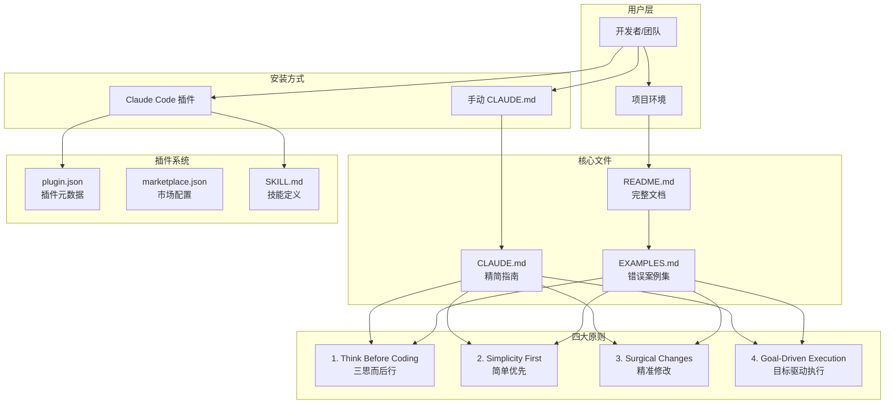
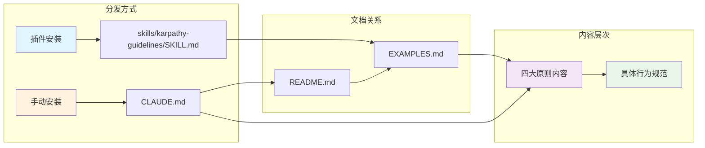
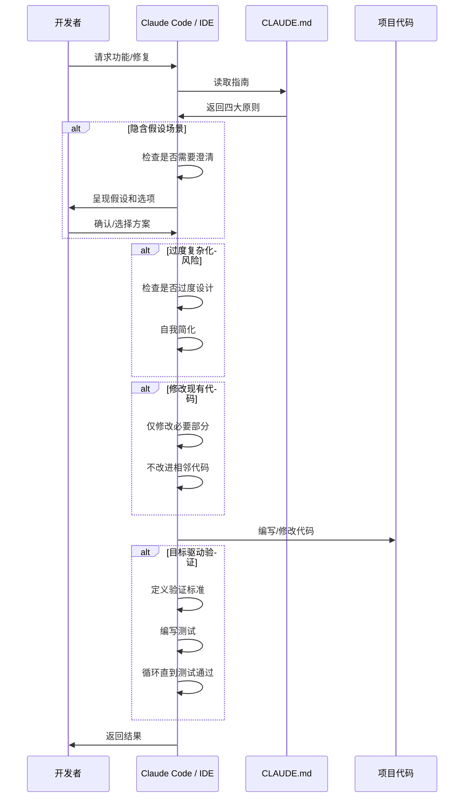
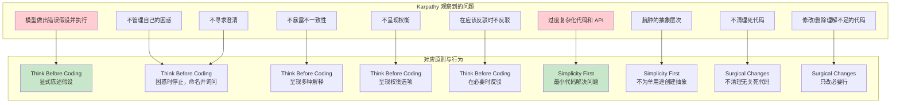

# Karpathy 启发式 Claude Code 指南：架构分析

## 1. 系统整体架构图



### 架构说明

该项目的架构非常扁平，主要分为三个层次：

1. **用户层**：开发者或团队决定安装方式
2. **分发层**：通过插件系统或手动文件方式分发
3. **内容层**：核心指南内容和示例

---

## 2. 文件依赖关系图



### 文件关系说明

| 文件 | 用途 | 被引用 |
|------|------|--------|
| `CLAUDE.md` | 精简版指南，核心内容 | 用户手动安装使用 |
| `README.md` | 完整文档，含背景和安装说明 | 主页文档 |
| `EXAMPLES.md` | 错误案例与正确做法对比 | 详细示例参考 |
| `SKILL.md` | 插件技能定义 | Claude Code 插件系统 |
| `plugin.json` | 插件元数据 | 插件系统配置 |
| `marketplace.json` | 市场分发配置 | 插件市场 |

---

## 3. 四大原则关系图

```mermaid
graph TB
    Root["LLM 编程改进"]

    Root --> Think
    Root --> Simple
    Root --> Surgical
    Root --> Goal

    subgraph "1. Think Before Coding"
        T1[显式陈述假设]
        T2[呈现多种解释]
        T3[在必要时反驳]
        T4[困惑时停止]
    end

    subgraph "2. Simplicity First"
        S1[不添加未请求功能]
        S2[不为单用途创建抽象]
        S3[不添加假想灵活性]
        S4[200行可50行则重写]
    end

    subgraph "3. Surgical Changes"
        SC1[不改进相邻代码]
        SC2[不重构未损坏部分]
        SC3[匹配现有风格]
        SC4[只清理自己造成的混乱]
    end

    subgraph "4. Goal-Driven Execution"
        G1[定义可验证目标]
        G2[测试优先]
        G3[循环直到验证]
        G4[陈述计划+验证点]
    end

    Think --> T1
    Think --> T2
    Think --> T3
    Think --> T4

    Simple --> S1
    Simple --> S2
    Simple --> S3
    Simple --> S4

    Surgical --> SC1
    Surgical --> SC2
    Surgical --> SC3
    Surgical --> SC4

    Goal --> G1
    Goal --> G2
    Goal --> G3
    Goal --> G4

    style Root fill:#bbdefb
    style Think fill:#c8e6c9
    style Simple fill:#ffe0b2
    style Surgical fill:#f8bbd9
    style Goal fill:#b2ebf2
```



### 原则详解

每个原则都包含四个具体行为要求，形成完整的行为指导体系。

---

## 4. 用户交互流程图



### 交互流程说明

用户发起请求后，Claude Code 会：

1. **读取 CLAUDE.md**：加载指南内容
2. **应用四大原则**：在每个环节检查是否符合原则
3. **必要时交互**：当存在歧义或需要权衡时，向用户确认
4. **精准执行**：按照最小改动原则完成代码
5. **验证目标**：确保满足可验证的成功标准

---

## 5. 安装与加载架构图

```mermaid
flowchart LR
    subgraph "插件安装流程"
        A[添加市场] --> B[/plugin marketplace add]
        B --> C[marketplace.json]
        C --> D[/plugin install]
        D --> E[plugin.json]
        E --> F[加载 SKILL.md]
    end

    subgraph "手动安装流程"
        G[下载文件] --> H[curl CLAUDE.md]
        H --> I[CLAUDE.md]
        I --> J[项目根目录]
    end

    subgraph "运行时加载"
        K[Claude Code 启动] --> L{检查插件}
        L -->|有| M[加载 SKILL.md]
        L -->|无| N{检查 CLAUDE.md}
        N -->|有| O[加载 CLAUDE.md]
        N -->|无| P[使用默认行为]
        M --> Q[应用四大原则]
        O --> Q
    end

    style A fill:#e3f2fd
    style G fill:#fff3e0
    style K fill:#f3e5f5
    style Q fill:#e8f5e9
```

---

## 6. 问题-解决方案映射图



### 映射关系总结

| 问题 | 核心原则 | 具体行为 |
|------|---------|----------|
| 错误假设 | Think Before Coding | 显式陈述假设 |
| 隐藏困惑 | Think Before Coding | 困惑时停止并询问 |
| 不寻求澄清 | Think Before Coding | 命名不明确之处 |
| 不暴露权衡 | Think Before Coding | 呈现利弊分析 |
| 过度复杂化 | Simplicity First | 最小代码 |
| 臃肿抽象 | Simplicity First | 抵制过度设计 |
| 乱改代码 | Surgical Changes | 只改必要行 |
| 不清理死代码 | Surgical Changes | 不碰无关代码 |

---

## 7. 示例文档结构图

```mermaid
graph TB
    EXAMPLES[EXAMPLES.md] -->四个原则示例

    subgraph "1. Think Before Coding 示例"
        E1_1[隐藏假设案例]
        E1_2[多种解释案例]
        E1_3[错误 vs 正确对比]
    end

    subgraph "2. Simplicity First 示例"
        E2_1[过度抽象案例]
        E2_2[投机性功能案例]
        E2_3[策略模式 vs 简单函数]
    end

    subgraph "3. Surgical Changes 示例"
        E3_1[顺便重构案例]
        E3_2[风格漂移案例]
        E3_3[精准 vs 过度修改]
    end

    subgraph "4. Goal-Driven Execution 示例"
        E4_1[模糊 vs 可验证目标]
        E4_2[多步骤验证计划]
        E4_3[测试优先案例]
    end

    EXAMPLES --> E1_1
    EXAMPLES --> E1_2
    EXAMPLES --> E1_3
    EXAMPLES --> E2_1
    EXAMPLES --> E2_2
    EXAMPLES --> E2_3
    EXAMPLES --> E3_1
    EXAMPLES --> E3_2
    EXAMPLES --> E3_3
    EXAMPLES --> E4_1
    EXAMPLES --> E4_2
    EXAMPLES --> E4_3

    style EXAMPLES fill:#bbdefb
    style E1_1 fill:#e1f5fe
    style E2_1 fill:#fff8e1
    style E3_1 fill:#fce4ec
    style E4_1 fill:#e0f7fa
```



---

## 总结

该项目的架构设计体现了几个关键原则：

1. **简洁性**：整个系统只有 6 个核心文件
2. **可扩展性**：CLAUDE.md 可与项目特定指南合并
3. **灵活性**：支持插件和手动两种安装方式
4. **层次分明**：从 README 到 CLAUDE.md 到 SKILL.md，内容层层递进
5. **问题导向**：每个原则都直接对应观察到的具体问题