# Chrome DevTools MCP 架构文档

## 一、系统整体架构

### 1.1 架构概览

Chrome DevTools MCP采用了分层架构设计，从上到下依次为：MCP客户端层、MCP服务器层、业务逻辑层和浏览器控制层。这种分层设计使得各层之间的职责清晰，便于维护和扩展。

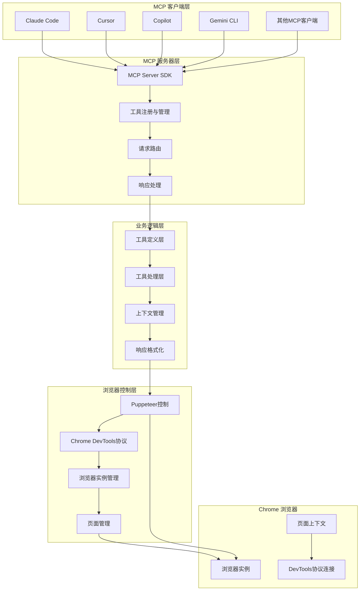

### 1.2 核心组件职责

Chrome DevTools MCP项目由多个核心组件构成，每个组件都有明确的职责范围。入口文件`src/index.ts`负责整个服务器的生命周期管理，包括初始化MCP服务器、创建浏览器上下文、注册工具、处理请求等核心功能。

**入口层组件**

`src/index.ts`作为整个应用的入口点，负责协调各个模块之间的工作。它解析命令行参数，初始化MCP服务器实例，创建浏览器上下文，并根据配置注册相应的工具。该文件还负责处理工具请求的路由和错误处理，确保整个系统能够稳定运行。

**浏览器管理层**

`src/browser.ts`文件封装了所有与浏览器相关的操作。该模块负责启动Chrome浏览器实例、连接到已运行的浏览器，维护浏览器会话，以及处理各种浏览器级别的配置选项。它支持多种连接方式，包括直接启动、远程调试端口连接、WebSocket连接等。

**上下文管理层**

`src/McpContext.ts`是核心的上下文管理组件，负责维护与浏览器会话相关的所有状态信息。它管理页面生命周期、跟踪打开的标签页、提供页面选择和切换功能，以及处理DevTools窗口检测。该组件是连接MCP服务器和浏览器的关键桥梁。

**响应处理层**

`src/McpResponse.ts`负责格式化工具执行结果，将其转换为MCP协议要求的格式。该组件处理文本响应、结构化内容、图像数据等不同类型的返回结果，并提供丰富的格式化选项。

**工具定义层**

`src/tools/`目录包含了所有可用工具的定义和实现。每个工具都被封装为独立的模块，包括输入模式定义、处理逻辑、参数验证等功能。这种模块化设计使得添加新工具变得非常简单。

## 二、核心数据流

### 2.1 工具调用完整流程

当AI编码助手调用Chrome DevTools MCP工具时，请求会经过一系列处理步骤。理解这个流程有助于更好地理解系统的工作原理，以及在遇到问题时进行有效的故障排查。

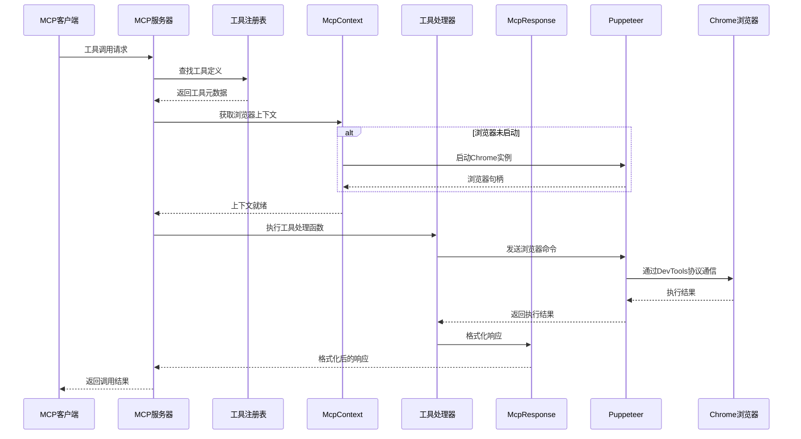

### 2.2 浏览器启动与连接流程

Chrome DevTools MCP支持多种浏览器连接方式，以适应不同的使用场景。理解这些连接方式有助于选择最适合具体需求的配置方案。

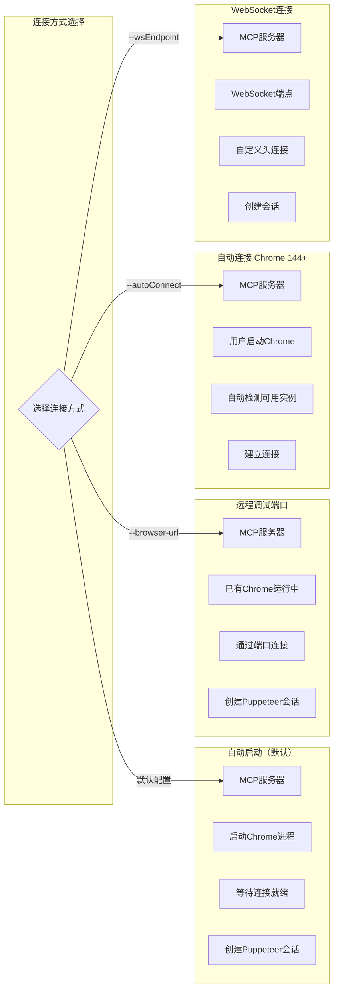

### 2.3 性能分析数据流

性能分析是Chrome DevTools MCP的核心功能之一。该功能涉及多个组件之间的协作，包括性能跟踪记录、跟踪数据处理、CrUX数据获取等步骤。

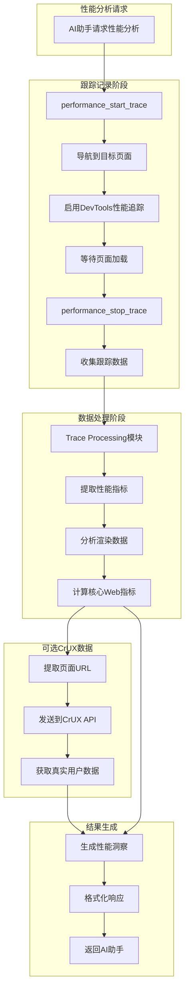

## 三、模块关系图

### 3.1 核心类依赖关系

Chrome DevTools MCP项目中的各个核心类之间存在明确的依赖关系。理解这些依赖关系有助于理解代码结构，以及在进行功能扩展时确保正确的设计决策。

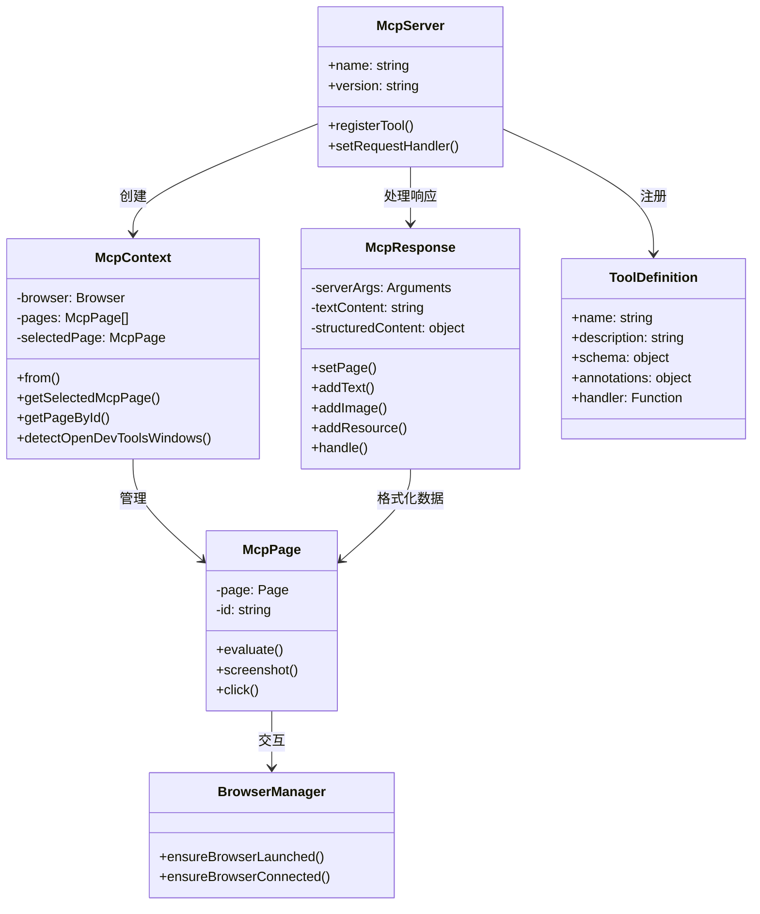

### 3.2 工具分类与组织

Chrome DevTools MCP将29个工具分为6个主要类别，每个类别负责特定功能域。这种分类方式使得工具易于理解和使用，同时也便于按需启用或禁用特定类别的工具。

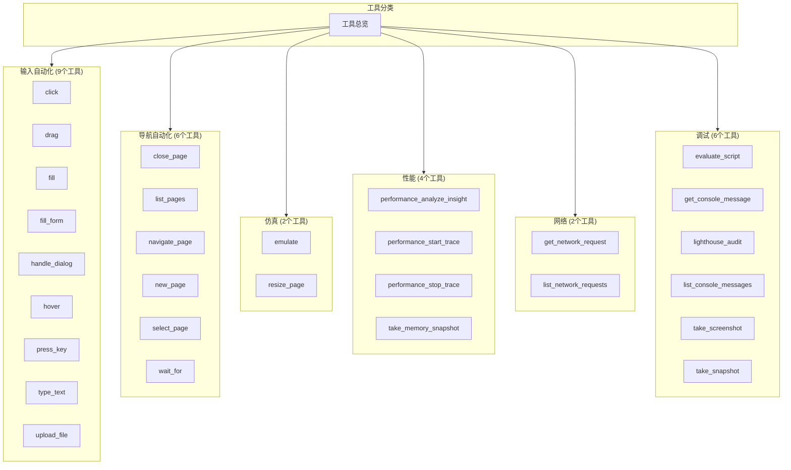

### 3.3 工具处理流程

每个工具在执行时都遵循统一的处理流程，包括参数验证、上下文获取、实际执行、结果格式化等步骤。这种标准化流程确保了工具行为的一致性和可预测性。

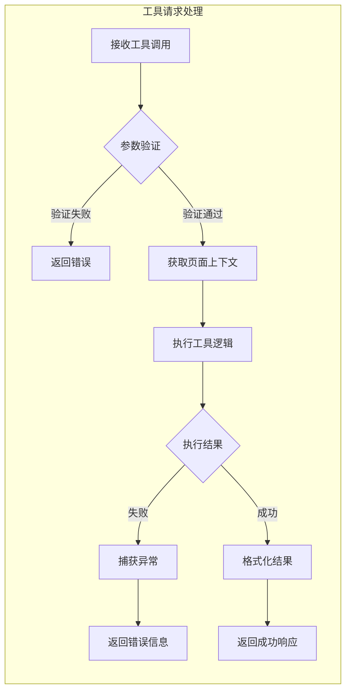

## 四、用户交互流程

### 4.1 典型使用场景流程

Chrome DevTools MCP的主要使用场景是AI编码助手代表用户执行浏览器操作。以下流程图展示了一个典型场景的完整交互过程。

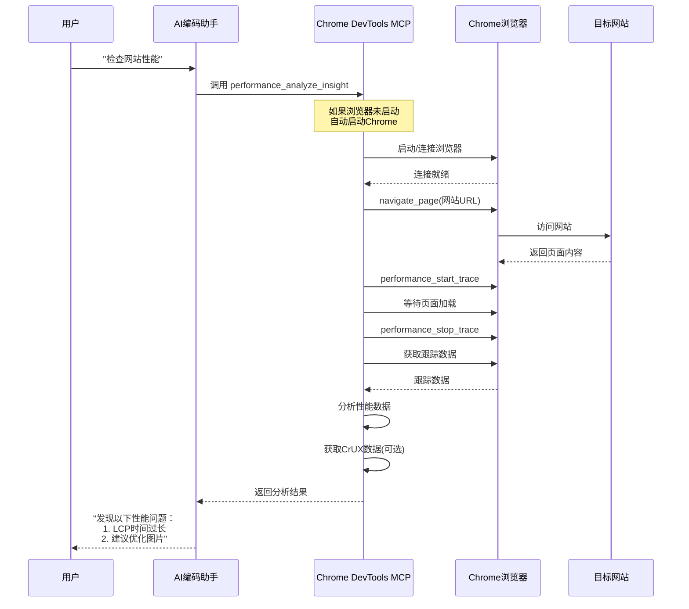

### 4.2 自动化操作流程

自动化操作是Chrome DevTools MCP的另一核心功能场景。以下流程展示了AI如何执行一系列复杂的用户交互操作。

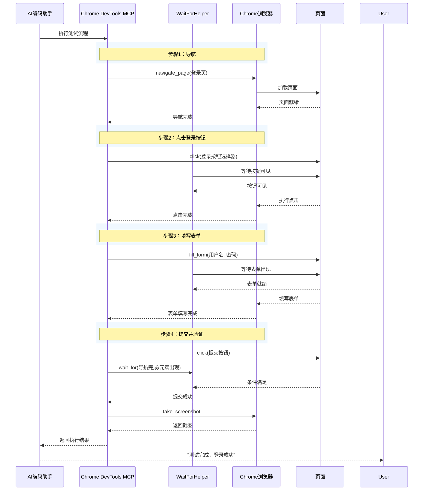

### 4.3 配置与初始化流程

在使用Chrome DevTools MCP之前，需要进行适当的配置。以下流程展示了从配置到首次使用的完整初始化过程。

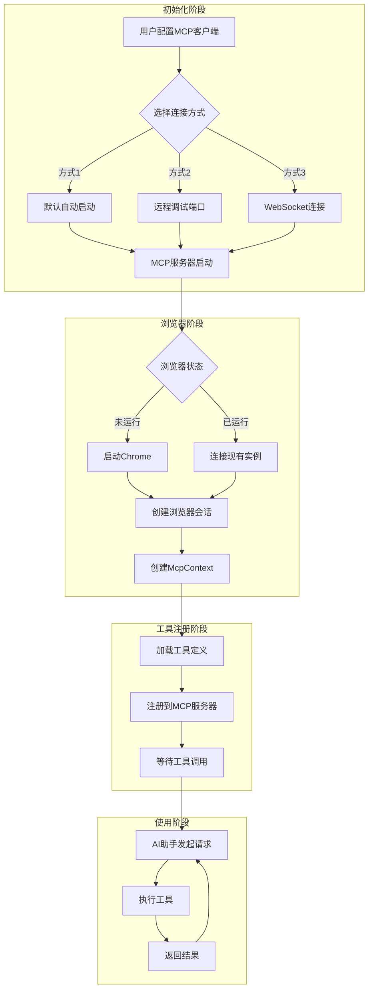

## 五、部署架构

### 5.1 单机部署架构

对于大多数使用场景，Chrome DevTools MCP采用单机部署架构。在这种模式下，MCP服务器和浏览器实例运行在同一台机器上，通过本地进程通信进行交互。

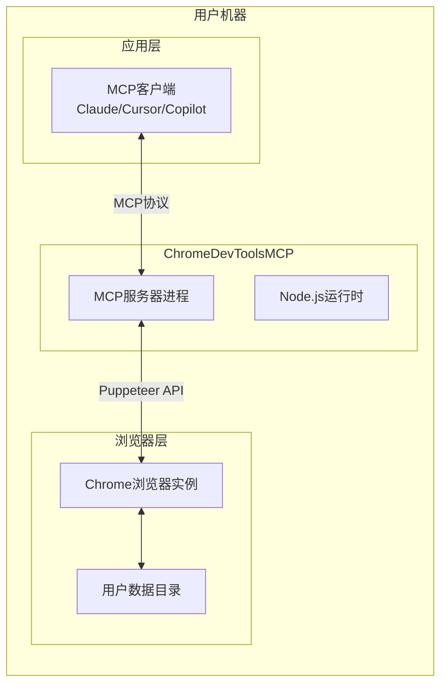

### 5.2 远程浏览器部署架构

在某些特殊场景下，可能需要让MCP服务器连接到远程运行的Chrome浏览器实例。这种架构主要用于沙箱环境、多用户共享浏览器资源等情况。

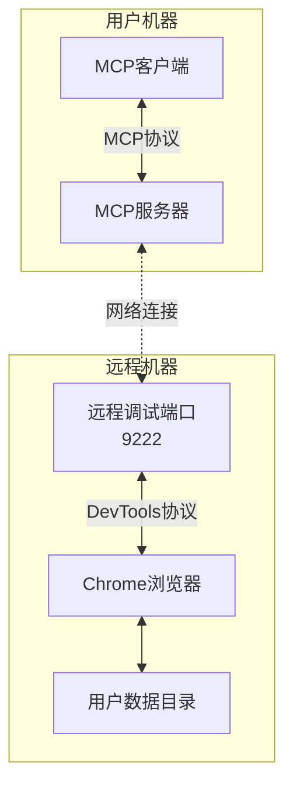

### 5.3 多实例架构

在团队协作或高并发场景下，可能需要运行多个Chrome DevTools MCP实例。这种架构需要注意用户数据目录的管理，以避免实例之间的冲突。

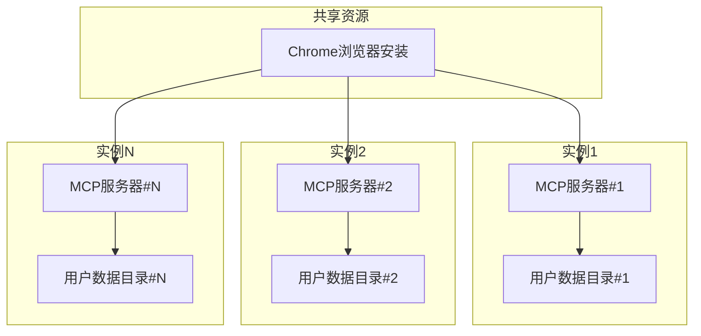

## 六、数据存储与状态管理

### 6.1 用户数据目录管理

Chrome DevTools MCP使用Chrome的用户数据目录来存储浏览器配置、缓存、扩展等数据。理解用户数据目录的管理机制有助于优化使用体验和解决相关问题。

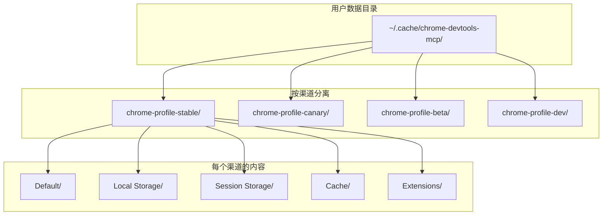

### 6.2 临时隔离模式

使用`--isolated`参数时，系统会创建临时用户数据目录，并在浏览器关闭后自动清理。这种模式适合需要隔离性的使用场景。

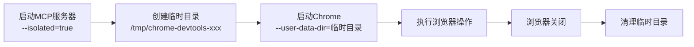

## 七、总结

Chrome DevTools MCP的架构设计体现了现代微服务设计的最佳实践。通过清晰的层次划分、模块化的组件设计、标准化的接口定义，项目实现了高内聚、低耦合的目标。这种架构不仅便于维护和扩展，也为社区贡献新功能和修复问题提供了良好的基础。

理解项目的架构对于有效使用和定制Chrome DevTools MCP至关重要。无论是选择合适的连接方式、配置性能选项，还是排查问题，都需要建立在对系统架构的清晰认识之上。希望本文档能够帮助读者建立这种认识，更好地利用Chrome DevTools MCP提升开发效率。
