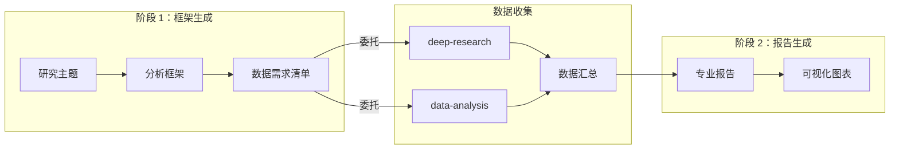

# DeerFlow 提示词分析

## 概述

DeerFlow 的提示词系统采用**技能驱动（Skill-Driven）**的设计理念。与传统的单一系统提示词不同，DeerFlow 通过模块化的技能文件（SKILL.md）定义智能体的能力，每个技能都是一个自包含的工作流程定义。这种设计允许智能体根据任务需求**渐进式加载**相应的技能，而非一次性加载所有提示词，从而保持上下文窗口的高效利用。

---

## 技能系统架构

### 技能文件结构

每个技能文件（SKILL.md）采用统一的结构化格式：

```markdown
---
name: 技能名称
description: 触发条件和功能描述
---

# 技能标题

## 概述
功能说明和使用场景

## 何时使用
触发条件说明

## 核心原则
基础规则定义

## 工作流程
分步骤执行说明

## 示例
代码和示例

## 质量标准
验收标准

## 常见错误
反模式说明
```

### YAML Frontmatter 设计

Frontmatter 包含技能的元数据，用于智能体识别和加载决策：

| 字段 | 类型 | 说明 | 示例 |
|-----|------|-----|------|
| name | string | 技能唯一标识符 | deep-research |
| description | string | 完整功能描述，包含触发条件 | Use this skill when... |

**设计要点**：

- **描述即触发器**：description 字段明确说明了何时应激活该技能
- **语言模型友好**：使用自然语言描述，易于 LLM 理解何时调用
- **分层信息**：name 提供精确匹配，description 提供语义匹配

---

## 核心技能提示词详解

### 1. Deep Research 技能

**文件位置**：`skills/public/deep-research/SKILL.md`

**核心提示词设计**：

```markdown
# Deep Research Skill

## Overview

This skill provides a systematic methodology for conducting
thorough web research. Load this skill BEFORE starting any
content generation task to ensure you gather sufficient
information from multiple angles, depths, and sources.
```

**设计模式分析**：

| 模式 | 说明 | 作用 |
|-----|------|-----|
| **前置加载原则** | 明确要求在使用技能前加载 | 确保研究工作先行，避免空洞内容 |
| **分阶段方法论** | Phase 1 广度探索 - Phase 2 深度钻研 | 系统化研究流程 |
| **多维度覆盖** | Facts/Data、Examples、Cases、Expert Opinions | 确保信息全面性 |
| **时间敏感性** | 利用 `<current_date>` 动态获取当前时间 | 生成时效性强的结果 |

**关键提示词片段**：

```markdown
## Core Principle

**Never generate content based solely on general knowledge.**
The quality of your output directly depends on the quality
and quantity of research conducted beforehand.
A single search query is NEVER enough.
```

**优化要点**：

- 使用**强调语法**（大写、加粗）突出核心原则
- 提供具体的**搜索查询模板**
- 包含**Temporal Awareness**（时间敏感）规则，确保搜索结果的时效性

### 2. Consulting Analysis 技能

**文件位置**：`skills/public/consulting-analysis/SKILL.md`

这是 DeerFlow 中最复杂的技能之一，支持**两阶段工作流程**：

```markdown
# Professional Research Report Skill

## Phase 1: Analysis Framework Generation
Given a research subject, produce a rigorous analysis framework
including chapter skeleton, per-chapter data requirements,
analysis logic, and visualization plan.

## Phase 2: Report Generation
After data has been collected by other skills, synthesize all
inputs into a final polished report.
```

**两阶段设计模式**：



**分析框架选择提示词**：

```markdown
## Framework Selection

| Framework | Description | Best For |
|-----------|-------------|----------|
| **SWOT Analysis** | ... | Brand assessment |
| **PEST/PESTEL Analysis** | ... | Macro-environment |
| **Porter's Five Forces** | ... | Industry landscape |
| **STP Analysis** | ... | Market segmentation |
| **BCG Matrix** | ... | Product portfolio |
```

**数据真实性协议**：

```markdown
## Data Authenticity Protocol

**Strict Adherence Rule**: All data presented in the report
and visualized in charts MUST be derived directly from the
provided Data Summary or External Search Findings.

- **NO Hallucinations**: Do not invent, estimate, or simulate data.
- **Traceable Sources**: Every major claim must be traceable.
```

**"So What" 洞察链**：

```markdown
## Insight Depth (The "So What" Chain)

Every insight must connect **Data - User Psychology - Strategy Implication**:

- Bad: "Females are 60%. Strategy: Target females."

- Good: "Females constitute 60% with a high TGI of 180.
This suggests the purchase decision is driven by aesthetic
and social validation rather than pure utility.
Consequently, media spend should pivot towards visual-heavy
platforms to maximize CTR."
```

### 3. Data Analysis 技能

**文件位置**：`skills/public/data-analysis/SKILL.md`

**设计特点**：

| 特点 | 说明 |
|-----|------|
| **工具封装** | 将 Python 脚本封装为可调用工具 |
| **SQL 语法支持** | 完整的 DuckDB SQL 分析能力 |
| **多文件支持** | Excel 多 Sheet、跨文件 JOIN |
| **缓存机制** | SHA256 哈希缓存避免重复解析 |

**提示词模板**：

```markdown
### Step 1: Understand Requirements

When a user uploads data files and requests analysis, identify:

- **File location**: Path(s) to uploaded files under /mnt/user-data/uploads/
- **Analysis goal**: What insights the user wants
- **Output format**: How results should be presented

### Step 2: Inspect File Structure

```bash
python /mnt/skills/public/data-analysis/scripts/analyze.py \
  --files /mnt/user-data/uploads/data.xlsx \
  --action inspect
```
```

---

## 提示词设计模式

### 1. 分层触发模式

```markdown
## When to Use This Skill

**Always load this skill when:**

### Research Questions
- User asks "what is X", "explain X", "research X"
- The question requires current, comprehensive information

### Content Generation (Pre-research)
- Creating presentations (PPT/slides)
- Writing articles, reports, or documentation
- Any content that requires real-world information
```

**优点**：

- 明确的触发条件让 LLM 容易识别何时加载
- 分类列举覆盖多种场景
- 使用**Always**、**Proactively**等强语气词强调重要性

### 2. 质量门槛模式

```markdown
## Quality Bar

Your research is sufficient when you can confidently answer:

- What are the key facts and data points?
- What are 2-3 concrete real-world examples?
- What do experts say about this topic?
- What are the current trends and future directions?
- What are the challenges or limitations?

## Common Mistakes to Avoid

- Stopping after 1-2 searches
- Relying on search snippets without reading full sources
- Ignoring contradicting viewpoints or challenges
```

**优点**：

- 可量化的质量标准
- 负面示例帮助 LLM 识别错误行为
- 清晰的停止条件

### 3. 渐进式执行模式

```markdown
### Phase 1: Broad Exploration

Start with broad searches to understand the landscape:
1. Initial Survey
2. Identify Dimensions
3. Map the Territory

### Phase 2: Deep Dive

For each important dimension identified, conduct targeted research:
1. Specific Queries
2. Multiple Phrasings
3. Fetch Full Content
4. Follow References

### Phase 3: Diversity & Validation

| Information Type | Purpose | Example Searches |
|-----------------|---------|------------------|
| Facts & Data | Concrete evidence | "statistics", "data" |
| Examples & Cases | Real-world applications | "case study" |
```

### 4. 条件分支模式

```markdown
### When to Execute This Step

- **Chart Files already provided**: Skip this step
- **Chart Files NOT provided but a visualization skill is available**: Execute this step
- **No Chart Files and no visualization skill available**: Skip this step
```

**优点**：

- 处理不同环境下的执行路径
- 提供降级方案
- 避免执行失败

### 5. 示例驱动模式

```markdown
Example:

Topic: "AI in healthcare"
Initial searches:
- "AI healthcare applications 2024"
- "artificial intelligence medical diagnosis"
- "healthcare AI market trends"

Identified dimensions:
- Diagnostic AI (radiology, pathology)
- Treatment recommendation systems
- Administrative automation
```

**优点**：

- 具体示例帮助理解抽象概念
- 提供可直接模仿的模板
- 减少 LLM 的不确定性

---

## 变量和模板系统

### 动态变量注入

DeerFlow 在运行时注入多个动态变量：

| 变量 | 来源 | 用途 | 示例 |
|-----|------|-----|------|
| `<current_date>` | 系统时钟 | 时间敏感搜索 | "AI trends 2026" |
| `<current_location>` | 用户上下文 | 本地化内容 | "附近的餐厅" |
| `<user_preferences>` | 记忆系统 | 个性化输出 | 语言风格 |
| `<thread_context>` | 对话历史 | 上下文连贯性 | 话题延续 |

### 模板片段

```markdown
# Always check `<current_date>` in your context before forming
# ANY search query.

| User intent | Temporal precision | Example query |
|---|---|---|
| "today / this morning" | Month + Day | "news February 28 2026" |
| "this week" | Week range | "releases week of Feb 24" |
| "recently / latest" | Month | "breakthroughs February" |
| "this year / trends" | Year | "software trends 2026" |
```

---

## 提示词优化建议

### 1. 强化错误处理

当前技能缺少详细的错误恢复指南。建议增加：

```markdown
## Error Recovery

### If web search fails:
1. Try alternative search engine (DuckDuckGo fallback)
2. Broaden search terms
3. Use different phrasings

### If data is missing:
1. State "Data not available" instead of fabricating
2. Suggest alternative data sources
3. Proceed with available data if sufficient
```

### 2. 添加性能提示

```markdown
## Performance Tips

- Parallelize independent searches
- Cache fetched content for reuse
- Limit web fetches to top 5 most relevant sources
- Use streaming for large outputs
```

### 3. 增强版本兼容性

```markdown
## Version Compatibility

- DeerFlow 2.0+ required
- Skills format version: 2.0
- Minimum token limit: 8K (recommended 32K+)
```

### 4. 多语言支持增强

当前输出语言由 `output_locale` 控制，建议在技能中显式声明：

```markdown
## Localization

- `output_locale`: Report language (default: zh_CN)
- `reasoning_locale`: Internal reasoning language (default: en)
- All headings and content follow `output_locale`
- Numbers use English comma separators
```

---

## 最佳实践总结

### 提示词编写规范

| 规范 | 说明 | 示例 |
|-----|------|-----|
| 明确触发条件 | 使用 When to Use 说明 | "Use this skill when user asks..." |
| 分层结构 | Overview - Details - Examples | 三级标题结构 |
| 强调关键规则 | 使用大写、加粗、特殊符号 | **NEVER**, **ALWAYS**, ❌ |
| 提供模板 | 降低执行不确定性 | 代码片段、命令模板 |
| 质量门槛 | 可量化的验收标准 | "min 200 words" |
| 反模式警告 | 明确避免的错误 | "Common Mistakes to Avoid" |

### 技能编排建议

1. **前置依赖声明**：明确技能之间的依赖关系
2. **数据传递规范**：定义技能间的输入输出格式
3. **状态同步机制**：确保多技能协作时的状态一致性
4. **回退策略**：当某个技能失败时的降级方案

### 持续优化方向

- 建立提示词性能指标（A/B 测试）
- 收集用户反馈迭代优化
- 建立技能版本管理机制
- 引入提示词评测基准

---

## 附录：完整技能列表

| 技能名称 | 功能描述 | 复杂度 |
|---------|---------|--------|
| deep-research | 系统化网络研究 | 高 |
| consulting-analysis | 专业咨询报告生成 | 极高 |
| data-analysis | 数据分析与 SQL 查询 | 中 |
| github-deep-research | GitHub 仓库研究 | 高 |
| ppt-generation | PPT 幻灯片生成 | 高 |
| image-generation | 图像生成 | 中 |
| video-generation | 视频生成 | 中 |
| podcast-generation | 播客音频生成 | 中 |
| chart-visualization | 数据可视化 | 中 |
| frontend-design | 前端界面设计 | 高 |
| bootstrap | 项目初始化引导 | 低 |
| find-skills | 技能发现与推荐 | 低 |
| skill-creator | 技能创建辅助 | 中 |
| surprise-me | 惊喜内容生成 | 低 |
| vercel-deploy-claimable | Vercel 部署 | 低 |
| web-design-guidelines | 网页设计指南 | 中 |
| claude-to-deerflow | Claude Code 集成 | 低 |