# DeerFlow 架构详解

## 系统整体架构

DeerFlow 采用分层架构设计，将智能体运行时与应用程序层严格分离，确保核心框架的可复用性和稳定性。

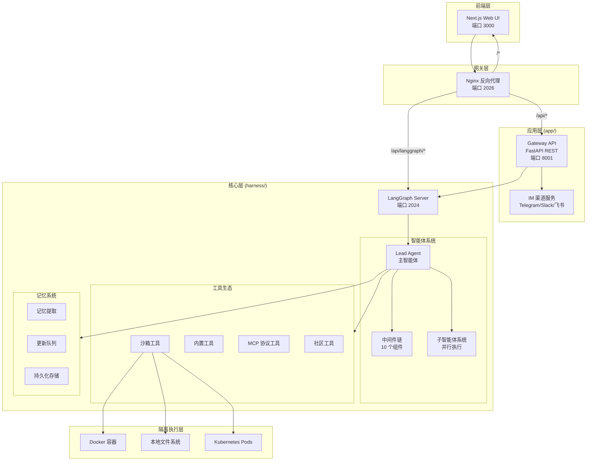

---

## 核心数据流

### 用户请求处理流程

当用户发送一条消息时，系统会经过以下处理流程：

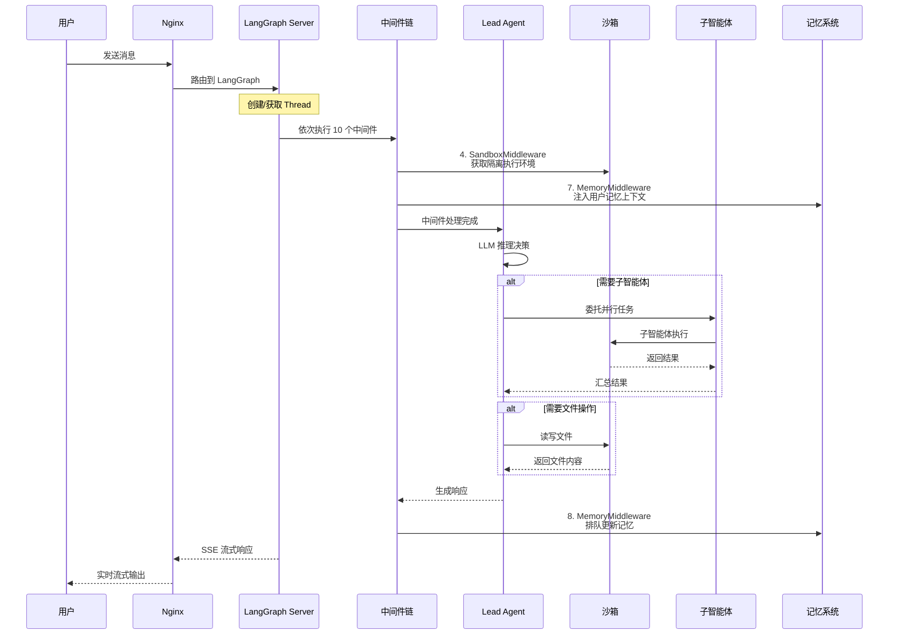

---

## 中间件链详解

DeerFlow 的 Lead Agent 包含 10 个按顺序执行的中间件，每个中间件负责特定的横切关注点：

```mermaid
flowchart LR
    subgraph 中间件链["中间件执行顺序"]
        direction TB
        M1[1. ThreadDataMiddleware<br/>线程数据初始化]
        M2[2. UploadsMiddleware<br/>文件注入]
        M3[3. SandboxMiddleware<br/>沙箱获取]
        M4[4. DanglingToolCallMiddleware<br/>工具调用补全]
        M5[5. SummarizationMiddleware<br/>上下文压缩]
        M6[6. TodoListMiddleware<br/>任务清单跟踪]
        M7[7. TitleMiddleware<br/>标题生成]
        M8[8. MemoryMiddleware<br/>记忆管理]
        M9[9. ViewImageMiddleware<br/>图像注入]
        M10[10. ClarificationMiddleware<br/>澄清拦截]
    end

    INPUT[用户输入] --> M1
    M1 --> M2
    M2 --> M3
    M3 --> M4
    M4 --> M5
    M5 --> M6
    M6 --> M7
    M7 --> M8
    M8 --> M9
    M9 --> M10
    M10 --> OUTPUT[LLM 推理]
```

### 中间件职责说明

| 序号 | 中间件名称 | 核心功能 |
|-----|----------|---------|
| 1 | ThreadDataMiddleware | 为每个线程创建隔离的目录结构（workspace、uploads、outputs） |
| 2 | UploadsMiddleware | 将上传的文件注入对话上下文 |
| 3 | SandboxMiddleware | 获取沙箱执行环境，存储 sandbox_id |
| 4 | DanglingToolCallMiddleware | 补全因用户中断而缺失的工具调用响应 |
| 5 | SummarizationMiddleware | 当接近 token 限制时压缩上下文（可选）|
| 6 | TodoListMiddleware | 在计划模式下跟踪多步骤任务（可选）|
| 7 | TitleMiddleware | 首轮交互后自动生成会话标题 |
| 8 | MemoryMiddleware | 将对话排队等待异步记忆更新 |
| 9 | ViewImageMiddleware | 为支持视觉的模型注入图像数据（条件触发）|
| 10 | ClarificationMiddleware | 拦截澄清请求并中断执行（必须最后）|

---

## 子智能体系统

### 子智能体执行架构

DeerFlow 支持复杂的并行任务分解，主智能体可以将任务委托给子智能体并行执行：

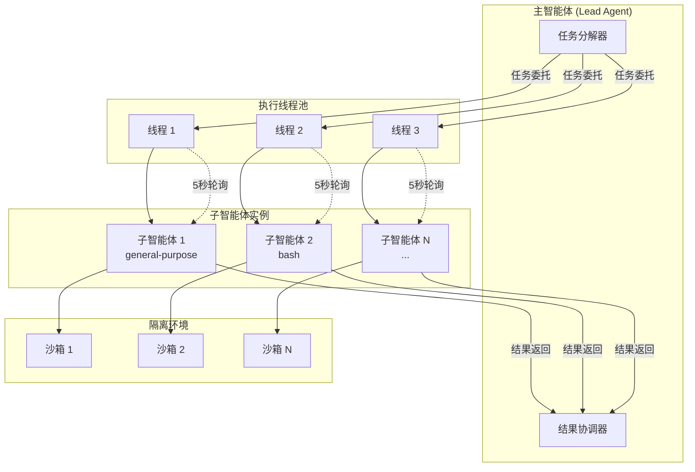

### 内置子智能体类型

| 类型 | 工具集 | 适用场景 |
|-----|-------|---------|
| general-purpose | 全部工具（除 task）| 复杂多步骤任务 |
| bash | 仅 bash 命令 | 快速命令执行 |

### 约束限制

- 最大并发数：3 个子智能体/轮次
- 超时时间：15 分钟
- 调度线程池：3 个工作线程
- 执行线程池：3 个工作线程

---

## 沙箱系统架构

### 虚拟路径映射

DeerFlow 使用虚拟路径系统，智能体看到的是统一的容器内路径：

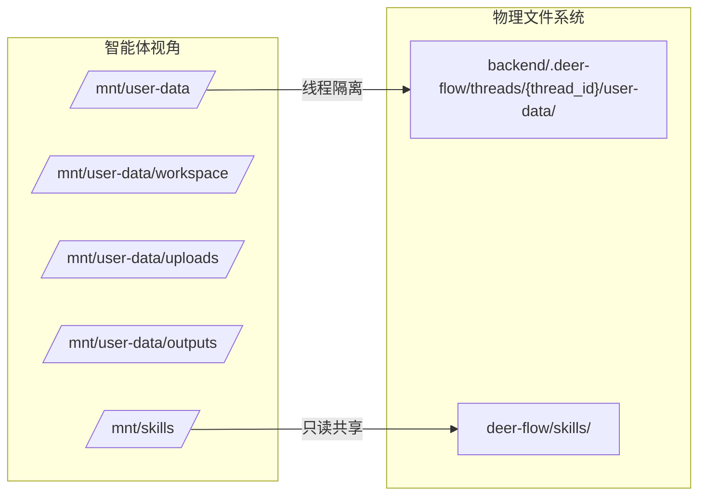

### 沙箱提供者

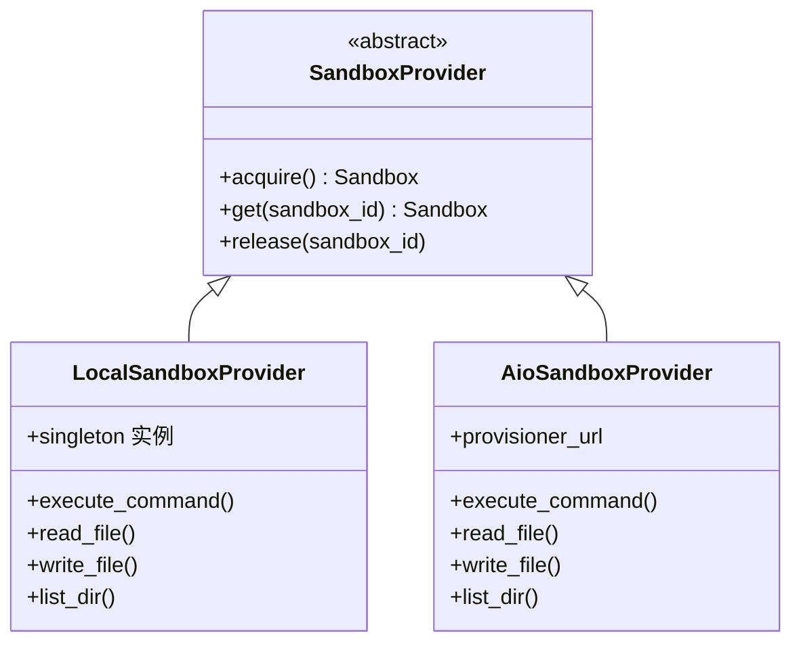

---

## 记忆系统架构

### 记忆更新流程

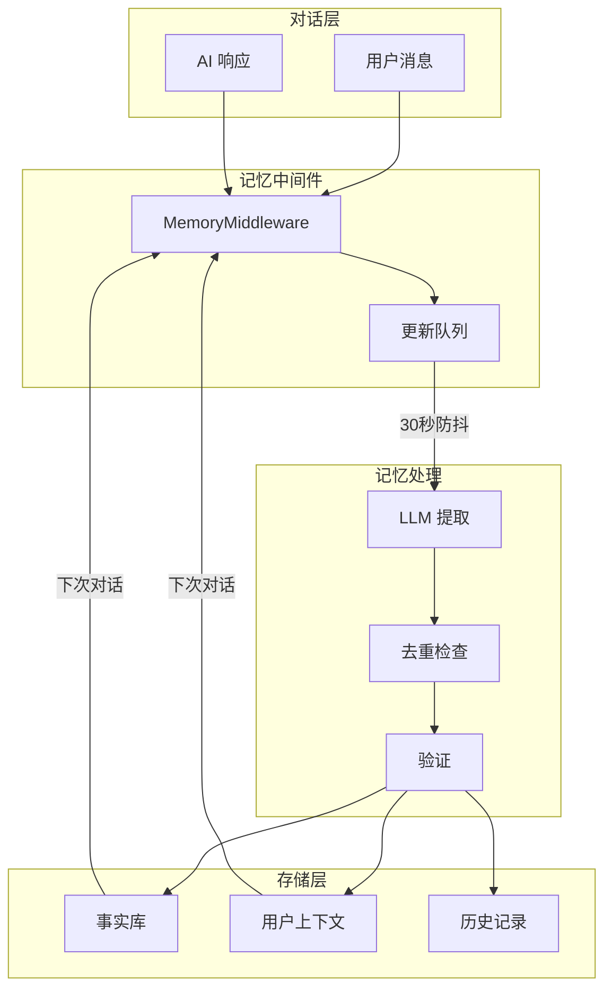

### 记忆数据结构

```json
{
  "userContext": {
    "workContext": "工作背景摘要",
    "personalContext": "个人信息摘要",
    "topOfMind": "当前最关注的事项"
  },
  "history": {
    "recentMonths": "近期对话摘要",
    "earlierContext": "早期对话背景",
    "longTermBackground": "长期知识积累"
  },
  "facts": [
    {
      "id": "唯一标识",
      "content": "事实内容",
      "category": "preference|knowledge|context|behavior|goal",
      "confidence": 0.85,
      "createdAt": "2026-03-01",
      "source": "thread_id"
    }
  ]
}
```

---

## 工具生态系统

### 工具分类

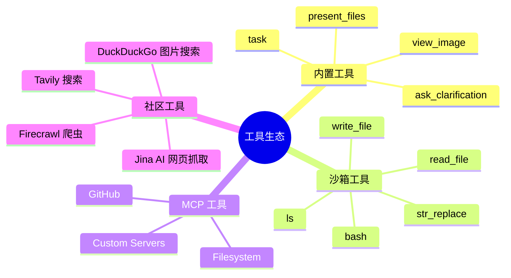

### 工具加载流程

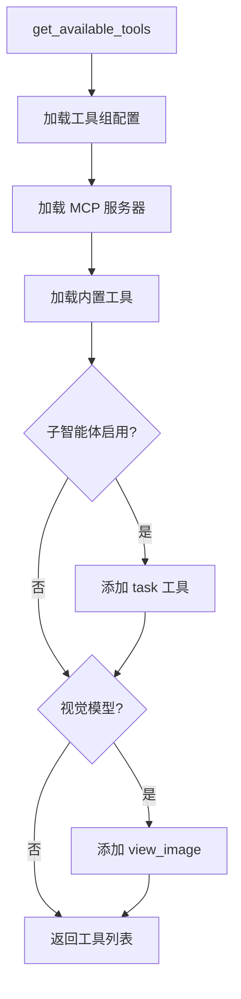

---

## Gateway API 路由

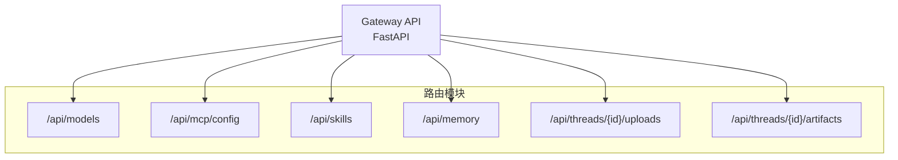

| 路由 | 方法 | 功能 |
|-----|------|-----|
| /api/models | GET | 获取可用模型列表 |
| /api/mcp/config | GET/PUT | 获取/更新 MCP 配置 |
| /api/skills | GET/PUT | 获取/更新技能状态 |
| /api/skills/install | POST | 从 .skill 包安装技能 |
| /api/memory | GET | 获取记忆数据 |
| /api/memory/reload | POST | 强制重载记忆 |
| /api/threads/{id}/uploads | POST | 上传文件 |
| /api/threads/{id}/artifacts | GET | 获取生成产物 |

---

## IM 渠道集成

### 消息流架构

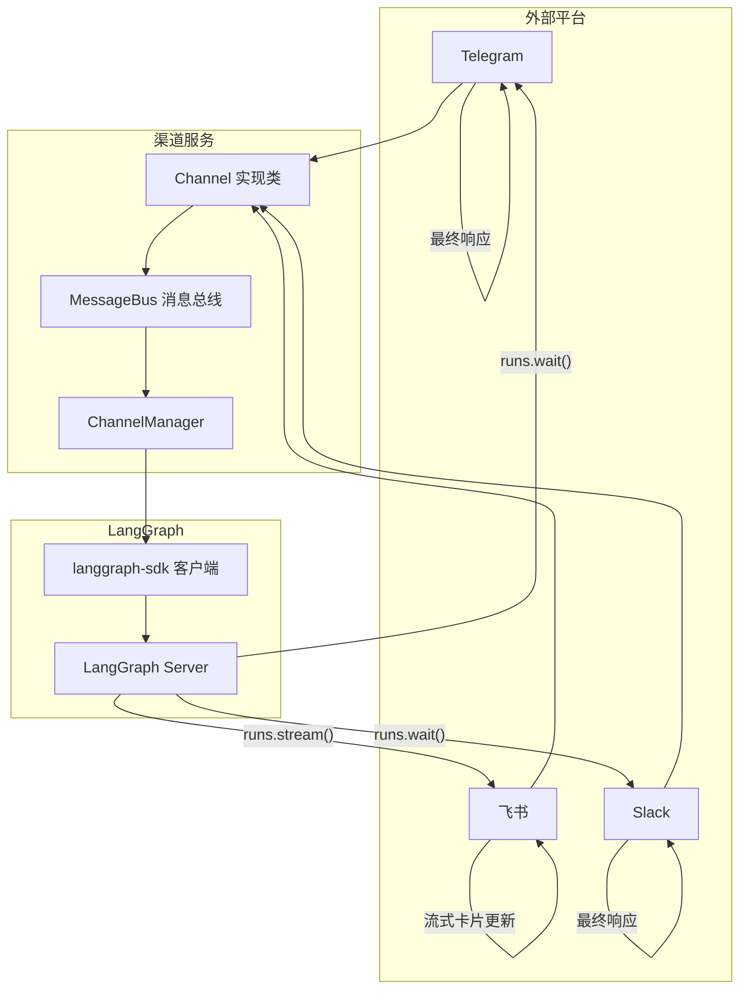

---

## 部署架构

### Docker 开发环境

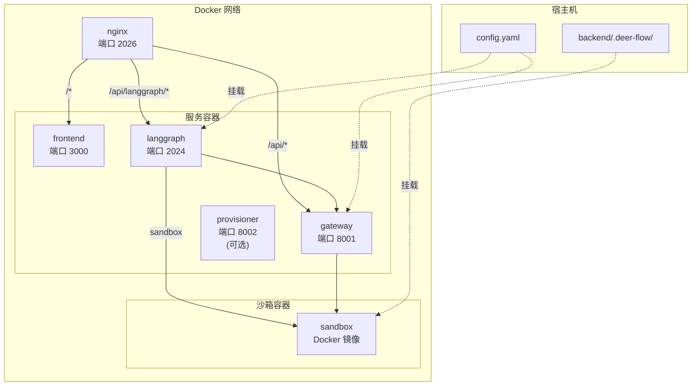

### 本地开发模式

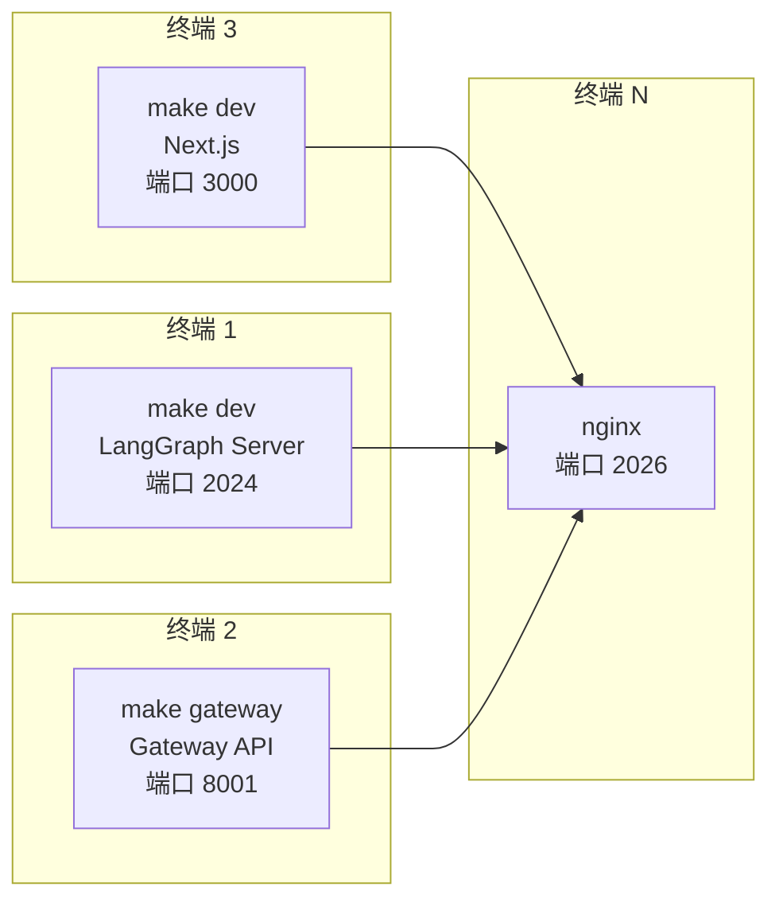

---

## 项目目录结构

```
deer-flow/
├── Makefile                    # 根目录命令
├── config.yaml                 # 主配置文件
├── extensions_config.json      # MCP 和技能扩展配置
│
├── backend/                    # 后端应用
│   ├── app/                   # 应用程序层
│   │   ├── gateway/          # FastAPI 网关
│   │   └── channels/         # IM 渠道集成
│   │
│   ├── packages/harness/      # 核心框架（可发布为 deerflow-harness）
│   │   └── deerflow/
│   │       ├── agents/        # 智能体系统
│   │       │   ├── lead_agent/# 主智能体
│   │       │   ├── middlewares/# 中间件链
│   │       │   └── memory/    # 记忆系统
│   │       ├── sandbox/       # 沙箱执行
│   │       ├── subagents/     # 子智能体
│   │       ├── tools/         # 工具
│   │       ├── mcp/           # MCP 协议
│   │       ├── models/        # 模型工厂
│   │       └── skills/        # 技能系统
│   │
│   ├── docs/                  # 后端文档
│   └── tests/                 # 测试套件
│
├── frontend/                   # Next.js 前端
│   ├── src/
│   │   ├── app/              # 页面
│   │   ├── components/        # 组件
│   │   └── lib/              # 工具库
│   └── public/
│
├── skills/                     # 技能目录
│   ├── public/                # 内置技能
│   │   ├── deep-research/
│   │   ├── consulting-analysis/
│   │   ├── data-analysis/
│   │   └── ...
│   └── custom/                 # 自定义技能（gitignore）
│
├── docker/                     # Docker 配置
│   ├── Dockerfile.frontend
│   ├── Dockerfile.backend
│   └── docker-compose.yaml
│
└── scripts/                    # 辅助脚本
```

---

## 配置系统

### config.yaml 结构

```yaml
# 模型配置
models:
  - name: gpt-4
    display_name: GPT-4
    use: langchain_openai:ChatOpenAI
    model: gpt-4
    api_key: $OPENAI_API_KEY
    supports_thinking: true
    supports_vision: true

# 工具配置
tools:
  - name: tavily
    use: deerflow.community.tavily: TavilySearch
    group: community

tool_groups:
  community:
    - tavily
    - jina_ai
    - firecrawl

# 沙箱配置
sandbox:
  use: deerflow.sandbox.local:LocalSandboxProvider

# 技能配置
skills:
  path: skills/
  container_path: /mnt/skills

# 子智能体配置
subagents:
  enabled: true
  max_concurrent: 3

# 记忆配置
memory:
  enabled: true
  storage_path: backend/.deer-flow/memory.json
  debounce_seconds: 30
  max_facts: 100
  fact_confidence_threshold: 0.7
```

### extensions_config.json 结构

```json
{
  "mcpServers": {
    "github": {
      "enabled": true,
      "type": "stdio",
      "command": "npx",
      "args": ["-y", "@modelcontextprotocol/server-github"]
    }
  },
  "skills": {
    "pdf-processing": {
      "enabled": true
    }
  }
}
```