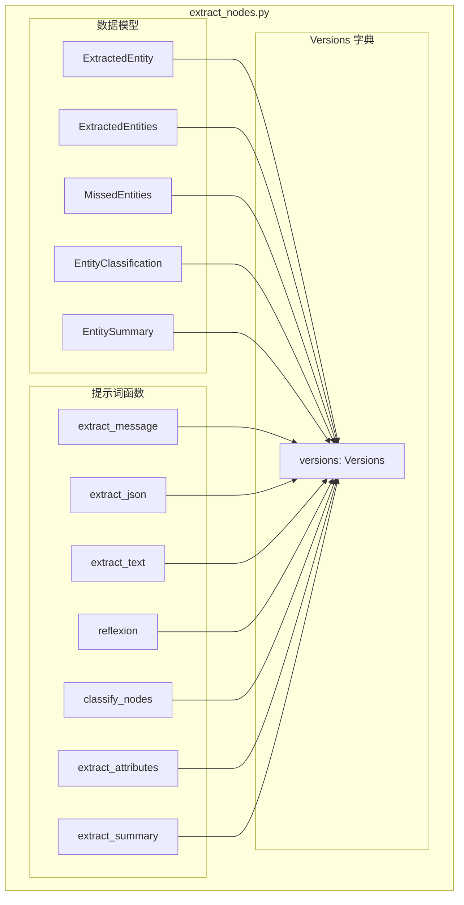
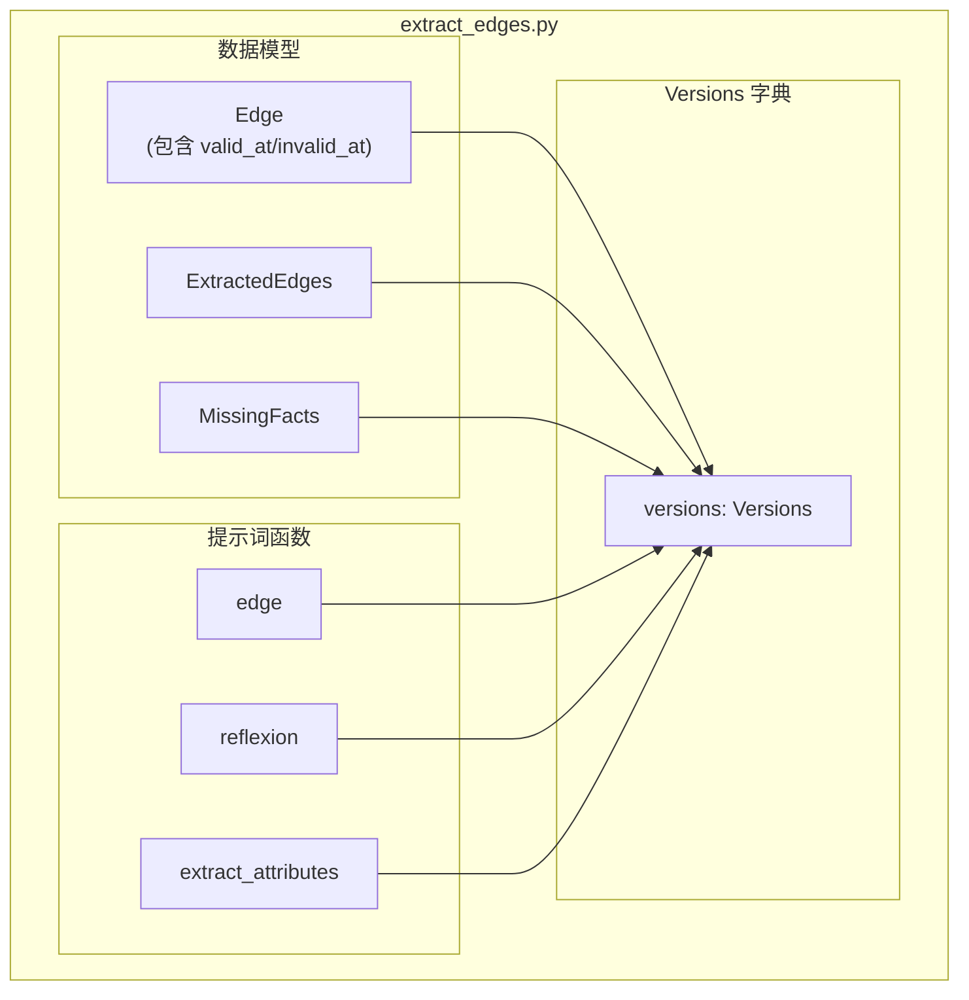
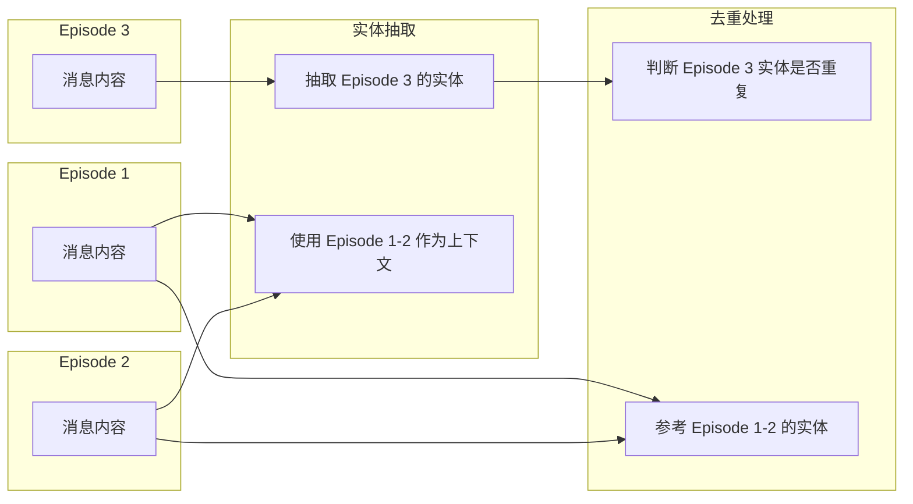

# Graphiti 提示词分析

## 概述

Graphiti 作为一款基于大语言模型的时序知识图谱构建框架，其核心功能高度依赖精心设计的提示词（Prompt）来实现实体抽取、关系提取、数据去重和摘要生成等关键任务。本文档深入分析 Graphiti 项目中使用的所有提示词，从提示词的位置、内容、设计模式、变量处理到优化建议，为理解和改进 Graphiti 的提示词工程提供全面参考。

Graphiti 的提示词设计遵循几个核心原则。首先是任务分离原则，不同的数据处理任务使用独立的提示词模板，避免单一提示词承担过多职责。其次是上下文感知原则，提示词设计充分考虑历史上下文信息的利用，使 LLM 能够理解信息的演进和变化。第三是结构化输出原则，几乎所有提示词都要求 LLM 返回结构化的 JSON 数据，便于后续程序处理。第四是类型安全原则，提示词中明确定义了输入输出的类型约束，确保数据一致性。

Graphiti 的提示词文件集中存放在 `graphiti_core/prompts/` 目录下，包含实体抽取、边抽取、去重、摘要等多个子模块。每个子模块针对特定的数据处理场景，提供了多个版本的提示词实现。这种模块化的组织方式便于维护和扩展，也使得提示词的复用和替换变得简单。

## 实体抽取提示词

### 提示词位置与结构

实体抽取提示词位于 `graphiti_core/prompts/extract_nodes.py` 文件中，该文件定义了从不同格式数据中抽取实体节点的所有提示词模板。文件采用 Protocol 和 TypedDict 模式组织提示词函数，定义了统一的接口规范。

文件结构包含以下核心组件：首先是数据模型定义，包括 `ExtractedEntity`（单个实体）、`ExtractedEntities`（实体列表）、`MissedEntities`（遗漏实体）、`EntityClassification`（实体分类结果）和 `EntitySummary`（实体摘要）。这些 Pydantic 模型定义了提示词的输入输出结构，确保类型安全和数据验证。

提示词函数通过 `Versions` 字典进行组织，支持不同版本的提示词实现。当前版本包含七组提示词函数：`extract_message`（对话消息实体抽取）、`extract_json`（JSON 数据实体抽取）、`extract_text`（纯文本实体抽取）、`reflexion`（遗漏实体反思）、`classify_nodes`（实体分类）、`extract_attributes`（属性提取）和 `extract_summary`（摘要生成）。



### extract_message 提示词

`extract_message` 是最常用的实体抽取提示词，用于从对话消息中提取实体节点。其设计充分考虑了对话的上下文特性和指代消解需求。

**系统提示词设计**：系统提示词定义了 LLM 的角色定位为「从对话消息中提取实体节点的 AI 助手」，并强调主要任务是提取说话者和消息中提到的显著实体。这种角色设定使 LLM 能够专注于实体抽取任务，避免生成无关内容。

**用户提示词结构**：
```
<ENTITY TYPES>
{context['entity_types']}
</ENTITY TYPES>

<PREVIOUS MESSAGES>
{to_prompt_json([ep for ep in context['previous_episodes']])}
</PREVIOUS MESSAGES>

<CURRENT MESSAGE>
{context['episode_content']}
</CURRENT MESSAGE>

Instructions:
1. 说话者提取规则
2. 实体识别规则
3. 实体分类规则
4. 排除规则
5. 格式化规则
{custom_extraction_instructions}
```

**关键设计要点**：

第一，`<ENTITY TYPES>` 标签结构化地展示实体类型定义，使 LLM 能够准确理解可用的实体类型及其描述。每个实体类型包含类型标识符和详细描述，LLM 根据描述判断抽取实体应归属的类型。

第二，`<PREVIOUS MESSAGES>` 提供历史上下文，这对于理解代词指代（如「他」「她」「它」）和识别重复实体至关重要。历史消息被格式化为 JSON 数组，便于 LLM 解析和理解。

第三，`<CURRENT MESSAGE>` 明确界定当前处理的消息范围，避免 LLM 错误地从历史消息中抽取实体。

第四，Instructions 部分详细说明了抽取规则，包括说话者始终作为第一个实体抽取、排除仅在历史消息中提到的实体、不抽取关系或动作等。

### extract_json 提示词

`extract_json` 专门设计用于从结构化 JSON 数据中抽取实体。与消息抽取相比，JSON 数据具有预定义的结构，抽取策略也有所不同。

**系统提示词**：将 LLM 定位为「从 JSON 中提取实体节点的 AI 助手」，强调从 JSON 文件中提取和分类相关实体。

**用户提示词结构**：
```
<ENTITY TYPES>
{context['entity_types']}
</ENTITY TYPES>

<SOURCE DESCRIPTION>:
{context['source_description']}
</SOURCE DESCRIPTION>

<JSON>
{context['episode_content']}
</JSON>

{context['custom_extraction_instructions']}

Guidelines:
1. 提取 JSON 表示的所有实体
2. 提取所有属性中提到的实体
3. 不提取包含日期的属性
```

**设计特点**：JSON 抽取提示词相比消息抽取更加简洁，因为 JSON 本身已经结构化。提示词特别强调不提取日期属性，因为日期属于时间信息，应该在边抽取阶段处理。`SOURCE DESCRIPTION` 提供了数据的业务背景，帮助 LLM 理解数据的语义上下文。

### extract_text 提示词

`extract_text` 用于从纯文本中抽取实体，是三种数据格式中最通用但也最基础的实现。

**系统提示词**：将 LLM 定位为「从文本中提取实体节点的 AI 助手」，强调说话者和显著实体的识别。

**用户提示词结构**：
```
<ENTITY TYPES>
{context['entity_types']}
</ENTITY TYPES>

<TEXT>
{context['episode_content']}
</TEXT>

{context['custom_extraction_instructions']}

Guidelines:
1. 提取显著实体、概念或参与者
2. 避免为关系或动作创建节点
3. 避免为日期、时间等时间信息创建节点
4. 实体名称尽可能明确，使用全名避免缩写
```

**设计特点**：纯文本抽取提示词没有历史上下文支持（因为普通文本通常没有对话历史），但保留了自定义提取指令的支持。指南部分强调避免为时间信息创建节点，因为时间信息应该通过边的时间戳属性表达。

### classify_nodes 提示词

`classify_nodes` 负责对已抽取的实体进行类型分类。这个步骤与抽取分离，提供了更好的抽象层次和错误恢复能力。

**系统提示词**：将 LLM 定位为「根据抽取上下文对实体节点进行分类的 AI 助手」。

**用户提示词结构**：
```
<PREVIOUS MESSAGES>
{to_prompt_json([ep for ep in context['previous_episodes']])}
</PREVIOUS MESSAGES>

<CURRENT MESSAGE>
{context['episode_content']}
</CURRENT MESSAGE>

<EXTRACTED ENTITIES>
{context['extracted_entities']}
</EXTRACTED ENTITIES>

<ENTITY TYPES>
{context['entity_types']}
</ENTITY TYPES>

Guidelines:
1. 每个实体必须有且仅有一个类型
2. 仅使用提供的实体类型进行分类
3. 如果没有提供的类型准确匹配，类型应设置为 None
```

**设计模式**：分类提示词采用了分离设计，将实体抽取和类型分类作为两个独立的步骤。这种设计有多个优势：首先，单一职责原则使每个提示词更专注于特定任务；其次，抽取结果可以先验证，再进行分类；第三，分类错误不会影响抽取，可以分别修复。指南中特别强调「类型应设置为 None」而不是创建新类型，这确保了类型系统的一致性。

### extract_attributes 提示词

`extract_attributes` 用于从消息中提取和更新实体的属性值。这支持了实体的渐进式丰富，允许随着时间推移逐步完善实体信息。

**系统提示词**：将 LLM 定位为「从提供的文本中提取实体属性的助手」。

**用户提示词结构**：
```
<MESSAGES>
{to_prompt_json(context['previous_episodes'])}
{to_prompt_json(context['episode_content'])}
</MESSAGES>

<ENTITY>
{context['node']}
</ENTITY>

Guidelines:
1. 不要在当前上下文中找不到时幻想实体属性值
2. 仅使用提供的 MESSAGES 和 ENTITY 设置属性值
```

**设计特点**：属性提取提示词强调「不要幻想」原则，这是 LLM 应用中的重要安全约束。LLM 应该严格基于提供的信息生成输出，避免虚构不存在的事实。提示词同时提供了历史消息和当前消息，确保属性提取有足够的上下文信息。

### extract_summary 提示词

`extract_summary` 负责生成和更新实体的摘要信息。摘要是实体的简洁描述，综合了来自多个 Episode 的相关信息。

**系统提示词**：将 LLM 定位为「从提供的文本中提取实体摘要的助手」。

**用户提示词结构**：
```
{Messages 和 ENTITY 内容的摘要说明}
<summary_instructions>

<MESSAGES>
{to_prompt_json(context['previous_episodes'])}
{to_prompt_json(context['episode_content'])}
</MESSAGES>

<ENTITY>
{context['node']}
</ENTITY>
```

**设计模式**：摘要生成使用了 `summary_instructions` 片段，该片段定义了摘要生成的具体规则和质量标准。摘要应该综合来自消息的实体相关信息和已有摘要内容，生成更新的摘要。这种增量摘要设计避免了每次都重新生成完整摘要，提高了效率和一致性。

## 边抽取提示词

### 提示词位置与结构

边抽取提示词位于 `graphiti_core/prompts/extract_edges.py` 文件中，定义了从数据中提取实体关系（事实三元组）的所有提示词模板。边抽取是知识图谱构建的核心环节，直接决定了知识图谱的语义丰富程度。

文件结构包含三个核心数据模型：`Edge`（单条边）、`ExtractedEdges`（边列表）和 `MissingFacts`（遗漏事实）。`Edge` 模型特别设计了时间戳字段，包括 `valid_at`（关系成立时间）和 `invalid_at`（关系失效时间），这与 Graphiti 的双时间数据模型一致。

边抽取提示词同样通过 `Versions` 字典组织，包含三组主要函数：`edge`（事实抽取）、`reflexion`（遗漏事实反思）和 `extract_attributes`（边属性提取）。



### edge 提示词

`edge` 是边抽取的核心提示词，负责从消息中提取实体之间的语义关系。

**系统提示词**：
```
You are an expert fact extractor that extracts fact triples from text.
1. Extracted fact triples should also be extracted with relevant date information.
2. Treat the CURRENT TIME as the time the CURRENT MESSAGE was sent.
All temporal information should be extracted relative to this time.
```

**设计特点**：系统提示词首先明确实体抽取专家的角色定位，然后强调两个关键点：第一，事实三元组应同时提取相关日期信息；第二，所有时间信息应相对于当前消息时间解析。这确保了时间信息的一致性和可追溯性。

**用户提示词结构**：
```
<FACT TYPES>
{context['edge_types']}
</FACT TYPES>

<PREVIOUS_MESSAGES>
{to_prompt_json([ep for ep in context['previous_episodes']])}
</PREVIOUS_MESSAGES>

<CURRENT_MESSAGE>
{context['episode_content']}
</CURRENT_MESSAGE>

<ENTITIES>
{to_prompt_json(context['nodes'])}
</ENTITIES>

<REFERENCE_TIME>
{context['reference_time']}
</REFERENCE_TIME>

# TASK
Extract all factual relationships between the given ENTITIES based on the CURRENT MESSAGE...

# EXTRACTION RULES
1. Entity ID Validation
2. Distinct entities requirement
3. SCREAMING_SNAKE_CASE for relation_type
4. No duplicate facts
5. Fact paraphrasing
6. Time resolution using REFERENCE_TIME

# DATETIME RULES
- ISO 8601 with Z suffix
- If fact is ongoing, valid_at = REFERENCE_TIME
- If change/termination expressed, invalid_at = relevant timestamp
- Leave both null if no explicit time
```

**关键设计要点**：

第一，`<ENTITIES>` 提供了从当前消息中抽取的实体列表，每个实体都有唯一标识符。边抽取只能使用这些实体，不能引入新实体，这确保了实体引用的完整性。

第二，`# TASK` 部分定义了抽取任务的边界：仅从当前消息中抽取事实，使用历史消息进行指代消解和连续性支持。

第三，`# EXTRACTION RULES` 是抽取的核心规则集，其中 Entity ID Validation 特别强调了使用 ENTITIES 列表中的 ID，错误的 ID 会导致边被拒绝。

第四，`# DATETIME RULES` 是时间处理规范，使用 ISO 8601 格式，相对时间通过 REFERENCE_TIME 解析，区分「持续有效」和「已终止」两种情况。

### 边时间戳处理逻辑

边抽取提示词中时间戳的处理是 Graphiti 时序建模的关键。系统使用 `valid_at` 和 `invalid_at` 两个字段追踪关系的生命周期。

当事实描述的是持续性状态（如「张三喜欢苹果」）时，如果消息中没有明确的时间信息，系统设置 `valid_at` 为 `REFERENCE_TIME`（消息发送时间），`invalid_at` 为 `null`。这表示关系从消息发送时间开始生效，且目前仍然有效。

当事实描述的是事件或状态变化时（如「张三不喜欢苹果了」），系统会检测到这种变化。如果新消息明确否定了之前的陈述，系统会设置旧边的 `invalid_at` 为当前时间，同时新边（如果存在）的 `valid_at` 也为当前时间。这种设计保持了历史信息的完整性，同时准确反映当前状态。

当事实描述的是有明确时间范围的事件时（如「张三 2020 年在北京工作」），系统从文本中提取时间信息并填充 `valid_at` 和 `invalid_at`。如果没有具体时间，则使用默认规则处理。

## 去重处理提示词

### 节点去重提示词

节点去重提示词位于 `graphiti_core/prompts/dedupe_nodes.py` 文件中，负责判断新抽取的实体是否与已有实体重复。这是知识图谱一致性维护的关键步骤。

文件定义了一个核心数据模型 `NodeDuplicate`，包含 `id`（实体 ID）、`duplicate_idx`（重复实体的索引）、`name`（最佳实体名称）和 `duplicates`（所有重复实体的索引列表）。

去重提示词提供三个版本：`node`（单个新实体与已有实体的比较）、`nodes`（多个新实体与已有实体的比较）和 `node_list`（批量节点的去重合并）。

**node 提示词设计**：
```
<PREVIOUS MESSAGES>
{to_prompt_json([ep for ep in context['previous_episodes']])}
</PREVIOUS MESSAGES>

<CURRENT MESSAGE>
{context['episode_content']}
</CURRENT MESSAGE>

<NEW ENTITY>
{to_prompt_json(context['extracted_node'])}
</NEW ENTITY>

<ENTITY TYPE DESCRIPTION>
{to_prompt_json(context['entity_type_description'])}
</ENTITY TYPE DESCRIPTION>

<EXISTING ENTITIES>
{to_prompt_json(context['existing_nodes'])}
</EXISTING ENTITIES>

TASK:
1. Compare new_entity against each existing entity
2. If refers to same real-world object, collect its index
3. Set duplicate_idx to smallest collected index, or -1 if none
4. Set duplicates to sorted list of all collected indices

Respond with JSON containing entity_resolutions array.
```

**设计模式**：去重提示词强调「语义等价」原则，如果描述性标签明确指代命名实体，则视为重复。同时，提示词明确列出不应视为重复的情况：相关但不相同的实体、具有相似名称或目的但指代不同实例的概念。这种清晰的边界定义有助于 LLM 进行准确判断。

**nodes 提示词设计**：

`nodes` 版本与 `node` 类似，但处理多个新实体的去重。其关键区别在于输出必须包含所有新实体的判断结果，ID 从 0 到 N-1，不能遗漏或添加。

这种设计支持批量去重场景，可以一次性处理多个新实体，提高处理效率。提示词强调「Your response MUST include EXACTLY N resolutions with IDs 0 through N-1」，确保输出的完整性和一致性。

### 边去重提示词

边去重提示词位于 `graphiti_core/prompts/dedupe_edges.py` 文件中，负责检测重复事实和矛盾关系。

文件定义了三个数据模型：`EdgeDuplicate`（边去重结果，包含重复边和矛盾边列表）、`UniqueFact`（唯一事实）和 `UniqueFacts`（唯一事实列表）。

边去重提供三个版本：`edge`（判断新边是否重复）、`edge_list`（批量边去重）和 `resolve_edge`（综合判断重复、类型和矛盾）。

**resolve_edge 提示词设计**：

这是最复杂的去重提示词，需要同时完成三个任务：重复检测、类型分类和矛盾判断。

```
<FACT TYPES>
{context['edge_types']}
</FACT TYPES>

<EXISTING FACTS>
{context['existing_edges']}
</EXISTING FACTS>

<FACT INVALIDATION CANDIDATES>
{context['edge_invalidation_candidates']}
</FACT INVALIDATION CANDIDATES>

<NEW FACT>
{context['new_edge']}
</NEW FACT>

TASK:
1. DUPLICATE DETECTION
2. FACT TYPE CLASSIFICATION
3. CONTRADICTION DETECTION

Guidelines:
- Some facts may be very similar but have key differences, especially around numeric values.
  Do not mark these facts as duplicates.
```

**设计特点**：提示词特别强调数值差异的处理，例如「张三身高 175cm」和「张三身高 180cm」虽然格式相似，但代表不同的事实，不应标记为重复。这种细粒度的区分对于知识图谱的准确性至关重要。

## 提示词模板与变量

### 变量注入机制

Graphiti 的提示词采用模板+变量的设计模式，所有动态内容通过上下文字典注入。这种设计实现了提示词模板的静态化和配置的动态化，便于维护和测试。

**标准变量注入模式**：

```python
def extract_message(context: dict[str, Any]) -> list[Message]:
    sys_prompt = """You are an AI assistant that extracts entity nodes..."""

    user_prompt = f"""
<ENTITY TYPES>
{context['entity_types']}
</ENTITY TYPES>

<PREVIOUS MESSAGES>
{to_prompt_json([ep for ep in context['previous_episodes']])}
</PREVIOUS MESSAGES>

<CURRENT MESSAGE>
{context['episode_content']}
</CURRENT_MESSAGE>

Instructions:
...
{custom_extraction_instructions}
"""
```

**上下文变量规范**：

`entity_types`：实体类型定义列表，格式化为结构化文本供 LLM 理解。

`previous_episodes`：历史 Episode 列表，用于提供上下文和指代消解。

`episode_content` 或 `current_message`：当前处理的数据内容。

`nodes` 或 `extracted_nodes`：已抽取的实体节点列表。

`existing_nodes` 或 `existing_entities`：图中已有的实体节点列表。

`edge_types` 或 `fact_types`：边类型定义列表。

`custom_extraction_instructions`：用户自定义的提取指令，支持业务特定需求。

`reference_time`：参考时间戳，用于解析相对时间表达。

### JSON 格式化工具

提示词使用 `to_prompt_json` 函数将 Python 对象格式化为 JSON 字符串，确保 LLM 能够正确解析结构化数据。

```python
def to_prompt_json(obj: Any) -> str:
    return json.dumps(obj, ensure_ascii=False, indent=2)
```

该函数设置 `ensure_ascii=False` 以支持中文内容，`indent=2` 提供良好的可读性。JSON 格式化确保复杂数据结构能够被 LLM 准确理解。

### 摘要生成指令

摘要生成使用独立的片段文件 `graphiti_core/prompts/snippets.py` 中定义的 `summary_instructions`，保持了主提示词的简洁性。

```python
summary_instructions = """
Given the MESSAGES and the ENTITY, update the summary that combines relevant information about the entity
from the messages and relevant information from the existing summary.
...
"""
```

这种片段化设计允许在不修改主提示词的情况下调整摘要生成策略，提高了系统的可维护性。

## 提示词设计模式

### 模式一：系统-用户双提示词结构

Graphiti 几乎所有提示词都采用系统提示词+用户提示词的双层结构。这种设计充分利用了现代 LLM 的能力分层：

系统提示词定义 LLM 的角色、能力和行为准则，通常包含「你是 XXX，负责YYY」的角色定位，以及「你应该遵循 ZZZ 原则」的行为指导。

用户提示词包含具体的任务描述、输入数据和输出要求。任务描述通常以 `# TASK` 或 `Instructions:` 开头，清晰说明需要完成的工作。输入数据使用 XML 标签（如 `<ENTITIES>`、`</ENTITIES>`）包裹，便于 LLM 识别不同类型的信息。

这种双层结构的优势在于：系统提示词提供稳定的上下文，用户提示词提供具体任务的指令。当需要针对不同场景调整提示词时，通常只需修改用户提示词部分，系统提示词保持不变。

### 模式二：结构化输出强制约束

Graphiti 的提示词几乎都要求 LLM 返回结构化的 JSON 输出，而非自由文本。这种设计有多重目的：

第一，程序处理便利。JSON 输出可以直接解析为 Python 对象，无需文本解析或正则匹配。

第二，类型安全保证。Pydantic 模型定义了输出的类型约束，解析过程同时完成类型验证。

第三，一致性保障。固定的输出结构确保不同次调用的结果格式一致，便于后续处理。

第四，错误处理能力。结构化输出使得识别和处理异常输出成为可能。

```python
class ExtractedEntities(BaseModel):
    extracted_entities: list[ExtractedEntity] = Field(..., description='List of extracted entities')
```

通过定义 Pydantic 模型并使用 `structured_output` 方法调用 LLM，Graphiti 确保了输出格式的严格一致性。

### 模式三：分离设计原则

Graphiti 的提示词设计遵循严格的分离原则，将复杂的处理流程分解为多个独立的步骤：

实体抽取（extract_nodes）和实体分类（classify_nodes）分离，允许分别优化和验证。

实体抽取和边抽取分离，确保实体先于关系确定，避免循环依赖。

实体/边抽取与去重分离，使得去重逻辑可以独立测试和优化。

边抽取和边无效化分离，矛盾检测作为独立步骤处理。

这种分离设计的好处包括：每个提示词更简洁，专注于单一任务；错误定位更精确，问题可以快速追溯到具体步骤；优化更有针对性，可以针对特定瓶颈进行改进。

### 模式四：上下文链式传递

Graphiti 的提示词设计充分利用上下文链式传递，每个步骤都可以访问相关的历史信息：



这种上下文传递机制使得 LLM 能够理解信息的演进和变化，处理指代消解、矛盾检测等复杂任务。

## 提示词优化建议

### 优化一：减少上下文长度

当前提示词在处理长对话历史时可能产生大量 token 消耗。建议的优化方向包括：

**选择性上下文截断**：不是传递所有历史消息，而是根据相关性选择最重要的 N 条消息。可以使用滑动窗口或基于嵌入相似度的筛选策略。

**摘要式上下文**：对于过长的历史消息，使用摘要代替原始内容。摘要应保留关键实体和事件，忽略细节信息。

**压缩格式优化**：当前使用格式化的 JSON，可以考虑更紧凑的表示方式，如单行 JSON 或自定义分隔符格式。

```python
# 示例：选择性上下文截断
async def get_relevant_context(
    query: str,
    episodes: list[EpisodicNode],
    max_episodes: int = 5
) -> list[EpisodicNode]:
    # 使用嵌入相似度筛选最相关的 Episode
    relevant = await filter_by_embedding_similarity(query, episodes, max_episodes)
    return relevant
```

### 优化二：增强错误处理

当前提示词缺乏明确的错误处理指导，建议增加：

**置信度阈值**：要求 LLM 在输出中包含置信度分数，低置信度结果可以被标记为需要人工审核。

**备选输出**：对于不确定的情况，要求 LLM 提供多个可能的答案及其理由。

**错误恢复**：当输出格式错误时，提供修复指南或备用解析策略。

```python
class EntityWithConfidence(BaseModel):
    name: str
    entity_type_id: int
    confidence: float = Field(..., ge=0, le=1, description="Confidence score 0-1")
    reason: str = Field(..., description="Reason for this classification")
```

### 优化三：增加少样本示例

当前提示词主要依赖纯文本指令，可以增加少样本示例提高抽取准确性：

**few-shot 示例**：在提示词中包含输入-输出的示例对，展示期望的行为。

**边界案例示例**：展示容易出错的情况和正确处理方式。

**格式示例**：展示期望的 JSON 输出格式的具体示例。

```python
def extract_message_with_examples(context: dict[str, Any]) -> list[Message]:
    examples = """
    Example 1:
    Input: "user: 我是张三，在北京工作。"
    Output: [{"name": "张三", "entity_type_id": 0}, {"name": "北京", "entity_type_id": 1}]


    Example 2:
    Input: "user: 他上周去了上海。"
    Output: [{"name": "上海", "entity_type_id": 1}]
    """

    user_prompt = f"""
    ...original prompt content...

    <FEW-SHOT EXAMPLES>
    {examples}
    </FEW-SHOT EXAMPLES>
    """
```

### 优化四：多语言支持增强

当前提示词主要使用英文，可以增强多语言支持：

**本地化系统提示词**：为不同语言提供本地化的系统提示词，使用户母语与 LLM 交互。

**语言检测**：自动检测输入语言，选择对应语言的提示词变体。

**跨语言实体识别**：支持识别不同语言中指代同一实体的表达。

```python
async def getLocalizedPrompt(
    content: str,
    language: str = "auto"
) -> list[Message]:
    if language == "auto":
        language = detect_language(content)

    prompts = {
        "zh": extract_message_zh,
        "en": extract_message_en,
        "ja": extract_message_ja,
    }

    return prompts.get(language, extract_message_en)(content)
```

### 优化五：增量式提示词优化

建议建立提示词 A/B 测试和持续优化机制：

**版本化管理**：对提示词进行版本控制，记录每次修改和效果变化。

**指标追踪**：追踪抽取准确率、去重准确率、延迟等指标。

**自动化测试**：使用标注数据集自动测试提示词效果。

**梯度优化**：基于测试结果自动调整提示词参数（如示例数量、上下文长度等）。

```python
# 示例：提示词版本测试框架
class PromptExperiment:
    def __init__(self, name: str, prompt_func, test_dataset: list[dict]):
        self.name = name
        self.prompt_func = prompt_func
        self.test_dataset = test_dataset

    async def evaluate(self) -> dict:
        results = []
        for item in self.test_dataset:
            result = await run_prompt(self.prompt_func, item)
            expected = item["expected"]
            match = evaluate_match(result, expected)
            results.append(match)

        return {
            "accuracy": sum(results) / len(results),
            "total": len(results),
            "correct": sum(results)
        }
```

### 优化六：安全性增强

当前提示词可以增强安全性约束：

**敏感信息过滤**：在抽取前检测和过滤敏感信息（如电话号码、身份证号）。

**事实验证**：对抽取的事实进行简单验证，拒绝明显错误或不可能的陈述。

**注入防护**：增强对提示词注入攻击的防护，验证输入内容的安全性。

```python
class SafeExtractionContext(TypedDict):
    content: str
    entity_types: dict
    previous_episodes: list
    sanitized: bool  # 标记是否已进行安全处理

async def sanitize_content(content: str) -> str:
    # 移除或替换敏感信息
    sanitized = redact_pii(content)
    # 验证内容安全性
    if not is_safe_content(sanitized):
        raise ContentSafetyError("Content contains unsafe elements")
    return sanitized
```

## 提示词性能考量

### Token 消耗分析

Graphiti 提示词的 token 消耗主要由以下部分组成：

**固定部分**：系统提示词、Instructions、标签结构等固定文本，每次调用都会消耗。

**上下文部分**：历史消息、实体列表、边列表等动态内容，消耗量随数据量变化。

**输出部分**：LLM 生成的内容，消耗量取决于输出复杂度。

对于典型的对话场景（5条历史消息，10个实体），单次实体抽取的 token 消耗估计在 2000-4000 tokens 左右，取决于消息长度和实体复杂度。

### 优化策略

**批处理优化**：对于批量数据处理，使用 `add_episode_bulk` 替代多次 `add_episode`，可以复用上下文计算，减少总体消耗。

**并发控制**：通过 `SEMAPHORE_LIMIT` 环境变量控制并发度，避免触发 LLM 提供商的速率限制。

**模型选择**：对于简单任务（如实体分类），可以使用较小的模型；对于复杂任务（如去重判断），使用较大的模型。

**缓存策略**：对相同输入的提示词结果进行缓存，避免重复调用。适用于实体类型定义等相对稳定的内容。

```python
# 示例：带缓存的提示词调用
from functools import lru_cache

@lru_cache(maxsize=128)
async def extract_entities_cached(
    content_hash: str,
    entity_types_hash: str
) -> ExtractedEntities:
    # 实际调用逻辑
    return await extract_entities(content, entity_types)
```

## 总结与最佳实践

Graphiti 的提示词设计体现了以下最佳实践：

**清晰的任务定义**：每个提示词都有明确的输入、输出和任务描述，避免歧义和误解。

**结构化输出**：强制 JSON 格式输出，便于程序处理和错误恢复。

**上下文充分利用**：通过历史消息提供上下文，支持指代消解和矛盾检测。

**分离设计原则**：将复杂流程分解为独立步骤，每个步骤专注于单一任务。

**类型安全保证**：使用 Pydantic 模型定义输入输出结构，确保数据一致性。

在使用 Graphiti 时，建议遵循以下实践：

根据具体业务场景调整 `custom_extraction_instructions`，提供领域特定的抽取指导。

为特殊实体类型定义详细的描述，帮助 LLM 准确分类。

监控提示词效果，定期使用标注数据集评估和优化。

对于大规模部署，建立提示词版本管理和 A/B 测试机制，持续改进抽取质量。
