# Graphiti 架构设计

## 系统整体架构

Graphiti 采用分层架构设计，将数据处理、存储、检索和接口服务分离，形成清晰的功能边界。整体架构分为五个主要层次：应用层、核心服务层、数据处理层、存储层和基础设施层。每一层都有明确的职责，层与层之间通过定义良好的接口进行通信，保证了系统的可维护性和可扩展性。

应用层是用户直接交互的入口，提供了多种集成方式。开发者可以通过 Python SDK 直接调用 Graphiti 的核心功能，也可以通过 REST API 服务（基于 FastAPI 构建）进行远程访问。对于 AI 助手和 CLI 工具，Graphiti 提供了 MCP Server 实现，支持 Claude、Cursor 等主流 AI 客户端直接调用知识图谱功能。

核心服务层封装了 Graphiti 的主要业务逻辑，包括 Episode 管理、节点操作、边操作、搜索服务和社区构建等模块。这一层是整个系统的核心，包含了知识图谱的创建、更新、查询和优化等核心算法。

数据处理层负责将非结构化数据转换为知识图谱表示。该层集成了 LLM 客户端、Embedder 客户端和 Cross-Encoder 客户端，利用大语言模型的能力进行实体抽取、关系抽取、去重和摘要生成等操作。数据处理层还包含了提示词模板库，定义了各种数据处理任务的 prompt。

存储层抽象了图数据库的访问接口，通过驱动程序模式支持多种图数据库后端。目前支持 Neo4j、FalkorDB、Kuzu 和 Amazon Neptune 四种数据库。存储层还集成了全文搜索引擎（对于 Neptune 使用 OpenSearch Serverless），为混合检索提供支持。

基础设施层提供运行时环境和工具支持，包括异步运行时、配置管理、日志记录、遥测采集和测试工具等。Graphiti 使用 Python asyncio 实现高并发，所有 I/O 操作都是异步的，能够高效处理大量并发请求。

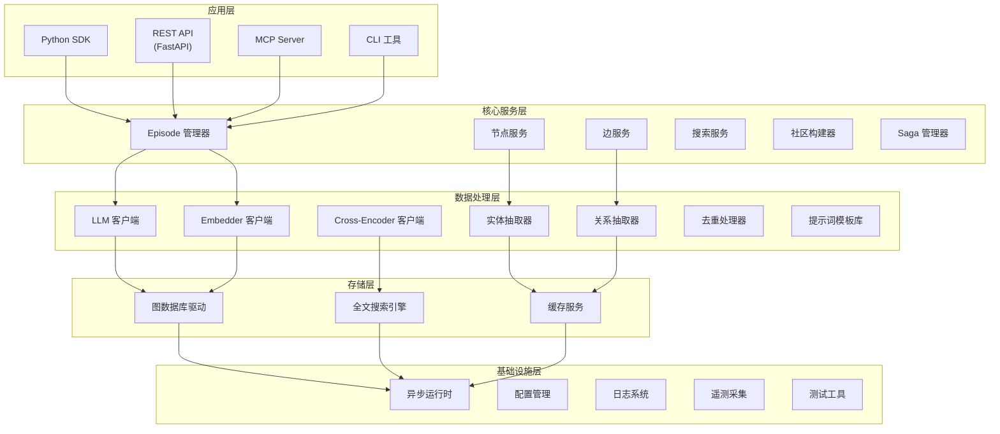

## 核心数据流

### Episode 添加流程

向 Graphiti 添加数据是最高频的操作之一，理解其数据流对于优化性能和调试问题至关重要。当调用 add_episode 方法时，系统会执行以下步骤：

首先，系统接收原始数据（文本、JSON 或消息格式）和元数据（来源描述、参考时间等），创建一个 EpisodicNode 对象。这个节点代表数据的时间戳信息和原始内容，但不包含从数据中提取的结构化知识。

接下来进入并行处理阶段。系统同时执行两个主要操作：检索相关历史上下文和调用 LLM 进行实体抽取。检索历史上下文的目的是获取最近的 Episode 列表，这些 Episode 将作为去重的参考和实体消歧的上下文。实体抽取使用专门的提示词模板，根据数据类型（消息、JSON 或纯文本）选择不同的抽取策略。

实体抽取完成后，系统对抽取的实体进行去重处理。去重通过向量相似度比较和 LLM 判断相结合的方式进行。系统会比较新实体与现有实体的名称嵌入，如果相似度超过阈值，则认为是同一个实体；否则通过 LLM 进行最终判断。去重结果会生成一个 UUID 映射表，记录新实体到已有实体的对应关系。

实体去重完成后，系统并行执行两个操作：边抽取和属性提取。边抽取从数据中提取实体之间的关系，生成 EntityEdge 对象。属性提取为每个实体生成或更新摘要信息。这两个操作都使用 LLM，但使用不同的提示词模板。

边抽取完成后，系统进行边去重和矛盾检测。边去重与实体去重类似，比较新边与已有边的语义相似度。矛盾检测是 Graphiti 的核心功能之一，系统会检查新边是否与已有边存在冲突。如果存在冲突，已有边会被标记为失效（设置 invalid_at 时间戳），新边正常添加。

最后，系统将所有处理结果保存到图数据库。保存操作包括：保存 EpisodicNode、创建 EpisodicEdge（连接 Episode 和实体）、保存 EntityNode、创建 EntityEdge（连接实体）、生成向量嵌入。这一步通过批量插入操作完成，保证高效的数据持久化。

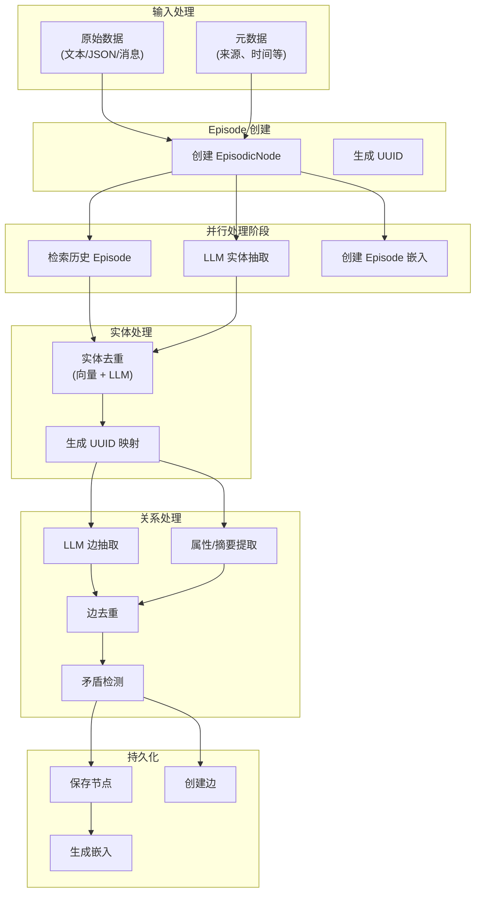

### 混合搜索流程

Graphiti 的混合搜索结合了三种检索方法：关键词搜索（BM25）、语义向量搜索和图遍历搜索。搜索流程首先对查询进行预处理，生成查询嵌入和提取关键词。

关键词搜索在文本字段上执行，使用 BM25 算法计算相关性得分。这种方法对于精确匹配查询词的效果很好，例如查找特定名称或术语。语义向量搜索在嵌入字段上执行，计算查询嵌入与存储嵌入的余弦相似度。这种方法能够找到语义相关但用词不同的结果。图遍历搜索从指定节点出发，沿图结构进行广度优先搜索，找出在图上接近的相关节点。

三种搜索方法并行执行各自的检索操作，生成候选结果集。每个候选结果包含相关性得分和节点/边信息。然后系统对候选结果进行合并，使用 RRF（Reciprocal Rank Fusion）等算法计算综合排名。RRF 通过综合多个检索源的结果，降低单一检索方法的偏差，提高整体准确性。

如果配置了重排序（Cross-Encoder 或其他），系统会对排名靠前的结果进行二次精排。Cross-Encoder 使用 LLM 直接评估查询与结果的匹配程度，给出更准确的相关性判断。最终，系统返回重排序后的结果列表。

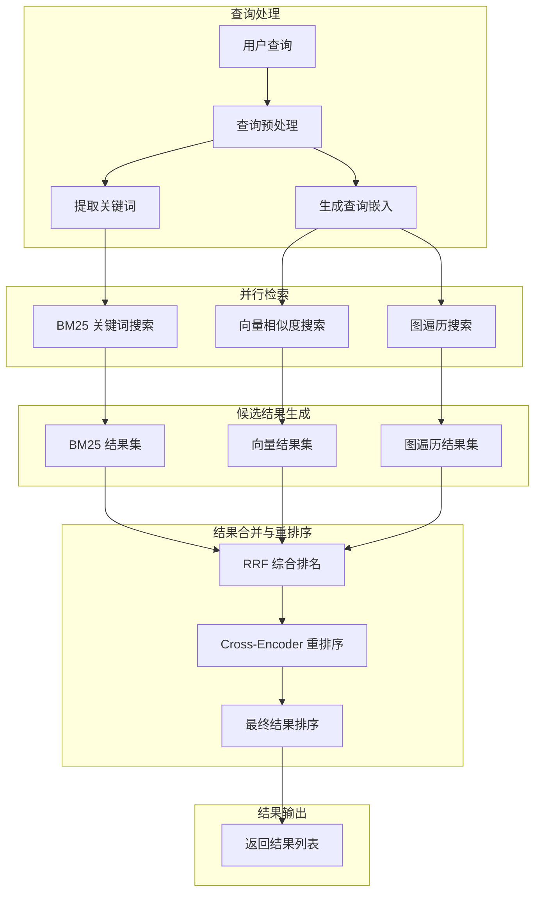

## 核心类与模块关系

### Graphiti 主类结构

Graphiti 主类是整个框架的入口点，封装了所有核心功能。理解其内部结构和依赖关系对于深入掌握框架原理和进行二次开发至关重要。

Graphiti 类的主要属性包括：driver（数据库驱动实例）、llm_client（LLM 客户端实例）、embedder（嵌入生成客户端实例）、cross_encoder（重排序客户端实例）和 tracer（追踪器实例）。这些属性通过依赖注入的方式初始化，支持自定义替换。

Graphiti 类的主要方法按功能可分为三类：添加方法、查询方法和维护方法。添加方法包括 add_episode（添加单个 Episode）、add_episode_bulk（批量添加 Episode）和 add_triplet（添加三元组）。查询方法包括 search（基本搜索）、search_（高级搜索）和 retrieve_episodes（检索历史 Episode）。维护方法包括 build_communities（构建社区）和 remove_episode（删除 Episode）。

Graphiti 类还包含多个私有方法，用于支持公共方法的实现。_extract_and_resolve_nodes 和 _extract_and_resolve_edges 方法分别处理实体和关系的抽取与去重。_process_episode_data 方法负责将处理结果保存到数据库。_get_or_create_saga 方法管理 Saga 节点的创建和查找。

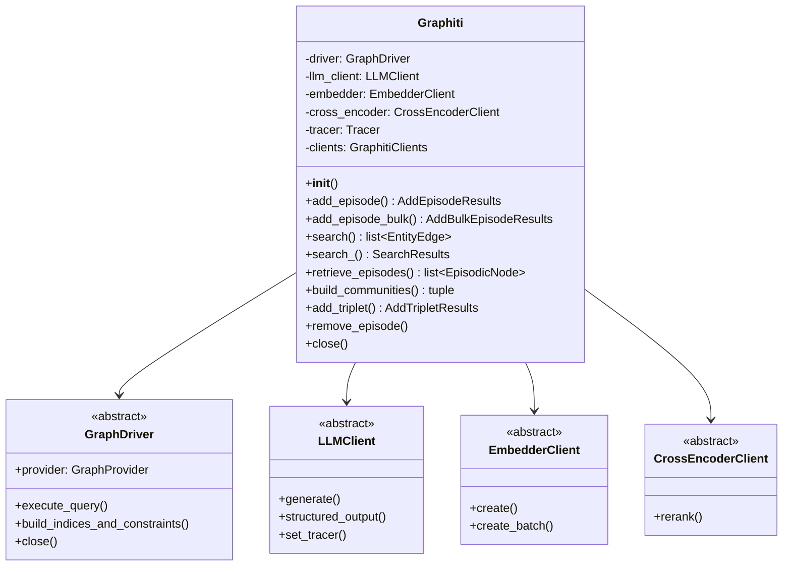

### 节点与边模型

Graphiti 定义了丰富的节点和边模型，用于表示知识图谱中的各种元素。这些模型都继承自 Pydantic 的 BaseModel，具备自动验证、序列化和类型提示等功能。

节点模型包括四个主要类型。Node 是抽象基类，定义了所有节点的共同属性（uuid、name、group_id、labels、created_at）和方法。EntityNode 表示实体节点，是知识图谱中最常见的节点类型，包含名称嵌入（name_embedding）和摘要（summary）属性。EpisodicNode 表示数据片段节点，存储原始数据和来源信息，包含 source、source_description、content、valid_at 和 entity_edges 等属性。CommunityNode 表示社区节点，用于聚类相关的实体，提供更高层次的抽象。SagaNode 表示 Saga 节点，用于管理连续的 Episode 序列。

边模型同样包括多个类型。Edge 是抽象基类，定义了所有边的共同属性（uuid、group_id、source_node_uuid、target_node_uuid、created_at）。EntityEdge 表示实体关系边，是知识图谱的核心，包含关系名称（name）、事实描述（fact）、嵌入向量（fact_embedding）和时间戳（valid_at、invalid_at）等属性。EpisodicEdge 连接 Episode 和实体，表示实体在该 Episode 中被提及。CommunityEdge 连接社区和实体，表示实体属于某个社区。HasEpisodeEdge 和 NextEpisodeEdge 用于 Saga 管理，分别表示 Saga 包含 Episode 和 Episode 之间的顺序关系。

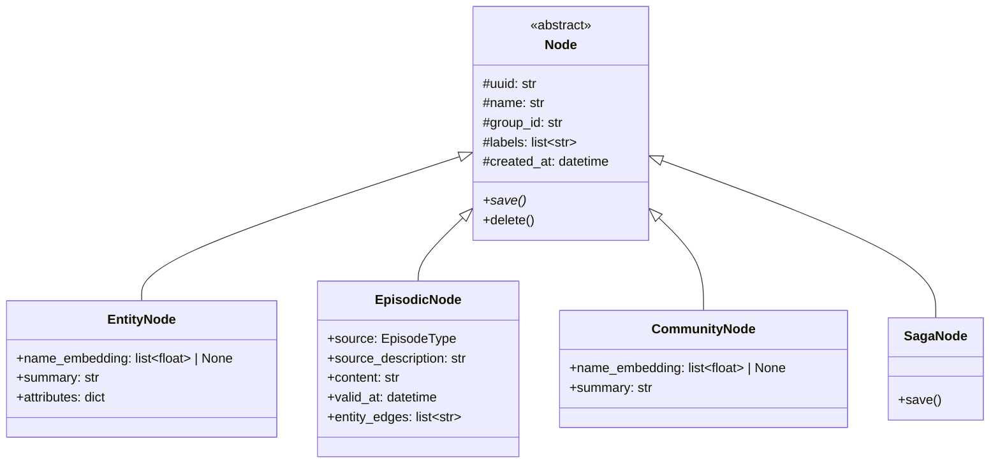

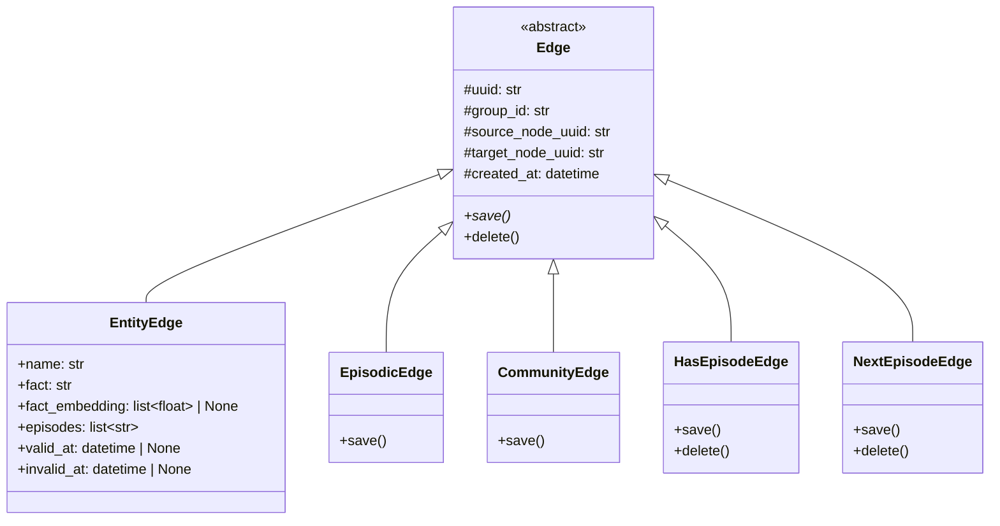

### 数据库驱动结构

Graphiti 的数据库驱动采用策略模式设计，通过抽象基类 GraphDriver 定义了统一的接口，各具体驱动实现这些接口。这种设计使得上层代码无需关心底层使用的数据库类型，只需通过统一 API 进行操作。

GraphDriver 抽象类定义了核心接口：execute_query 方法用于执行图查询；build_indices_and_constraints 方法用于创建索引和约束；session 方法用于创建数据库会话（某些驱动支持）；close 方法用于关闭连接。GraphProvider 枚举类定义了支持的数据库类型，包括 NEO4J、FALKORDB、KUZU 和 NEPTUNE。

Neo4jDriver 是最成熟的驱动实现，利用 Neo4j 的 Bolt 协议进行通信。它支持 Neo4j 的所有查询语法，包括 Cypher 的高级特性。Neo4jDriver 实现了批量操作优化，使用事务批量处理插入操作，提高写入性能。

FalkorDBDriver 使用 Redis 协议与 FalkorDB 通信。FalkorDB 的图操作完全在 Redis 中实现，因此 FalkorDBDriver 相对简单，主要处理数据格式转换。

KuzuDriver 是嵌入式驱动，无需独立的数据库进程。Kuzu 使用自己的查询语言，Graphiti 在内部将其转换为对应的查询操作。KuzuDriver 特别适合需要简化部署的场景。

NeptuneDriver 是最复杂的驱动，因为它需要同时管理 Neptune 图数据库和 OpenSearch Serverless 全文搜索索引。NeptuneDriver 将图操作和全文搜索操作分离，分别调用不同的服务。

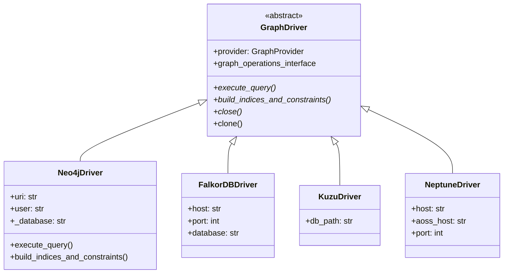

### LLM 客户端结构

Graphiti 的 LLM 客户端设计支持多种 LLM 提供商，通过统一的接口抽象隐藏了不同 API 的差异。这种设计使得切换 LLM 提供商变得简单，只需更换客户端实例即可。

LLMClient 是抽象基类，定义了核心方法：generate 方法用于生成文本响应；structured_output 方法用于生成结构化输出（Pydantic 模型）。所有具体客户端都继承这个基类并实现这些方法。

OpenAIClient 是默认客户端，使用 OpenAI 的 Chat Completion API。它支持流式输出、结构化输出和图像理解等功能。OpenAIClient 还支持通过 base_url 参数配置兼容 OpenAI API 的第三方服务，如本地部署的模型。

AzureOpenAIClient 封装了 Azure OpenAI 的特定功能，使用 Azure 的 API 端点和认证方式。它继承自 OpenAIClient 的大部分功能，但覆盖了初始化逻辑以支持 Azure 的认证机制。

AnthropicClient 和 GroqClient 分别封装了 Anthropic Claude 和 Groq 的 API。这些客户端需要处理各自 API 的特定参数和响应格式。

GeminiClient 是最复杂的客户端之一，因为它同时支持 LLM 生成、嵌入向量和 Cross-Encoder 重排序。GeminiClient 将这三个功能统一封装，通过不同的方法暴露给上层使用。

OpenAIGenericClient 是一个特殊的客户端，用于支持 Ollama 等兼容 OpenAI API 但运行在本地的模型。它继承了 OpenAIClient 的功能，但调整了默认参数以适应本地模型的特点。

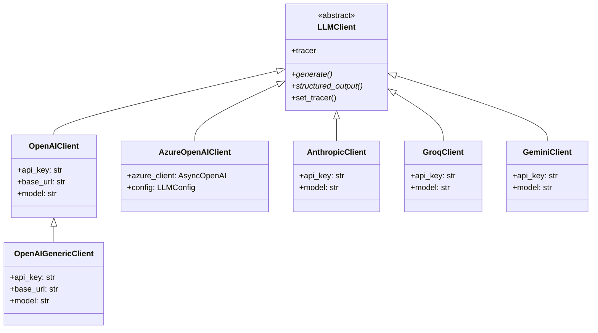

## 用户交互流程

### 对话上下文管理流程

在典型的 AI 助手场景中，Graphiti 用于管理对话历史和用户记忆。用户与 AI 的每次交互都会触发一系列 Graphiti 操作，形成完整的上下文管理流程。

对话开始时，AI 系统首先调用 Graphiti 的 retrieve_episodes 方法，检索与当前对话相关的历史上下文。检索基于参考时间（通常是当前时间）和可选的 Saga 参数，返回最近的 Episode 列表。这些 Episode 包含了用户的历史偏好、之前讨论的话题和关键事实。

当用户发送新消息时，AI 系统将消息作为 Episode 添加到 Graphiti。add_episode 方法会提取消息中的实体和关系，与历史数据进行去重和关联，然后持久化到数据库。添加完成后，系统可以获得新增的实体和关系列表，用于更新对用户的理解。

在回答用户问题时，AI 系统调用 search 方法查询知识图谱。混合搜索结合语义相似度、关键词匹配和图遍历，返回与问题相关的知识。搜索结果被整合到 System Prompt 中，为 LLM 提供上下文信息，生成更准确、更个性化的回答。

整个流程是循环进行的，每次用户交互都会重复这个模式。随着对话的深入，Graphiti 中的知识不断积累和更新，AI 系统对用户的理解也越来越准确。

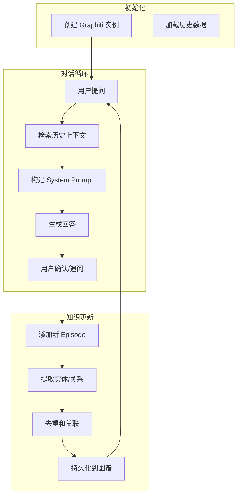

### 批量数据导入流程

在系统初始化或迁移场景中，需要将大量历史数据批量导入 Graphiti。批量导入流程针对数据量进行了优化，使用并行处理和批量操作提高效率。

导入开始前，系统首先对数据进行预处理。数据可能来自不同的源（数据库、文件系统、API），需要统一转换为 RawEpisode 格式。RawEpisode 包含名称、内容、来源描述和参考时间等必要信息。

批量添加通过 add_episode_bulk 方法执行，该方法接收 RawEpisode 列表作为输入。在内部，系统首先创建所有 Episode 对象并保存到数据库，获取数据库生成的 UUID。然后并行检索每个 Episode 的历史上下文。

系统并行执行实体和边的抽取，使用批量 LLM 调用提高效率。抽取结果经过内存中的去重处理，生成统一的 UUID 映射。最后，系统批量保存所有节点、边和嵌入，完成数据导入。

批量导入完成后，系统会返回导入统计信息，包括添加的实体数、关系数和冲突检测结果。如果存在数据冲突（如重复实体），系统会自动进行合并和标记。

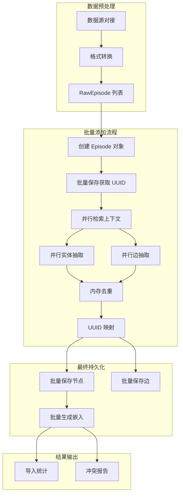

## 部署架构

### 开发环境部署

对于开发和小规模测试场景，Graphiti 可以部署在单机环境中。使用 Docker Compose 可以快速启动所有依赖服务，无需复杂的配置。

开发环境的标准配置包括：Graphiti Python 应用、Neo4j 5.26 数据库和可选的监控工具。所有服务运行在同一台机器上，通过 Docker 网络进行通信。Neo4j 的 HTTP 端口（7474）和 Bolt 端口（7687）映射到宿主机器，供应用连接。

数据流向方面，Graphiti 应用通过 Bolt 协议连接 Neo4j，执行所有图数据库操作。LLM 调用通过互联网发送到 OpenAI 或其他 LLM 提供商。嵌入向量存储在 Neo4j 的向量索引中，支持高效的相似度搜索。

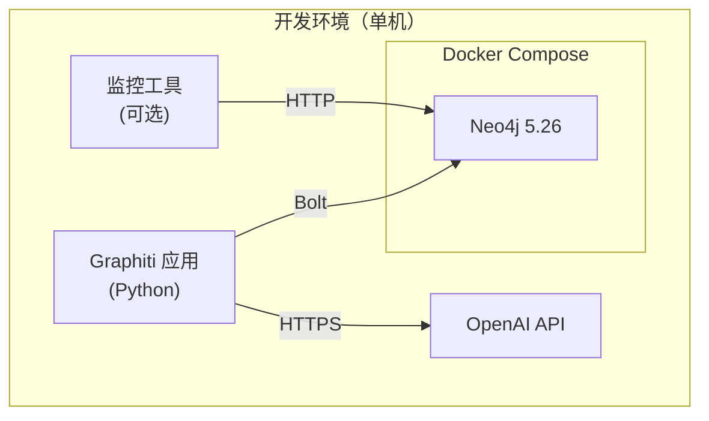

### 生产环境部署

生产环境需要考虑高可用性、可扩展性和安全性。Graphiti 支持多种生产部署架构，开发者可以根据实际需求选择合适的方案。

**方案一：独立 Neo4j 集群**。Neo4j 可以部署为因果集群模式，包含核心服务器和只读副本。这种架构提供高可用性和读写分离，所有写入操作路由到核心节点，读取操作可以分散到只读副本。Graphiti 应用部署为无状态服务，可以通过负载均衡器进行水平扩展。

**方案二：FalkorDB 集群**。FalkorDB 基于 Redis Cluster 构建，提供高可用和自动故障转移。Graphiti 应用连接到 FalkorDB 集群的入口节点，Redis 集群在内部处理请求路由和故障恢复。

**方案三：Amazon Neptune**。完全托管的图数据库服务，无需运维。Graphiti 通过 Neptune 的 endpoint 连接，同时使用 OpenSearch Serverless 进行全文搜索。AWS 提供多可用区部署和高可用保障。

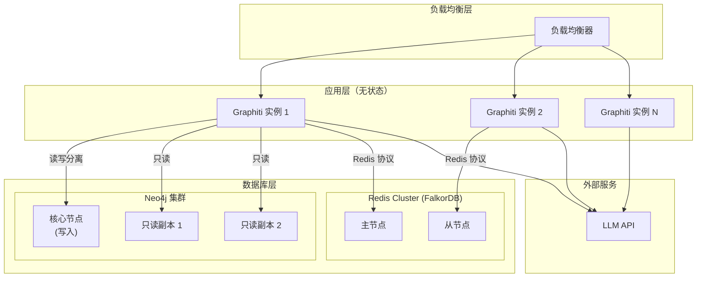

### MCP Server 部署

Graphiti 提供了 MCP（Model Context Protocol）Server 实现，允许 AI 助手（如 Claude、Cursor）直接访问知识图谱功能。MCP Server 可以独立部署，通过标准 MCP 协议与 AI 客户端通信。

MCP Server 部署需要以下组件：MCP Server 进程（Python 应用）、Graphiti 核心库和图数据库连接。MCP Server 暴露以下工具：add_episode（添加数据）、search（搜索知识）、get_episodes（获取历史）和 delete_episode（删除数据）。

部署方式可以是本地开发（通过 stdio 连接到 AI 客户端）或生产部署（通过 HTTP/SSE 协议提供远程访问）。生产部署建议使用反向代理和身份验证，确保 API 安全。

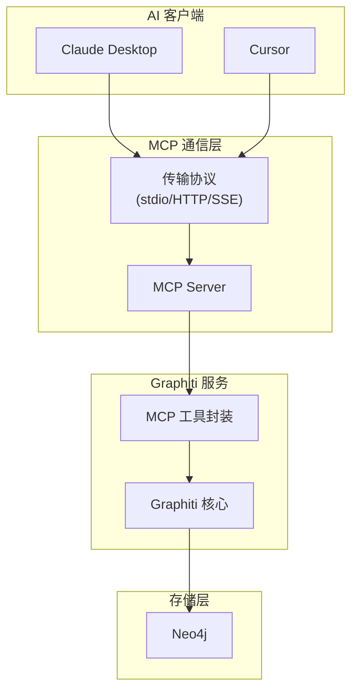

## 数据模型架构

### 知识图谱数据模型

Graphiti 的知识图谱数据模型围绕几个核心概念构建：节点（Node）、边（Edge）和属性（Property）。节点表示实体或事件，边表示实体之间的关系，属性存储节点的附加信息。

实体节点（EntityNode）是知识图谱的基本单元，每个实体有唯一的 UUID、名称、名称嵌入向量和摘要。实体可以附加任意数量的自定义属性，这些属性通过 Pydantic 模型定义，支持类型验证和文档化。

关系边（EntityEdge）连接两个实体节点，表示它们之间的关系。每条边有事实描述（fact）和关系类型（name），事实描述是对关系的人工可读描述。边同样可以附加自定义属性，支持更丰富的语义表达。

时间信息是 Graphiti 数据模型的重要组成部分。valid_at 表示事实成立的时间，invalid_at 表示事实失效的时间。当新数据与旧数据冲突时，Graphiti 不是删除旧数据，而是标记其 invalid_at 时间戳，保持历史完整性。

社区节点（CommunityNode）提供高一层的抽象，将语义相关的实体聚合成社区。社区有名称嵌入和摘要，用于快速检索相关主题。社区边（CommunityEdge）连接社区和成员实体。

情节节点（EpisodicNode）存储原始数据片段，包含内容、来源和时间戳。情节边（EpisodicEdge）连接情节和从中提取的实体，表示实体在该情节中被提及。这种设计使得知识图谱可以追溯到原始数据源。

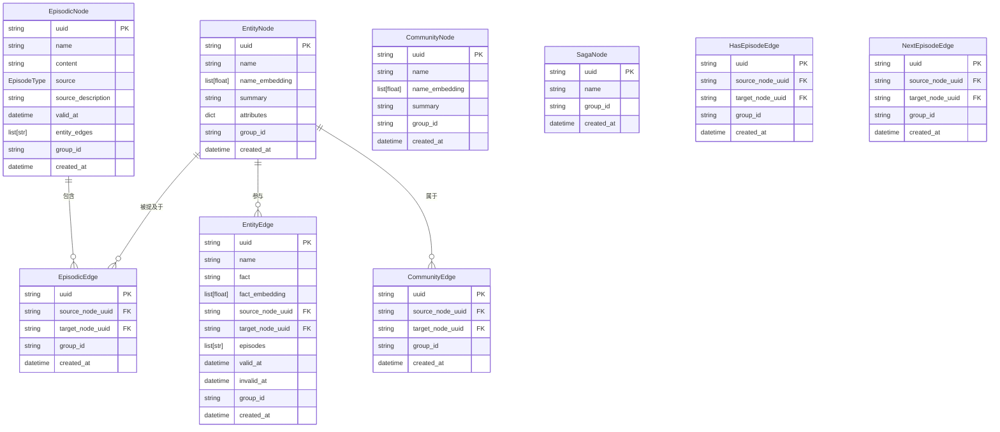

### 分区与隔离模型

Graphiti 通过 group_id 机制实现数据分区和隔离。每个节点和边都属于一个 group_id，查询默认只返回相同 group_id 的数据。这种设计支持多租户场景和逻辑数据隔离。

group_id 通常对应于用户 ID、租户 ID 或其他业务标识符。当调用 add_episode 时，如果不指定 group_id，系统会使用数据库驱动提供的默认值。当调用 search 时，如果不指定 group_ids，系统会使用默认分组。

通过 @handle_multiple_group_ids 装饰器，Graphiti 支持在单个请求中查询多个 group_id 的数据。这对于跨用户搜索或聚合分析场景很有用。装饰器会解析输入的 group_ids 参数，并将其转换为数据库查询。

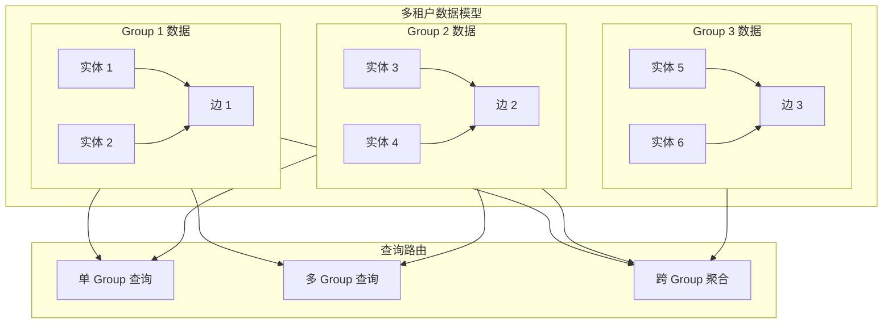

## 搜索配置架构

### SearchConfig 结构

SearchConfig 是 Graphiti 搜索功能的核心配置类，定义了搜索的各个层面和行为。理解 SearchConfig 的结构对于优化搜索效果至关重要。

SearchConfig 包含四个层次的配置对象，每个对象对应一种图元素类型：edge_config（边搜索配置）、node_config（节点搜索配置）、episode_config（片段搜索配置）和 community_config（社区搜索配置）。每层配置都是独立的，可以单独启用或禁用。

每层搜索配置包含搜索方法列表和重排序器。搜索方法定义了如何从数据库中检索候选结果，包括 BM25（关键词搜索）、cosine_similarity（向量搜索）和 BFS（图遍历搜索）。重排序器定义了如何对候选结果进行二次排序，包括 RRF（排名融合）、MMR（最大边际相关）和 Cross-Encoder（交叉编码器）。

limit 参数控制返回结果的最大数量，默认为 10。offset 参数用于分页查询。center_node_uuid 参数用于基于节点距离的重排序，指定中心节点后，搜索结果会优先返回与中心节点在图上更接近的结果。

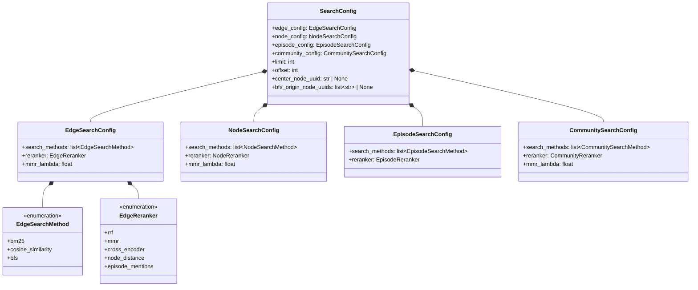

### 搜索配置 Recipes

Graphiti 提供了多种预定义的搜索配置（Recipes），针对不同的使用场景进行了优化。这些 Recipes 可以直接使用，也可以作为自定义配置的基础。

**COMBINED_HYBRID_SEARCH_CROSS_ENCODER** 是功能最全面的搜索配置。它在边、节点和社区三个层次执行混合搜索（BM25 + 向量 + BFS），并使用 Cross-Encoder 进行重排序。这种配置适合需要高召回率和高精度的场景，但计算开销也最大。

**COMBINED_HYBRID_SEARCH_RRF** 使用 RRF 代替 Cross-Encoder 进行重排序。RRF 是一种轻量级的排名融合算法，不需要额外的模型调用。这种配置在保持较好效果的同时，大幅降低了计算成本。

**COMBINED_HYBRID_SEARCH_MMR** 在 RRF 的基础上使用 MMR（Max Marginal Relevance）增加结果多样性。MMR 会惩罚与已选结果相似的结果，确保返回结果覆盖更多不同方面。这种配置适合探索性查询。

**EDGE_HYBRID_SEARCH_RRF** 只搜索边，跳过节点和社区层。这种配置专注于实体关系查询，适合只需要关系知识的场景。计算量只有完整配置的三分之一左右。

**EDGE_HYBRID_SEARCH_NODE_DISTANCE** 使用节点距离作为重排序依据。当查询中指定了 center_node_uuid 时，结果会优先返回与中心节点直接相连或距离较近的边。这种配置适合基于上下文的检索。

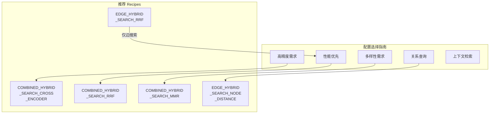

## 扩展性架构

### 插件式组件设计

Graphiti 的核心架构采用插件式设计，关键组件都可以替换和扩展。这种设计使得框架能够适应不同的使用场景和技术选型。

**LLM 客户端插件**：通过继承 LLMClient 抽象类并实现 required 方法，可以支持新的 LLM 提供商。需要实现的方法包括 generate（生成文本）、structured_output（生成结构化输出）和 set_tracer（设置追踪器）。

**Embedder 客户端插件**：通过继承 EmbedderClient 抽象类并实现 create 和 create_batch 方法，可以支持新的嵌入模型。嵌入客户端需要处理 API 认证、批处理和错误重试。

**数据库驱动插件**：通过继承 GraphDriver 抽象类并实现 execute_query 和 build_indices_and_constraints 方法，可以支持新的图数据库。数据库驱动是最复杂的插件类型，需要处理查询语言差异、数据格式转换和特定数据库优化。

**重排序器插件**：通过继承 CrossEncoderClient 抽象类并实现 rerank 方法，可以实现新的重排序策略。重排序器相对简单，只需要实现单一的 rerank 接口。

```mermaid
graph TB
    subgraph 核心["Graphiti 核心"]
        C["Graphiti\n主类"]
    end

    subgraph 插件接口["插件接口层"]
        LLM["LLMClient\n抽象类"]
        EMB["EmbedderClient\n抽象类"]
        DRV["GraphDriver\n抽象类"]
        RER["CrossEncoder\n抽象类"]
    end

    subgraph 官方实现["官方实现"]
        O1["OpenAIClient"]
        O2["Neo4jDriver"]
        O3["OpenAIEmbedder"]
        O4["OpenAIReranker"]
    end

    subgraph 自定义插件["自定义扩展"]
        E1["CustomLLMClient"]
        E2["CustomDriver"]
        E3["CustomEmbedder"]
    end

    C --> LLM
    C --> EMB
    C --> DRV
    C --> RER

    LLM <|-- O1
    LLM <|-- E1

    EMB <|-- O3
    EMB <|-- E3

    DRV <|-- O2
    DRV <|-- E2
```

### 自定义实体类型扩展

Graphiti 支持通过 Pydantic 模型定义自定义实体类型，这使得知识图谱能够适应特定领域的需求。实体类型扩展涉及三个方面：定义类型、注册类型和使用类型。

定义实体类型需要创建 Pydantic BaseModel 的子类。模型字段对应实体的属性，需要提供类型注解和可选的描述。Graphiti 会自动从类名生成类型标识符，从字段名和类型注解生成属性定义。

注册实体类型需要将类型字典传递给 add_episode 方法。字典的键是类型名称，值是 Pydantic 模型类。Graphiti 会在处理过程中使用这些定义进行属性验证和类型检查。

使用自定义实体类型后，抽取的实体如果匹配类型定义，会被赋予相应的类型标签。属性提取阶段会提取模型中定义的字段作为实体属性。这些属性会与标准属性（name、summary 等）一起存储和检索。

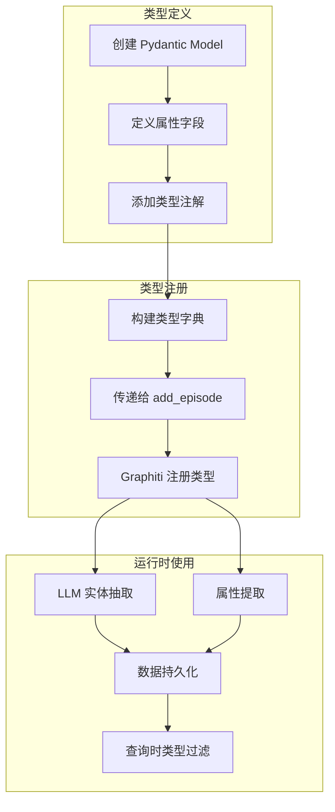
