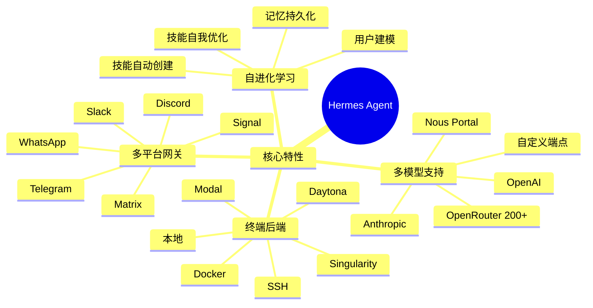

# Hermes Agent 项目介绍

## 为什么 (Why)

### 项目解决的问题

Hermes Agent 是由 **Nous Research** 开发的**自进化 AI 代理系统**，旨在解决以下核心问题：

1. **现有 AI 助手缺乏持续学习能力**
   - 传统 AI 助手无法从交互经验中学习
   - 无法创建和使用技能来应对复杂任务
   - 跨会话记忆和知识持久化能力不足

2. **平台锁定和部署限制**
   - 用户被绑定在特定的模型提供商
   - 本地运行需要昂贵的 GPU 资源
   - 无法在不同设备间无缝切换

3. **多平台消息渠道割裂**
   - 用户需要在多个平台间切换与 AI 交互
   - 缺乏统一的代理体验
   - 对话历史和上下文无法同步

4. **技能系统缺失**
   - 无法创建可重用的自动化技能
   - 复杂任务需要手动拆解和执行
   - 缺乏技能自我优化机制

### 项目背景和动机

Nous Research 团队认为，AI 代理的未来在于**自主学习和持续进化**。Hermes Agent 的设计理念是：

- **让 AI 从经验中学习**：通过内置的学习循环，代理能够创建技能、优化技能，并在使用过程中持续改进
- **打破平台壁垒**：支持多种消息平台（电报、Discord、Slack 等），实现真正的全平台体验
- **降低使用门槛**：能够在 $5 VPS 到 GPU 集群的各种硬件上运行，支持无服务器架构

### 目标用户

| 用户类型 | 使用场景 |
|---------|--------|
| 开发者 | 代码开发、自动化任务、CI/CD 集成 |
| 研究人员 | 强化学习实验、轨迹生成、模型训练 |
| 企业用户 | 自动化工作流、客服集成、团队协作 |
| 高级用户 | 跨平台代理、自定义技能、系统管理 |

---

## 是什么 (What)

### 核心功能概述

Hermes Agent 是一个具有以下特性的**自进化 AI 代理系统**：



### 主要功能特性

#### 1. 真正的终端界面

完整的 TUI（文本用户界面），具有以下特性：

- 多行编辑和斜杠命令自动补全
- 对话历史浏览和搜索
- 中断和重定向功能
- 流式工具输出显示

#### 2. 自进化学习闭环

Hermes Agent 的核心创新：

| 功能 | 描述 |
|-----|------|
| 技能创建 | 复杂任务完成后自动创建可复用技能 |
| 技能优化 | 技能在使用过程中持续改进 |
| 记忆管理 | Agent 引导的周期性记忆提醒 |
| 会话搜索 | FTS5 全文搜索 + LLM 摘要 |
| 用户建模 | Honcho 框架实现的用户画像 |

#### 3. 定时自动化

内置 cron 调度器，支持：

- 自然语言定义定时任务
- 多平台消息推送
- 每日报告、每周审计等自动化场景

#### 4. 子代理委派

- 生成隔离的子代理并行处理工作流
- Python 脚本通过 RPC 调用工具
- 零上下文消耗的并行执行

#### 5. 研究支持

专为 AI 研究设计的功能：

- 批量轨迹生成
- Atropos RL 环境集成
- 轨迹压缩用于训练下一代模型

### 技术栈概览

| 层级 | 组件 |
|------|------|
| 前端接口 | CLI (TUI) - 交互式命令行界面, Gateway - 多平台消息网关 |
| 核心层 | AIAgent - 主代理循环 (9000+ 行), Model Adapters - 多模型适配器, Context Engine - 上下文管理, Memory Manager - 记忆系统 |
| 工具层 (40+ 工具) | 文件操作, 终端操作, 浏览器自动化, Web 工具, 技能管理, 特殊工具 |
| 模型提供商 | OpenAI, Anthropic, Google, OpenRouter (200+ 模型), AWS Bedrock, Nous Portal |

### 与竞品的差异化

| 特性 | Hermes Agent | 普通 AI 助手 | 商业 AI Agent |
|-----|-------------|-------------|--------------|
| 自进化技能 | 自动创建优化 | 固定能力 | 部分支持 |
| 多平台网关 | 10+ 平台 | 仅单一接口 | 有限支持 |
| 部署灵活性 | VPS 到云端 | 依赖云服务 | 固定部署 |
| 开源程度 | 完全开源 MIT | 部分开源 | 封闭 |
| 学习闭环 | 内置记忆系统 | 无 | 基础记忆 |

---

## 怎么做 (How)

### 快速开始

#### 安装（Linux/macOS/WSL2）

```bash
# 一键安装脚本
curl -fsSL https://raw.githubusercontent.com/NousResearch/hermes-agent/main/scripts/install.sh | bash

# 重新加载 shell
source ~/.bashrc

# 启动交互式 CLI
hermes
```

#### 开发者安装

```bash
# 克隆仓库
git clone https://github.com/NousResearch/hermes-agent.git
cd hermes-agent

# 初始化子模块
git submodule update --init mini-swe-agent

# 安装 uv 包管理器
curl -LsSf https://astral.sh/uv/install.sh | sh

# 创建虚拟环境
uv venv .venv --python 3.11
source .venv/bin/activate

# 安装依赖
uv pip install -e ".[all,dev]"
uv pip install -e "./mini-swe-agent"

# 运行测试
python -m pytest tests/ -q
```

### 核心使用方式

#### 命令行基础操作

| 命令 | 功能 |
|-----|------|
| `hermes` | 启动交互式 CLI |
| `hermes model` | 选择 LLM 提供商和模型 |
| `hermes tools` | 配置启用的工具 |
| `hermes gateway` | 启动消息网关 |
| `hermes setup` | 运行完整设置向导 |
| `hermes update` | 更新到最新版本 |
| `hermes doctor` | 诊断问题 |

#### 对话命令

| 命令 | 功能 |
|-----|------|
| `/new` 或 `/reset` | 开始新的对话 |
| `/model [provider:model]` | 切换模型 |
| `/personality [name]` | 设置人格 |
| `/retry` / `/undo` | 重试或撤销 |
| `/compress` | 压缩上下文 |
| `/usage` / `/insights` | 查看使用统计 |
| `/skills` 或 `/` | 浏览技能列表 |

### 消息网关配置

#### Telegram 集成

```bash
# 启动网关设置向导
hermes gateway setup

# 或手动配置
hermes config set GATEWAY_TELEGRAM_BOT_TOKEN your_token
hermes gateway start
```

#### Discord 集成

```bash
hermes config set GATEWAY_DISCORD_BOT_TOKEN your_token
hermes config set GATEWAY_DISCORD_ALLOWED_GUILDS your_guild_id
```

### 技能系统使用

#### 查看可用技能

```
hermes> /skills
hermes> /
```

#### 创建新技能

```markdown
# skill: my-automation
---
name: 我的自动化技能
description: 执行特定重复任务
platform: [cli, telegram, discord]
---
你是一个自动化助手，擅长...
```

### 关键配置说明

#### 配置文件位置

```
~/.hermes/
├── config.yaml          # 主配置文件
├── .env                 # 环境变量/密钥
├── SOUL.md              # Agent 人格定义
├── MEMORY.md            # 持久记忆
├── USER.md              # 用户画像
├── BOOT.md              # 启动时执行
└── skills/              # 技能目录
```

#### 重要配置项

| 配置项 | 描述 | 示例 |
|-------|------|------|
| `DEFAULT_MODEL` | 默认模型 | `openrouter:anthropic/claude-3` |
| `ENABLED_TOOLSETS` | 启用的工具集 | `web,terminal,file` |
| `MEMORY_PROVIDER` | 记忆提供者 | `honcho` |
| `GATEWAY_PLATFORMS` | 启用的消息平台 | `telegram,discord` |

### 最佳实践建议

#### 1. 安全使用

- **不要**在 AGENTS.md/SOUL.md 中使用不可信的外部引用
- 项目内置**上下文威胁检测**，会扫描提示注入攻击
- 使用命令白名单限制工具执行权限

#### 2. 性能优化

```bash
# 定期压缩上下文
hermes> /compress

# 查看使用情况
hermes> /insights --days 7

# 配置上下文预算
hermes config set MAX_CONTEXT_TURNS 50
```

#### 3. 记忆管理

```
最佳实践：
- 在 MEMORY.md 中保存声明性事实
- 定期使用 /compress 清理上下文
- 为项目创建专门的 .hermes.md
- 利用会话搜索跨对话回忆
```

### 故障排除

```bash
# 运行诊断
hermes doctor

# 查看日志
hermes logs --component agent

# 检查配置
hermes config show

# 从 OpenClaw 迁移
hermes claw migrate --dry-run
```

---

## 总结

Hermes Agent 代表了 AI 代理发展的新方向——**自进化**。它不仅是一个功能强大的 AI 助手，更是一个能够：

- 从经验中学习
- 创建和优化技能
- 在任意平台上运行
- 支持企业级部署

的开源系统。无论是个人用户还是企业团队，Hermes Agent 都提供了一个灵活、可扩展的 AI 代理解决方案。

**项目地址**: https://github.com/NousResearch/hermes-agent
**文档地址**: https://hermes-agent.nousresearch.com/docs/
**社区 Discord**: https://discord.gg/NousResearch