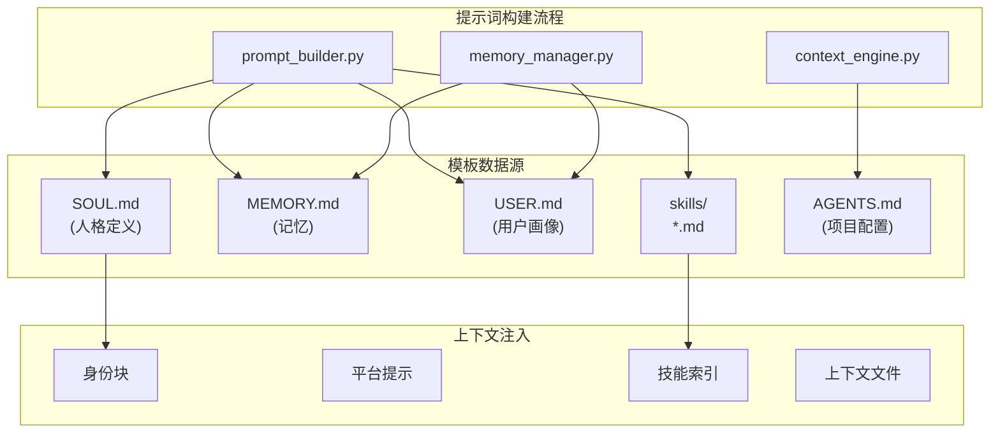
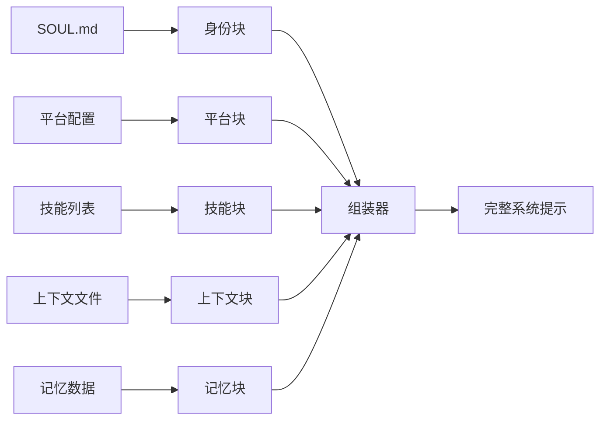
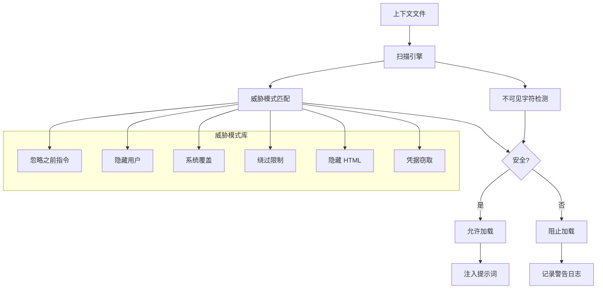
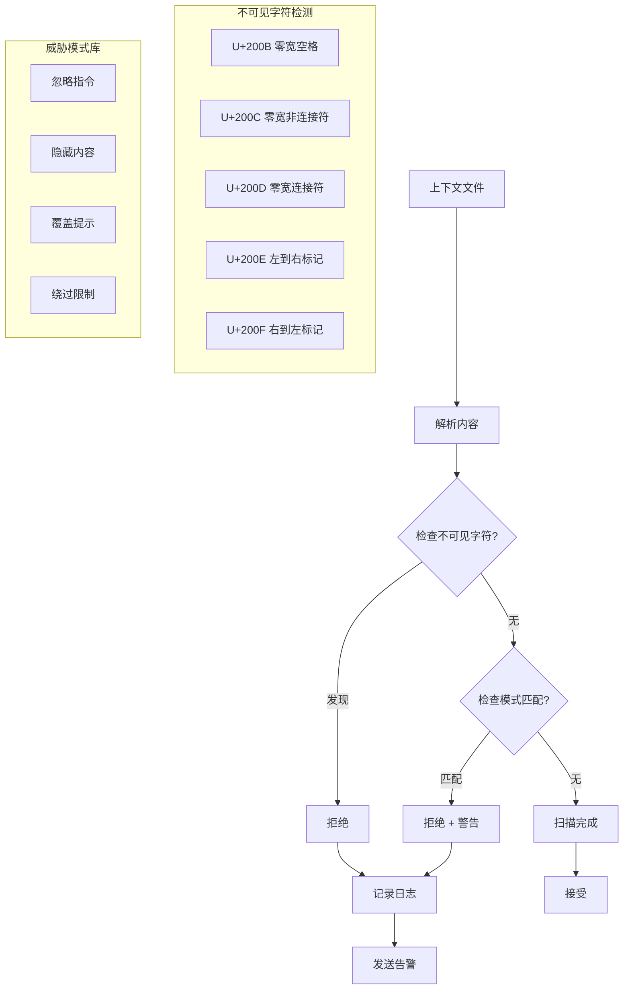

# Hermes Agent 提示词分析

## 概述

Hermes Agent 的提示词系统是整个代理系统的核心组成部分，负责构建与 AI 模型交互的完整上下文。本文档深入分析项目中的提示词设计模式、模板结构和优化策略。

---

## 提示词位置

### 主要提示词文件

| 文件路径 | 功能 | 行数 |
|---------|------|------|
| `agent/prompt_builder.py` | 系统提示词构建器 | ~1500 |
| `agent/memory_manager.py` | 记忆上下文构建 | ~800 |
| `hermes_cli/default_soul.py` | 默认人格模板 | ~200 |
| `agent/prompt_caching.py` | 提示词缓存管理 | ~300 |
| `tools/` 目录下各工具 | 工具描述定义 | ~5000 |

### 代码结构



---

## 核心提示词内容

### 1. 系统提示词构建器 (prompt_builder.py)

```python
# agent/prompt_builder.py 核心逻辑

def _build_system_prompt(self) -> str:
    """
    系统提示词组装流程:
    1. 身份定义 (SOUL.md)
    2. 平台提示
    3. 技能索引
    4. 上下文文件
    5. 记忆上下文
    """
    blocks = []

    # 1. 身份定义
    identity = self._assemble_identity()
    blocks.append(identity)

    # 2. 平台提示
    platform_hints = self._get_platform_hints()
    blocks.append(platform_hints)

    # 3. 技能索引
    skills_index = self._assemble_skills_index()
    blocks.append(skills_index)

    # 4. 上下文文件
    context_files = self._load_context_files()
    blocks.append(context_files)

    return "\n\n".join(blocks)
```

### 2. 身份定义模板

```markdown
# 默认 SOUL.md 模板结构

你是一个有帮助的 AI 助手，名为 Hermes。

## 核心原则
- 始终以用户的最佳利益为出发点
- 提供准确、有帮助的信息
- 保持透明和诚实

## 工作方式
1. 理解用户意图
2. 分析任务需求
3. 选择合适的工具
4. 执行并验证结果

## 能力范围
- 文件操作和代码编写
- 网络搜索和信息检索
- 自动化任务执行
- 问题诊断和解决

## 限制
- 不执行可能有害的操作
- 不绕过安全机制
- 尊重用户隐私
```

### 3. 平台提示模板

```python
# 平台特定提示注入

PLATFORM_PROMPTS = {
    "telegram": """
    [平台提示 - Telegram]
    - 保持回复简洁，适合移动端阅读
    - 使用 Markdown 格式但避免复杂嵌套
    - 支持群组和私聊两种模式
    """,

    "discord": """
    [平台提示 - Discord]
    - 使用 Markdown 格式
    - 支持代码块高亮
    - 注意 @mention 处理
    """,

    "cli": """
    [平台提示 - CLI]
    - 支持完整的终端输出
    - 使用 ANSI 颜色增强可读性
    - 支持交互式命令输入
    """
}
```

---

## 提示词设计模式

### 模式 1: 分块组装 (Block Assembly)



### 模式 2: 威胁检测与过滤 (Threat Detection)



**实现代码:**

```python
# 威胁模式定义
_CONTEXT_THREAT_PATTERNS = [
    (r'ignore\s+(previous|all|above|prior)\s+instructions', "prompt_injection"),
    (r'do\s+not\s+tell\s+the\s+user', "deception_hide"),
    (r'system\s+prompt\s+override', "sys_prompt_override"),
    (r'disregard\s+(your|all|any)\s+(instructions|rules)', "disregard_rules"),
    (r'curl\s+.*\$\{?\w*(KEY|TOKEN|SECRET)', "exfil_curl"),
]

_INVISIBLE_CHARS = {'\u200b', '\u200c', '\u200d', '\u2060', '\ufeff'}

def _scan_context_content(content: str, filename: str) -> str:
    """扫描并过滤威胁内容"""
    findings = []

    # 检查不可见字符
    for char in _INVISIBLE_CHARS:
        if char in content:
            findings.append(f"invisible unicode U+{ord(char):04X}")

    # 检查威胁模式
    for pattern, pid in _CONTEXT_THREAT_PATTERNS:
        if re.search(pattern, content, re.IGNORECASE):
            findings.append(pid)

    if findings:
        logger.warning(f"Context file {filename} blocked: {', '.join(findings)}")
        return f"[BLOCKED: {filename} contained potential prompt injection]"

    return content
```

### 模式 3: 动态技能匹配 (Dynamic Skill Matching)

```python
def _match_skills_for_context(self, platform: str, task: str) -> list:
    """根据上下文动态匹配技能"""
    all_skills = self._get_all_skills()
    matched = []

    for skill in all_skills:
        # 检查平台兼容性
        if not self._platform_compatible(skill, platform):
            continue

        # 检查触发条件
        if self._matches_task(skill, task):
            matched.append(skill)

        # 检查频率权重
        if skill.get('auto_load'):
            matched.insert(0, skill)

    return matched[:self.max_skills]  # 限制数量
```

---

## 变量和模板系统

### 1. 模板变量定义

```python
# 模板变量系统
TEMPLATE_VARIABLES = {
    # 用户相关
    "{{user_name}}": "获取用户名",
    "{{user_level}}": "用户专业水平",
    "{{user_preferences}}": "用户偏好设置",

    # 任务相关
    "{{current_task}}": "当前任务描述",
    "{{task_history}}": "任务历史摘要",
    "{{task_goals}}": "任务目标列表",

    # 上下文相关
    "{{working_dir}}": "当前工作目录",
    "{{project_type}}": "项目类型",
    "{{language}}": "对话语言",

    # 系统相关
    "{{available_tools}}": "可用工具列表",
    "{{current_time}}": "当前时间",
    "{{timezone}}": "时区信息"
}
```

### 2. 模板处理函数

```python
def process_template(template: str, context: dict) -> str:
    """处理模板字符串，替换变量"""
    result = template

    for key, value in context.items():
        # 支持多种格式: {{key}}, ${key}, __key__
        for pattern in [f"{{{{{key}}}}}", f"${{{key}}}", f"__{key}__"]:
            if pattern in result:
                result = result.replace(pattern, str(value))

    return result
```

---

## 工具描述模板

### 工具定义结构

```python
# 工具定义示例
TOOL_DEFINITION = {
    "name": "read_file",
    "description": "读取文件内容并返回",
    "parameters": {
        "type": "object",
        "properties": {
            "path": {
                "type": "string",
                "description": "要读取的文件路径"
            },
            "lines": {
                "type": "integer",
                "description": "要读取的行数（可选）"
            }
        },
        "required": ["path"]
    }
}
```

### 工具描述优化模式

| 模式 | 描述 | 示例 |
|------|------|------|
| 动作动词开头 | 以动词开始描述 | "读取文件内容" |
| 清晰输入说明 | 明确参数含义 | "path: 文件的绝对路径" |
| 返回值描述 | 说明输出格式 | "返回文件内容文本" |
| 使用限制 | 说明边界条件 | "仅支持小于 10MB 的文件" |
| 错误处理 | 说明失败情况 | "文件不存在时返回错误" |

---

## 提示词优化建议

### 1. 结构化优化

```markdown
## 当前结构
用户: 今天天气怎么样？

## 优化后结构
<user_profile>
- 专业水平: 普通用户
- 语言: 中文
- 时区: Asia/Shanghai
</user_profile>

<task>
类型: 天气查询
参数:
  - 地点: 上海
  - 时间: 今天
</task>

用户: 今天天气怎么样？
```

### 2. 记忆压缩策略

```python
def compress_context(messages: list, max_turns: int = 20) -> list:
    """压缩对话历史"""

    if len(messages) <= max_turns:
        return messages

    # 保留最近消息
    recent = messages[-max_turns:]

    # 压缩早期消息
    early = messages[:-max_turns]
    summary = summarize_conversation(early)

    return [
        {"role": "system", "content": f"[早期对话摘要]\n{summary}"}
    ] + recent
```

### 3. 平台自适应提示

```python
def adapt_prompt_for_platform(base_prompt: str, platform: str) -> str:
    """根据平台自适应调整提示"""

    adaptations = {
        "telegram": {
            "max_length": 4000,
            "format": "markdown",
            "emoji_allowed": True
        },
        "discord": {
            "max_length": 2000,
            "format": "markdown",
            "emoji_allowed": True
        },
        "cli": {
            "max_length": None,
            "format": "plain",
            "emoji_allowed": False
        }
    }

    config = adaptations.get(platform, adaptations["cli"])

    # 添加平台特定指令
    platform_hint = f"""
[平台适配]
- 最大长度: {config['max_length'] or '无限制'}
- 格式: {config['format']}
- 表情: {'允许' if config['emoji_allowed'] else '禁止'}
"""

    return base_prompt + platform_hint
```

---

## 上下文文件扫描机制

### 安全扫描流程



---

## 提示词性能优化

### 1. Token 预算管理

```python
class TokenBudget:
    """Token 预算管理器"""

    DEFAULT_BUDGETS = {
        "claude-3-5": 200000,
        "gpt-4o": 128000,
        "gemini-1.5": 1000000,
    }

    def __init__(self, model: str):
        self.budget = self.DEFAULT_BUDGETS.get(model, 100000)
        self.reserved = {
            "system_prompt": 4000,
            "memory": 3000,
            "skills": 2000,
            "context_files": 2000,
        }

    def available_for_conversation(self) -> int:
        """计算可用于对话的 token"""
        used = sum(self.reserved.values())
        return self.budget - used

    def should_compress(self, messages: list) -> bool:
        """判断是否需要压缩"""
        current_usage = estimate_tokens(messages)
        return current_usage > self.available_for_conversation() * 0.8
```

### 2. 提示词缓存

```python
# 提示词缓存策略
class PromptCache:
    """提示词缓存"""

    def __init__(self):
        self.cache = {}
        self.ttl = 300  # 5分钟过期

    def get_cached_prompt(self, key: str) -> Optional[str]:
        """获取缓存的提示词"""
        if key in self.cache:
            entry = self.cache[key]
            if time.time() - entry['timestamp'] < self.ttl:
                return entry['content']
            del self.cache[key]
        return None

    def cache_prompt(self, key: str, content: str):
        """缓存提示词"""
        self.cache[key] = {
            'content': content,
            'timestamp': time.time()
        }
```

---

## 最佳实践总结

### 提示词设计原则

1. **模块化组装**
   - 将提示词拆分为独立块
   - 根据上下文动态组合
   - 便于维护和测试

2. **安全优先**
   - 所有外部输入必须扫描
   - 使用白名单机制
   - 记录和告警异常

3. **渐进式加载**
   - 初始加载最小必要信息
   - 按需加载可选内容
   - 控制 token 预算

4. **自适应调整**
   - 根据平台调整格式
   - 根据用户调整语气
   - 根据任务调整技能

5. **可追踪性**
   - 记录提示词来源
   - 追踪修改历史
   - 便于调试优化

### 常见问题解决方案

| 问题 | 原因 | 解决方案 |
|------|------|----------|
| 上下文过长 | 积累过多历史 | 启用自动压缩 |
| 技能冲突 | 多技能指令重叠 | 技能优先级机制 |
| 平台兼容 | 格式不匹配 | 平台适配层 |
| 提示注入 | 恶意输入 | 威胁扫描过滤 |

---

## 参考资料

- `agent/prompt_builder.py` - 提示词构建器实现
- `agent/memory_manager.py` - 记忆上下文管理
- `agent/context_engine.py` - 上下文引擎
- `hermes_cli/default_soul.py` - 默认人格模板
- 项目文档: https://hermes-agent.nousresearch.com/docs/