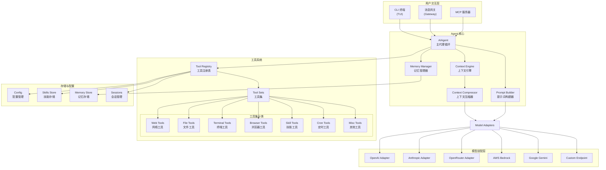
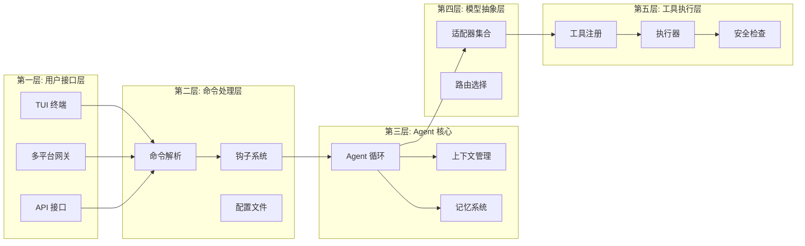
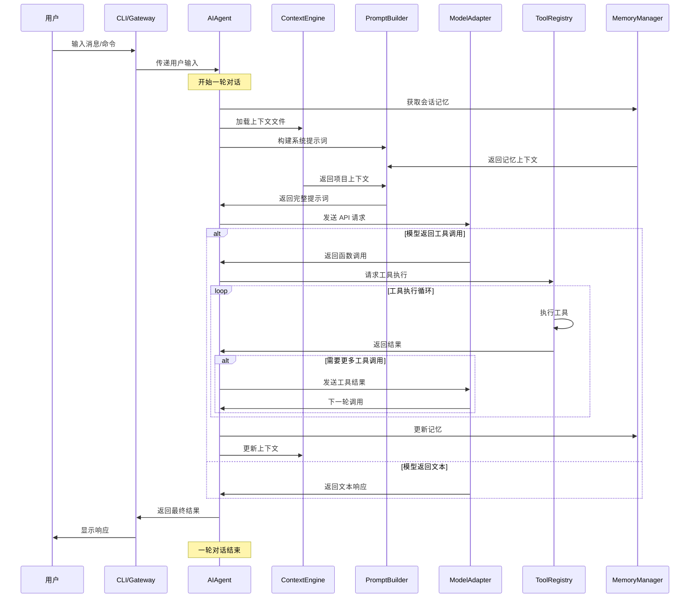
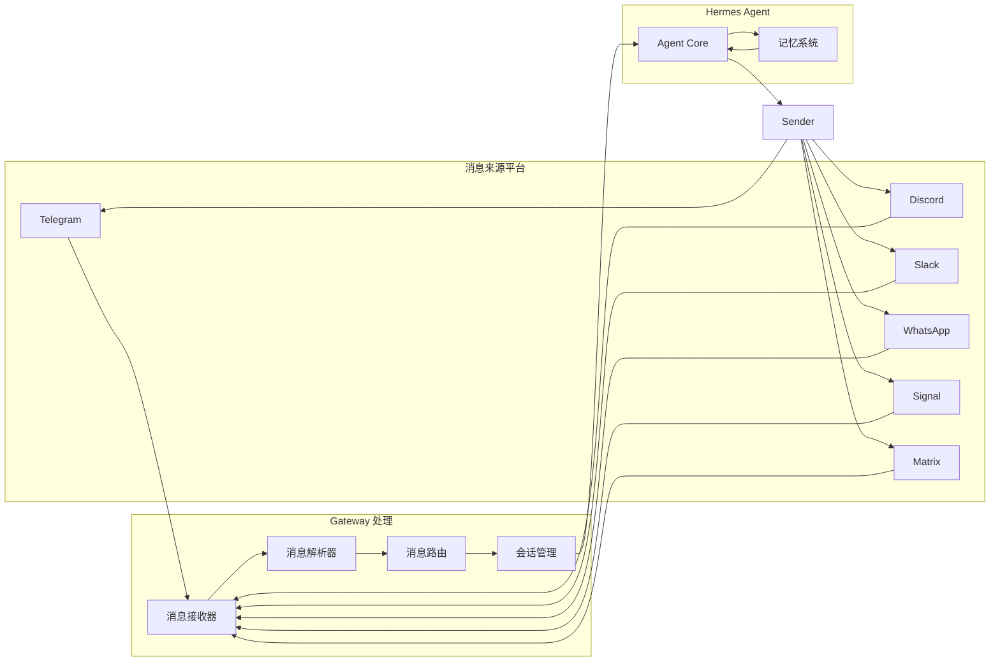
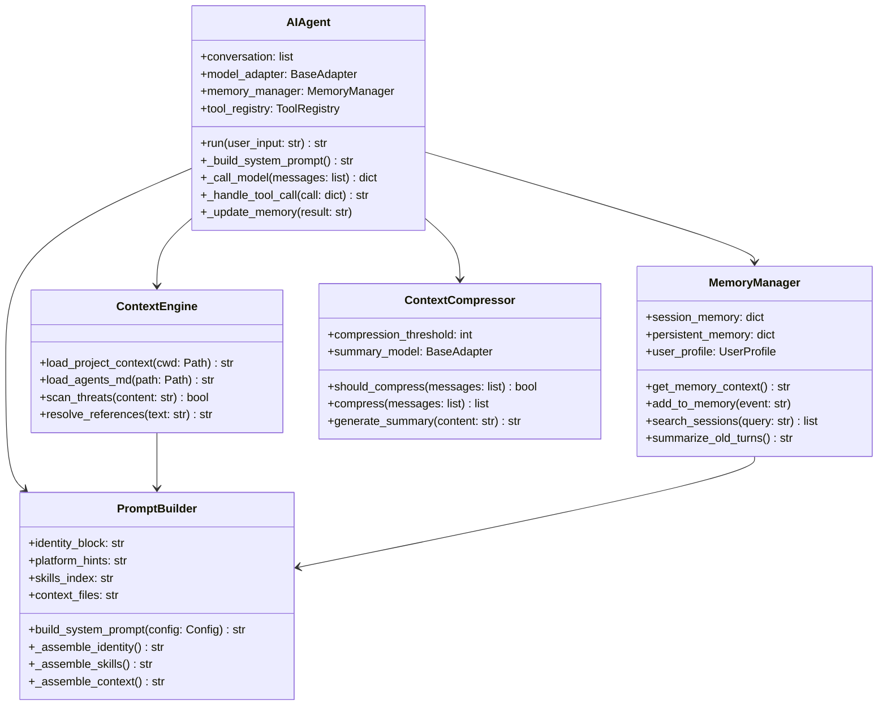
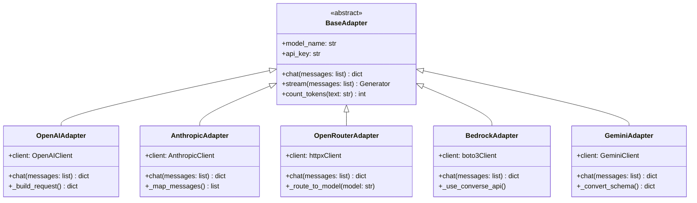
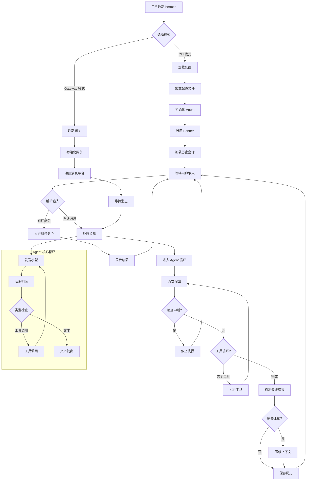
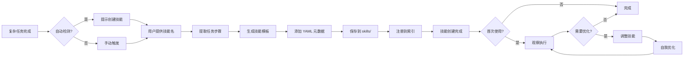
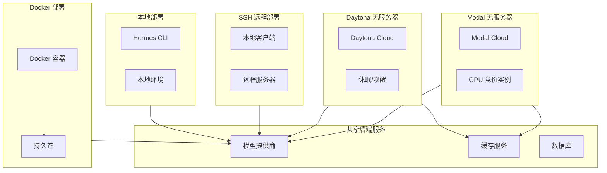

# Hermes Agent 架构文档

## 系统整体架构

### 核心架构概览

### 分层架构详解

---

## 核心数据流图

### 主代理执行流程

### 消息网关数据流

---

## 模块关系图

### Agent 核心模块

### 模型适配器体系

---

## 用户交互流程图

### CLI 交互流程

### 技能创建流程

---

## 部署架构图

### 多种部署模式

---

## 总结

本文档通过多种 Mermaid 图表展示了 Hermes Agent 的完整架构：

1. **系统整体架构**：展示从用户接口到模型适配的完整分层
2. **核心数据流**：展示主代理循环、消息网关、工具执行的详细流程
3. **模块关系图**：展示核心类之间的依赖关系
4. **用户交互流程**：展示 CLI 和 Gateway 的用户交互模式
5. **部署架构**：展示多种部署选项

这些图表可以帮助开发者快速理解 Hermes Agent 的设计理念和实现细节。