# nanobot 架构设计文档

## 一、系统整体架构

nanobot 采用分层模块化架构设计，将功能职责清晰分离。从宏观视角来看，系统由五大核心层组成：用户接入层、消息路由层、Agent 核心层、工具执行层和基础设施层。各层之间通过定义良好的接口进行通信，既保证了系统的内聚性，又实现了组件的可替换性。

系统的核心设计理念是**事件驱动**和**异步处理**。所有外部交互（无论是用户消息还是定时任务触发）都被抽象为事件，通过消息总线（Message Bus）在各模块之间流转。这种设计使得系统能够高效处理并发请求，同时保持代码结构的清晰性。

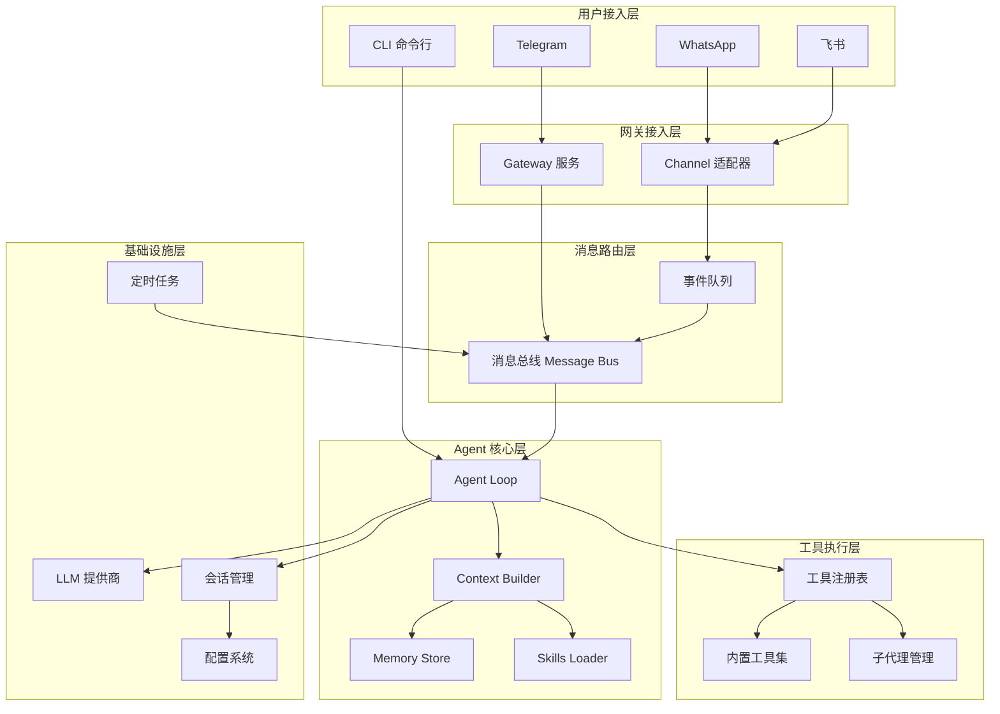

### 1.1 目录结构概览

nanobot 的项目结构经过精心组织，每个目录对应一个功能模块：

```
nanobot/
├── agent/                    # 🧠 Agent 核心逻辑
│   ├── loop.py              #    Agent 循环主逻辑
│   ├── context.py           #    上下文构建器
│   ├── memory.py            #    持久化记忆存储
│   ├── skills.py            #    技能加载器
│   ├── subagent.py          #    背景子代理管理
│   └── tools/               #    内置工具实现
│       ├── base.py          #    工具基类
│       ├── registry.py      #    工具注册表
│       ├── filesystem.py     #    文件系统工具
│       ├── shell.py         #    Shell 执行工具
│       ├── web.py           #    网页搜索/抓取
│       ├── message.py       #    消息发送工具
│       ├── cron.py          #    定时任务工具
│       └── spawn.py         #    子代理启动工具
├── skills/                   # 🎯 技能模板
├── providers/               # 🤖 LLM 提供商
│   ├── base.py             #    Provider 基类
│   ├── litellm_provider.py  #    LiteLLM 实现
│   └── transcription.py    #    语音转录
├── session/                 # 💬 会话管理
├── channels/                # 📱 渠道适配器
├── bus/                     # 🚌 消息总线
├── cron/                    # ⏰ 定时任务服务
├── heartbeat/              # 💓 心跳保活
├── config/                  # ⚙️ 配置管理
└── cli/                     # 🖥️ 命令行接口
```

## 二、核心数据流

### 2.1 消息处理主流程

当用户发送一条消息给 nanobot 时，系统会经历一系列处理步骤。从消息进入系统到最终响应返回，整个流程涉及多个模块的协同工作。理解这一流程对于进行二次开发和问题排查至关重要。

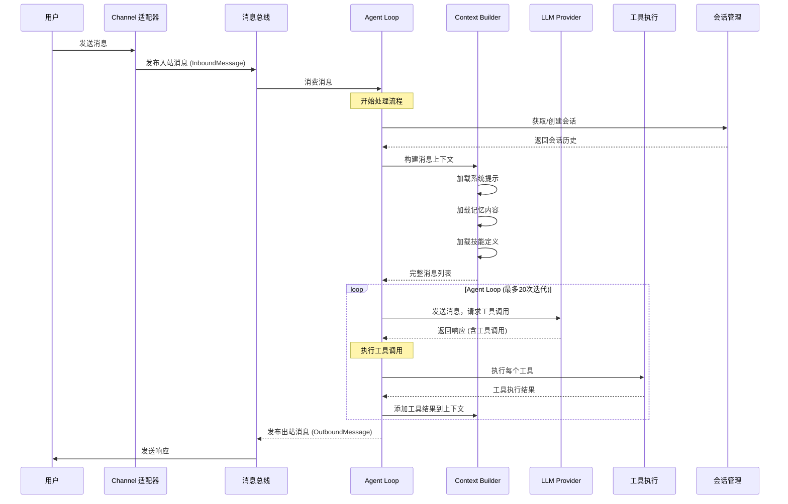

### 2.2 上下文构建流程

上下文构建是 Agent 响应的关键环节。nanobot 的 ContextBuilder 采用渐进式加载策略，将系统提示、用户记忆、对话历史和技能定义整合为统一的上下文。这种设计确保了 Agent 在每次决策时都能获得完整的信息。

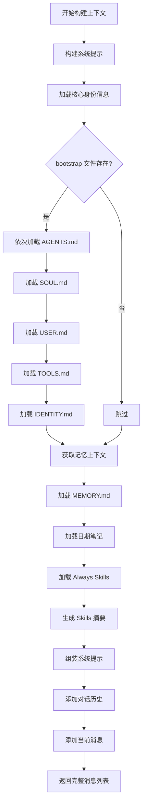

### 2.3 工具执行流程

工具系统是 nanobot 实现功能扩展的核心机制。每个工具都遵循统一的注册、定义和执行接口。Agent 通过调用 LLM 决定需要使用的工具，工具注册表负责定位和执行具体工具，最后将结果返回给 Agent。

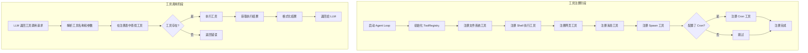

## 三、核心模块关系图

### 3.1 Agent Loop 核心类图

AgentLoop 是整个系统的核心处理器，负责协调各模块的工作。它持有消息总线、LLM 提供商、工作空间、工具注册表等关键组件，通过事件驱动的方式处理每一条用户消息。

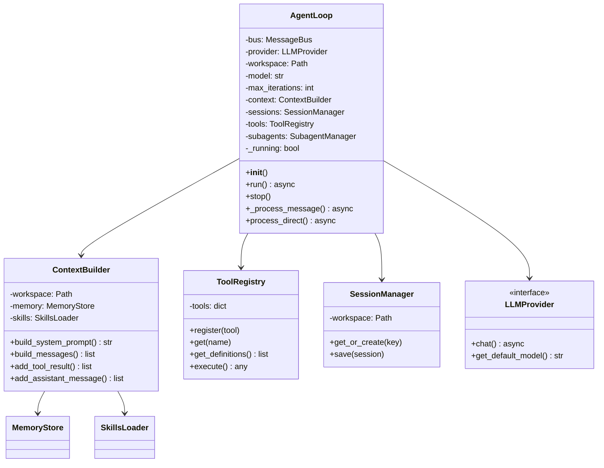

### 3.2 工具基类与实现

nanobot 的工具系统采用模板方法模式设计。BaseTool 定义了工具的通用接口，包括名称、描述、参数模式和执行逻辑。各具体工具继承 BaseTool 并实现抽象方法，即可扩展新的功能。

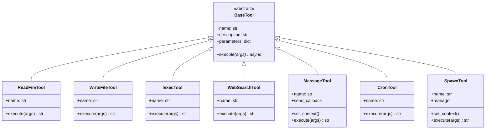

### 3.3 LLM Provider 架构

LLM Provider 采用了适配器模式，通过 LiteLLM 库统一封装了多家 LLM 服务商的接口。这种设计使得添加新的 LLM 服务商变得简单，只需遵循统一的 Provider 接口即可。

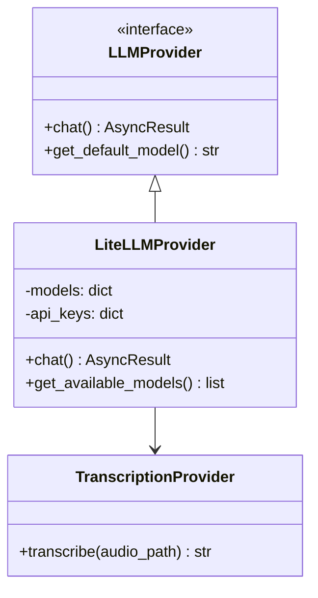

## 四、用户交互流程

### 4.1 首次使用流程

新用户使用 nanobot 的典型流程包含四个步骤：安装、初始化、配置和开始使用。整个流程设计简洁明了，确保用户能够在最短时间内体验到 AI 助手的便利。

```mermaid
flowchart TD
    A[开始使用 nanobot] --> B[安装 nanobot]
    B --> C{安装方式}
    C -->|源码| D[git clone & pip install -e]
    C -->|uv| E[uv tool install nanobot-ai]
    C -->|PyPI| F[pip install nanobot-ai]

    D --> G[nanobot onboard]
    E --> G
    F --> G

    G --> H[创建配置文件 ~/.nanobot/config.json]
    H --> I[创建工作空间 ~/nanobot-workspace/]

    I --> J[配置 LLM API Key]
    J --> K{需要配置渠道?}
    K -->|Telegram| L[创建 BotFather 机器人]
    K -->|WhatsApp| M[执行 channels login]
    K -->|飞书| N[创建飞书应用]
    K -->|否| O[跳过]

    L --> P[配置 Token]
    M --> Q[扫描 QR 码]
    N --> R[配置 App credentials]
    P --> S[保存配置]
    Q --> S
    R --> S
    O --> S

    S --> T{使用场景}
    T -->|命令行对话| U[nanobot agent -m "..."]
    T -->|交互模式| V[nanobot agent]
    T -->|即时通讯| W[nanobot gateway]
```

### 4.2 对话交互流程

用户与 nanobot 的对话交互遵循经典的 Agent 模式：用户提问、Agent 思考、工具执行、结果返回。这一循环可以迭代多次，直至 Agent 得出最终答案。

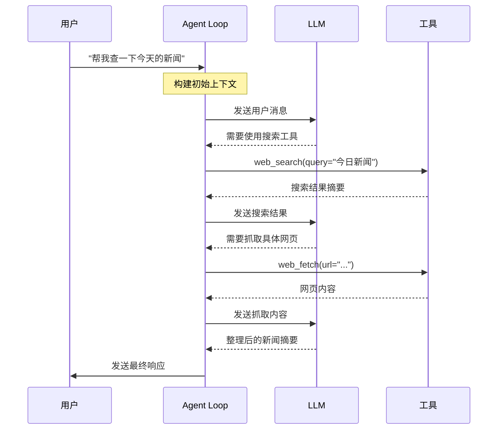

### 4.3 定时任务执行流程

nanobot 的定时任务系统采用独立的 CronService 管理，与 Agent Loop 通过消息总线解耦。这种设计确保了定时任务不会干扰正常的消息处理流程。

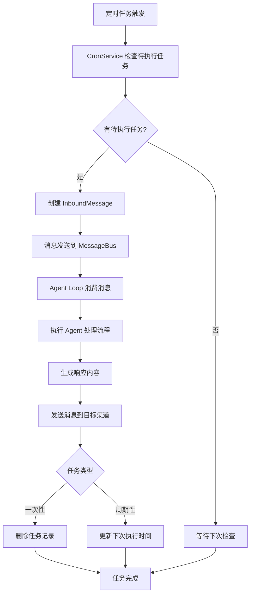

### 4.4 多渠道消息路由

当配置了多个通信渠道时，nanobot 能够统一管理所有渠道的消息入口。用户无论通过哪个渠道发送消息，都能获得一致的 AI 助手体验。

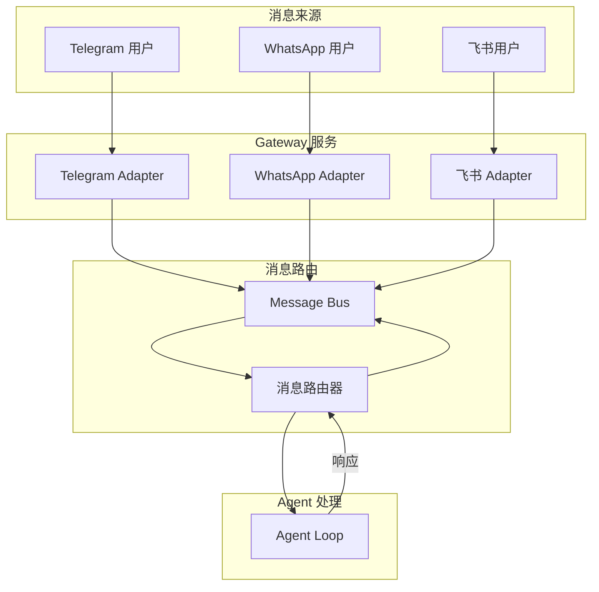

## 五、部署架构

### 5.1 单机部署架构

对于大多数个人用户而言，单机部署是最佳选择。这种部署方式简单直接，无需额外的服务基础设施，就能满足日常使用需求。

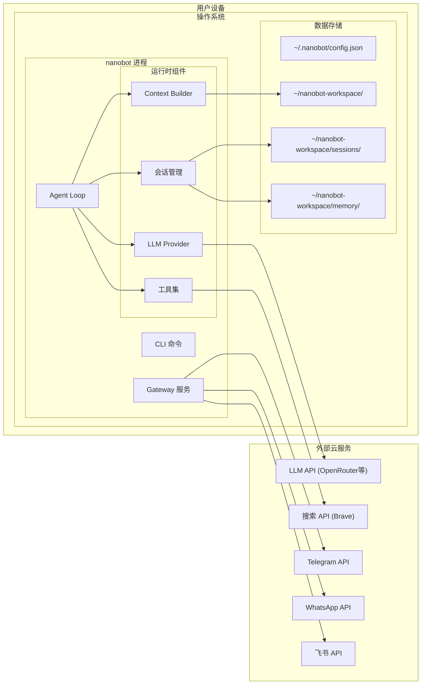

### 5.2 Docker 部署架构

使用 Docker 容器化部署可以提供更好的环境隔离和可移植性。这种方式特别适合需要在多台机器上迁移部署，或希望避免依赖冲突的场景。

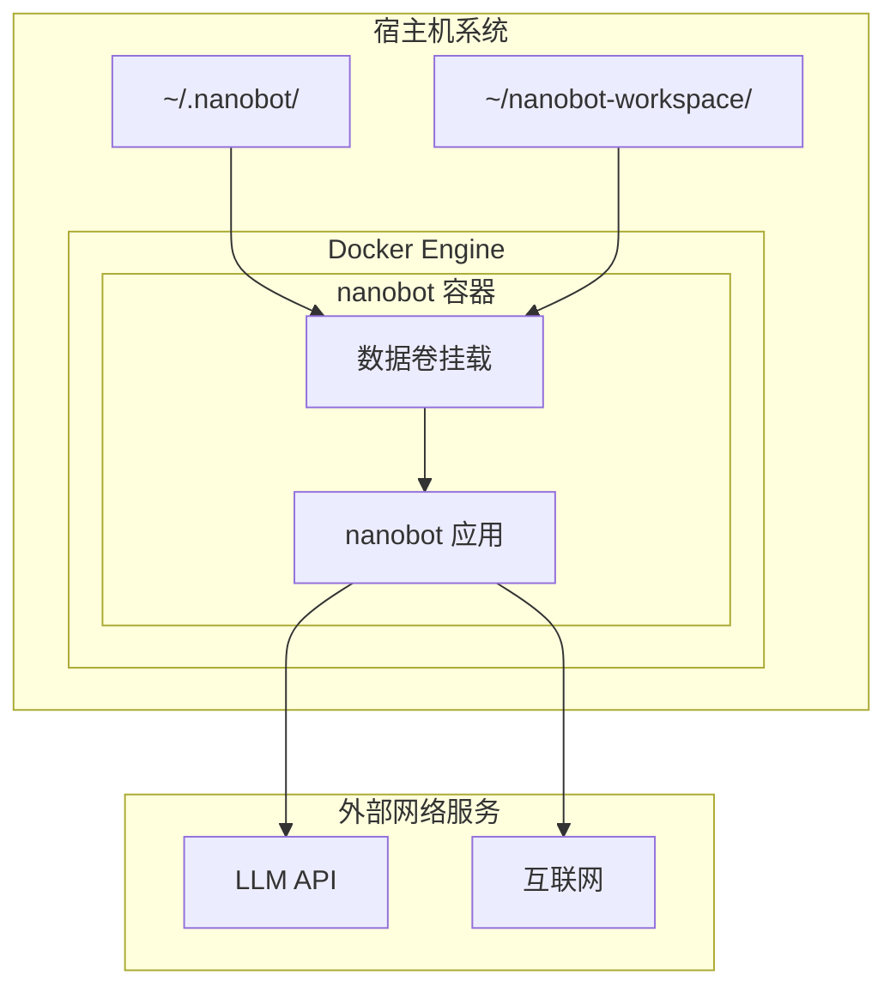

### 5.3 vLLM 本地部署架构

对于有本地 GPU 资源的用户，可以使用 vLLM 部署本地大语言模型，实现完全离线运行。这种架构不依赖外部 LLM API，数据完全保留在本地。

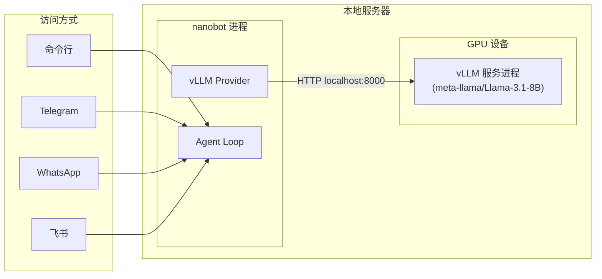

## 六、数据存储结构

### 6.1 工作空间结构

nanobot 的工作空间是用户数据存储的核心位置，包含会话历史、记忆文件、技能配置等重要数据。良好的目录结构设计便于数据管理和备份。

```
nanobot-workspace/
├── sessions/                    # 对话会话历史
│   ├── cli:user1.json          # CLI 用户会话
│   ├── telegram:12345.json      # Telegram 对话
│   └── feishu:ou_xxx.json      # 飞书对话
│
├── memory/                      # 长期记忆存储
│   ├── MEMORY.md               # 重要信息记忆
│   ├── 2026-02-06.md           # 每日笔记
│   └── personality.md          # 个性化配置
│
├── skills/                      # 自定义技能
│   └── github/
│       └── SKILL.md            # GitHub 操作技能
│
├── workspace/                   # 工作文件目录
│   ├── code/                   # 代码文件
│   ├── data/                   # 数据文件
│   └── docs/                   # 文档文件
│
└── bootstrap/                   # 引导配置文件
    ├── AGENTS.md               # Agent 行为配置
    ├── SOUL.md                 # 灵魂/价值观配置
    ├── USER.md                 # 用户信息
    ├── TOOLS.md                # 工具说明
    └── IDENTITY.md             # 身份定义
```

### 6.2 配置结构

配置文件采用 JSON 格式，集中管理所有系统参数。这种设计使得配置管理清晰明了，也便于在不同环境间迁移配置。

```json
{
  "agents": {
    "defaults": {
      "model": "anthropic/claude-opus-4-5",
      "max_iterations": 20
    }
  },
  "providers": {
    "openrouter": {
      "apiKey": "sk-or-v1-xxx"
    },
    "groq": {
      "apiKey": "gsk_xxx"
    }
  },
  "channels": {
    "telegram": {
      "enabled": true,
      "token": "123456:ABC...",
      "allowFrom": ["123456789"]
    },
    "whatsapp": {
      "enabled": false
    },
    "feishu": {
      "enabled": false,
      "appId": "cli_xxx",
      "appSecret": "xxx"
    }
  },
  "tools": {
    "web": {
      "search": {
        "apiKey": "BSA..."
      }
    },
    "exec": {
      "timeout": 60,
      "restrict_to_workspace": true
    }
  }
}
```

## 七、扩展点说明

nanobot 的架构设计预留了多个扩展点，方便开发者根据需求进行定制化开发。这些扩展点遵循开闭原则，对扩展开放，对修改封闭，确保了系统的稳定性和可维护性。

**工具扩展**是最常见的扩展需求。开发者只需继承 BaseTool 类，实现 name、description、parameters 属性和 execute 方法，然后在 AgentLoop 初始化时注册到 ToolRegistry 中，即可添加新的功能工具。

**渠道扩展**支持添加新的通信平台。新的 Channel Adapter 需要实现消息接收和发送接口，并通过 Gateway 服务与 Message Bus 对接。这种设计使得添加微信、Slack 等新渠道变得简单。

**Provider 扩展**允许支持新的 LLM 服务商。实现 LLMProvider 接口并注册到系统中，即可无缝接入新的语言模型服务。

**技能扩展**提供了最高级别的功能扩展能力。通过在 workspace/skills/ 目录下创建新的技能文件夹并编写 SKILL.md 文件，可以定义复杂的多步骤工作流。
