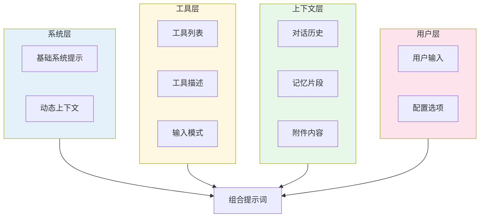
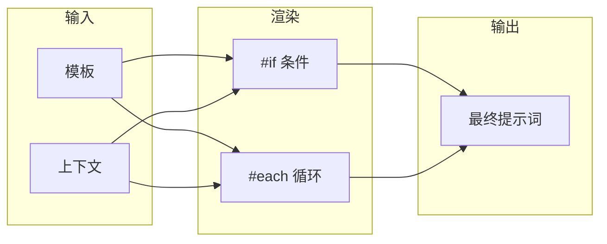
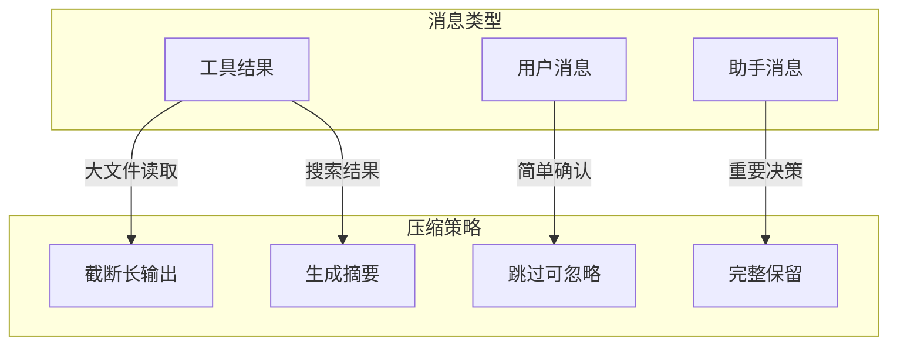
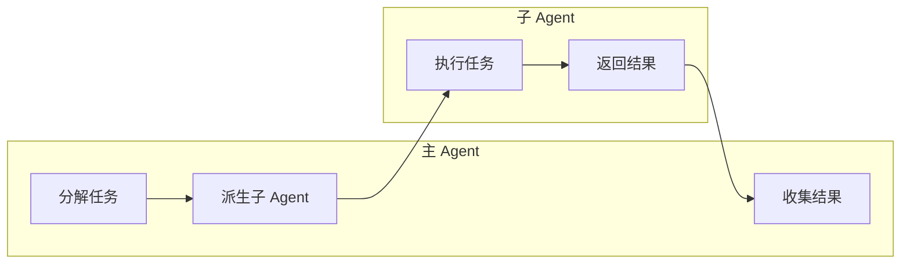
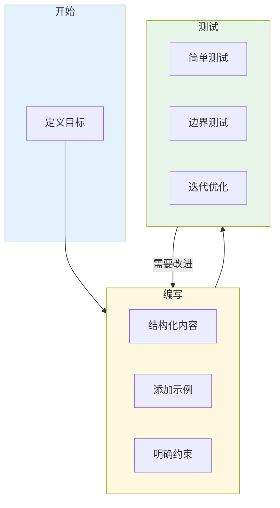

# Open Agent SDK 提示词分析

## 概述

Open Agent SDK 是一个基于 Claude API 的 Agent 框架，其核心价值在于通过精心设计的提示词系统来引导 Claude 模型执行各种编程任务。

**注意**：由于该项目是开源的 Agent SDK 而非直接面向用户的聊天应用，其提示词主要在 API 调用层面使用。

## 1. 提示词架构概览

### 1.1 提示词分层结构

Open Agent SDK 的提示词系统采用多层架构：




### 1.2 核心提示词文件位置

| 位置 | 描述 |
|------|------|
| `src/utils/systemPromptType.ts` | 系统提示类型定义 |
| `src/bootstrap/` | 引导提示词 |
| `src/tools/*/prompt.ts` | 工具描述提示词 |
| `src/context/` | 上下文管理 |
| `src/assistant/` | 助手相关 |

## 2. 系统提示词设计

### 2.1 基础系统提示

SDK 使用 Claude Code 的完整系统提示，包含核心组件：

- 角色定义：AI 助手身份和能力
- 工具能力：可用的操作和限制
- 工作原则：最佳实践指导
- 安全考虑：敏感操作的处理

### 2.2 动态系统提示

系统提示支持动态组件，根据上下文进行调整：

- 语言特定指导（Python、TypeScript 等）
- 框架特定规则（React、Node.js 等）
- 项目类型适配

```typescript
const buildSystemPrompt = (context: {
  cwd: string
  language?: string
  framework?: string
}) => {
  const parts = [baseSystemPrompt]
  if (context.language === 'Python') {
    parts.push(pythonGuidelines)
  }
  return parts.join('\n\n')
}
```

## 3. 工具描述提示词

### 3.1 工具提示词模式

每个内置工具都包含详细的提示词描述。

| 原则 | 描述 |
|------|------|
| **清晰意图** | 明确说明工具的目的 |
| **具体用途** | 列出常见使用场景 |
| **输入约束** | 明确必需和可选参数 |
| **输出格式** | 描述返回内容格式 |

### 3.2 工具提示词示例

```typescript
const toolDescription = {
  name: "Read",
  description: `Read a file from the filesystem.

  Use this tool to:
  - View the contents of existing files
  - Understand code structure
  - Review configuration files

  The file will be displayed with line numbers.`,

  inputSchema: {
    type: "object",
    properties: {
      file_path: {
        type: "string",
        description: "The path to the file to read"
      }
    },
    required: ["file_path"]
  }
}
```

## 4. 提示词模板系统

### 4.1 模板变量模式

SDK 使用模板系统处理动态内容：

- 变量插值
- 条件渲染
- 循环处理

```typescript
const systemPromptTemplate = `
You are working in {{project_name}}.
Project type: {{project_type}}

{{#if has_testing}}
You should write tests for your changes.
{{/if}}
`
```

### 4.2 条件渲染

支持根据条件包含或排除部分提示词：



## 5. 上下文压缩提示词

### 5.1 压缩摘要提示词

当对话历史过长时，系统会生成摘要来压缩上下文。

```typescript
const compactPrompt = `
## Context Compression

The conversation history is becoming too long. Please summarize:

### Recent Actions
{{recentActions}}

### Decisions Made
{{decisions}}

### Outstanding Tasks
{{outstandingTasks}}
`
```

### 5.2 微压缩策略

| 策略 | 适用场景 |
|------|---------|
| Truncate | 大文件读取 |
| Summary | 搜索结果 |
| Skip | 简单确认 |
| Keep | 重要决策 |



## 6. 权限系统提示词

### 6.1 权限请求提示词

当工具需要权限时，系统会生成用户友好的提示词。

```typescript
const permissionPrompt = {
  title: "Tool Permission Request",

  description: (toolName: string, action: string) =>
    `The ${toolName} tool wants to ${action}.`,

  risk: {
    low: "This action is low risk and typically safe.",
    medium: "This action modifies files. Please review carefully.",
    high: "This action is potentially dangerous. Please confirm."
  }
}
```

### 6.2 权限绕过提示词

当使用 bypassPermissions 模式时：

```typescript
const bypassSystemPrompt = `
## Permission Mode: Bypass

All tool executions are automatically approved.
Proceed with operations without confirmation prompts.

Be extra careful to verify operations before execution.
`
```

## 7. 多 Agent 提示词设计

### 7.1 子 Agent 提示词

子 Agent 继承主 Agent 的系统提示，并添加特定指令。

```typescript
const createSubagentPrompt = (
  mainPrompt: string,
  subagentConfig: {
    description: string
    instructions: string
    constraints?: string[]
  }
) => {
  const parts = [
    "# Subagent Context",
    subagentConfig.description,
    "",
    "## Your Instructions",
    subagentConfig.instructions,
  ]

  if (subagentConfig.constraints) {
    parts.push("", "## Constraints")
    subagentConfig.constraints.forEach(c => parts.push(`- ${c}`))
  }

  return parts.join('\n')
}
```

### 7.2 Agent 协作提示词



## 8. 提示词优化建议

### 8.1 当前实现的优点

| 优点 | 描述 |
|------|------|
| **分层设计** | 系统提示、工具提示、上下文分离 |
| **动态组合** | 根据上下文动态调整提示词内容 |
| **类型安全** | 使用 TypeScript 确保提示词结构正确 |
| **模板系统** | 支持变量、条件渲染，提高灵活性 |

### 8.2 潜在改进建议

#### 1. 提示词版本控制

建议添加提示词版本跟踪机制。

#### 2. A/B 测试支持

建议支持提示词的 A/B 测试。

#### 3. 提示词性能监控

建议添加提示词效果监控。

#### 4. 提示词调试工具

建议提供提示词调试能力。

## 9. 最佳实践

### 9.1 提示词编写指南



编写高质量提示词的最佳实践：

1. **明确角色**：定义 Agent 的身份和能力边界
2. **结构化输出**：指定期望的响应格式
3. **提供示例**：用 Few-shot 示例说明期望行为
4. **处理边缘情况**：明确如何处理错误和异常
5. **迭代优化**：基于测试结果持续改进

### 9.2 提示词安全考虑

| 安全问题 | 缓解措施 |
|---------|---------|
| 提示词注入 | 输入验证和转义 |
| 敏感信息泄露 | 过滤日志中的敏感内容 |
| 意外操作 | 权限确认机制 |
| 资源耗尽 | Token 限制和成本控制 |

## 10. 总结

Open Agent SDK 展示了一个成熟的 Agent 框架如何设计和组织提示词系统：

1. **分层架构**：清晰分离系统提示、工具提示、上下文管理
2. **模板系统**：灵活支持变量、条件渲染和循环
3. **动态优化**：上下文压缩和记忆管理确保高效运行
4. **安全机制**：完善的权限控制和审计日志

项目的提示词工程实践为构建生产级 Agent 应用提供了宝贵的参考。