# Open Agent SDK 架构文档

## 1. 系统整体架构

### 1.1 核心架构概述

Open Agent SDK 采用进程内架构，将完整的 Claude Code 引擎直接嵌入到应用程序中。架构分为三个主要层次：入口层、引擎层和服务层。

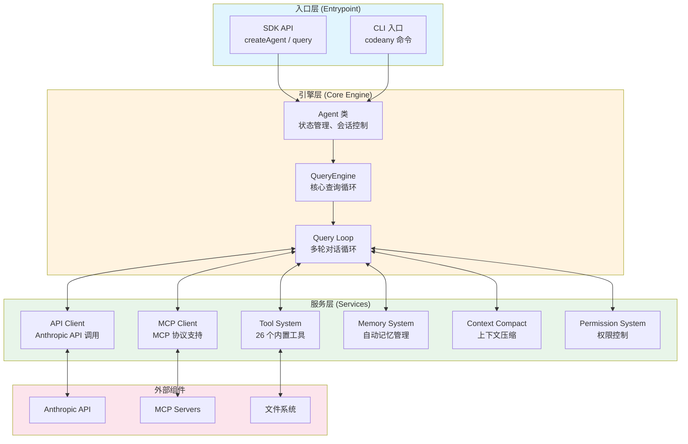

### 1.2 模块目录结构

项目源代码位于 `src/` 目录，包含多个功能模块：

- **agent.ts**: Agent 主类，状态管理
- **query.ts**: 核心查询循环引擎
- **Tool.ts**: 工具接口定义
- **tools/**: 26 个内置工具实现
- **services/**: API 调用、记忆管理等服务
- **mcp/**: MCP 协议客户端
- **context/**: 上下文管理系统
- **state/**: 状态管理
- **hooks/**: 权限和生命周期钩子
- **components/**: UI 组件

## 2. 核心数据流

### 2.1 Agent 查询流程

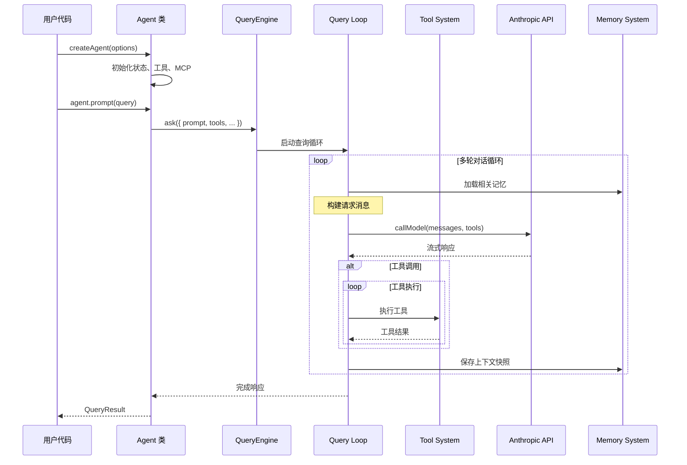

### 2.2 工具执行流程

工具执行支持并发和串行两种模式。

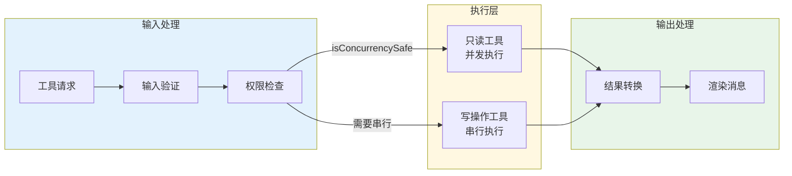

### 2.3 MCP 集成数据流

MCP（Model Context Protocol）允许连接外部工具和服务。

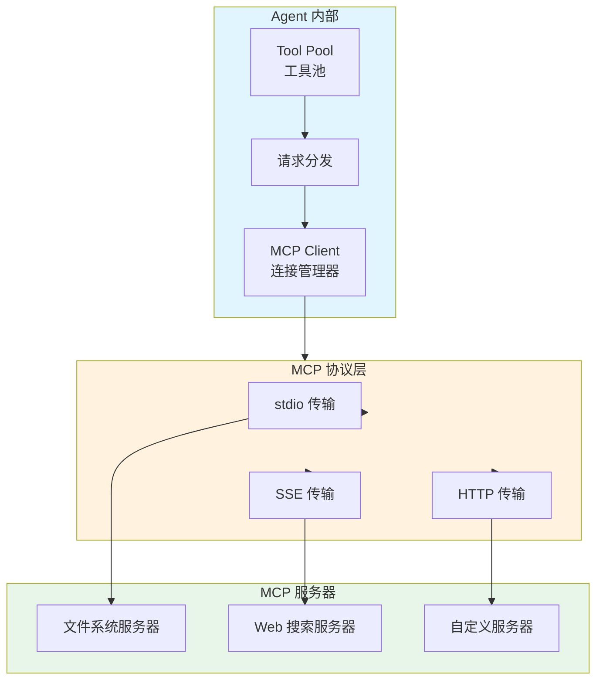

## 3. 类/模块关系图

### 3.1 Agent 核心类图

Agent 类是 SDK 的主要入口。

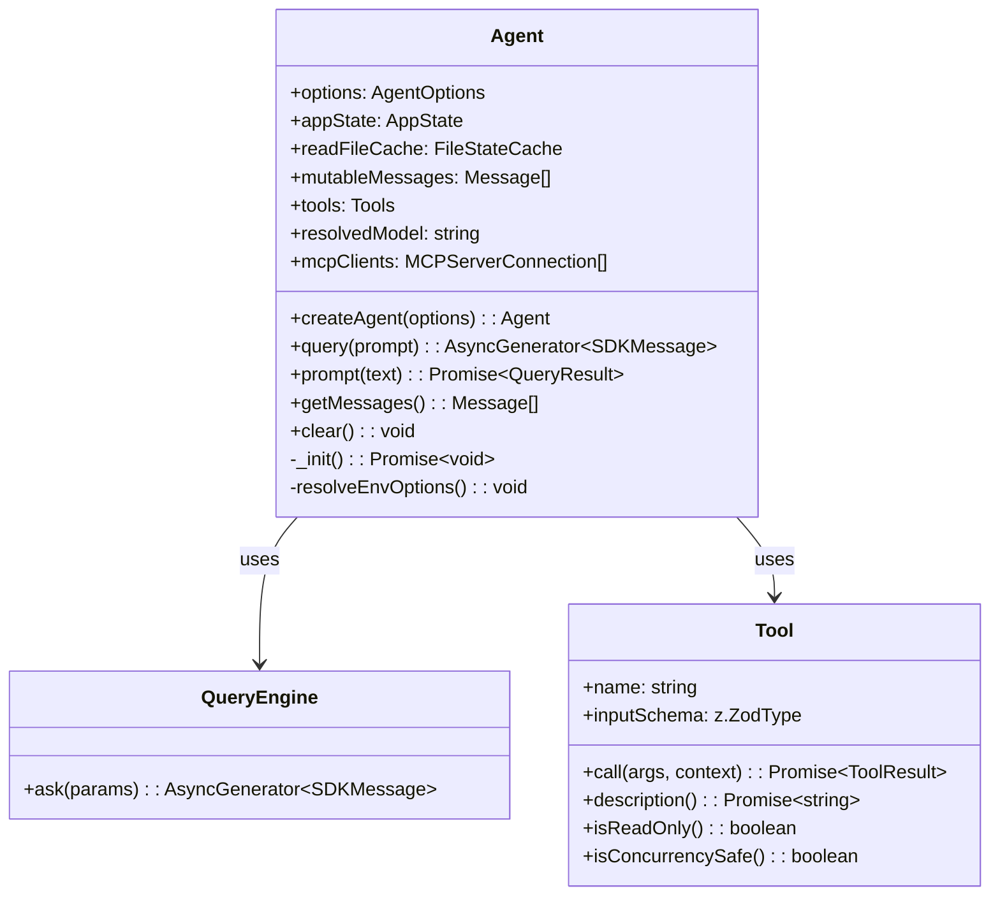

### 3.2 工具系统架构

工具系统采用策略模式，每个工具实现统一的 Tool 接口。

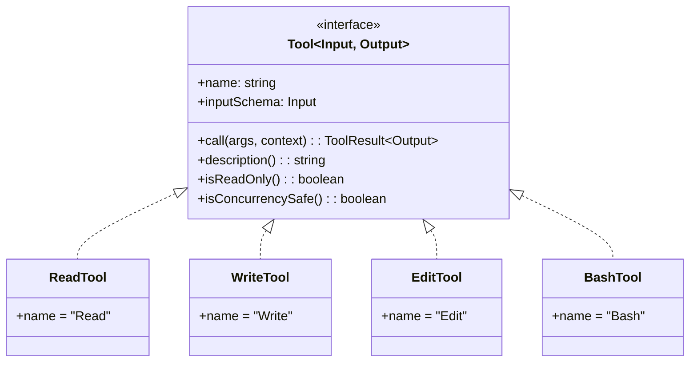

### 3.3 权限系统类图

权限系统实现四层验证管道。

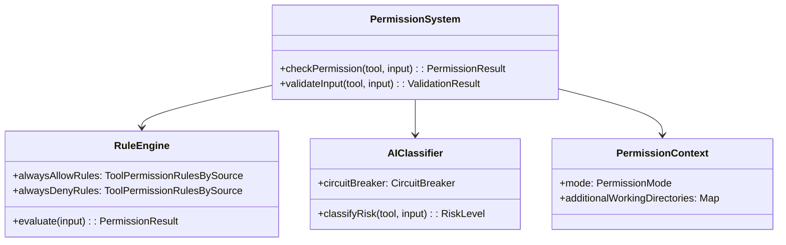

## 4. 用户交互流程

### 4.1 创建和使用 Agent 的完整流程

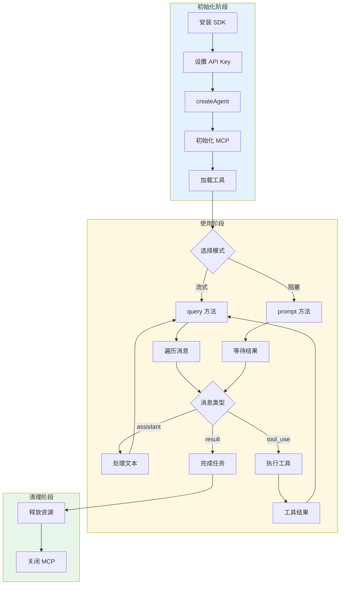

### 4.2 子 Agent 协作流程

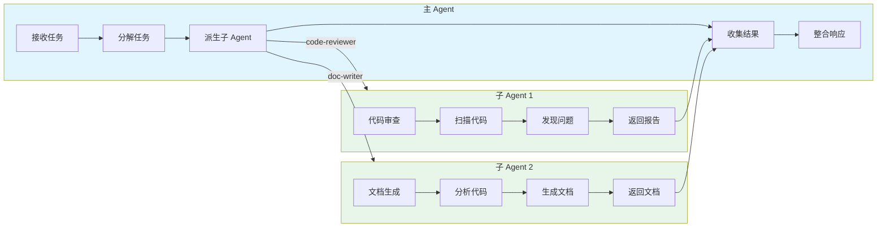

## 5. 部署架构

### 5.1 典型部署场景

Open Agent SDK 支持多种部署场景。

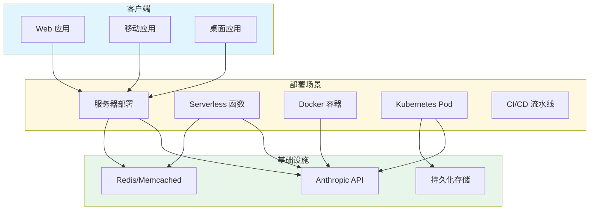

## 6. 上下文管理架构

### 6.1 上下文生命周期

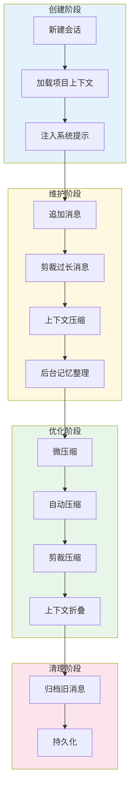

### 6.2 自动压缩流程

当上下文超过阈值时，系统自动进行压缩。

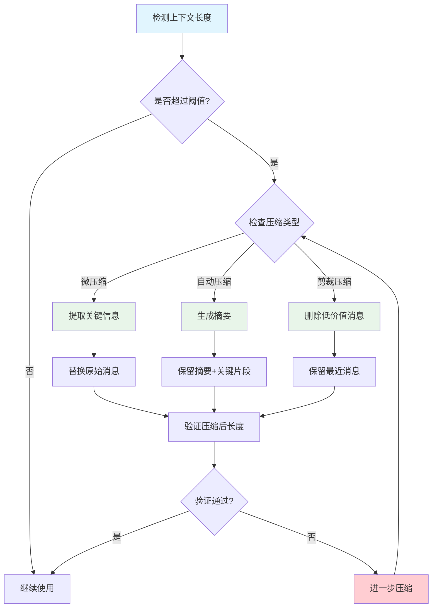

## 7. 错误处理和恢复

### 7.1 错误恢复机制

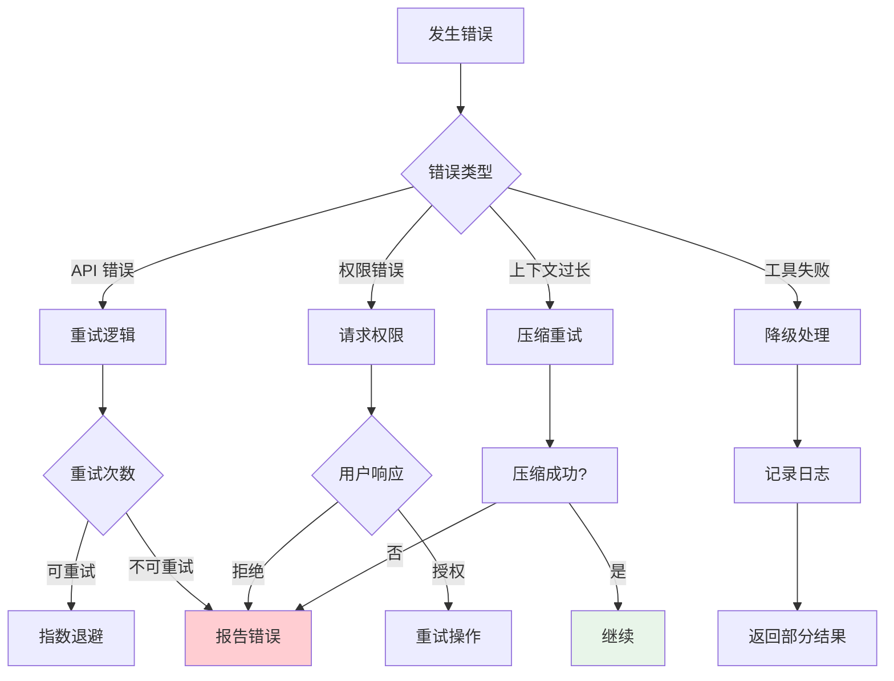

## 总结

Open Agent SDK 的架构设计体现了以下核心原则：

1. **模块化**：各组件职责清晰，易于测试和维护
2. **可扩展性**：支持自定义工具和 MCP 集成
3. **容错性**：完善的错误处理和恢复机制
4. **性能优化**：上下文压缩、并发执行等优化策略
5. **安全性**：四层权限管道确保操作安全