# PentAGI 架构文档

## 一、系统整体架构

PentAGI 采用微服务架构设计，所有组件通过Docker容器化部署，实现完全隔离和易于扩展。系统架构分为多个层次，每个层次负责特定的功能域。

### 1.1 系统上下文图

以下是PentAGI与外部系统交互的整体视图：

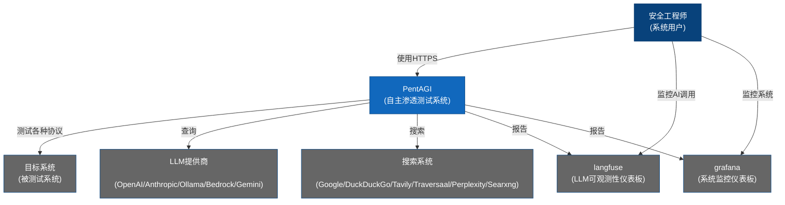

**架构说明**：

- **安全工程师（用户）**：通过HTTPS与PentAGI交互，监控AI行为和系统状态
- **PentAGI核心系统**：处理用户请求，协调各AI代理，执行渗透测试任务
- **目标系统**：被测试的系统，PentAGI通过各种协议进行安全测试
- **LLM提供商**：为AI代理提供推理能力，支持多种模型提供商
- **搜索系统**：用于信息收集和情报获取
- **监控工具**：Langfuse用于AI行为监控，Grafana用于系统监控

### 1.2 容器架构图

以下是PentAGI的详细容器架构，展示了所有微服务组件及其交互关系：

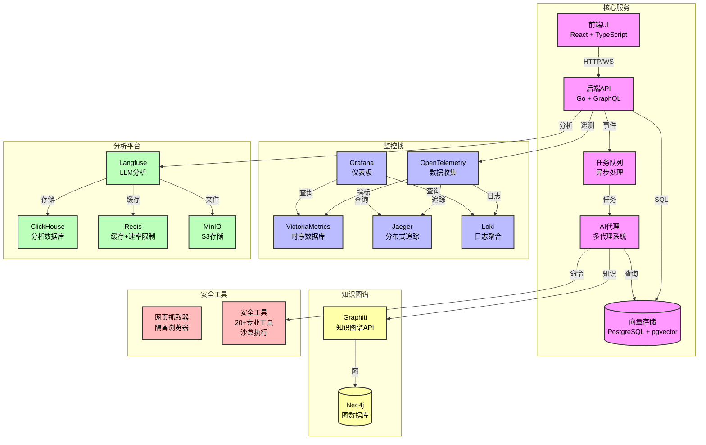

**组件功能说明**：

| 组件 | 技术栈 | 功能描述 |
|------|--------|----------|
| 前端UI | React + TypeScript | 用户交互界面，展示测试进度和结果 |
| 后端API | Go + GraphQL | 业务逻辑处理，API网关 |
| 向量存储 | PostgreSQL + pgvector | 语义搜索，记忆存储 |
| 任务队列 | 异步处理 | 可靠的任务调度和执行 |
| AI代理 | 多代理系统 | 协调各专业代理执行测试任务 |
| Graphiti | 知识图谱API | 语义关系追踪和上下文理解 |
| Neo4j | 图数据库 | 存储实体关系和时序上下文 |
| Grafana | 监控仪表板 | 系统指标可视化 |
| VictoriaMetrics | 时序数据库 | 高性能指标存储 |
| Jaeger | 分布式追踪 | 端到端调试和问题诊断 |
| Loki | 日志聚合 | 可扩展的日志分析 |
| OpenTelemetry | 数据收集 | 统一的可观测性数据收集 |
| Langfuse | LLM分析 | AI模型性能监控和追踪 |
| ClickHouse | 分析数据库 | 列式分析数据仓库 |
| Redis | 缓存 | 高速缓存和速率限制 |
| MinIO | 对象存储 | S3兼容的文件存储 |
| 网页抓取器 | 隔离浏览器 | 安全的Web信息收集 |
| 安全工具 | 20+专业工具 | 渗透测试工具集 |

## 二、核心数据流

PentAGI的核心数据流展示了信息如何在系统中流转，从用户发起测试请求到生成最终报告的完整过程。

### 2.1 主数据流程

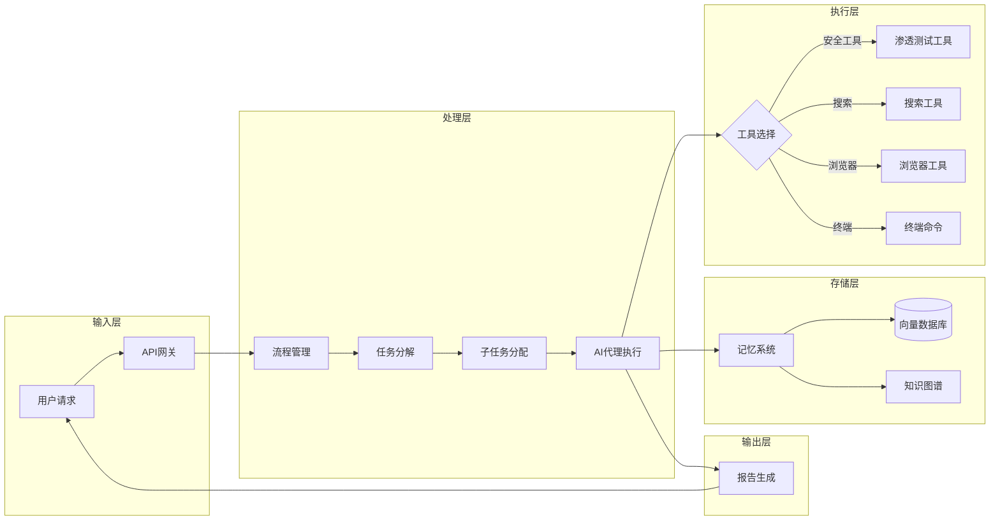

### 2.2 代理交互流程

PentAGI采用多代理协作模式，不同类型的代理各司其职，协同完成复杂的渗透测试任务：

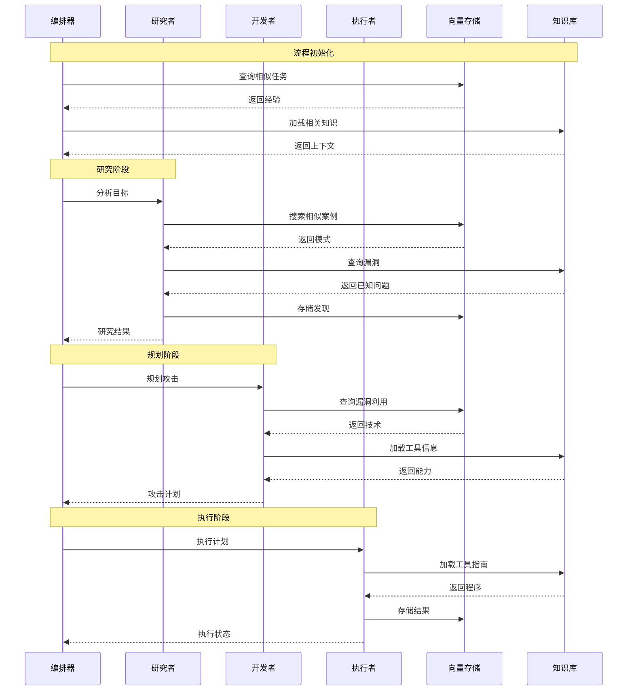

**代理角色说明**：

| 代理类型 | 功能职责 |
|----------|----------|
| 编排器（Orchestrator） | 协调整个测试流程，管理任务分解和代理协作 |
| 研究者（Researcher） | 收集目标信息，分析漏洞模式，研究攻击向量 |
| 开发者（Developer） | 规划攻击策略，选择合适的漏洞利用方法 |
| 执行者（Executor） | 执行具体的测试命令和工具调用 |

## 三、实体关系图

PentAGI的数据模型清晰定义了各实体之间的关系，以下是核心实体及其关联：

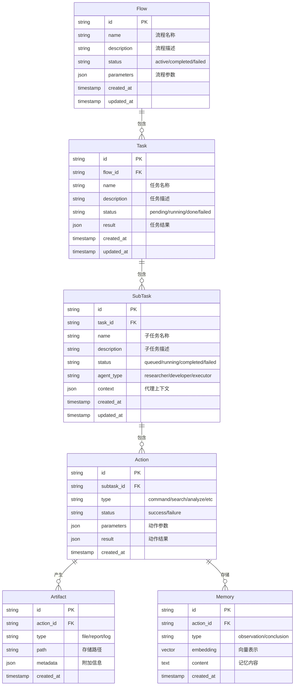

**实体说明**：

| 实体 | 描述 | 关键属性 |
|------|------|----------|
| Flow | 完整的渗透测试流程 | 名称、描述、状态、参数 |
| Task | 流程中的一个主要任务 | 名称、描述、状态、结果 |
| SubTask | 任务分解的子任务 | 名称、状态、代理类型、上下文 |
| Action | 子任务执行的具体动作 | 类型、状态、参数、结果 |
| Artifact | 动作产生的文件/报告 | 类型、路径、元数据 |
| Memory | 存储的记忆/学习内容 | 类型、内容、向量化表示 |

## 四、记忆系统架构

PentAGI的智能记忆系统是其核心竞争优势之一，通过多层记忆架构实现持续学习和知识积累。

### 4.1 记忆系统架构图

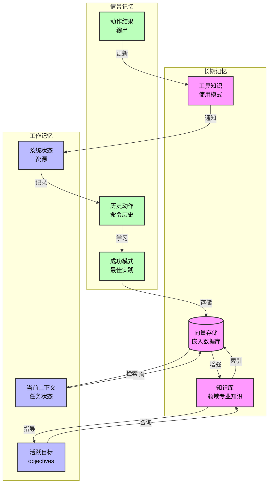

### 4.2 链式摘要系统

PentAGI使用链式摘要技术管理不断增长的对话上下文，防止超出LLM的令牌限制：

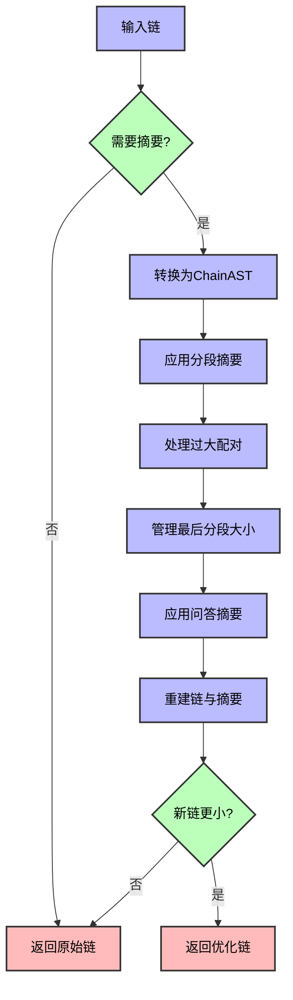

**摘要配置参数**：

| 参数 | 环境变量 | 默认值 | 说明 |
|------|----------|--------|------|
| 保留最后 | SUMMARIZER_PRESERVE_LAST | true | 是否保留最后部分的所有消息 |
| 使用问答对 | SUMMARIZER_USE_QA | true | 是否使用问答对摘要策略 |
| 最后分段大小 | SUMMARIZER_LAST_SEC_BYTES | 51200 | 最后分段的最大字节数(50KB) |
| 最大体配对大小 | SUMMARIZER_MAX_BP_BYTES | 16384 | 单个体配对的最大字节数(16KB) |
| 最大问答分段 | SUMMARIZER_MAX_QA_SECTIONS | 10 | 保留的最大问答分段数 |

## 五、部署架构

PentAGI支持多种部署模式，从简单的单节点部署到生产环境推荐的双节点架构。

### 5.1 单节点部署

适用于开发和测试环境，所有服务部署在单一服务器上：

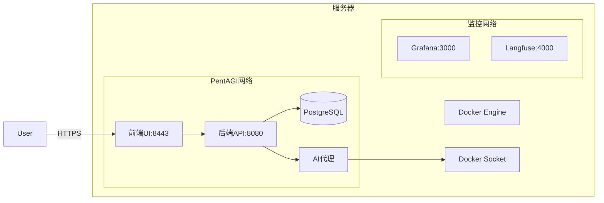

### 5.2 双节点部署（推荐生产环境）

将工作节点隔离在独立服务器上，提供更强的安全边界：

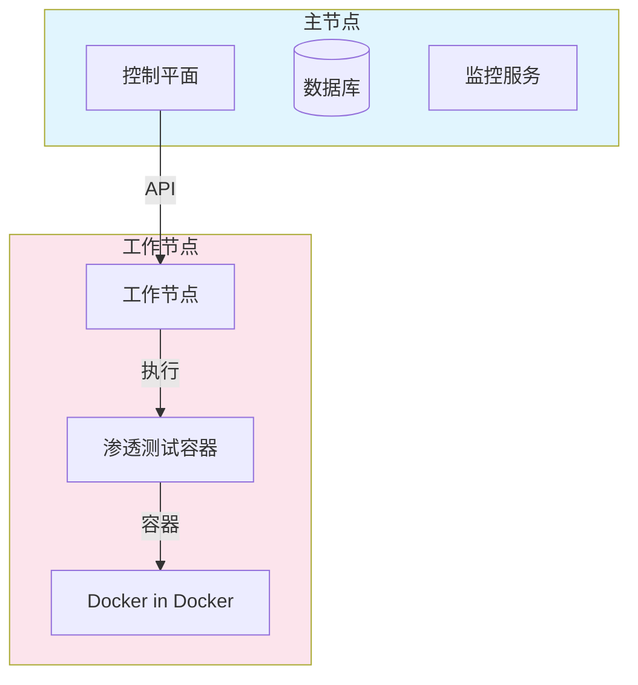

**双节点架构优势**：

- 隔离执行：工作容器运行在专用硬件上
- 网络隔离：渗透测试的网络边界分离
- 安全边界：Docker-in-Docker与TLS认证
- OOB攻击支持：专用的外带技术端口范围

## 六、监控与可观测性

PentAGI提供全面的监控和可观测性支持，帮助用户了解系统状态和AI代理行为。

### 6.1 监控数据流

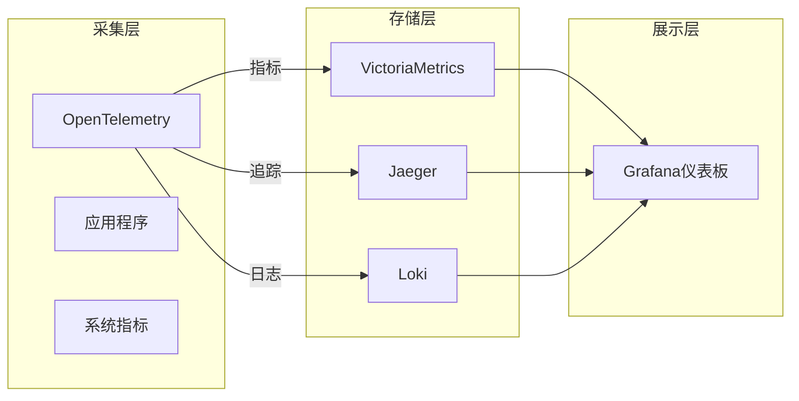

### 6.2 Langfuse集成

Langfuse提供AI模型的可观测性，包括追踪、评估和调试：

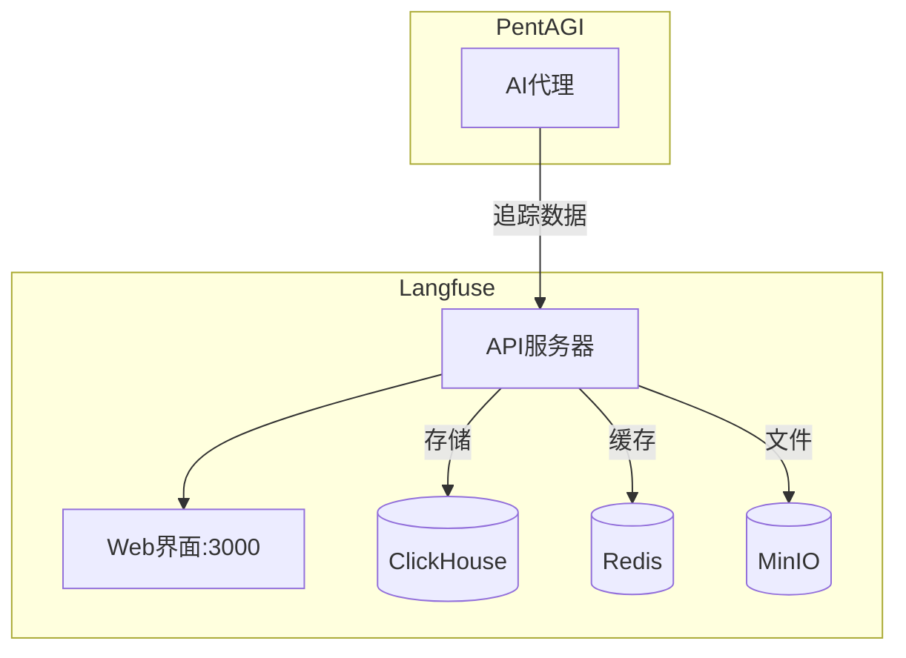

## 七、总结

PentAGI的架构设计体现了现代化云原生应用的最佳实践：

- **微服务架构**：各组件独立部署，易于扩展和维护
- **容器化隔离**：所有操作在隔离的容器中执行，确保安全
- **多代理协作**：专业化的AI代理协同工作，提高测试效率
- **智能记忆**：多层记忆系统实现持续学习和知识复用
- **全面监控**：端到端的可观测性支持问题诊断和性能优化
- **灵活部署**：支持从开发环境到生产环境的多种部署模式

这种架构设计使PentAGI成为一个强大、灵活且安全的自动化渗透测试平台。