# Qwen-Agent 架构分析

## 一、系统整体架构

Qwen-Agent采用了分层架构设计，从底层到顶层依次为：模型层、Agent层、工具层和应用层。这种设计确保了各模块之间的松耦合和高内聚，便于扩展和维护。

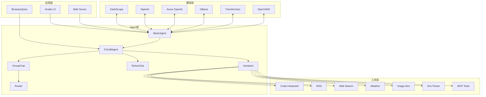

### 架构层次说明

**模型层（LLM）**：负责与各种大语言模型服务进行通信，包括阿里云DashScope、OpenAI、Azure等云端服务，以及Ollama、Transformers等本地部署方案。模型层抽象了底层API的差异，提供统一的调用接口。

**Agent层**：实现了各种类型的智能体，每个Agent都有其特定的工作流程。BasicAgent是最基础的LLM封装，FnCallAgent增加了函数调用能力，Assistant在FnCallAgent基础上集成了RAG功能，ReActChat采用ReAct推理模式，GroupChat支持多智能体协作。

**工具层**：提供Agent可以调用的各种工具，包括代码执行、文档检索、网页搜索、图像生成等。工具通过统一的BaseTool接口进行封装，便于扩展新的工具。

**应用层**：提供了面向用户的应用示例，包括Web服务、Gradio图形界面和BrowserQwen浏览器助手。

## 二、核心模块关系

### 2.1 Agent类继承关系

Qwen-Agent的Agent体系采用了继承设计，从基类Agent派生出多种专用Agent类型。这种设计使得代码复用最大化，同时保持了各类型Agent的独立性。

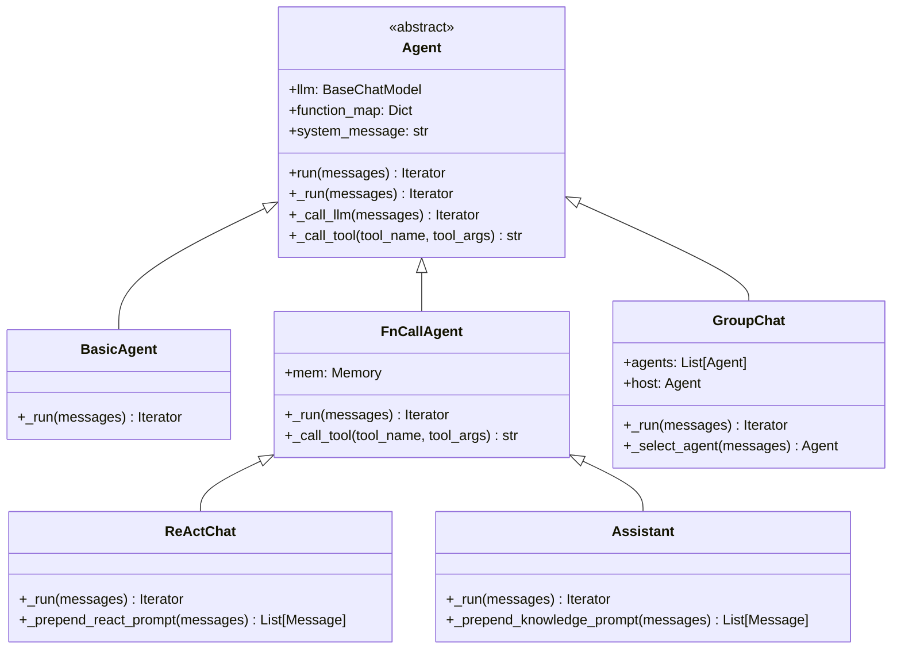

### 2.2 模块职责说明

**Agent基类**：定义了所有Agent的通用接口和行为规范，包括LLM调用、工具调用、消息处理等核心功能。

**BasicAgent**：最基础的Agent实现，仅包含LLM调用，没有任何工具增强。适用于简单的对话场景。

**FnCallAgent**：在Agent基础上增加了函数调用能力，支持工具注册、工具调用、结果处理等完整的工作流程。

**ReActChat**：采用ReAct（Reasoning + Acting）模式的Agent，通过显式的推理步骤来增强工具调用能力。

**Assistant**：在FnCallAgent基础上集成了RAG功能，可以管理文档、处理检索、生成带上下文的回答。

**GroupChat**：多智能体管理器，支持创建多个专业Agent，协调发言顺序、管理群组对话。

## 三、数据流图

### 3.1 单Agent数据流

以下展示了单个Agent处理用户请求时的完整数据流，从接收消息到返回响应涉及多个处理阶段。

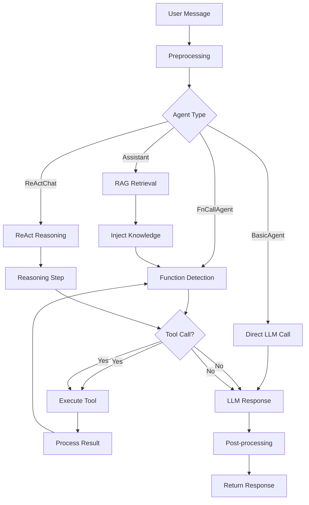

### 3.2 函数调用详细流程

函数调用是Agent的核心能力之一，下图详细展示了从LLM生成函数调用请求到执行工具并返回结果的完整流程。

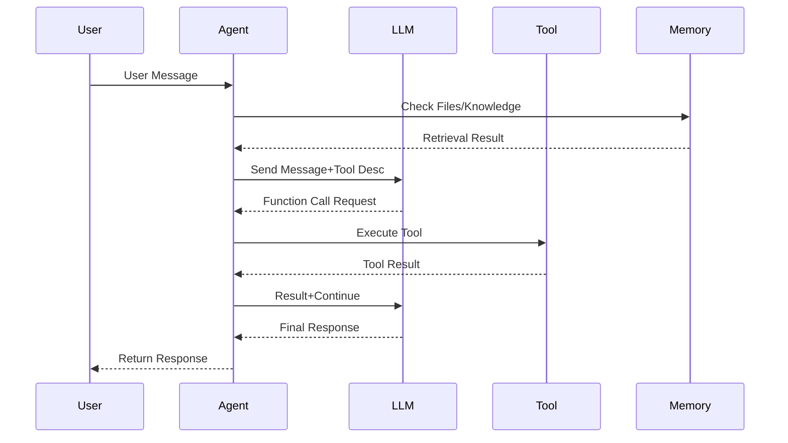

### 3.3 多智能体协作流程

GroupChat支持多个Agent协同工作，通过自动或手动的发言顺序管理，实现复杂任务的分解和协作处理。

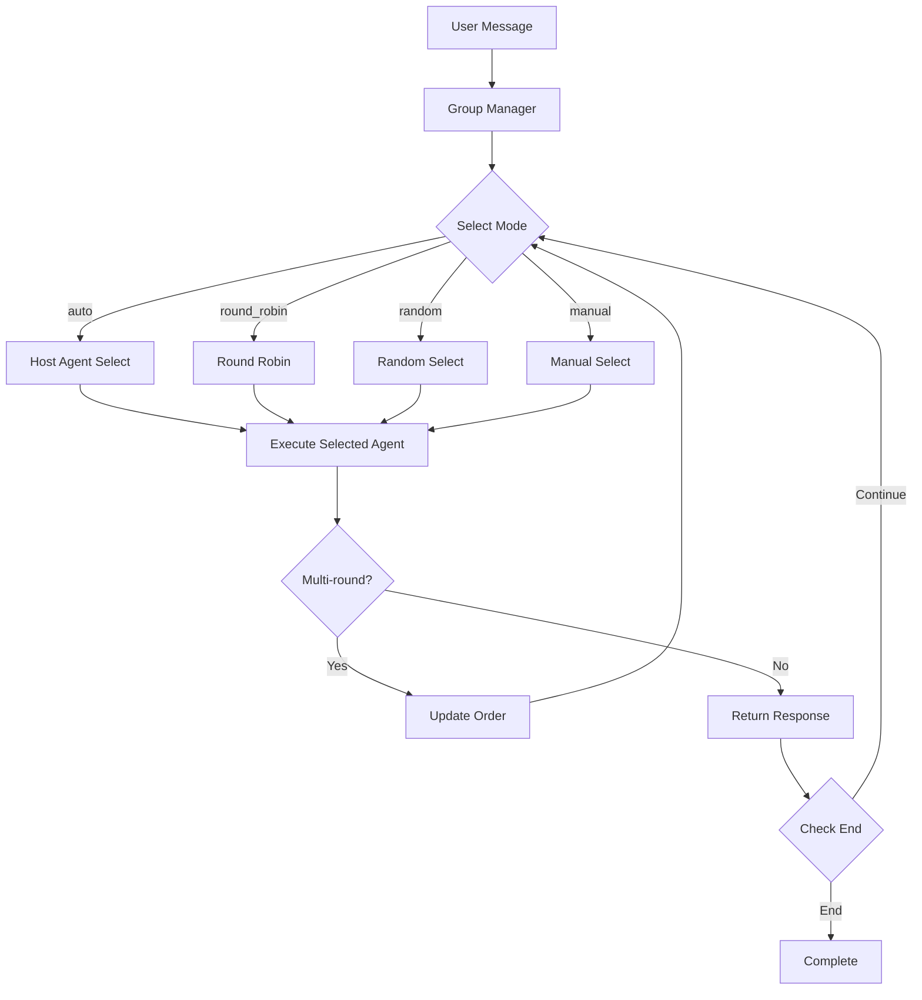

## 四、LLM模块架构

### 4.1 模型适配器设计

Qwen-Agent通过统一的适配器接口支持多种LLM后端，这种设计使得添加新的模型支持变得非常简单。

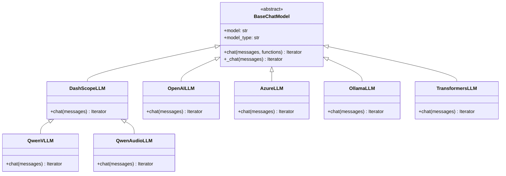

### 4.2 函数调用提示词处理

函数调用功能的核心在于如何将工具描述和调用格式有效地传递给LLM。Qwen-Agent实现了多种提示词模板来处理不同模型的函数调用格式。

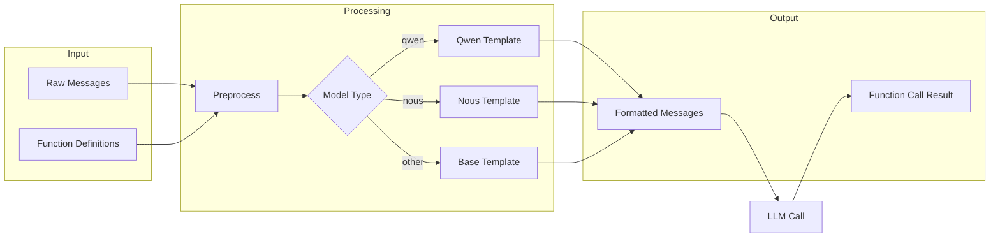

## 五、工具系统架构

### 5.1 工具注册与调用

Qwen-Agent提供了统一的工具注册和管理机制，所有工具都继承自BaseTool基类，通过TOOL_REGISTRY进行注册。

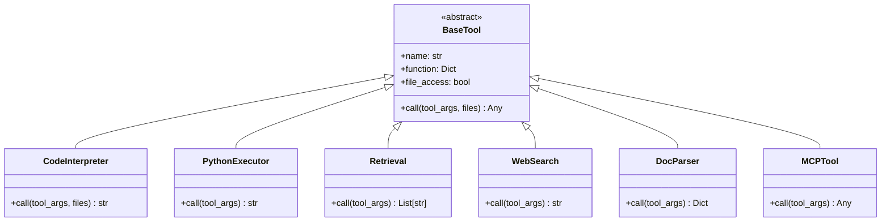

### 5.2 MCP工具集成

Qwen-Agent支持MCP（Model Context Protocol）协议，可以接入更多第三方工具和服务，扩展了框架的能力边界。

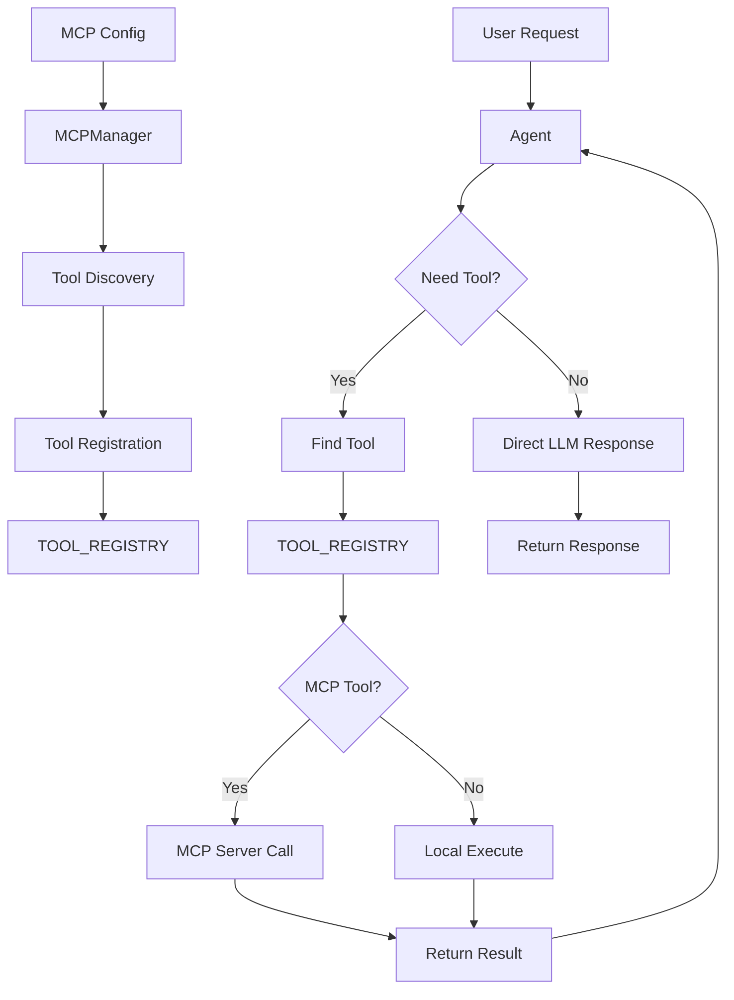

## 六、部署架构

### 6.1 服务部署模式

Qwen-Agent支持多种部署方式以满足不同场景的需求，从简单的本地运行到生产级别的服务部署。

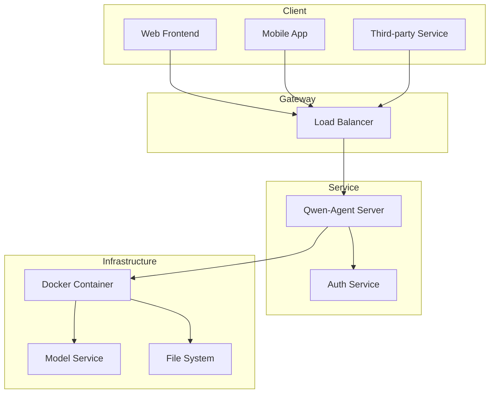

### 6.2 BrowserQwen架构

BrowserQwen是基于Qwen-Agent构建的浏览器助手，展示了如何将Agent能力与浏览器自动化相结合。

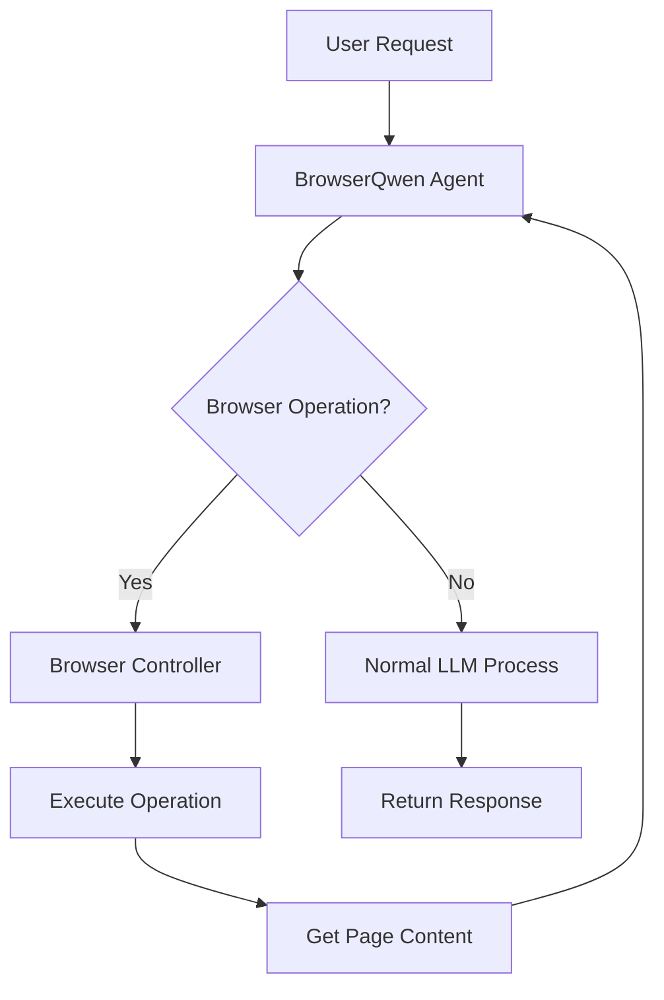

## 七、扩展性设计

### 7.1 自定义Agent

Qwen-Agent的设计充分考虑了扩展性，开发者可以轻松创建自定义的Agent类型。

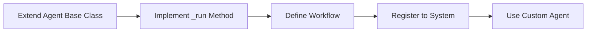

### 7.2 自定义工具

创建自定义工具只需继承BaseTool类并实现call方法。

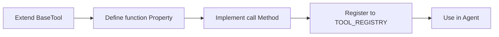

