# Semble 系统架构

## 系统整体架构

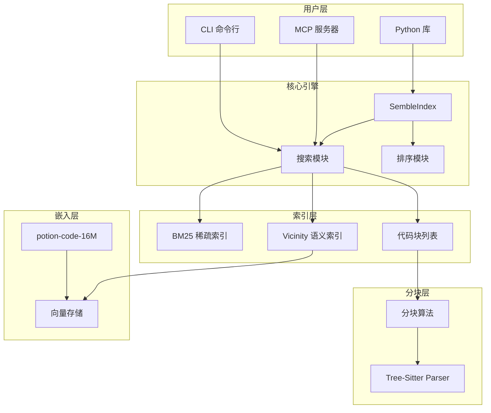
```mermaid
graph TB
    subgraph 用户层["用户层"]
        CLI[CLI 命令行]
        MCP[MCP 服务器]
        LIB[Python 库]
    end

    subgraph 核心引擎["核心引擎"]
        INDEX[SembleIndex]
        SEARCH[搜索模块]
        RANKING[排序模块]
    end

    subgraph 索引层["索引层"]
        BM25[BM25 稀疏索引]
        VICINITY[Vicinity 语义索引]
        CHUNKS[代码块列表]
    end

    subgraph 分块层["分块层"]
        TREE_SITTER[Tree-Sitter Parser]
        CHUNKING[分块算法]
    end

    subgraph 嵌入层["嵌入层"]
        MODEL[potion-code-16M]
        EMBEDDINGS[向量存储]
    end

    CLI --> SEARCH
    MCP --> SEARCH
    LIB --> INDEX

    INDEX --> SEARCH
    INDEX --> RANKING

    SEARCH --> BM25
    SEARCH --> VICINITY
    SEARCH --> CHUNKS

    CHUNKING --> TREE_SITTER
    CHUNKS --> CHUNKING
    VICINITY --> EMBEDDINGS
    MODEL --> EMBEDDINGS
```

## 核心数据流

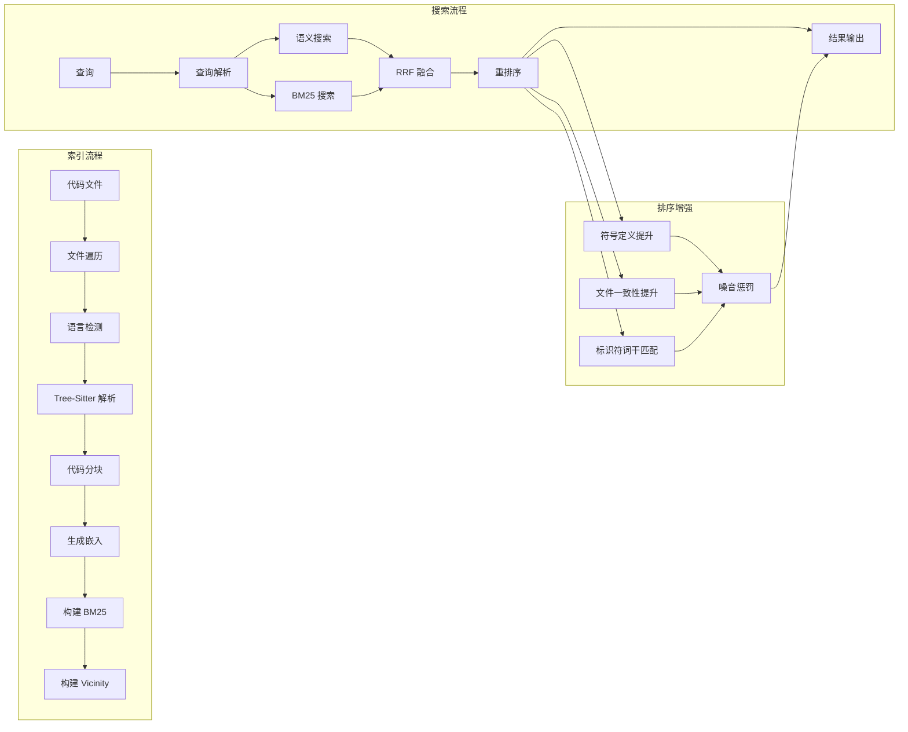
```mermaid
flowchart LR
    subgraph 索引流程["索引流程"]
        A1[代码文件] --> B1[文件遍历]
        B1 --> C1[语言检测]
        C1 --> D1[Tree-Sitter 解析]
        D1 --> E1[代码分块]
        E1 --> F1[生成嵌入]
        F1 --> G1[构建 BM25]
        G1 --> H1[构建 Vicinity]
    end

    subgraph 搜索流程["搜索流程"]
        A2[查询] --> B2[查询解析]
        B2 --> C2[语义搜索]
        B2 --> D2[BM25 搜索]
        C2 --> E2[RRF 融合]
        D2 --> E2
        E2 --> F2[重排序]
        F2 --> G2[结果输出]
    end

    subgraph 排序增强["排序增强"]
        F2 --> H2[符号定义提升]
        F2 --> I2[文件一致性提升]
        F2 --> J2[标识符词干匹配]
        H2 --> K2[噪音惩罚]
        I2 --> K2
        J2 --> K2
        K2 --> G2
    end
```

## 模块依赖关系

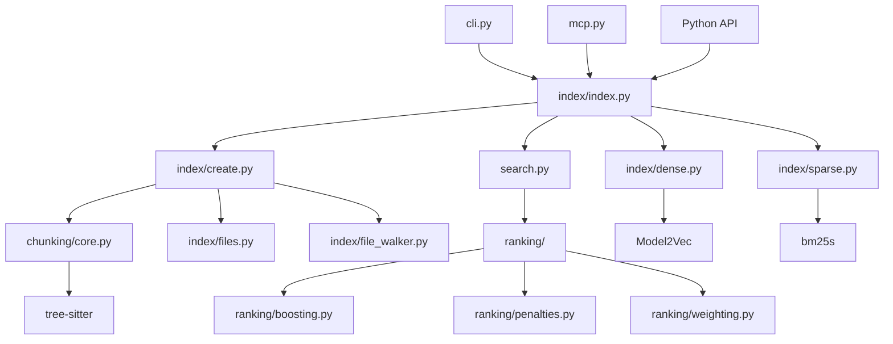
```mermaid
graph TD
    CLI["cli.py"] --> INDEX["index/index.py"]
    MCP["mcp.py"] --> INDEX
    LIB["Python API"] --> INDEX

    INDEX --> CREATE["index/create.py"]
    INDEX --> DENSE["index/dense.py"]
    INDEX --> SPARSE["index/sparse.py"]
    INDEX --> SEARCH["search.py"]

    CREATE --> CHUNKING["chunking/core.py"]
    CREATE --> FILES["index/files.py"]
    CREATE --> WALKER["index/file_walker.py"]

    SEARCH --> RANKING["ranking/"]
    CHUNKING --> TREE_SITTER["tree-sitter"]

    RANKING --> BOOSTING["ranking/boosting.py"]
    RANKING --> PENALTIES["ranking/penalties.py"]
    RANKING --> WEIGHTING["ranking/weighting.py"]

    DENSE --> MODEL2VEC["Model2Vec"]
    SPARSE --> BM25S["bm25s"]
```

## 用户交互流程

### MCP 服务器模式

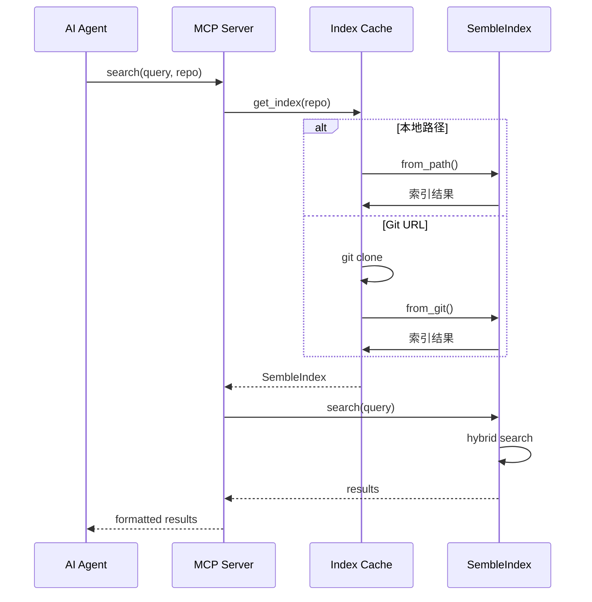
```mermaid
sequenceDiagram
    participant Agent as AI Agent
    participant MCP as MCP Server
    participant Cache as Index Cache
    participant Index as SembleIndex

    Agent->>MCP: search(query, repo)
    MCP->>Cache: get_index(repo)
    alt 本地路径
        Cache->>Index: from_path()
        Index->>Cache: 索引结果
    else Git URL
        Cache->>Cache: git clone
        Cache->>Index: from_git()
        Index->>Cache: 索引结果
    end
    Cache-->>MCP: SembleIndex
    MCP->>Index: search(query)
    Index->>Index: hybrid search
    Index-->>MCP: results
    MCP-->>Agent: formatted results
```

### CLI 模式

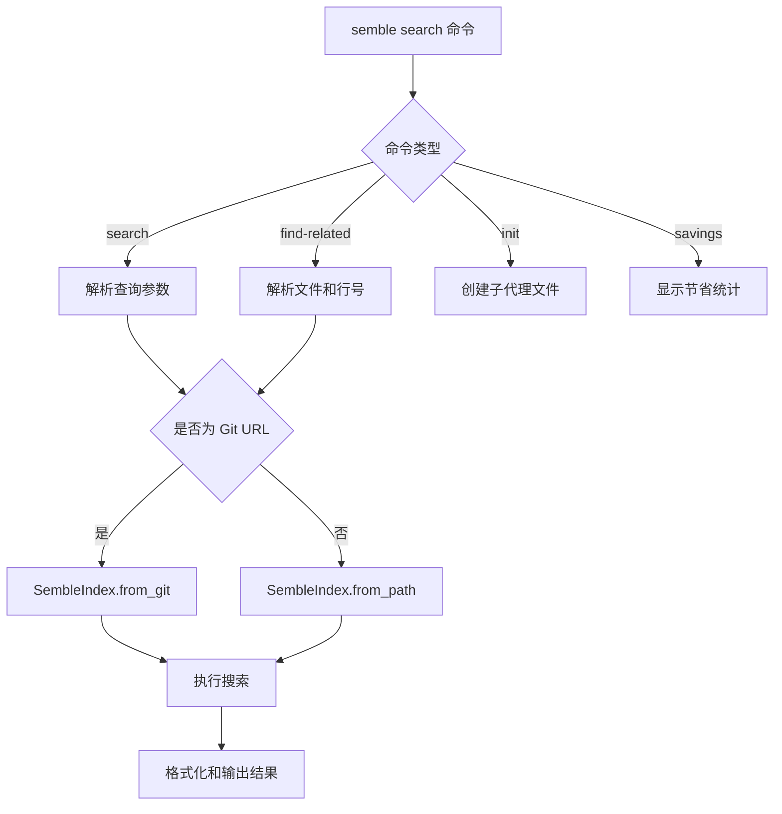
```mermaid
flowchart TD
    A["semble search 命令"] --> B{命令类型}
    B -->|search| C[解析查询参数]
    B -->|find-related| D[解析文件和行号]
    B -->|init| E[创建子代理文件]
    B -->|savings| F[显示节省统计]

    C --> G{是否为 Git URL}
    D --> G
    G -->|是| H[SembleIndex.from_git]
    G -->|否| I[SembleIndex.from_path]

    H --> J[执行搜索]
    I --> J

    J --> K[格式化和输出结果]
```

## 索引创建流程

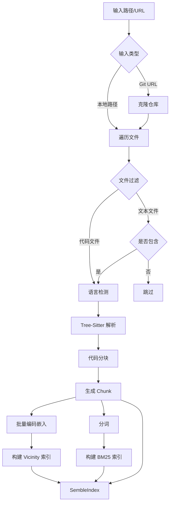
```mermaid
flowchart TD
    A[输入路径/URL] --> B{输入类型}
    B -->|本地路径| C[遍历文件]
    B -->|Git URL| D[克隆仓库]
    D --> C

    C --> E{文件过滤}
    E -->|代码文件| F[语言检测]
    E -->|文本文件| G{是否包含}
    G -->|是| F
    G -->|否| H[跳过]

    F --> I[Tree-Sitter 解析]
    I --> J[代码分块]
    J --> K[生成 Chunk]

    K --> L[批量编码嵌入]
    L --> M[构建 Vicinity 索引]

    K --> N[分词]
    N --> O[构建 BM25 索引]

    M --> P[SembleIndex]
    O --> P
    K --> P
```

## 搜索执行流程

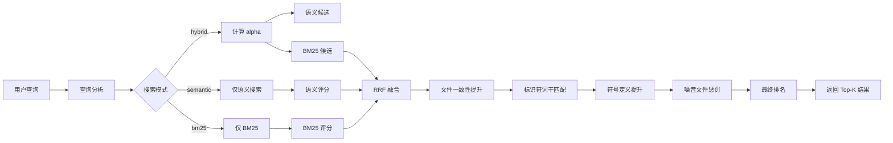
```mermaid
flowchart LR
    A[用户查询] --> B[查询分析]
    B --> C{搜索模式}

    C -->|hybrid| D[计算 alpha]
    C -->|semantic| E[仅语义搜索]
    C -->|bm25| F[仅 BM25]

    D --> G[语义候选]
    D --> H[BM25 候选]

    E --> I[语义评分]
    F --> J[BM25 评分]

    I --> K[RRF 融合]
    H --> K
    J --> K

    K --> L[文件一致性提升]
    L --> M[标识符词干匹配]
    M --> N[符号定义提升]
    N --> O[噪音文件惩罚]
    O --> P[最终排名]
    P --> Q[返回 Top-K 结果]
```

## 混合搜索 RRF 融合

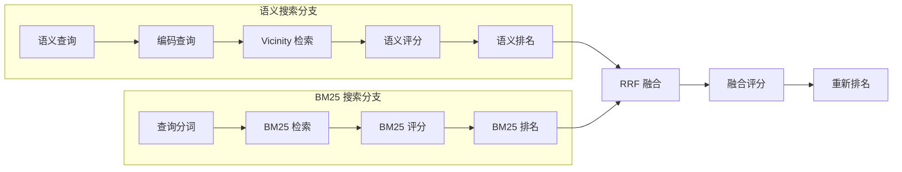
```mermaid
flowchart LR
    subgraph 语义分支["语义搜索分支"]
        SQ[语义查询] --> SE[编码查询]
        SE --> SI[Vicinity 检索]
        SI --> SS[语义评分]
        SS --> SR[语义排名]
    end

    subgraph BM25分支["BM25 搜索分支"]
        BQ[查询分词] --> BL[BM25 检索]
        BL --> BS[BM25 评分]
        BS --> BR[BM25 排名]
    end

    SR --> FUSION[RRF 融合]
    BR --> FUSION

    FUSION --> SCORE[融合评分]
    SCORE --> RANK[重新排名]
```

## 部署架构

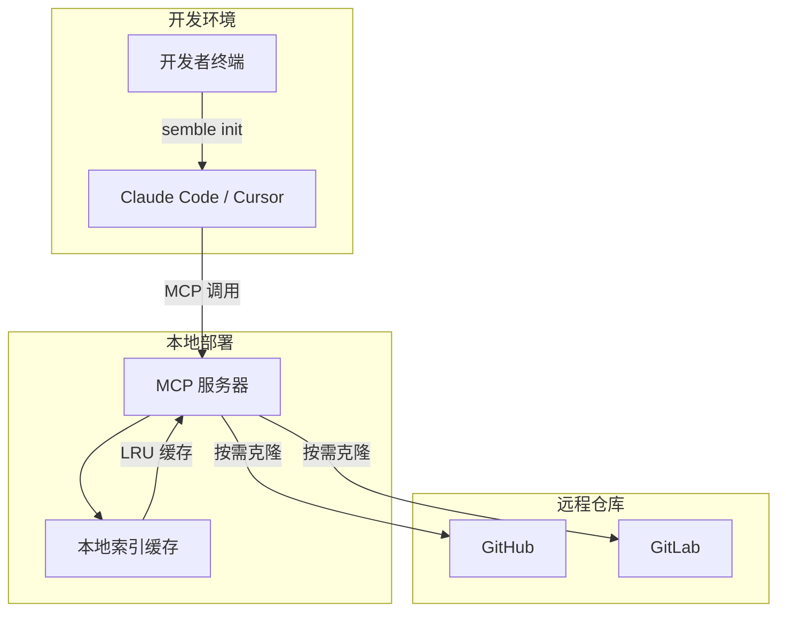
```mermaid
graph TB
    subgraph 开发环境["开发环境"]
        DEV[开发者终端]
        AGENT[Claude Code / Cursor]
    end

    subgraph 本地部署["本地部署"]
        MCP_Server[MCP 服务器]
        Local_Index[本地索引缓存]
    end

    subgraph 远程仓库["远程仓库"]
        GitHub[GitHub]
        GitLab[GitLab]
    end

    DEV -->|semble init| AGENT
    AGENT -->|MCP 调用| MCP_Server
    MCP_Server --> Local_Index

    MCP_Server -->|按需克隆| GitHub
    MCP_Server -->|按需克隆| GitLab

    Local_Index -->|LRU 缓存| MCP_Server
```

## 数据结构

### Chunk 数据结构

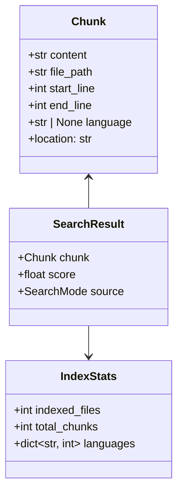
```mermaid
classDiagram
    class Chunk {
        +str content
        +str file_path
        +int start_line
        +int end_line
        +str | None language
        +location: str
    }

    class SearchResult {
        +Chunk chunk
        +float score
        +SearchMode source
    }

    class IndexStats {
        +int indexed_files
        +int total_chunks
        +dict~str, int~ languages
    }

    Chunk <-- SearchResult
    SearchResult --> IndexStats
```

### 搜索模式枚举

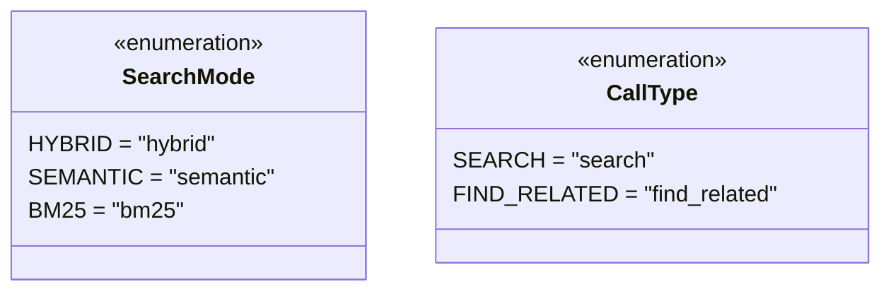
```mermaid
classDiagram
    class SearchMode {
        <<enumeration>>
        HYBRID = "hybrid"
        SEMANTIC = "semantic"
        BM25 = "bm25"
    }

    class CallType {
        <<enumeration>>
        SEARCH = "search"
        FIND_RELATED = "find_related"
    }
```
