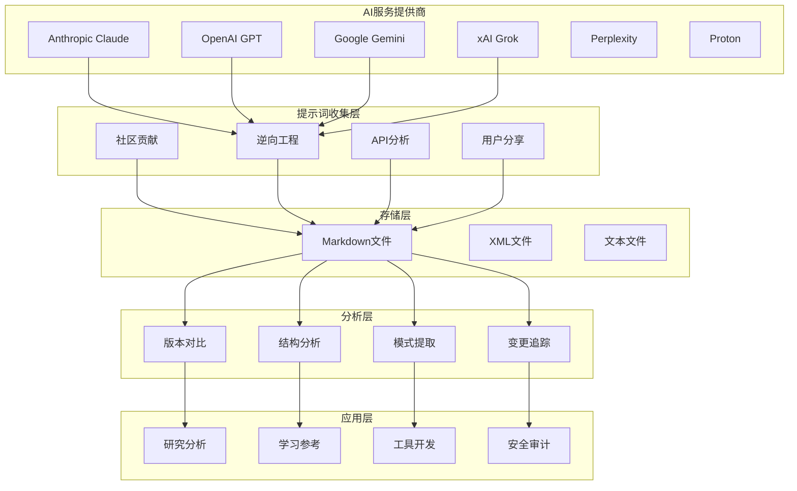
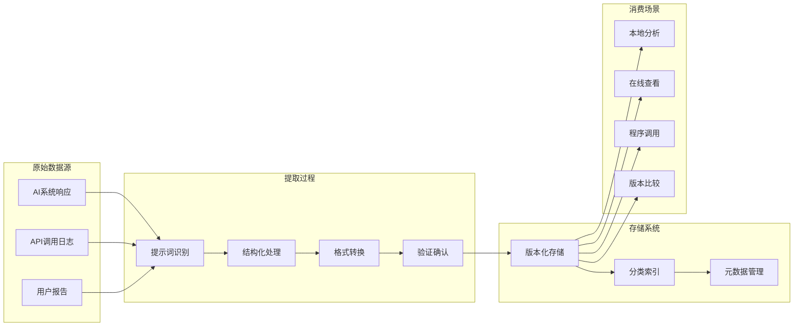
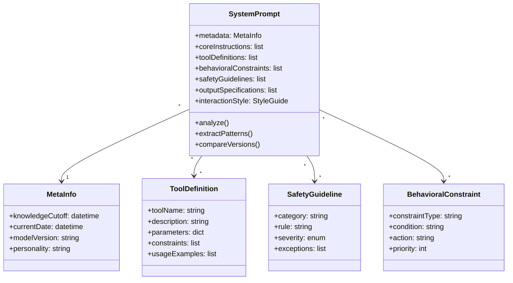
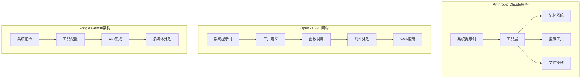
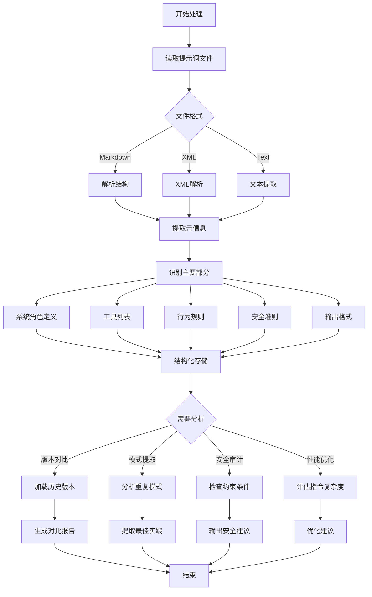
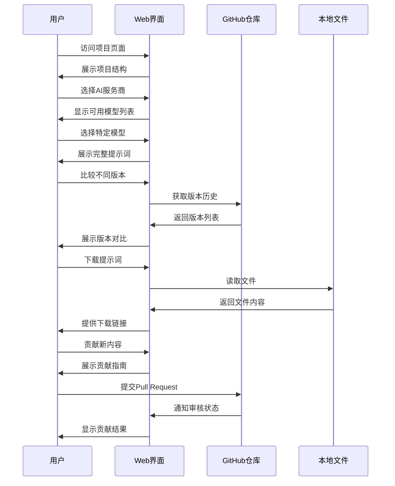
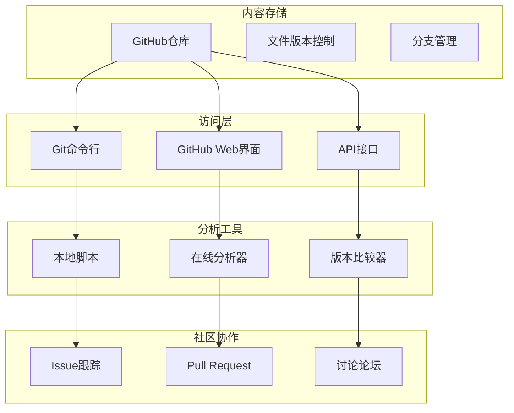
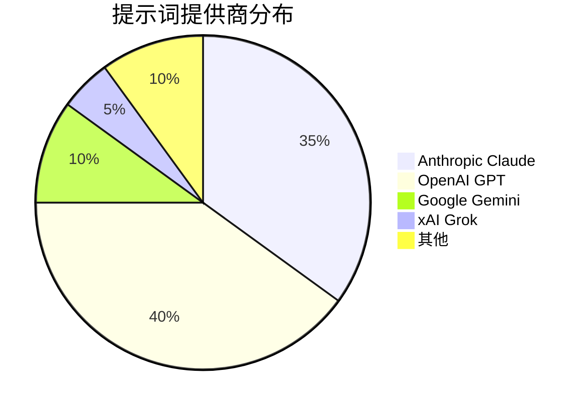
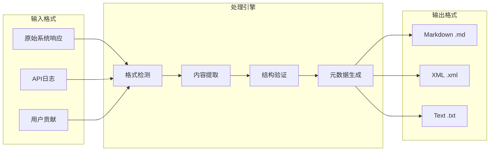

# System Prompts Leaks 架构分析

## 系统整体架构

## 核心数据流

## 提示词结构模式

## AI服务架构对比

## 提示词处理流程

## 用户交互流程

## 部署架构

## 数据统计概览

## 文件格式支持

## 关键组件说明

### 1. 提示词收集器

负责从多个渠道获取系统提示词:

- **社区贡献渠道**: 用户提交的提示词内容
- **逆向工程方法**: 通过特定技术手段获取
- **API分析**: 从API响应中提取系统消息
- **官方文档**: 参考官方发布的信息

### 2. 存储管理系统

提供版本化的文件存储:

- **文件版本控制**: 跟踪提示词的历史变化
- **分类索引**: 按提供商和模型分类
- **元数据管理**: 记录文件属性和来源信息

### 3. 分析引擎

支持多种分析功能:

- **版本对比**: 比较不同时期的提示词差异
- **结构分析**: 解析提示词的内部结构
- **模式提取**: 识别常见的提示词设计模式
- **变更追踪**: 监控提示词的更新情况

### 4. 访问接口

提供多种访问方式:

- **Web界面**: GitHub项目页面浏览
- **命令行**: Git工具克隆和查询
- **API访问**: 程序化接口调用
- **本地分析**: 下载后进行离线分析
