# WhatsApp Web.js 架构分析

## 一、系统整体架构

### 1.1 架构概述

WhatsApp Web.js 采用分层架构设计，从上到下依次为：应用层、结构层、核心层、认证层和浏览器层。这种分层设计使得各层之间的职责清晰，便于维护和扩展。应用层直接面向开发者，提供简洁的 API 接口；结构层封装了各种业务对象，如消息、联系人、群组等；核心层负责与 WhatsApp Web 进行交互，实现消息的发送接收和状态管理；认证层处理用户的登录状态和会话持久化；浏览器层则通过 Puppeteer 控制 Chrome/Chromium 浏览器执行实际的网页操作。

整体架构遵循事件驱动模式，所有操作都通过发布订阅机制进行协调。当用户在 WhatsApp Web 上执行某些操作（如收到新消息）时，底层通过 JavaScript 注入捕获这些事件，然后逐层向上传递，最终触发开发者注册的事件监听器。这种设计模式使得异步操作的编排变得简洁直观，开发者只需关注业务逻辑本身，而无需处理复杂的并发和状态同步问题。

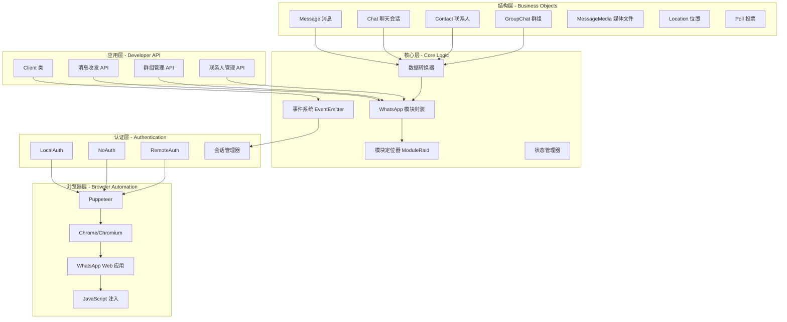

### 1.2 核心技术组件

**Puppeteer 浏览器自动化框架**是整个系统的基础设施。Puppeteer 是 Google 开发的 Node.js 库，它提供了高级 API 来通过 Chrome DevTools Protocol 控制 Chrome 或 Chromium 浏览器。在 WhatsApp Web.js 中，Puppeteer 负责启动浏览器实例、加载 WhatsApp Web 页面、执行 JavaScript 注入以及捕获页面事件。相比于直接使用 CDP（Chrome DevTools Protocol）协议，Puppeteer 大大简化了浏览器控制的复杂性，提供了更加友好的编程接口。

**ModuleRaid 模块定位工具**是一个关键的内部组件，由项目维护者 Pedro Lopez 开发。WhatsApp Web 是一个高度混淆和压缩的单页应用，其源代码经过 webpack 打包和代码混淆处理，直接阅读和定位功能模块几乎不可能。ModuleRaid 通过分析 Webpack 的模块加载机制，能够在运行时定位WhatsApp Web内部的各种模块，如消息发送模块、联系人模块、群组模块等。这种能力使得 WhatsApp Web.js 能够调用 WhatsApp Web 的内部函数，实现完整的聊天功能。

**事件发射器（EventEmitter）**是 Node.js 内置的事件处理机制的封装。WhatsApp Web.js 几乎所有的异步操作都通过事件机制实现，包括消息接收、连接状态变更、认证状态变更等。这种设计模式使得开发者可以以声明式的方式处理各种事件，只需注册相应的事件监听器即可。事件系统还支持一次性监听、错误处理等高级特性，确保了系统的健壮性。

## 二、核心数据流

### 2.1 消息接收流程

消息接收是 WhatsApp Web.js 最核心的功能之一，其数据流涉及多个组件的协作。当用户在 WhatsApp 上发送消息时，WhatsApp 服务器通过 WebSocket 将消息推送到 WhatsApp Web 页面。页面内部的 WhatsApp 模块接收到消息后，会触发内部的事件处理逻辑。WhatsApp Web.js 通过 JavaScript 注入，hook 了这些内部事件处理函数，将消息数据提取出来并转换为统一的消息对象格式。最后，消息对象通过项目的事件系统发布出去，触发开发者注册的 message 事件监听器。

整个流程中，最关键的环节是 JavaScript 注入和消息对象转换。注入代码需要准确定位到 WhatsApp 的消息处理模块，并正确解析消息数据的结构。由于 WhatsApp Web 频繁更新，注入代码也需要持续维护以适应界面变化。消息对象转换则需要处理各种不同类型的消息，包括文本消息、媒体消息、位置消息、联系人消息等，将它们统一转换为 Message 结构。

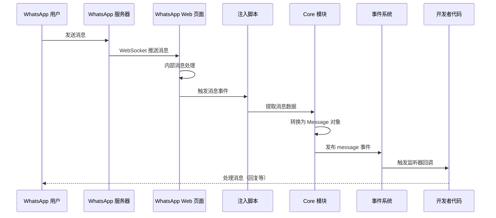

### 2.2 消息发送流程

消息发送流程从开发者调用 `client.sendMessage()` 或 `chat.sendMessage()` 开始。首先，API 层接收发送请求，对输入参数进行验证和预处理，包括消息内容解析、媒体文件处理、收件人信息验证等。验证通过后，请求被传递到核心层的消息发送模块。该模块根据消息类型调用相应的 WhatsApp 内部函数，如发送文本消息调用 `sendTextMessage()`，发送媒体消息调用 `sendMediaMessage()` 等。

发送函数被调用后，WhatsApp 模块会与 WhatsApp 服务器进行通信，将消息内容上传到 WhatsApp 的媒体服务器（如果是媒体消息），然后通过 WebSocket 发送消息数据。服务器确认消息接收后，会返回一个消息 ID，WhatsApp 模块将此 ID 返回给上层。核心层将消息 ID 封装成 Message 对象，通过事件系统发布 message_create 事件，表示消息已成功创建并发送。整个流程是异步的，开发者可以通过监听 message_ack 事件来跟踪消息的送达状态。

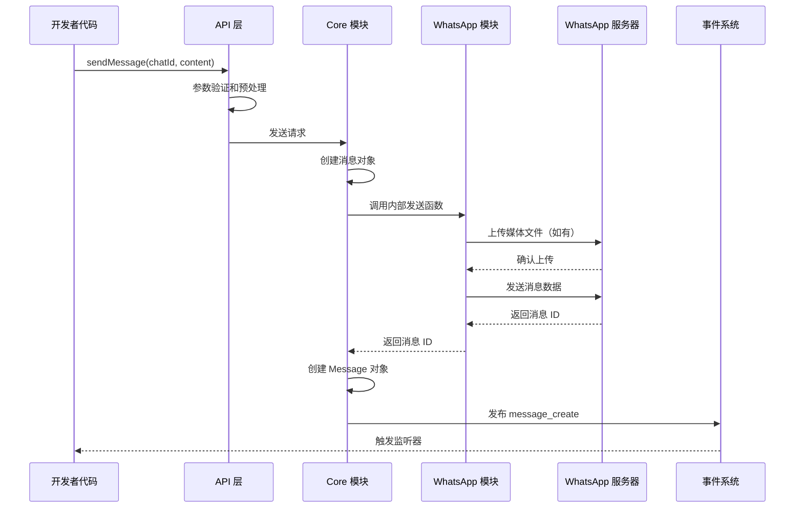

### 2.3 认证与会话管理流程

认证流程是 WhatsApp Web.js 使用体验的关键环节。当首次运行或没有有效会话时，Client 会触发 qr 事件，开发者需要向用户展示二维码。用户使用手机 WhatsApp 扫描二维码后，WhatsApp 服务器会验证二维码有效性并建立设备关联。关联成功后，WhatsApp Web 会生成一个会话令牌，此令牌包含了用户的认证信息。

认证成功后，会话管理器将令牌保存到持久化存储中（根据配置的认证策略，保存到本地文件或远程存储）。后续启动时，Client 会尝试从存储中恢复会话，绕过二维码扫描流程直接登录。如果会话过期或失效，系统会自动清除旧会话并触发新的 qr 事件。

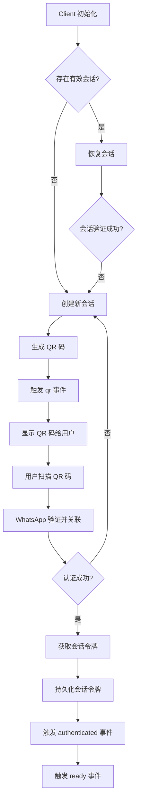

## 三、类与模块关系

### 3.1 核心类结构

WhatsApp Web.js 的核心类结构设计遵循面向对象设计原则，主要类包括 Client、Message、Chat、Contact、GroupChat、MessageMedia 等。Client 是整个库的入口点，负责管理浏览器实例、事件系统和认证状态。Message 类封装了单条消息的所有属性和行为，包括消息内容、发送者、接收者、时间戳、媒体附件等。Chat 类表示一个聊天会话，可以是私聊或群聊，提供了发送消息、获取参与者、修改会话设置等方法。

Contact 类表示一个联系人，存储了联系人的 ID、名称、头像、状态消息等信息。GroupChat 继承自 Chat，专门处理群组相关的功能，如添加成员、修改群组信息、提升管理员等。MessageMedia 类处理媒体文件的编码和解码，支持从文件路径、URL、Base64 字符串等多种来源创建媒体对象。

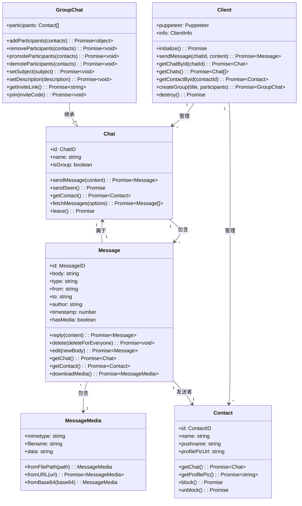

### 3.2 模块依赖关系

WhatsApp Web.js 的内部模块组织清晰，主要包括以下几个目录：authStrategies（认证策略）、structures（数据结构）、factories（工厂类）、util（工具函数）和 webCache（Web 版本缓存）。authStrategies 目录下实现了多种认证策略，包括 LocalAuth、NoAuth 和 RemoteAuth，每种策略都实现了统一的接口，便于扩展。structures 目录下定义了所有业务对象的类，这些类封装了对象的行为和数据转换逻辑。

factories 目录包含工厂类，用于创建复杂对象或处理对象转换。util 目录下是各种工具函数，包括辅助函数、常量定义等。webCache 目录负责管理 WhatsApp Web 版本的缓存，避免每次启动都重新下载 Web 版本。核心的 Client.js 文件是程序的入口点，它协调各个模块的工作，管理浏览器实例和事件系统。

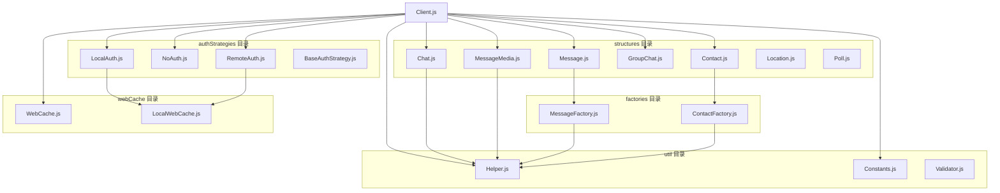

### 3.3 内部模块映射

WhatsApp Web.js 通过 ModuleRaid 工具与 WhatsApp Web 的内部模块进行交互。WhatsApp Web 使用 Webpack 进行模块打包，其内部模块通过数字 ID 进行引用。ModuleRaid 能够扫描 Webpack 的模块注册表，将数字 ID 与模块的实际功能进行映射。这种映射关系使得 WhatsApp Web.js 能够调用 WhatsApp 的内部函数，实现消息发送、联系人获取、群组管理等核心功能。

项目维护者维护了一个模块映射表，记录了 WhatsApp Web 不同版本中关键模块的 ID 及其功能。当 WhatsApp Web 更新导致模块结构变化时，维护者会更新这个映射表以适应新的版本。这也是为什么项目会频繁发布小版本更新来跟进 WhatsApp Web 的变化。

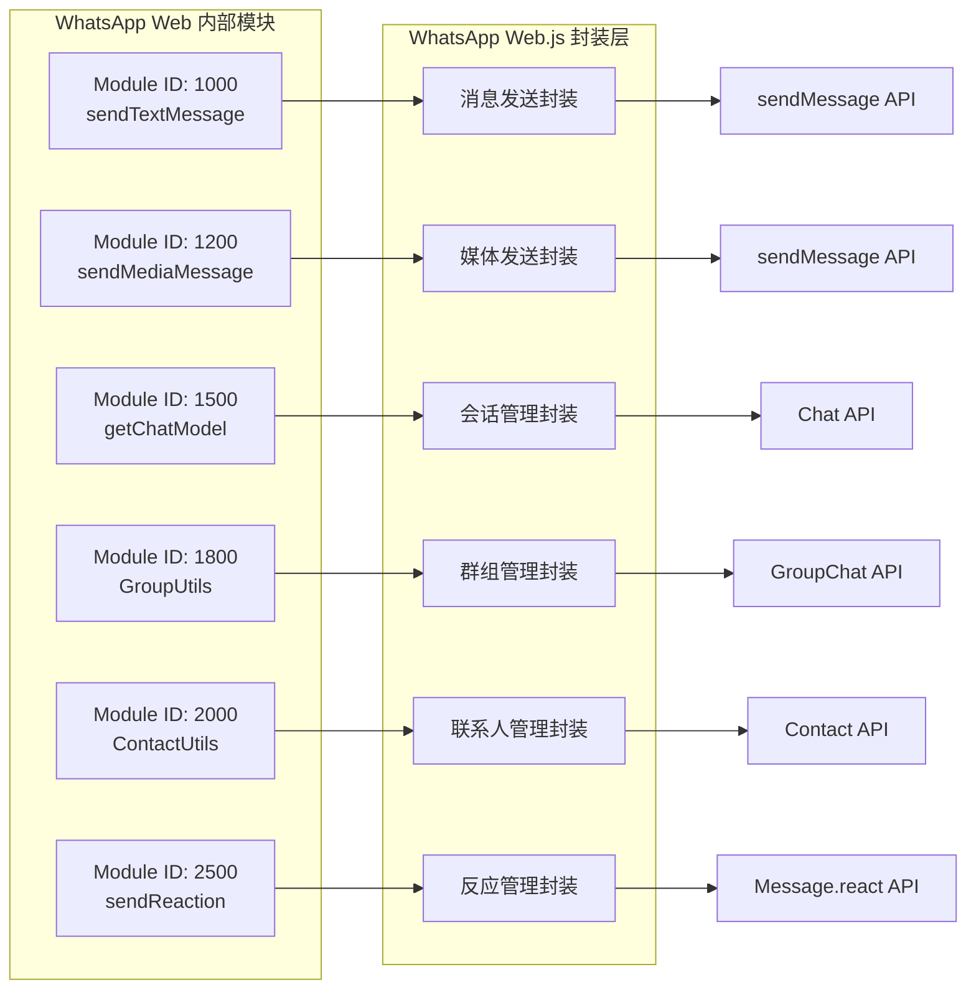

## 四、用户交互流程

### 4.1 典型使用流程

使用 WhatsApp Web.js 开发机器人的典型流程包括以下几个阶段：项目初始化、Client 配置、事件监听编写、消息处理逻辑实现、测试和部署。在项目初始化阶段，开发者需要创建 Node.js 项目，安装 whatsapp-web.js 依赖。然后，根据应用需求配置 Client 实例，包括选择认证策略、配置 Puppeteer 参数等。

事件监听是 WhatsApp Web.js 编程的核心模式。开发者需要为各种可能发生的事件注册监听器，包括 qr 事件（首次运行时展示二维码）、ready 事件（客户端就绪后的初始化逻辑）、message 事件（收到消息时的处理逻辑）等。在消息处理逻辑中，开发者根据消息内容执行相应的操作，如查询数据库、调用第三方 API、发送回复消息等。

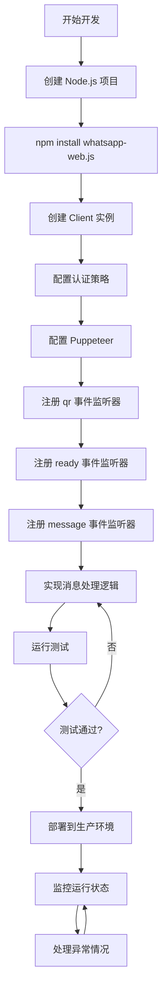

### 4.2 消息处理流程

消息处理流程展示了从收到消息到发送回复的完整链路。当 WhatsApp Web.js 收到新消息时，首先触发 message 事件，传入 Message 对象。消息处理函数从 Message 对象中提取关键信息，包括发送者 ID、消息内容、消息类型等。根据消息内容，开发者可以执行不同的处理逻辑，如命令解析、意图识别、业务查询等。

对于需要回复的消息，处理函数调用 Message.reply() 或 Client.sendMessage() 方法发送回复消息。消息发送是异步操作，调用后立即返回 Promise，实际发送结果通过事件系统通知。对于重要的业务操作，建议在发送前进行状态持久化，确保即使程序崩溃也不会丢失关键操作记录。

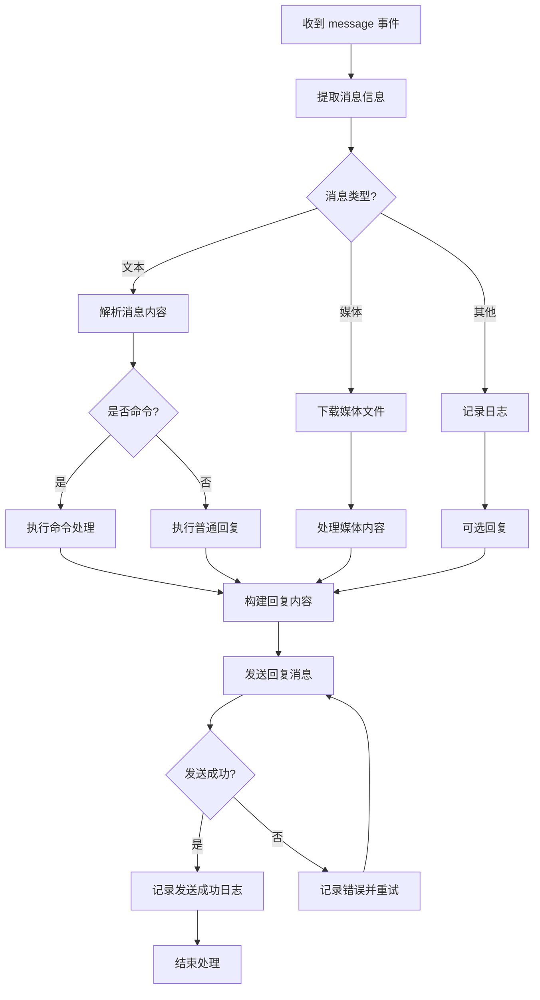

### 4.3 生命周期管理

WhatsApp Web.js 应用的生命周期管理是生产环境部署的关键考量。典型的生命周期包括初始化、就绪、运行中、断开连接、销毁等阶段。初始化阶段 Client 会启动浏览器实例并加载 WhatsApp Web 页面。就绪阶段表示 WhatsApp Web 已完全加载，用户可以开始收发消息。运行中阶段是应用的主要工作状态，消息处理逻辑在此阶段执行。

断开连接可能由多种原因引起，如网络问题、WhatsApp 服务器维护、用户手动退出等。应用需要正确处理断开连接事件，决定是尝试重连还是通知管理员。销毁阶段是程序正常退出或被终止时的清理工作，包括关闭浏览器实例、清理临时文件、保存状态等。正确的生命周期管理确保应用在各种情况下都能优雅地处理，避免资源泄漏和数据丢失。

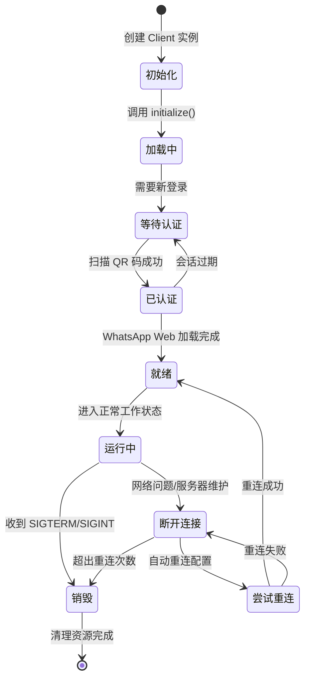

## 五、部署架构

### 5.1 单实例部署架构

单实例部署是最简单的部署方式，适用于小规模应用或开发测试环境。在这种架构中，一个 Node.js 进程运行一个 WhatsApp Web.js Client 实例，直接控制一个浏览器实例。认证策略通常使用 LocalAuth，将会话数据存储在本地文件系统中。这种部署方式的优势是简单易用，缺点是扩展性有限，无法利用多核 CPU 的能力，且单点故障风险较高。

单实例部署需要注意的资源管理问题包括：内存管理（浏览器实例消耗大量内存）、磁盘空间（会话数据和媒体缓存会占用磁盘）、进程守护（确保进程崩溃后能够自动重启）。建议使用 PM2 或类似工具管理进程，实现自动重启和日志管理。

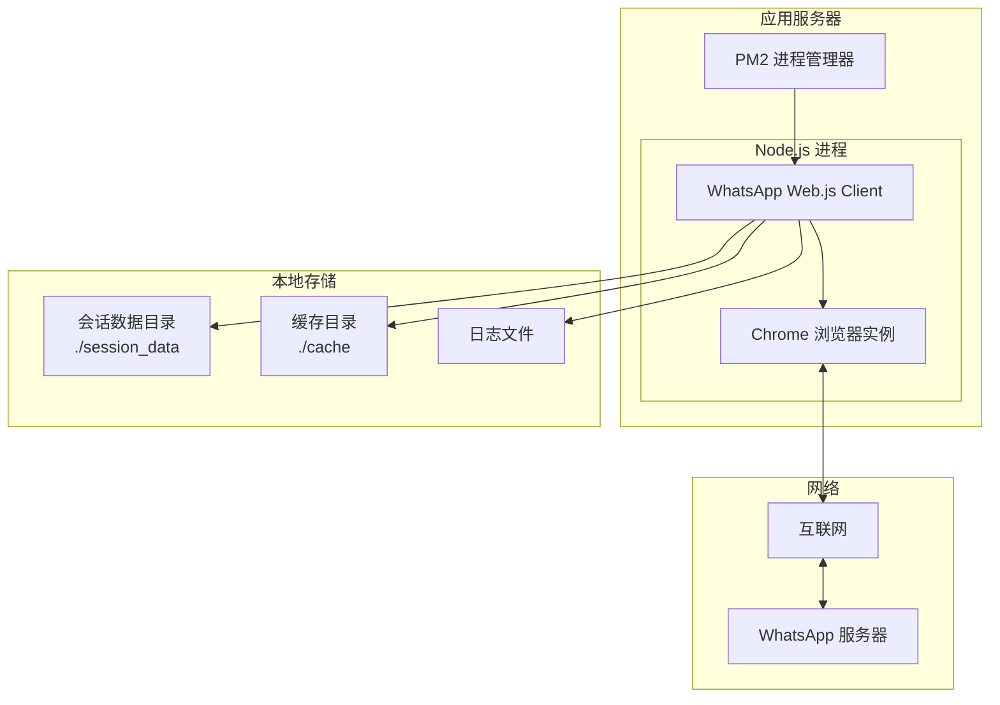

### 5.2 多实例部署架构

对于需要高可用或高并发处理能力的应用，可以采用多实例部署架构。在这种架构中，多个 Node.js 进程分别运行 WhatsApp Web.js Client 实例，每个实例使用独立的浏览器实例。需要注意的是，每个 WhatsApp 账户同时只能在一个设备上登录，因此多实例必须使用不同的 WhatsApp 账户，或者使用 RemoteAuth 策略实现会话共享（但并发使用同一账户可能导致冲突）。

会话共享可以通过 RemoteAuth 策略实现，该策略支持将会话数据存储在远程服务器或云存储服务（如 AWS S3）中。每个实例从远程存储加载会话数据，但同一时间只能有一个实例活跃，其他实例处于待命状态。这种架构适合需要容灾备份的场景，当主实例故障时，备用实例可以接管服务。

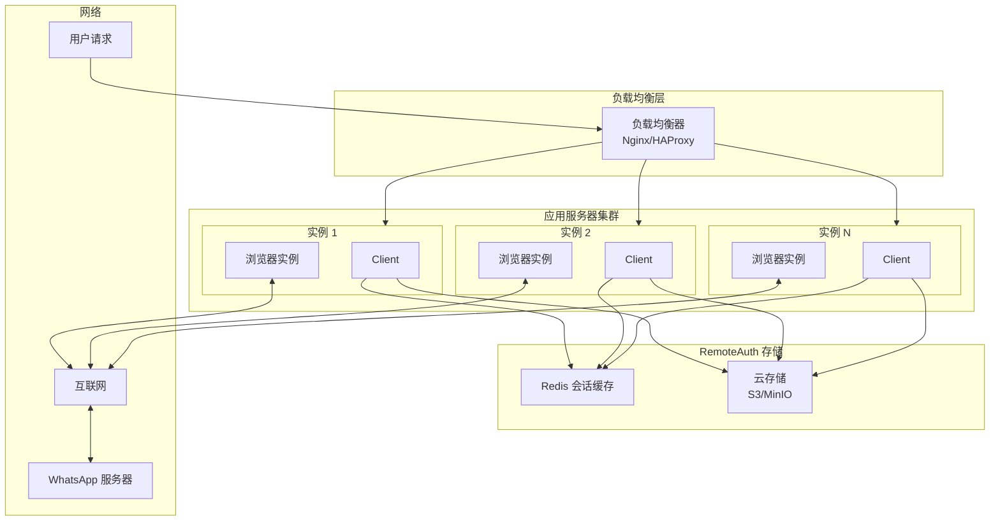

### 5.3 云原生部署架构

云原生部署充分利用云平台的弹性和服务能力，适合大规模生产环境。在这种架构中，应用容器化部署，使用 Kubernetes 或其他容器编排平台管理。浏览器实例通常运行在无头模式，可以利用无头浏览器服务（如 Chrome Headless Browser Cloud）来降低资源消耗。远程存储使用云服务商提供的对象存储和数据库服务，确保数据持久化和高可用。

云原生架构还需要考虑以下要素：配置管理（使用 ConfigMap/Secret 管理敏感配置）、自动伸缩（根据负载自动扩缩容）、日志收集（集中式日志管理）、监控告警（Prometheus + Grafana 监控体系）。这种架构虽然复杂度较高，但提供了最好的扩展性、可靠性和运维效率。

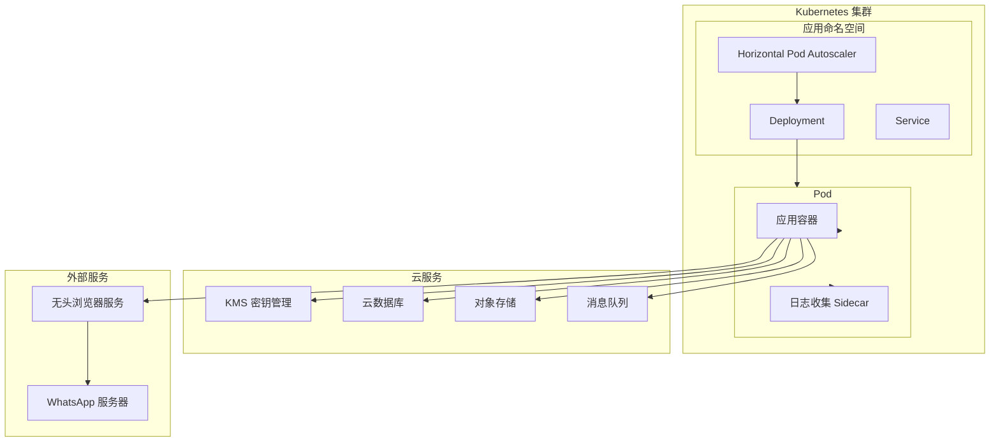

## 六、技术栈依赖关系

### 6.1 核心依赖

| 依赖包 | 版本 | 用途 |
|--------|------|------|
| puppeteer | ^24.31.0 | 浏览器自动化 |
| @pedroslopez/moduleraid | ^5.0.2 | WhatsApp 模块定位 |
| node-fetch | ^2.6.9 | HTTP 请求 |
| node-webpmux | ^3.1.7 | WebP 图像处理 |
| mime | ^3.0.0 | MIME 类型检测 |
| fluent-ffmpeg | ^2.1.3 | 音视频处理 |

### 6.2 可选依赖

| 依赖包 | 版本 | 用途 |
|--------|------|------|
| archiver | ^5.3.1 | ZIP 压缩 |
| fs-extra | ^10.1.0 | 增强文件系统操作 |
| unzipper | ^0.10.11 | ZIP 解压 |

### 6.3 开发依赖

| 依赖包 | 版本 | 用途 |
|--------|------|------|
| eslint | ^8.4.1 | 代码规范检查 |
| mocha | ^9.0.2 | 单元测试 |
| jsdoc | ^3.6.4 | API 文档生成 |
| chai | ^4.3.4 | 测试断言库 |

## 七、版本兼容性

### 7.1 环境要求

| 组件 | 最低版本 | 推荐版本 |
|------|----------|----------|
| Node.js | 18.0.0 | 20.x LTS |
| Chrome/Chromium | 最新版 | 最新稳定版 |
| npm | 随 Node.js | 随 Node.js |
| 操作系统 | Windows/macOS/Linux | Linux (Ubuntu/CentOS) |

### 7.2 WhatsApp Web 版本支持

项目维护了与 WhatsApp Web 版本的兼容性，并通过自动化测试确保新版本发布时的兼容性检查。截至分析时，项目支持的 WhatsApp Web 版本为 2.3000.x 系列。由于 WhatsApp Web 频繁更新，建议关注项目的 GitHub Issues 和 Releases 以获取最新的兼容性信息。
