# LangExtract 项目架构与数据流分析

## 一、系统架构总览

### 1.1 架构设计理念

LangExtract采用了分层架构设计，将用户接口层、任务编排层、模型适配层和数据持久层清晰地分离。这种分层设计的核心优势在于关注点分离——用户接口层专注于提供简洁的API，任务编排层专注于处理复杂的提取逻辑，模型适配层专注于与不同LLM提供商的交互，数据持久层专注于结果的序列化和可视化。

在架构风格上，LangExtract采用了插件化设计模式，通过Provider Registry机制支持多种LLM提供商的动态接入。这种设计确保了核心功能的稳定性，同时提供了良好的扩展性。当需要支持新的LLM提供商时，只需实现相应的Provider接口并注册到Registry中，无需修改核心代码。

### 1.2 系统层次结构

```
┌─────────────────────────────────────────────────────────────────┐
│                     用户接口层 (User Interface)                  │
│  ┌───────────────────────────────────────────────────────────┐  │
│  │                   lx.extract()                            │  │
│  │                   lx.io.save_annotated_documents()        │  │
│  │                   lx.visualize()                          │  │
│  └───────────────────────────────────────────────────────────┘  │
├─────────────────────────────────────────────────────────────────┤
│                    任务编排层 (Task Orchestration)               │
│  ┌───────────────┬───────────────┬───────────────┬───────────┐  │
│  │  文本分块器    │  并行调度器    │  多轮处理器   │ 结果聚合器 │  │
│  │  TextChunker  │ Parallelizer  │ MultiPasser   │ Aggregator │  │
│  └───────────────┴───────────────┴───────────────┴───────────┘  │
├─────────────────────────────────────────────────────────────────┤
│                    模型适配层 (Model Adapter)                    │
│  ┌───────────────────────────────────────────────────────────┐  │
│  │                   Model Factory                            │  │
│  │         ┌─────────────────────────────────────────┐        │  │
│  │         │          Provider Registry              │        │  │
│  │         │  ┌─────┐ ┌─────┐ ┌─────┐ ┌─────┐       │        │  │
│  │         │  │Gemini│ │OpenAI│ │Ollama│ │Vertex│ ...  │        │  │
│  │         │  └─────┘ └─────┘ └─────┘ └─────┘       │        │  │
│  │         └─────────────────────────────────────────┘        │  │
│  └───────────────────────────────────────────────────────────┘  │
├─────────────────────────────────────────────────────────────────┤
│                    数据持久层 (Data Persistence)                 │
│  ┌───────────────────┐                    ┌───────────────────┐  │
│  │  JSONL 序列化器    │                    │  HTML 可视化器    │  │
│  │  JSONL Serializer │                    │  HTML Visualizer │  │
│  └───────────────────┘                    └───────────────────┘  │
└─────────────────────────────────────────────────────────────────┘
```

## 二、核心组件详解

### 2.1 文本分块器（TextChunker）

文本分块器负责将长文档拆分为适合LLM处理的块。分块策略直接影响提取质量：过大的块可能导致信息遗漏，过小的块可能破坏上下文连贯性。

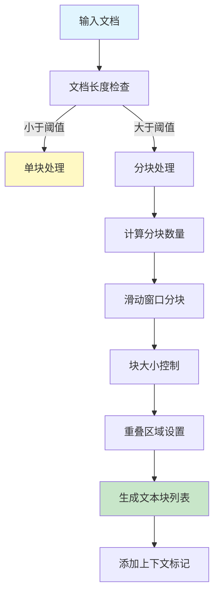

**分块算法特点**：
- 滑动窗口：确保每个区域都被覆盖
- 重叠区域：处理块边界处的跨块引用
- 智能截断：在句子或段落边界切分，保持语义完整性

### 2.2 并行调度器（Parallelizer）

并行调度器利用多线程或异步机制，同时处理多个文本块，以提高整体吞吐量。

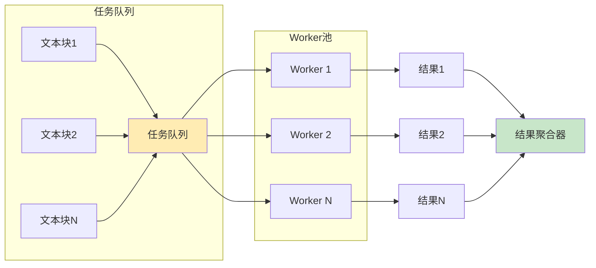

**并行策略**：
- Worker数量可配置（`max_workers`参数）
- 支持异步API调用的并发执行
- 错误处理：单块失败不影响整体处理

### 2.3 多轮处理器（MultiPasser）

多轮处理器通过多次提取轮次来提高召回率。每一轮的提取结果会影响后续轮次的提示词。

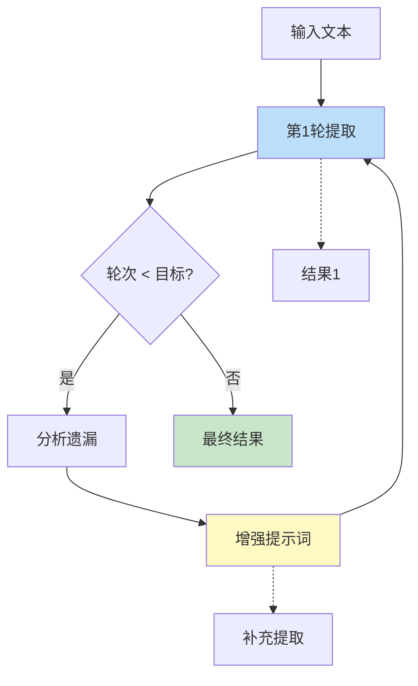

**多轮提取逻辑**：
- 第一轮：基础提取，识别主要实体
- 后续轮次：针对性补充，处理遗漏和模糊情况
- 终止条件：达到指定轮数或结果收敛

### 2.4 结果聚合器（Aggregator）

结果聚合器负责合并来自多个块和多轮处理的提取结果，并解决核心指代问题。

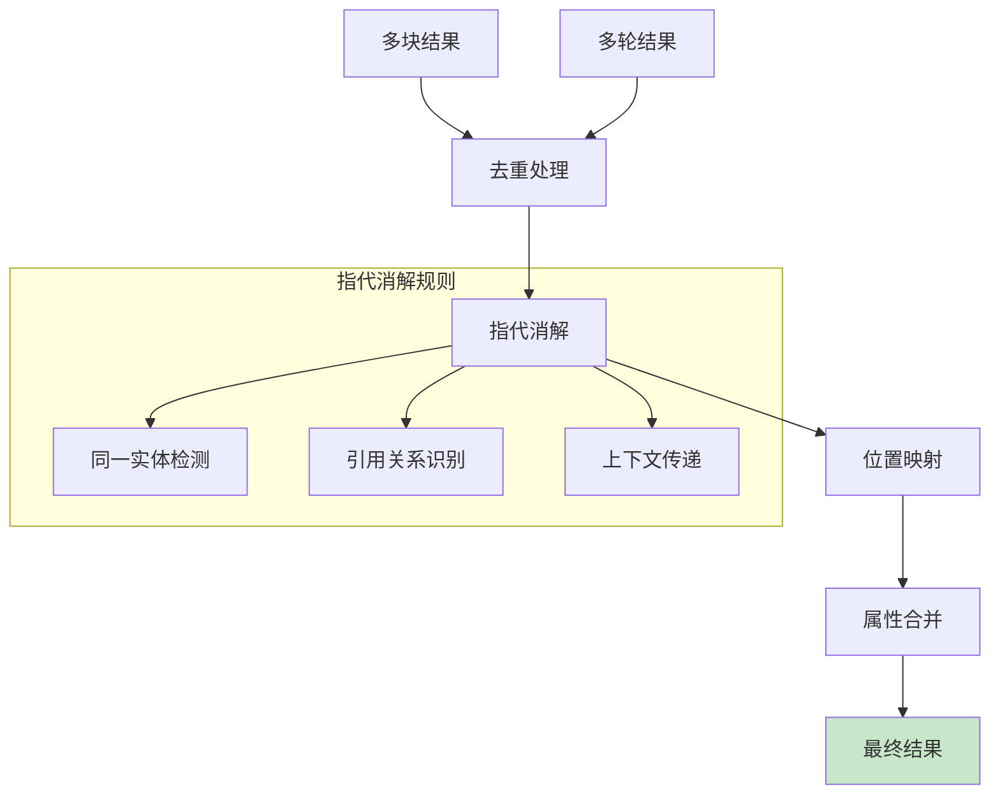

## 三、数据流分析

### 3.1 端到端数据流

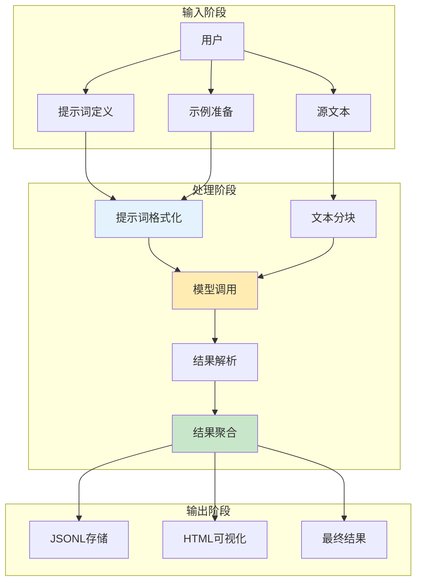

### 3.2 提示词格式化数据流

提示词格式化是连接用户意图和模型理解的关键环节。

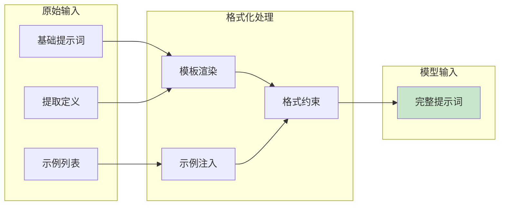

**提示词模板结构**：
```
[系统指令]
[提取任务描述]
[格式要求]
[示例1]
[示例2]
...
[待提取文本]
```

### 3.3 批处理数据流（Vertex AI）

Vertex AI批处理模式针对大规模离线处理场景。

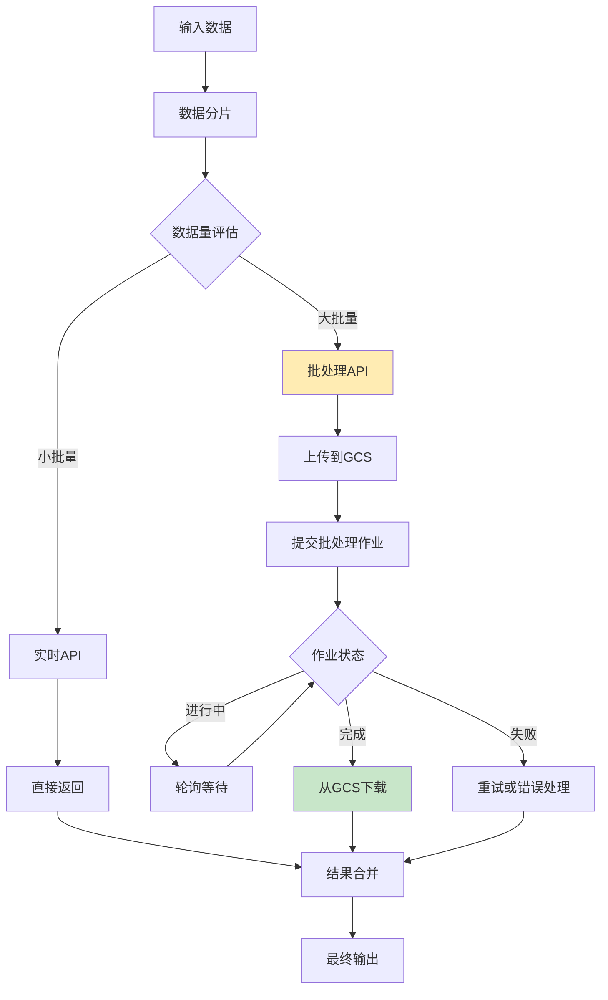

### 3.4 多语言处理数据流

LangExtract内置了多语言分词支持，确保在不同语言环境下的准确提取。

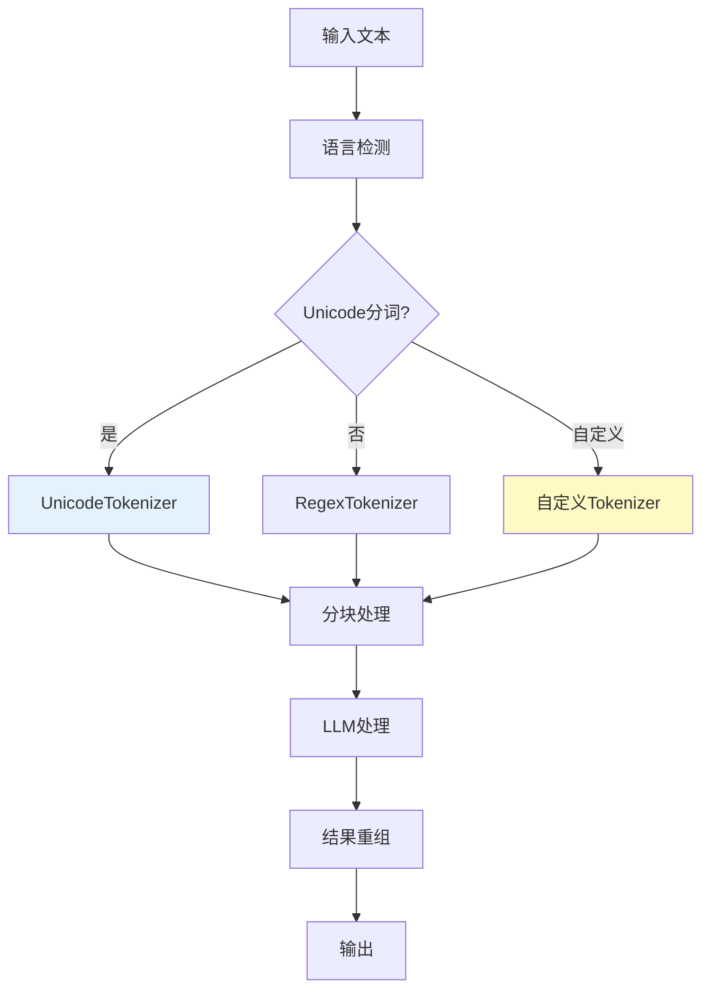

## 四、模型适配层架构

### 4.1 Provider Registry 机制

Provider Registry采用模式匹配和优先级解析机制，支持动态发现和注册LLM提供商。

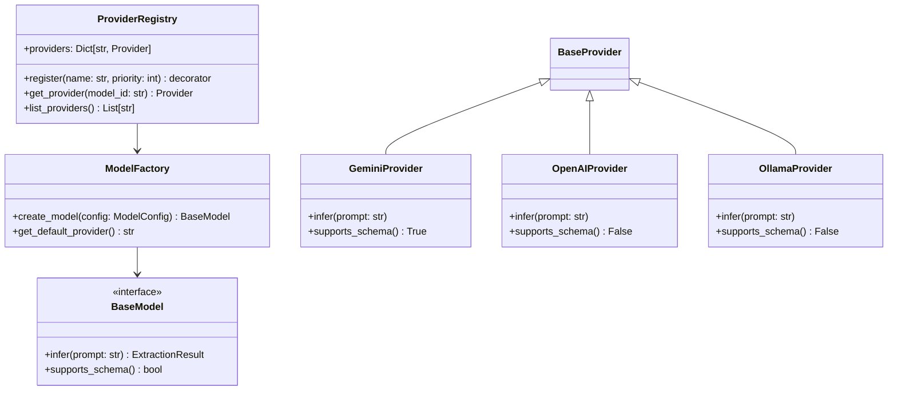

### 4.2 模型调用时序图

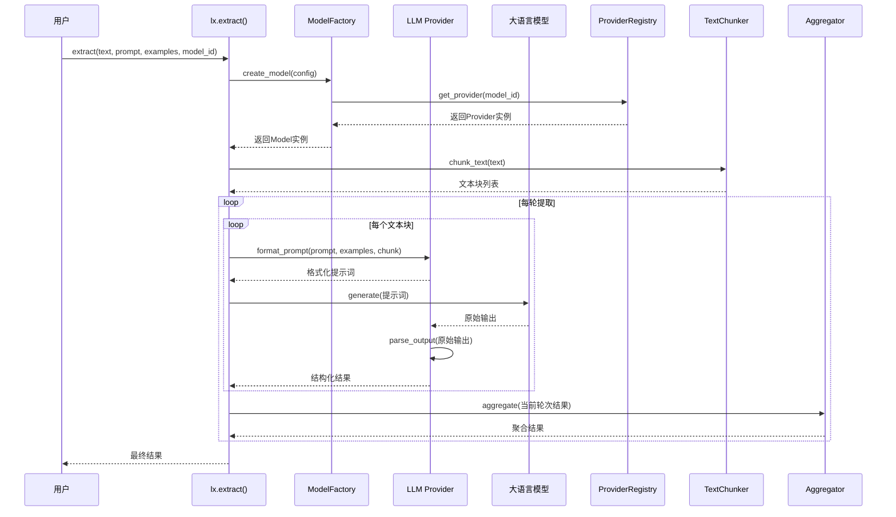

## 五、自定义Provider开发架构

### 5.1 插件接口规范

自定义Provider需要实现以下接口规范。

```mermaid
flowchart TD
    A[自定义Provider开发] --> B[实现BaseModel接口]
    B --> C[注册到ProviderRegistry]
    C --> D[配置入口点]
    D --> E[测试验证]
    
    subgraph 接口要求
        F[infer()方法]
        G[supports_schema()方法]
        H[parse_output()方法]
    end
    
    B --> F
    B --> G
    B --> H
    
    style A fill:#c8e6c9
    style E fill:#c8e6c9
```

### 5.2 数据模型关系图

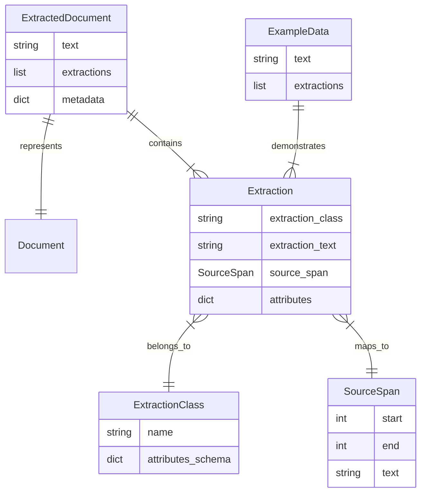

## 六、可视化与持久化架构

### 6.1 结果持久化架构

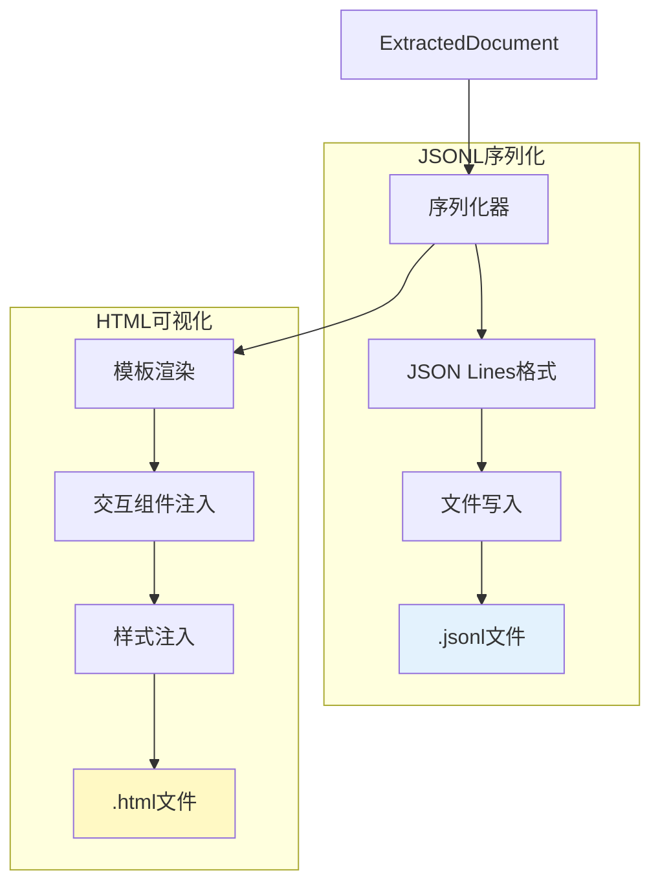

### 6.2 HTML可视化架构

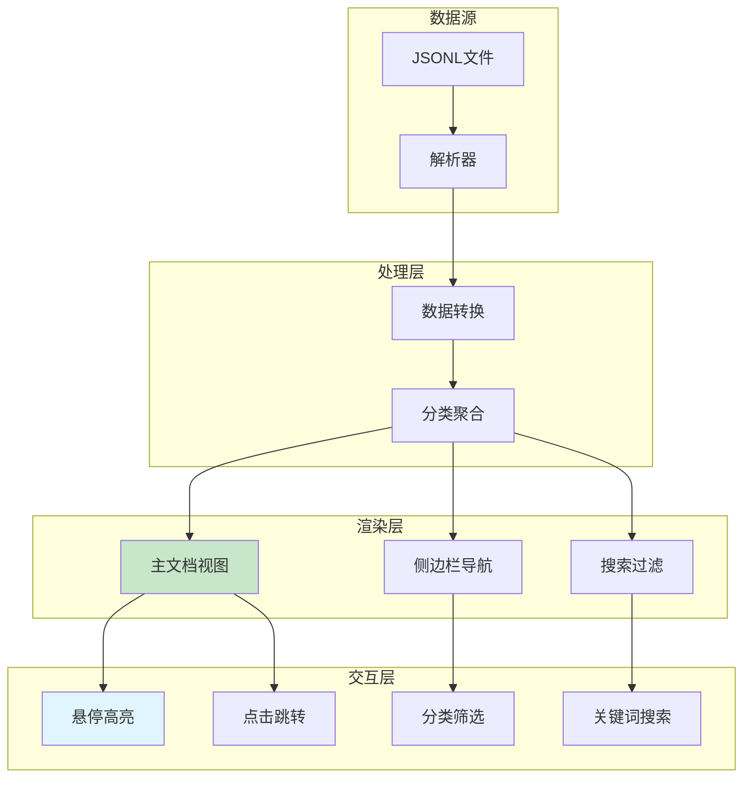

## 七、配置与扩展点

### 7.1 可配置参数映射

| 功能模块 | 参数名称 | 类型 | 默认值 | 说明 |
|---------|---------|------|-------|------|
| 提取配置 | `extraction_passes` | int | 1 | 提取轮数 |
| 并行配置 | `max_workers` | int | 1 | 并行工作线程数 |
| 分块配置 | `max_char_buffer` | int | 40000 | 单块最大字符数 |
| 上下文配置 | `context_window_chars` | int | 1000 | 跨块上下文大小 |
| 模型配置 | `model_id` | str | "gemini-2.5-flash" | 模型标识 |
| 批处理配置 | `batch.enabled` | bool | False | 启用批处理 |

### 7.2 扩展点列表

LangExtract提供了多个扩展点以支持自定义需求。

**Provider扩展**：通过实现BaseModel接口并注册到ProviderRegistry，可以添加新的LLM提供商支持。

**Tokenizer扩展**：通过实现自定义Tokenizer并注册，可以支持特定语言或领域的分词策略。

**输出格式扩展**：通过自定义结果解析器，可以支持不同的输出格式和验证规则。

**可视化扩展**：通过修改HTML模板，可以定制可视化界面的样式和交互行为。
