# OpenClaw 架构文档

## 1. 系统整体架构图

### 1.1 核心架构概览

```mermaid
graph TB
    subgraph "用户设备层"
        subgraph "macOS 平台"
            MenuBar["菜单栏应用\nOpenClaw.app"]
            VoiceWake["Voice Wake\n语音唤醒"]
            TalkMode["Talk Mode\n对话模式"]
            Canvas["Live Canvas\n可视化画布"]
        end

        subgraph "iOS 平台"
            IOSNode["iOS 节点"]
            IOSVoice["语音唤醒"]
            IOSCamera["相机/屏幕录制"]
        end

        subgraph "Android 平台"
            AndroidNode["Android 节点"]
            AndroidVoice["语音唤醒"]
            AndroidCamera["相机/屏幕录制"]
        end
    end

    subgraph "Gateway 控制平面"
        GW["Gateway 服务\nws://127.0.0.1:18789"]
        CLI["CLI 界面\nopenclaw 命令"]
        WebUI["Web UI\nControl UI + WebChat"]
    end

    subgraph "AI 运行时层"
        PI["Pi Agent 运行时\nRPC 模式"]
        Models["模型提供商\nAnthropic/OpenAI"]
        Skills["Skills 平台\nClawHub"]
    end

    subgraph "通道层 Channels"
        WhatsApp["WhatsApp\nBaileys"]
        Telegram["Telegram\ngrammY"]
        Slack["Slack\nBolt"]
        Discord["Discord\ndiscord.js"]
        GoogleChat["Google Chat\nChat API"]
        Signal["Signal\nsignal-cli"]
        IMessage["iMessage\nBlueBubbles"]
        Teams["Microsoft Teams\nBot Framework"]
        Matrix["Matrix\nSDK"]
        Zalo["Zalo\nSDK"]
    end

    subgraph "工具层 Tools"
        Browser["Browser Control\nChrome CDP"]
        CanvasTools["Canvas 工具\nA2UI"]
        NodeTools["Node 工具\n相机/屏幕/位置"]
        Cron["Cron 定时任务"]
        Webhook["Webhook 触发器"]
        Sessions["会话管理\nsessions_*"]
    end

    subgraph "数据层"
        Config["配置文件\n~/.openclaw/openclaw.json"]
        SessionsData["会话数据\n~/.openclaw/sessions/"]
        Credentials["凭证存储\n~/.openclaw/credentials/"]
        Workspace["工作区\n~/.openclaw/workspace/"]
        SkillsStore["技能存储\n~/.openclaw/workspace/skills/"]
    end

    MenuBar --> GW
    VoiceWake --> GW
    TalkMode --> GW
    Canvas --> GW

    IOSNode --> GW
    AndroidNode --> GW

    CLI --> GW
    WebUI --> GW

    GW --> PI
    PI --> Models
    PI --> Skills

    GW --> WhatsApp
    GW --> Telegram
    GW --> Slack
    GW --> Discord
    GW --> GoogleChat
    GW --> Signal
    GW --> IMessage
    GW --> Teams
    GW --> Matrix
    GW --> Zalo

    GW --> Browser
    GW --> CanvasTools
    GW --> NodeTools
    GW --> Cron
    GW --> Webhook
    GW --> Sessions

    GW --> Config
    GW --> SessionsData
    GW --> Credentials
    GW --> Workspace
    GW --> SkillsStore

    style GW fill:#e1f5fe
    style PI fill:#f3e5f5
    style Models fill:#fff3e0
```

### 1.2 消息流向架构

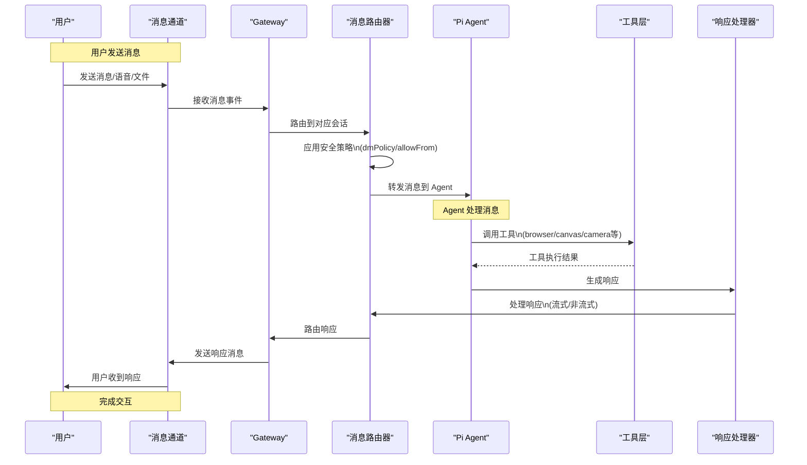

## 2. 核心数据流图

### 2.1 消息处理数据流

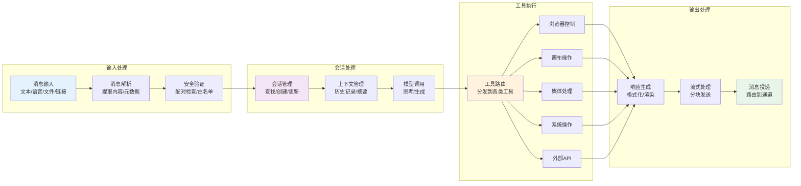

### 2.2 媒体处理管道

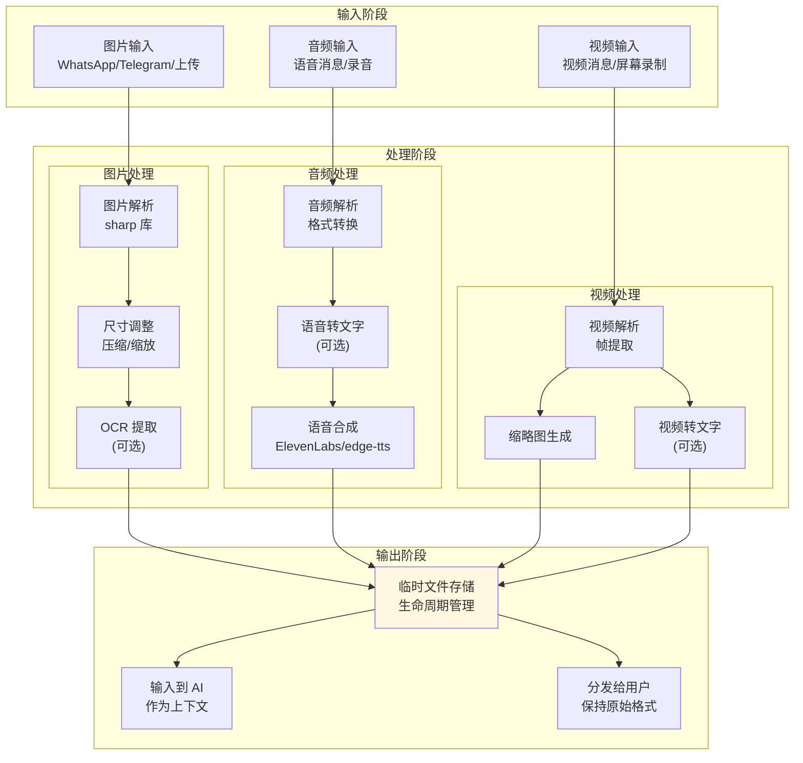

## 3. 模块关系图

### 3.1 Gateway 核心模块依赖

```mermaid
graph TB
    subgraph "Gateway 核心"
        GWMain["gateway/index.ts\n入口文件"]
        GWServer["WebSocket 服务器\nws://127.0.0.1:18789"]
        GWConfig["配置管理\nConfig 模块"]
    end

    subgraph "会话管理"
        Sessions["sessions/ 会话模块"]
        SessionModel["会话模型\nmain/群组/激活模式"]
        SessionStore["会话存储\nJSONL 文件"]
    end

    subgraph "消息通道"
        Channels["channels/ 通道模块"]
        Routing["routing/ 路由模块"]
        ChannelBase["通道基类"]
        ChannelImpl["各平台实现"]
    end

    subgraph "Agent 集成"
        Agents["agents/ Agent 模块"]
        PiRuntime["Pi Agent 运行时"]
        ToolsDef["工具定义\nSchema"]
        Streaming["流式处理"]
    end

    subgraph "工具系统"
        Tools["tools/ 工具模块"]
        Browser["browser/ 浏览器"]
        Canvas["canvas-host/ 画布"]
        Nodes["nodes/ 设备节点"]
        Cron["cron/ 定时任务"]
    end

    subgraph "辅助功能"
        CLI["cli/ 命令行"]
        Web["web/ Web 服务"]
        TUI["tui/ 终端 UI"]
        Media["media/ 媒体处理"]
    end

    GWMain --> GWServer
    GWMain --> GWConfig
    GWServer --> Sessions
    GWServer --> Channels
    GWServer --> Agents
    GWServer --> Tools
    GWServer --> CLI
    GWServer --> Web
    GWServer --> TUI
    GWServer --> Media

    Sessions --> SessionModel
    Sessions --> SessionStore

    Channels --> Routing
    Channels --> ChannelBase
    Channels --> ChannelImpl

    Agents --> PiRuntime
    Agents --> ToolsDef
    Agents --> Streaming

    Tools --> Browser
    Tools --> Canvas
    Tools --> Nodes
    Tools --> Cron

    style GWMain fill:#bbdefb
    style GWServer fill:#bbdefb
    style Sessions fill:#f8bbd9
    style Channels fill:#c8e6c9
    style Agents fill:#ffe0b2
    style Tools fill:#b2dfdb
```

### 3.2 通道模块结构

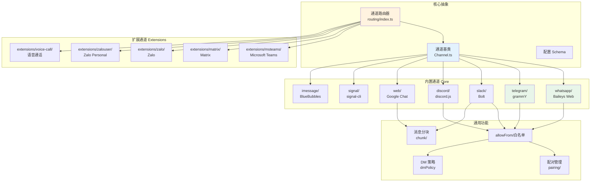

## 4. 用户交互流程图

### 4.1 典型用户交互流程

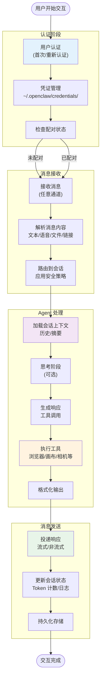

### 4.2 多设备协同流程

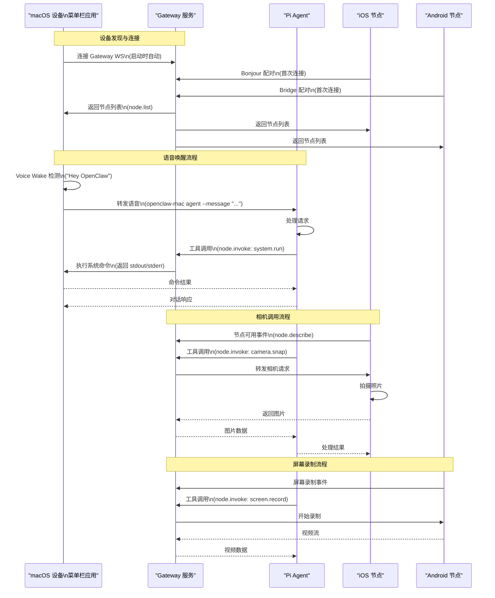

### 4.3 群组消息处理流程

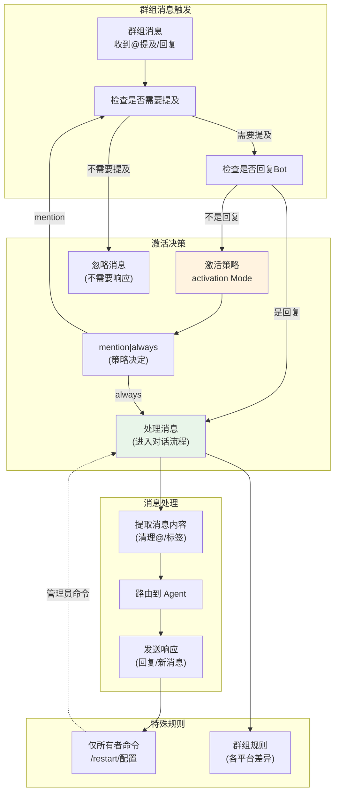

## 5. 部署架构图

### 5.1 本地部署架构（推荐）

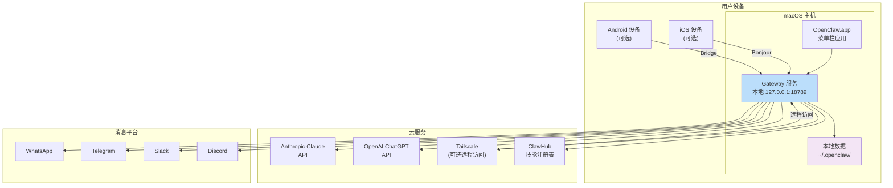

### 5.2 服务器远程部署架构

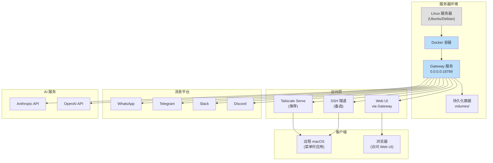

### 5.3 Docker 沙箱部署架构

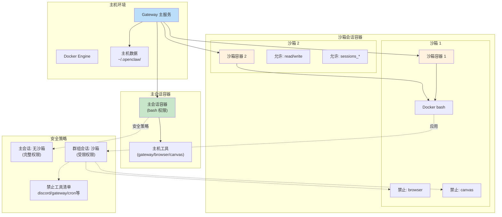

## 6. 技术栈依赖图

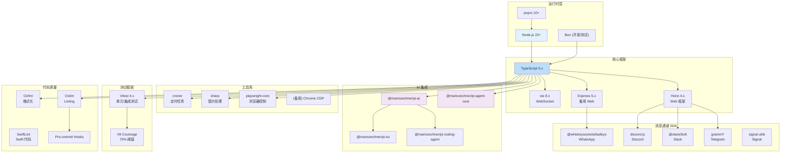

## 7. 安全架构图

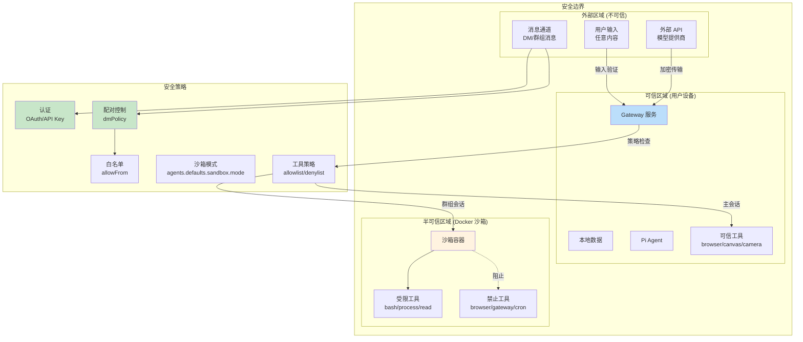
