# Anthropic Skills 架构图

## 一、系统整体架构

### 1.1 架构概览

Anthropic Skills 系统采用分层架构设计，从上至下依次为：接入层、集成层、技能层和规格层。这种分层设计遵循了软件工程的最佳实践，实现了关注点分离和高内聚低耦合的目标。每一层都有明确的职责边界，层与层之间通过标准化接口进行通信，确保了系统的可维护性和可扩展性。

架构设计的核心理念是「技能即封装」。每个技能都是一个自包含的功能单元，包含执行特定任务所需的全部指令、脚本和资源。这种封装使得技能的开发和测试可以独立进行，也使得技能的复用和组合变得简单直观。用户可以根据自己的需求选择性地加载所需技能，实现个性化的 AI 助手能力。

整个架构围绕 Claude 核心引擎构建，技能系统作为扩展层存在。当用户发起请求时，系统会分析请求意图并激活相关的技能，激活的技能将其指令注入到 Claude 的上下文中，从而影响 AI 的行为和输出。这种动态注入机制是 Skills 系统区别于传统提示词工程的关键创新点。

### 1.2 分层架构图

以下架构图展示了 Skills 系统的整体分层结构和各层之间的交互关系：

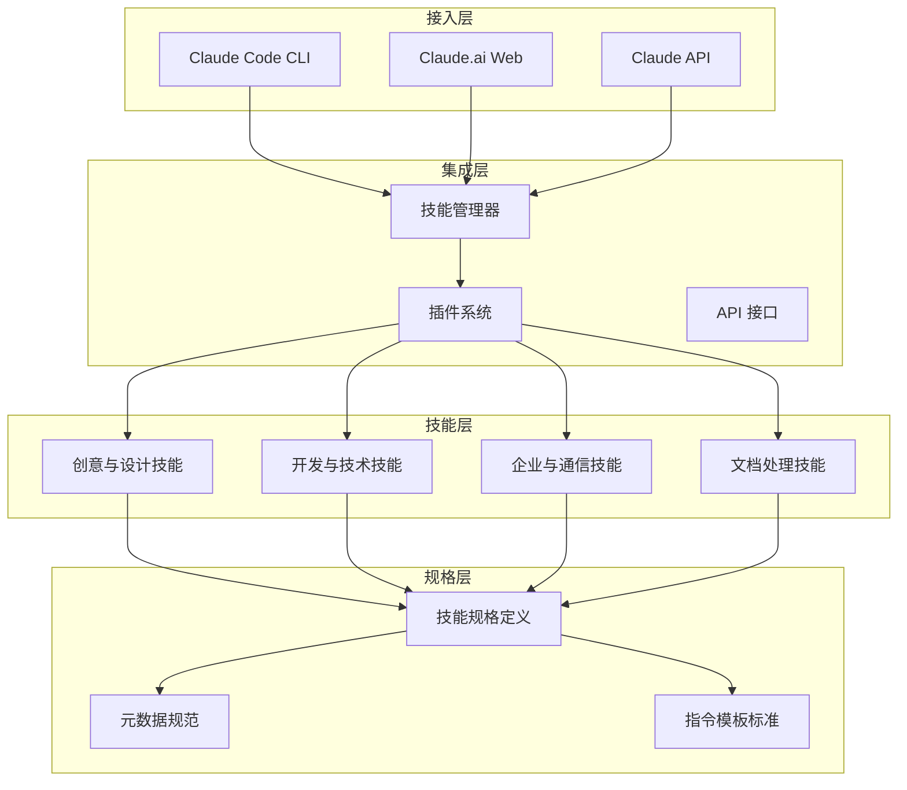

**架构说明**：

- **接入层**是用户与系统交互的入口点，支持三种使用方式：命令行工具（Claude Code）、网页应用（Claude.ai）和编程接口（API）
- **集成层**负责处理技能的管理和激活，包括技能管理器、插件系统和 API 接口三个核心组件
- **技能层**包含具体的技能实现，按照功能领域分为四个类别
- **规格层**定义了技能的标准规范，确保所有技能遵循统一的结构

### 1.3 技能仓库结构

Skills 仓库本身的目录结构反映了系统的设计理念：

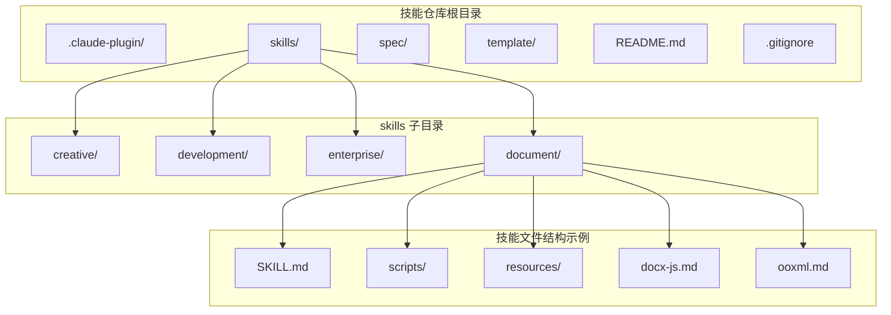

**结构说明**：

- **skills/** 目录包含所有示例技能，按功能类别组织
- **spec/** 目录包含 Agent Skills 的规格定义文档
- **template/** 目录提供创建新技能的模板
- **.claude-plugin/** 目录定义 Claude Code 插件配置

## 二、核心数据流

### 2.1 技能激活数据流

当用户与 Claude 交互时，系统内部经历一系列步骤来确定是否需要激活技能以及激活哪些技能。以下流程图详细展示了这一过程：

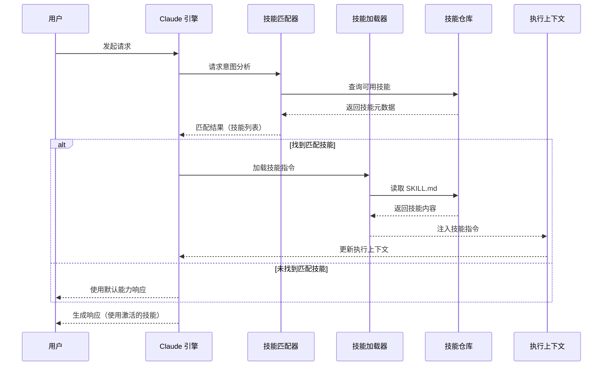

**数据流说明**：

1. 用户发起请求后，系统首先进行意图分析
2. 技能匹配器根据请求内容查询可用技能
3. 匹配结果返回给 Claude 引擎
4. 如果找到匹配技能，技能加载器读取并解析 SKILL.md 文件
5. 技能指令被注入到执行上下文中
6. Claude 使用更新后的上下文生成最终响应

### 2.2 文档处理数据流

以 DOCX 文档处理为例，展示完整的文档操作数据流：

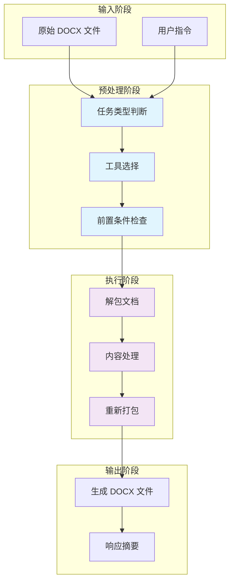

**详细数据流说明**：

**输入阶段**：接收用户提供的 DOCX 文件和操作指令。文件路径需要验证存在性，指令需要解析操作类型。

**预处理阶段**：系统首先判断任务类型（创建、读取、编辑），然后根据类型选择合适的工具和脚本，最后检查前置条件（如必要的参考文档是否已阅读）。

**执行阶段**：对于编辑类任务，首先使用 unpack.py 脚本解压 DOCX 文件（ZIP 格式），然后根据具体操作修改 XML 内容，最后使用 pack.py 脚本重新打包为 DOCX 格式。

**输出阶段**：生成处理后的文件，并提供操作摘要供用户确认。

### 2.3 修订追踪工作流数据流

修订追踪（Redlining）是 DOCX 技能中最高级的工作流，以下是其完整的数据流转过程：

```mermaid
flowchart LR
    subgraph "阶段一：准备"
        A1["获取当前文档"]
        A2["转换为 Markdown"]
        A3["识别变更需求"]
    end

    subgraph "阶段二：分组"
        B1["分析变更类型"]
        B2["确定分组策略"]
        B3["划分变更批次"]
    end

    subgraph "阶段三：实现"
        C1["阅读参考文档"]
        C2["解压目标文档"]
        C3["逐批次实现变更"]
    end

    subgraph "阶段四：验证"
        D1["重新打包文档"]
        D2["转换验证"]
        D3["确认变更正确"]
    end

    A1 --> A2 --> A3 --> B1 --> B2 --> B3 --> C1 --> C2 --> C3 --> D1 --> D2 --> D3

    style A1 fill:#fff3e0
    style A2 fill:#fff3e0
    style A3 fill:#fff3e0
    style B1 fill:#e8f5e9
    style B2 fill:#e8f5e9
    style B3 fill:#e8f5e9
    style C1 fill:#e3f2fd
    style C2 fill:#e3f2fd
    style C3 fill:#e3f2fd
    style D1 fill:#fce4ec
    style D2 fill:#fce4ec
    style D3 fill:#fce4ec
```

**批次划分策略**：

修订追踪工作流的核心创新是批次划分。系统将大量变更分组为 3-10 个变更的小批次，每个批次可以独立测试和验证。批次划分可以基于以下维度：

- **按文档章节**：将同一章节的变更归为一批
- **按变更类型**：将同类变更（如日期修改、名称替换）归为一批
- **按复杂程度**：简单变更先行，复杂变更后处理
- **按页面位置**：将相邻页面的变更归为一批

## 三、模块关系图

### 3.1 技能内部模块关系

以 DOCX 技能为例，展示其内部各模块之间的依赖关系：

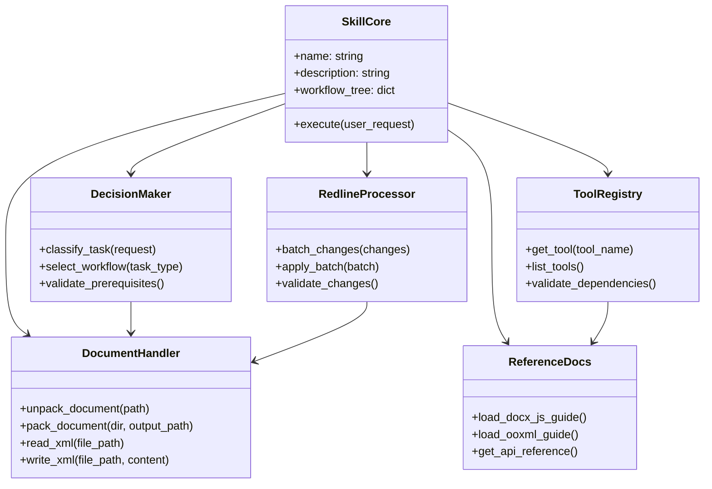

**模块职责说明**：

- **SkillCore**：技能核心类，负责协调各模块的工作
- **DecisionMaker**：决策模块，根据任务类型选择合适的工作流程
- **DocumentHandler**：文档处理模块，负责 DOCX 文件的解压、读取和打包
- **RedlineProcessor**：修订追踪模块，处理复杂的文档编辑操作
- **ToolRegistry**：工具注册表，管理技能所需的外部工具
- **ReferenceDocs**：参考文档模块，提供详细的技术文档访问

### 3.2 技能间协作关系

不同技能之间可以协作完成复杂任务，以下展示了技能间的协作关系：

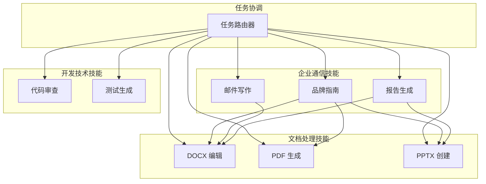

**协作模式说明**：

- **任务路由**：任务路由器根据任务类型将请求分发给相应的技能
- **技能组合**：多个技能可以组合使用，例如「品牌指南」与「DOCX 编辑」组合确保生成的文档符合品牌规范
- **流水线执行**：某些任务需要按顺序执行多个技能，例如生成报告可能需要先由「报告生成」技能规划结构，再由「DOCX 编辑」技能创建文档

### 3.3 Claude 与 Skills 的交互关系

以下图表展示了 Claude 引擎与 Skills 系统之间的交互关系：

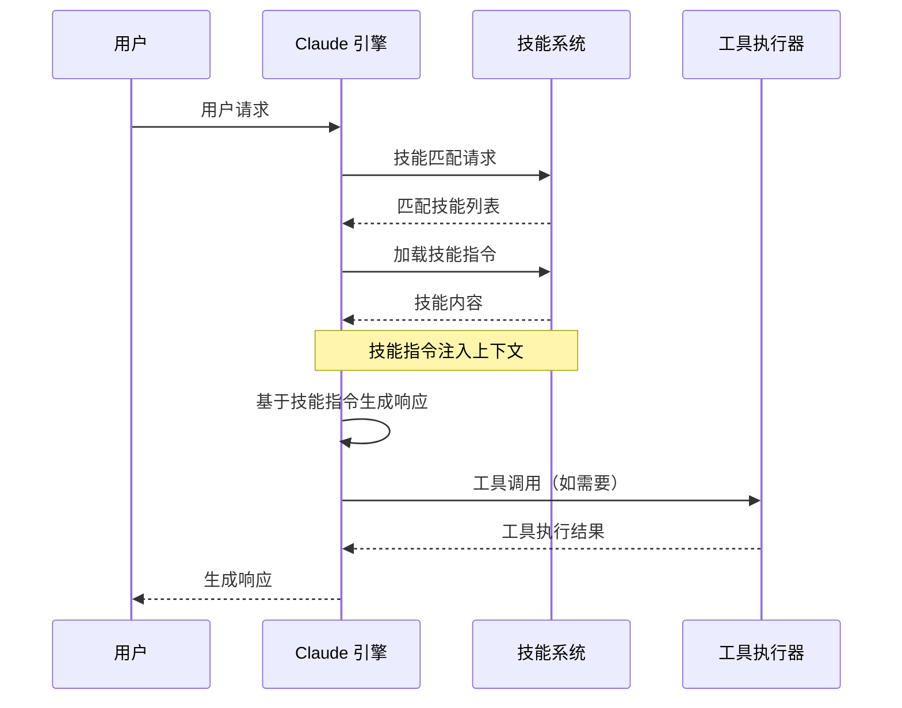

## 四、用户交互流程

### 4.1 Claude Code 用户交互流程

以下是 Claude Code 用户使用 Skills 的完整交互流程：

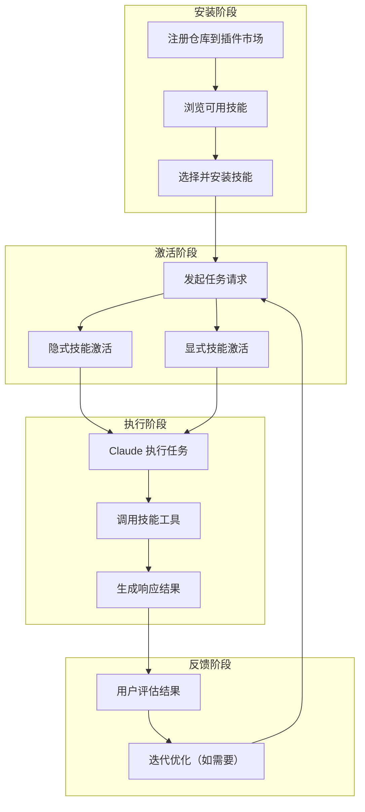

**交互方式说明**：

**隐式激活**：Claude 根据请求内容自动匹配并激活相关技能，用户无需显式指定技能。例如，用户说「帮我创建一个专业的商业合同」，系统自动激活 DOCX 技能中的文档创建功能。

**显式激活**：用户可以显式指定使用某个技能。例如，「使用 PDF 技能从这个 DOCX 文件生成 PDF」。显式激活在用户清楚知道自己需要什么技能时更加高效。

### 4.2 技能创建流程

创建新技能遵循以下流程：

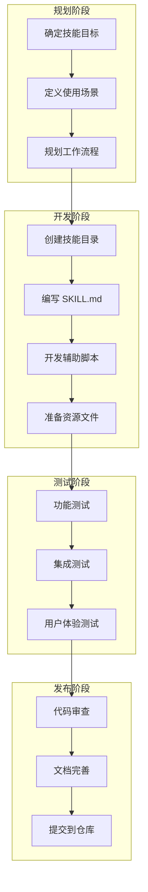

### 4.3 修订追踪操作流程

修订追踪工作流的详细用户交互流程：

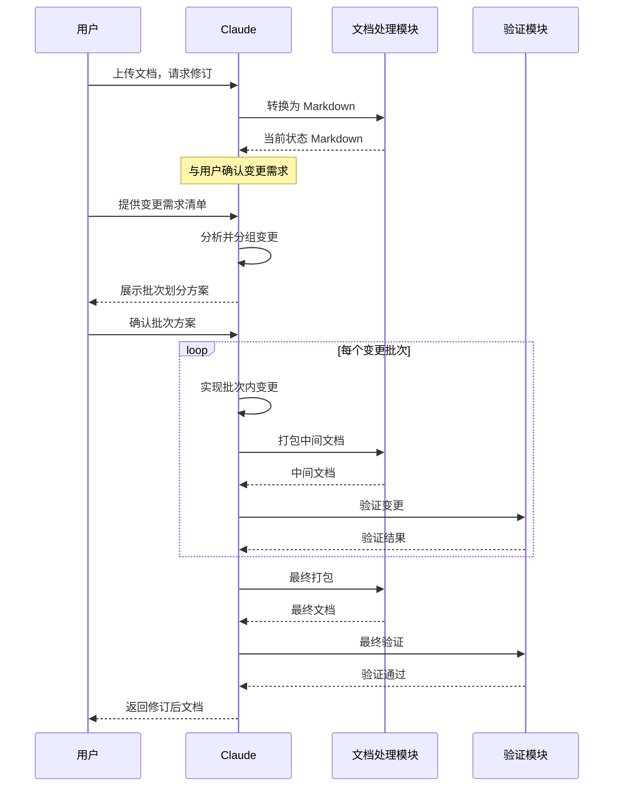

## 五、部署架构

### 5.1 技能仓库部署架构

Skills 项目本身的部署架构相对简单，主要依赖于 GitHub 的基础设施：

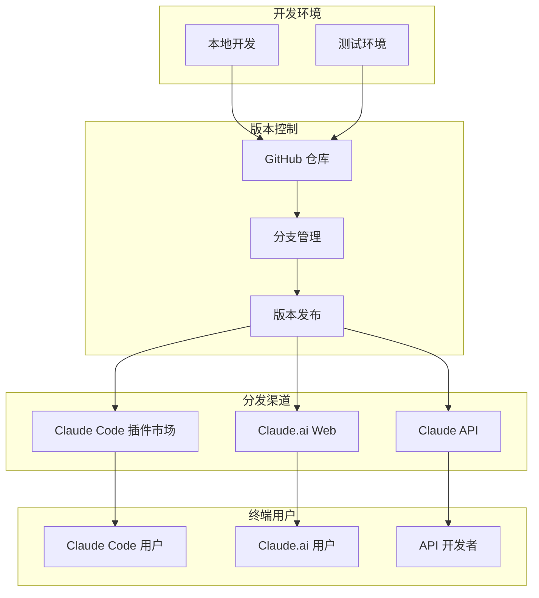

### 5.2 运行时技能加载架构

技能在运行时被加载和激活的架构设计：

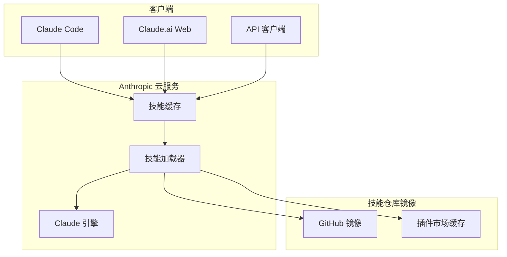

**加载优化策略**：

- **缓存机制**：已安装的技能被缓存在本地，避免重复下载
- **按需加载**：技能在使用时才被加载到内存，未激活的技能不占用资源
- **增量更新**：技能更新时只下载变化的部分，减少带宽消耗

### 5.3 技能开发与部署工作流

完整的技能开发与部署工作流：

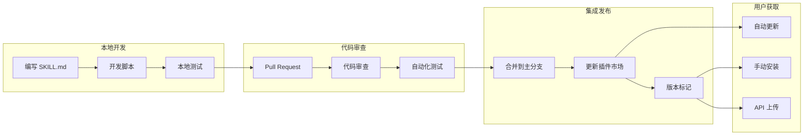

## 六、架构总结

### 6.1 设计特点

Anthropic Skills 架构展现了以下设计特点：

**模块化设计**：技能作为独立模块封装功能，模块之间通过标准化接口交互，实现了高内聚低耦合的目标。这种设计使得技能的开发和测试可以独立进行，也便于技能的复用和组合。

**分层架构**：系统采用接入层、集成层、技能层和规格层的分层结构，每层有明确的职责边界。分层设计使得系统易于理解和维护，也便于未来扩展。

**动态激活**：技能在运行时动态加载和激活，而不是硬编码到系统中。这种设计提供了极大的灵活性，用户可以根据需要选择性地加载技能。

**标准化规范**：所有技能遵循统一的规格标准，确保了一致性和互操作性。标准化也使得技能的分享和复用更加便捷。

### 6.2 可扩展性

架构设计支持多种扩展方式：

**横向扩展**：可以轻松添加新类别的技能，只需遵循规格标准即可。新技能可以与现有技能协作，无需修改核心系统。

**纵向扩展**：可以在现有技能基础上增加新功能，如添加新的辅助脚本、参考文档等，而不影响技能的核心结构。

**平台扩展**：架构支持在不同平台（CLI、Web、API）上使用，展示了良好的可移植性。
