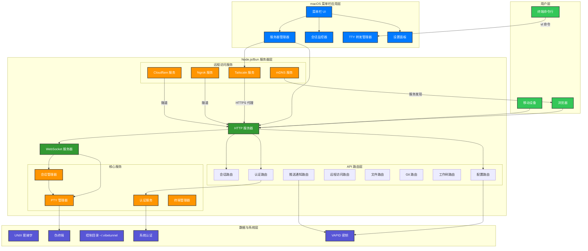
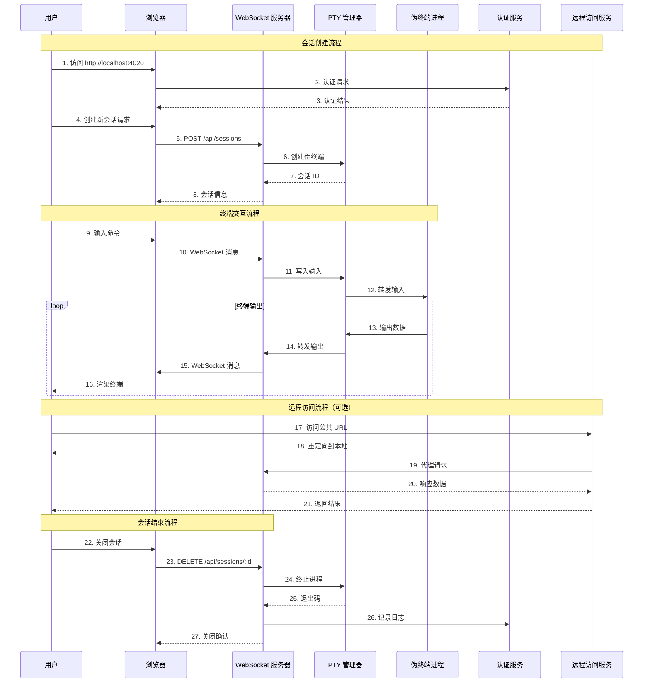
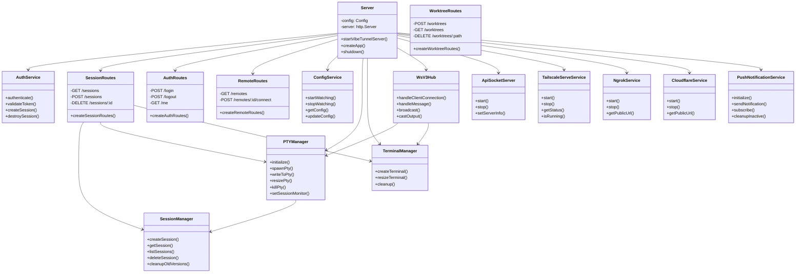
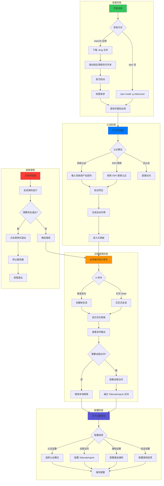
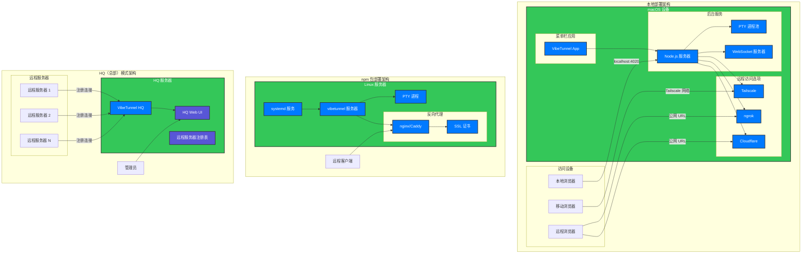
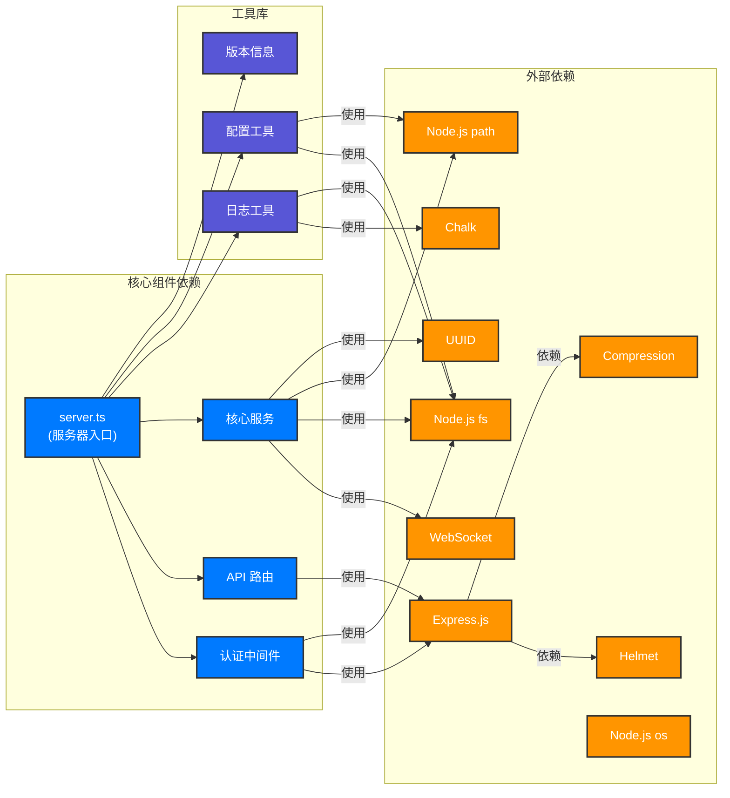
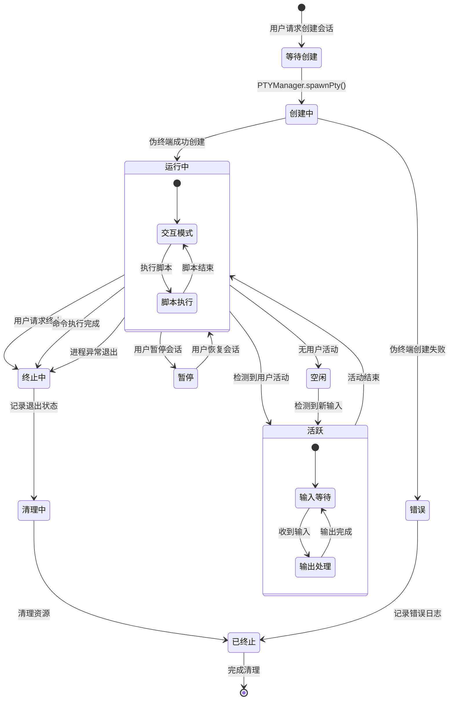
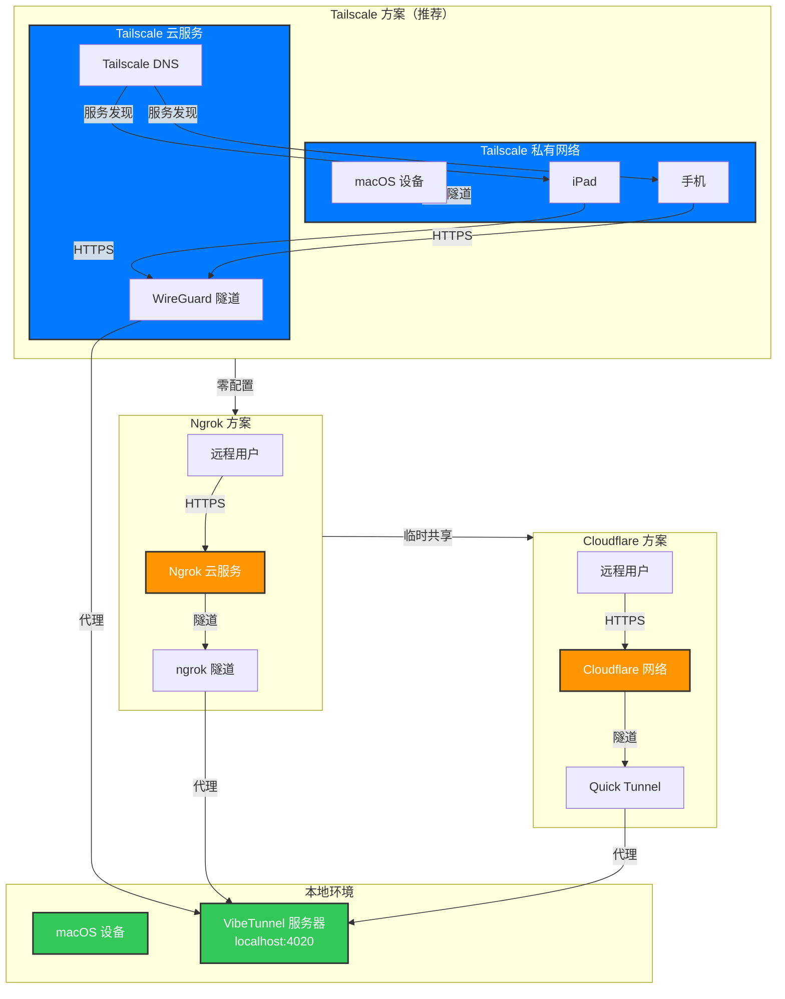

# VibeTunnel 架构文档

## 1. 系统整体架构图

VibeTunnel 采用三层架构设计，各层之间通过明确定义的接口进行通信。这种架构确保了各组件的独立性和可维护性，同时提供了流畅的用户体验。

该架构图展示了 VibeTunnel 的核心设计理念：用户通过多种渠道（浏览器、移动设备、终端命令行）与系统交互，由 macOS 菜单栏应用统一管理，通过高性能 Node.js 服务器处理请求，最终连接到系统层的伪终端和认证系统。各层之间通过清晰定义的接口通信，保证了系统的模块化和可扩展性。

## 2. 核心数据流图

数据在 VibeTunnel 系统中以多种形式流转，包括用户输入、终端输出、认证令牌、配置信息等。理解这些数据流对于掌握系统工作原理至关重要。

该数据流图清晰地展示了用户与 VibeTunnel 系统交互的完整生命周期。从最初的认证请求开始，到会话创建、终端交互、远程访问（可选），最后到会话结束，每个步骤都标注了对应的 API 调用和组件交互。这种端到端的流程展示有助于开发者理解整个系统的工作机制。

## 3. 类与模块关系图

VibeTunnel 的代码库包含多个核心模块，它们之间存在复杂的依赖关系。以下图表展示了主要模块及其相互关系。

该类图展示了 VibeTunnel 服务器端的核心类结构。Server 类作为入口点，协调所有服务和路由。AuthService、SessionManager、PTYManager 和 TerminalManager 构成了核心业务逻辑层。各种路由类（SessionRoutes、AuthRoutes 等）处理 HTTP API 请求。WsV3Hub 和 ApiSocketServer 处理 WebSocket 通信。远程服务类（TailscaleServeService、NgrokService 等）提供可选的远程访问功能。

## 4. 用户交互流程图

用户与 VibeTunnel 的交互涉及多个步骤，包括首次安装、日常使用和配置调整等场景。

该流程图全面展示了用户与 VibeTunnel 交互的所有阶段。从安装开始，经过认证、日常会话使用、配置调整，到最后的退出，每个阶段都包含了关键决策点（如认证模式选择、远程访问配置等）和可能的分支路径。这种端到端的流程展示帮助用户理解完整的使用生命周期。

## 5. 部署架构图

VibeTunnel 支持多种部署方式，从本地开发到生产环境都有对应的最佳实践。

该部署架构图展示了 VibeTunnel 支持的三种主要部署模式：

1. **本地部署**：macOS 设备上运行菜单栏应用和 Node.js 服务器，支持多种远程访问方式（Tailscale、ngrok、Cloudflare），可从本地或远程浏览器访问。

2. **npm 包部署**：在 Linux 服务器上通过 npm 安装运行，可以配置 systemd 服务实现开机自启动，配合反向代理（nginx/Caddy）和 SSL 证书提供生产级别的 Web 服务。

3. **HQ 模式部署**：中心化的总部架构，多个远程服务器注册到 HQ 服务器，管理员通过 HQ Web UI 统一管理和监控所有远程服务器。

## 6. 组件依赖关系图

了解各组件之间的依赖关系对于系统维护和故障排查至关重要。

该依赖图展示了 server.ts 文件如何组织其依赖关系。核心组件（认证中间件、API 路由、核心服务）直接由服务器入口文件管理和协调。工具库（Logger、Config、Version）提供通用的辅助功能。外部依赖包括 Node.js 内置模块（fs、path、os）和第三方库（Express、WebSocket、Chalk 等）。

## 7. 会话生命周期状态图

每个终端会话在 VibeTunnel 中都有明确的状态生命周期，理解这些状态有助于调试和监控。

该状态图详细描述了会话的完整生命周期。从「等待创建」开始，经过「创建中」到达「运行」状态。在运行状态下，会话可以在「活跃」和「空闲」之间切换。最终，会话会进入「终止中」和「清理中」状态，最终完成清理并标记为「已终止」。状态图还展示了运行状态的子状态（交互模式、脚本执行）和活跃状态的子状态（输入等待、输出处理）。

## 8. 远程访问架构对比图

VibeTunnel 支持多种远程访问方案，每种方案都有其适用场景和技术特点。

该架构对比图直观地展示了三种远程访问方案的网络拓扑和访问路径。Tailscale 方案通过创建加密的 WireGuard 隧道实现点对点通信，是最推荐的方式。Ngrok 和 Cloudflare 方案都通过云服务中转流量，适用于临时共享或没有 Tailscale 网络的场景。每种方案的安全性、配置复杂度和适用场景都有所不同，用户可以根据实际需求选择。

---

以上架构文档全面展示了 VibeTunnel 系统的设计理念、组件关系、数据流和部署模式。通过这些图表，开发者可以快速理解系统的整体架构，在进行代码修改或故障排查时能够快速定位相关组件和依赖关系。
